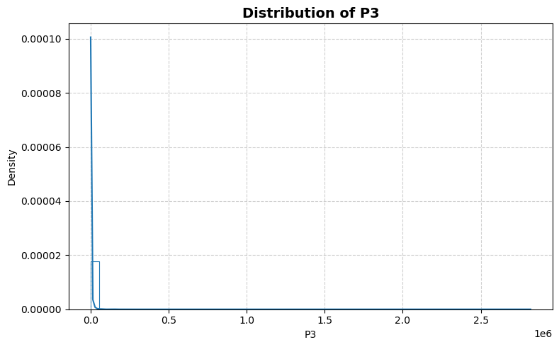
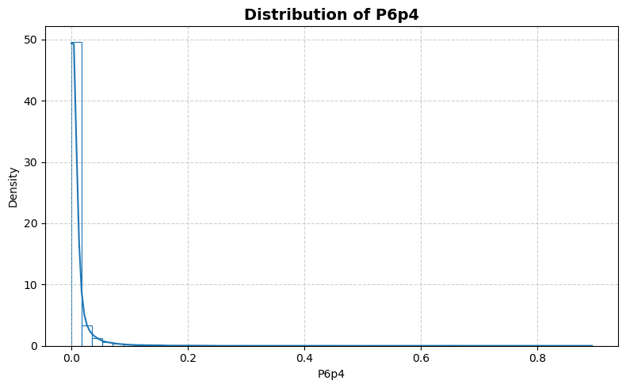
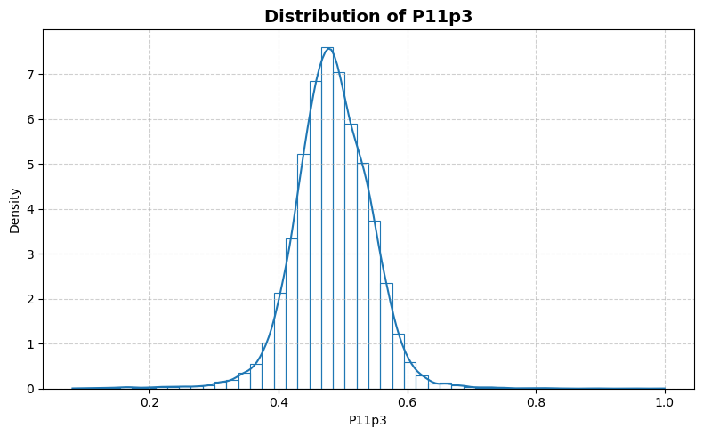
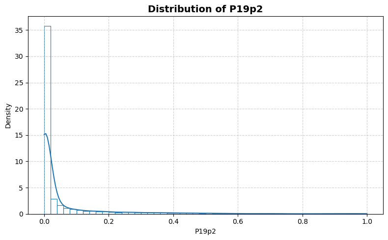
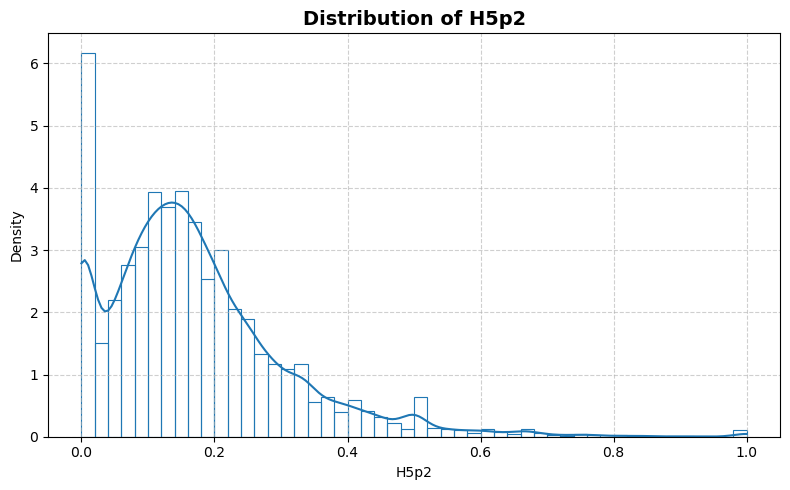
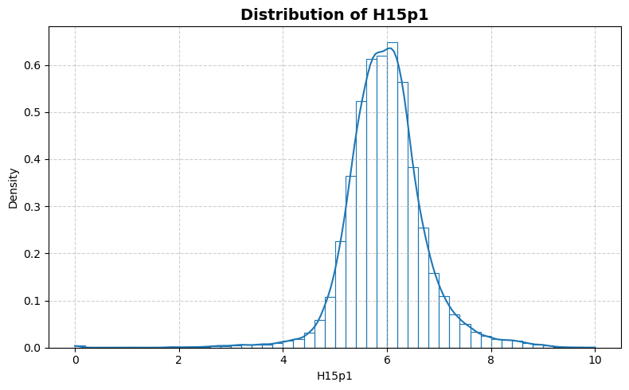
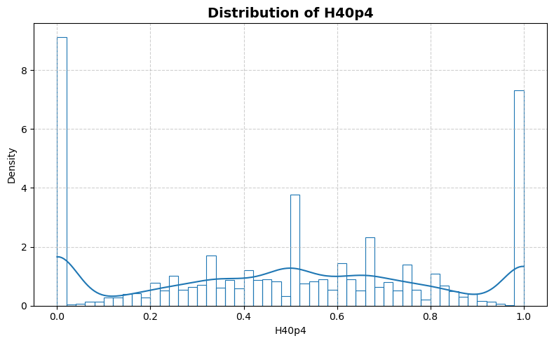
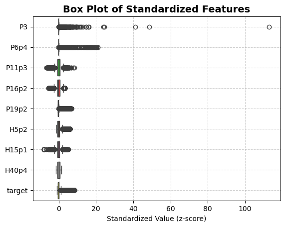
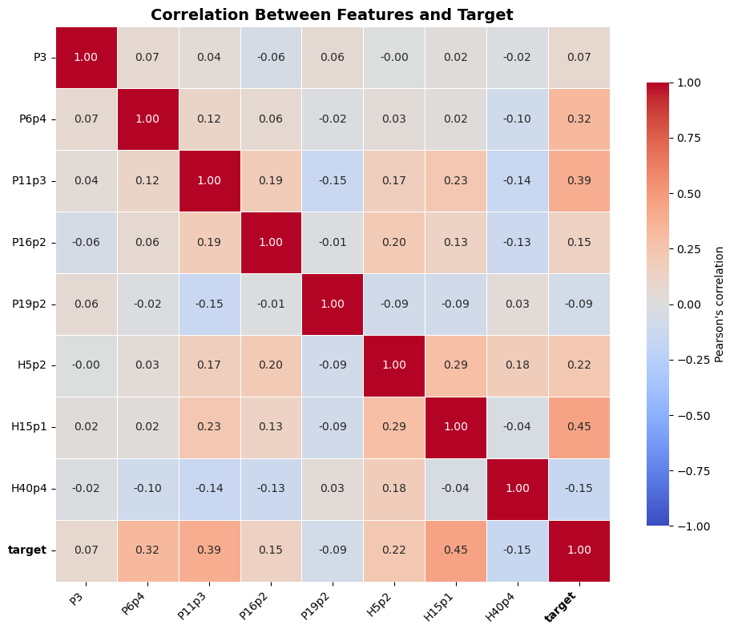

```python
from stat_sum_func import ToParquet, DatasetStatistics
```


```python
file = "218_house_8L"
path = f"raw/{file}/{file}.parquet"
statistics_man = DatasetStatistics(path)
statistics_man.df
```


<div>
<table border="1" class="dataframe">
  <thead>
    <tr style="text-align: right;">
      <th></th>
      <th>P3</th>
      <th>P6p4</th>
      <th>P11p3</th>
      <th>P16p2</th>
      <th>P19p2</th>
      <th>H5p2</th>
      <th>H15p1</th>
      <th>H40p4</th>
      <th>target</th>
    </tr>
  </thead>
  <tbody>
    <tr>
      <th>0</th>
      <td>7074.0</td>
      <td>0.004964</td>
      <td>0.507478</td>
      <td>0.579729</td>
      <td>0.036613</td>
      <td>0.020244</td>
      <td>6.618784</td>
      <td>0.774059</td>
      <td>130600.0</td>
    </tr>
    <tr>
      <th>1</th>
      <td>597.0</td>
      <td>0.003871</td>
      <td>0.480000</td>
      <td>0.695142</td>
      <td>0.003350</td>
      <td>0.170732</td>
      <td>7.163934</td>
      <td>0.142857</td>
      <td>40500.0</td>
    </tr>
    <tr>
      <th>2</th>
      <td>1931.0</td>
      <td>0.002320</td>
      <td>0.477747</td>
      <td>0.683584</td>
      <td>0.000000</td>
      <td>0.117647</td>
      <td>6.185848</td>
      <td>0.687500</td>
      <td>28700.0</td>
    </tr>
    <tr>
      <th>3</th>
      <td>164.0</td>
      <td>0.000000</td>
      <td>0.492505</td>
      <td>0.780488</td>
      <td>0.000000</td>
      <td>0.100000</td>
      <td>6.619835</td>
      <td>1.000000</td>
      <td>28500.0</td>
    </tr>
    <tr>
      <th>4</th>
      <td>119.0</td>
      <td>0.000000</td>
      <td>0.480645</td>
      <td>0.756302</td>
      <td>0.672269</td>
      <td>0.000000</td>
      <td>6.161616</td>
      <td>0.000000</td>
      <td>24100.0</td>
    </tr>
    <tr>
      <th>...</th>
      <td>...</td>
      <td>...</td>
      <td>...</td>
      <td>...</td>
      <td>...</td>
      <td>...</td>
      <td>...</td>
      <td>...</td>
      <td>...</td>
    </tr>
    <tr>
      <th>22779</th>
      <td>3664.0</td>
      <td>0.003967</td>
      <td>0.461217</td>
      <td>0.674945</td>
      <td>0.000546</td>
      <td>0.121739</td>
      <td>6.584818</td>
      <td>0.214286</td>
      <td>38900.0</td>
    </tr>
    <tr>
      <th>22780</th>
      <td>27037.0</td>
      <td>0.006755</td>
      <td>0.488844</td>
      <td>0.663165</td>
      <td>0.102415</td>
      <td>0.181772</td>
      <td>5.847176</td>
      <td>0.598338</td>
      <td>27900.0</td>
    </tr>
    <tr>
      <th>22781</th>
      <td>376.0</td>
      <td>0.014330</td>
      <td>0.561924</td>
      <td>0.688830</td>
      <td>0.109043</td>
      <td>0.166667</td>
      <td>6.885715</td>
      <td>0.333333</td>
      <td>51100.0</td>
    </tr>
    <tr>
      <th>22782</th>
      <td>113.0</td>
      <td>0.009804</td>
      <td>0.516340</td>
      <td>0.778761</td>
      <td>0.000000</td>
      <td>0.000000</td>
      <td>5.578432</td>
      <td>0.000000</td>
      <td>17200.0</td>
    </tr>
    <tr>
      <th>22783</th>
      <td>2319.0</td>
      <td>0.009842</td>
      <td>0.533237</td>
      <td>0.704183</td>
      <td>0.015955</td>
      <td>0.362903</td>
      <td>6.366131</td>
      <td>0.600000</td>
      <td>117700.0</td>
    </tr>
  </tbody>
</table>
<p>22784 rows × 9 columns</p>
</div>


```python
for feature in statistics_man.df.columns:
    statistics_man.plot_distribution(feature)
```


    

    


    

    


    

    


    

    


    

    


    

    


    

    


    

    


    

    


```python
statistics_man.plot_box()
```


    

    


```python
statistics_man.print_stat_sum()
```

    Number of samples : 22784
    Number of features: 8
    ==============================


<div>
<table border="1" class="dataframe">
  <thead>
    <tr style="text-align: right;">
      <th></th>
      <th>dtype</th>
      <th>missing</th>
      <th>count</th>
      <th>median</th>
      <th>mean</th>
      <th>std</th>
      <th>min</th>
      <th>25%</th>
      <th>50%</th>
      <th>75%</th>
      <th>max</th>
    </tr>
  </thead>
  <tbody>
    <tr>
      <th>P3</th>
      <td>float64</td>
      <td>0</td>
      <td>22784.0</td>
      <td>506.000000</td>
      <td>2935.865739</td>
      <td>24949.880169</td>
      <td>1.000000</td>
      <td>163.000000</td>
      <td>506.000000</td>
      <td>1683.000000</td>
      <td>2.819401e+06</td>
    </tr>
    <tr>
      <th>P6p4</th>
      <td>float64</td>
      <td>0</td>
      <td>22784.0</td>
      <td>0.002361</td>
      <td>0.010330</td>
      <td>0.042105</td>
      <td>0.000000</td>
      <td>0.000000</td>
      <td>0.002361</td>
      <td>0.007429</td>
      <td>8.944444e-01</td>
    </tr>
    <tr>
      <th>P11p3</th>
      <td>float64</td>
      <td>0</td>
      <td>22784.0</td>
      <td>0.483384</td>
      <td>0.484021</td>
      <td>0.060334</td>
      <td>0.079876</td>
      <td>0.448766</td>
      <td>0.483384</td>
      <td>0.521739</td>
      <td>1.000000e+00</td>
    </tr>
    <tr>
      <th>P16p2</th>
      <td>float64</td>
      <td>0</td>
      <td>22784.0</td>
      <td>0.714286</td>
      <td>0.716131</td>
      <td>0.087264</td>
      <td>0.233702</td>
      <td>0.662283</td>
      <td>0.714286</td>
      <td>0.771039</td>
      <td>1.000000e+00</td>
    </tr>
    <tr>
      <th>P19p2</th>
      <td>float64</td>
      <td>0</td>
      <td>22784.0</td>
      <td>0.002538</td>
      <td>0.057437</td>
      <td>0.139811</td>
      <td>0.000000</td>
      <td>0.000000</td>
      <td>0.002538</td>
      <td>0.029928</td>
      <td>1.000000e+00</td>
    </tr>
    <tr>
      <th>H5p2</th>
      <td>float64</td>
      <td>0</td>
      <td>22784.0</td>
      <td>0.147826</td>
      <td>0.171518</td>
      <td>0.138987</td>
      <td>0.000000</td>
      <td>0.079359</td>
      <td>0.147826</td>
      <td>0.230769</td>
      <td>1.000000e+00</td>
    </tr>
    <tr>
      <th>H15p1</th>
      <td>float64</td>
      <td>0</td>
      <td>22784.0</td>
      <td>5.958333</td>
      <td>5.978000</td>
      <td>0.758649</td>
      <td>0.000000</td>
      <td>5.548364</td>
      <td>5.958333</td>
      <td>6.363078</td>
      <td>1.000000e+01</td>
    </tr>
    <tr>
      <th>H40p4</th>
      <td>float64</td>
      <td>0</td>
      <td>22784.0</td>
      <td>0.500000</td>
      <td>0.491626</td>
      <td>0.331655</td>
      <td>0.000000</td>
      <td>0.243243</td>
      <td>0.500000</td>
      <td>0.750000</td>
      <td>1.000000e+00</td>
    </tr>
    <tr>
      <th>target</th>
      <td>float64</td>
      <td>0</td>
      <td>22784.0</td>
      <td>33200.000000</td>
      <td>50074.439782</td>
      <td>52843.475551</td>
      <td>0.000000</td>
      <td>21000.000000</td>
      <td>33200.000000</td>
      <td>56100.000000</td>
      <td>5.000010e+05</td>
    </tr>
  </tbody>
</table>
</div>


```python
statistics_man.plot_corr_heatmap()
```


    

    

