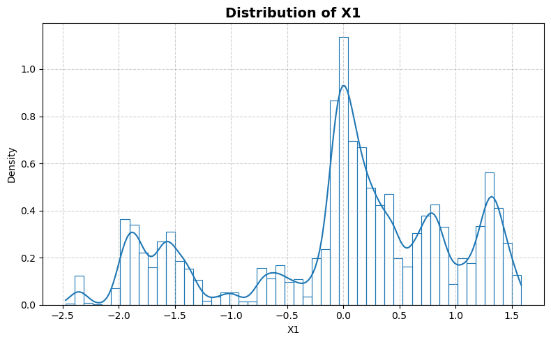
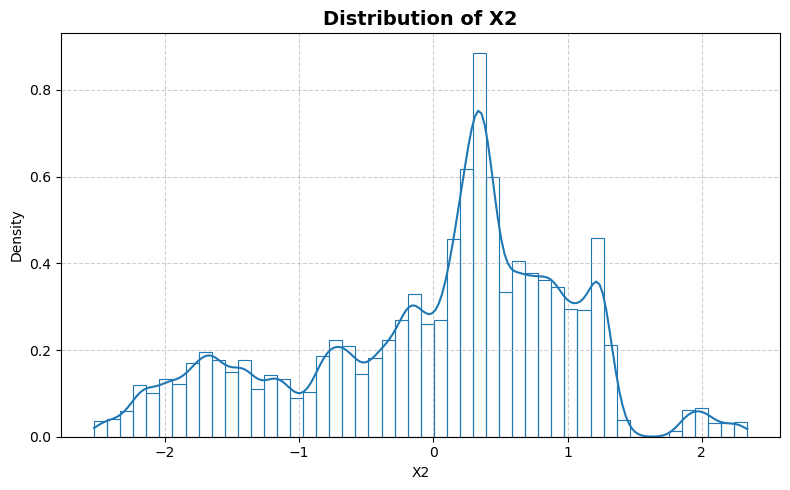
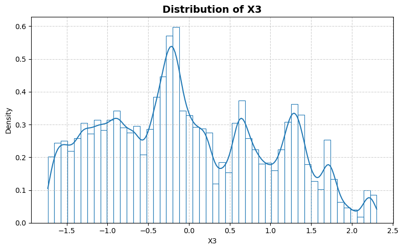
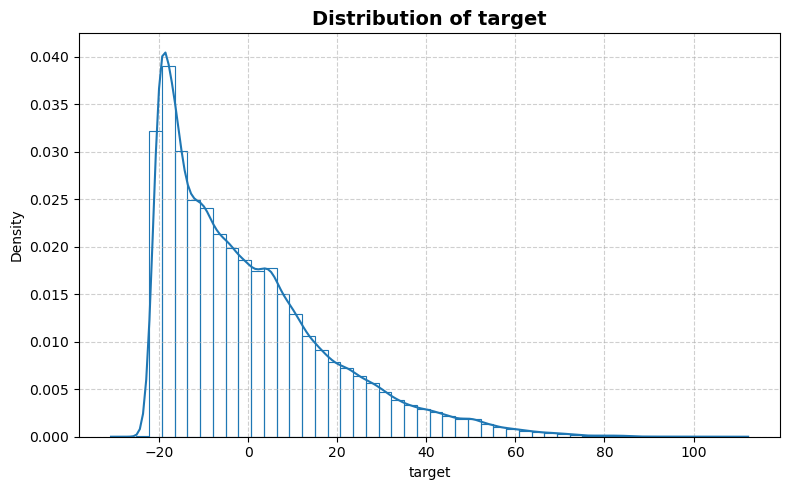
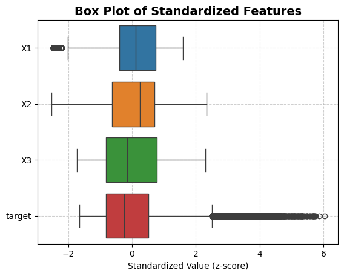
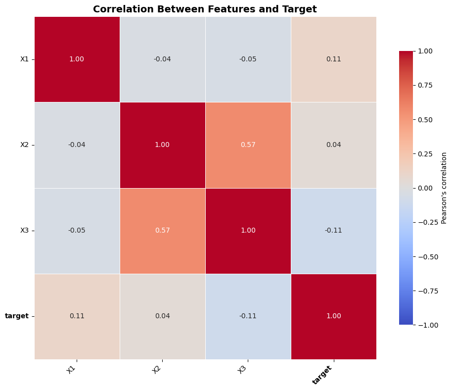

```python
from stat_sum_func import ToParquet, DatasetStatistics
```


```python
path = "raw/3droad/3droad.parquet"
statistics_man = DatasetStatistics(path)
statistics_man.df
```


<div>
<table border="1" class="dataframe">
  <thead>
    <tr style="text-align: right;">
      <th></th>
      <th>X1</th>
      <th>X2</th>
      <th>X3</th>
      <th>target</th>
    </tr>
  </thead>
  <tbody>
    <tr>
      <th>0</th>
      <td>-1.474300</td>
      <td>-0.238940</td>
      <td>-1.46360</td>
      <td>14.64100</td>
    </tr>
    <tr>
      <th>1</th>
      <td>1.260700</td>
      <td>-0.235650</td>
      <td>-0.85814</td>
      <td>12.66400</td>
    </tr>
    <tr>
      <th>2</th>
      <td>1.281200</td>
      <td>0.882660</td>
      <td>0.98573</td>
      <td>29.73800</td>
    </tr>
    <tr>
      <th>3</th>
      <td>-0.476720</td>
      <td>1.312300</td>
      <td>2.14940</td>
      <td>-17.76000</td>
    </tr>
    <tr>
      <th>4</th>
      <td>-0.042664</td>
      <td>-1.507500</td>
      <td>-1.06310</td>
      <td>0.79023</td>
    </tr>
    <tr>
      <th>...</th>
      <td>...</td>
      <td>...</td>
      <td>...</td>
      <td>...</td>
    </tr>
    <tr>
      <th>434869</th>
      <td>-1.793600</td>
      <td>0.831020</td>
      <td>-1.67220</td>
      <td>-17.92400</td>
    </tr>
    <tr>
      <th>434870</th>
      <td>-0.019241</td>
      <td>-0.000993</td>
      <td>0.26701</td>
      <td>-17.97000</td>
    </tr>
    <tr>
      <th>434871</th>
      <td>0.012714</td>
      <td>0.565490</td>
      <td>-0.25018</td>
      <td>-16.67600</td>
    </tr>
    <tr>
      <th>434872</th>
      <td>-1.546200</td>
      <td>-0.128330</td>
      <td>0.76656</td>
      <td>7.44630</td>
    </tr>
    <tr>
      <th>434873</th>
      <td>0.431390</td>
      <td>-1.420700</td>
      <td>-1.06790</td>
      <td>-5.04410</td>
    </tr>
  </tbody>
</table>
<p>434874 rows × 4 columns</p>
</div>


```python
for feature in statistics_man.df.columns:
    statistics_man.plot_distribution(feature)
```


    

    


    

    


    

    


    

    


```python
statistics_man.plot_box()
```


    

    


```python
statistics_man.print_stat_sum()
```

    Number of samples : 434874
    Number of features: 3
    ==============================


<div>
<table border="1" class="dataframe">
  <thead>
    <tr style="text-align: right;">
      <th></th>
      <th>dtype</th>
      <th>missing</th>
      <th>count</th>
      <th>median</th>
      <th>mean</th>
      <th>std</th>
      <th>min</th>
      <th>25%</th>
      <th>50%</th>
      <th>75%</th>
      <th>max</th>
    </tr>
  </thead>
  <tbody>
    <tr>
      <th>X1</th>
      <td>float64</td>
      <td>0</td>
      <td>434874.0</td>
      <td>0.108860</td>
      <td>3.092640e-07</td>
      <td>0.999999</td>
      <td>-2.4737</td>
      <td>-0.40239</td>
      <td>0.108860</td>
      <td>0.743920</td>
      <td>1.5859</td>
    </tr>
    <tr>
      <th>X2</th>
      <td>float64</td>
      <td>0</td>
      <td>434874.0</td>
      <td>0.247645</td>
      <td>1.788017e-08</td>
      <td>1.000000</td>
      <td>-2.5276</td>
      <td>-0.62834</td>
      <td>0.247645</td>
      <td>0.702200</td>
      <td>2.3392</td>
    </tr>
    <tr>
      <th>X3</th>
      <td>float64</td>
      <td>0</td>
      <td>434874.0</td>
      <td>-0.142535</td>
      <td>1.342181e-09</td>
      <td>1.000000</td>
      <td>-1.7316</td>
      <td>-0.82116</td>
      <td>-0.142535</td>
      <td>0.776950</td>
      <td>2.3033</td>
    </tr>
    <tr>
      <th>target</th>
      <td>float64</td>
      <td>0</td>
      <td>434874.0</td>
      <td>-4.610750</td>
      <td>5.271324e-07</td>
      <td>18.617988</td>
      <td>-30.7940</td>
      <td>-15.15700</td>
      <td>-4.610750</td>
      <td>9.624825</td>
      <td>112.2600</td>
    </tr>
  </tbody>
</table>
</div>


```python
statistics_man.plot_corr_heatmap()
```


    

    

