```python
from stat_sum_func import ToParquet, DatasetStatistics
```


```python
file = "574_house_16H"
path = f"raw/{file}/{file}.parquet"
statistics_man = DatasetStatistics(path)
statistics_man.df
```


<div>
<table border="1" class="dataframe">
  <thead>
    <tr style="text-align: right;">
      <th></th>
      <th>P1</th>
      <th>P5p1</th>
      <th>P6p2</th>
      <th>P11p4</th>
      <th>P14p9</th>
      <th>P15p1</th>
      <th>P15p3</th>
      <th>P16p2</th>
      <th>P18p2</th>
      <th>P27p4</th>
      <th>H2p2</th>
      <th>H8p2</th>
      <th>H10p1</th>
      <th>H13p1</th>
      <th>H18pA</th>
      <th>H40p4</th>
      <th>target</th>
    </tr>
  </thead>
  <tbody>
    <tr>
      <th>0</th>
      <td>15512.0</td>
      <td>0.460869</td>
      <td>0.049252</td>
      <td>0.226470</td>
      <td>0.149827</td>
      <td>0.752837</td>
      <td>0.010057</td>
      <td>0.579729</td>
      <td>0.003251</td>
      <td>0.075912</td>
      <td>0.625318</td>
      <td>0.036613</td>
      <td>0.991377</td>
      <td>0.260116</td>
      <td>0.052246</td>
      <td>0.774059</td>
      <td>130600.0</td>
    </tr>
    <tr>
      <th>1</th>
      <td>1550.0</td>
      <td>0.470968</td>
      <td>0.002581</td>
      <td>0.137419</td>
      <td>0.096341</td>
      <td>0.862581</td>
      <td>0.000000</td>
      <td>0.695142</td>
      <td>0.005025</td>
      <td>0.043551</td>
      <td>0.064263</td>
      <td>0.003350</td>
      <td>0.994975</td>
      <td>0.285266</td>
      <td>0.060606</td>
      <td>0.142857</td>
      <td>40500.0</td>
    </tr>
    <tr>
      <th>2</th>
      <td>4741.0</td>
      <td>0.485341</td>
      <td>0.000211</td>
      <td>0.189412</td>
      <td>0.135656</td>
      <td>0.856992</td>
      <td>0.000000</td>
      <td>0.683584</td>
      <td>0.004143</td>
      <td>0.027965</td>
      <td>0.065796</td>
      <td>0.000000</td>
      <td>0.997411</td>
      <td>0.315433</td>
      <td>0.065116</td>
      <td>0.687500</td>
      <td>28700.0</td>
    </tr>
    <tr>
      <th>3</th>
      <td>467.0</td>
      <td>0.498929</td>
      <td>0.000000</td>
      <td>0.100642</td>
      <td>0.085470</td>
      <td>0.907923</td>
      <td>0.000000</td>
      <td>0.780488</td>
      <td>0.006098</td>
      <td>0.018293</td>
      <td>0.057471</td>
      <td>0.000000</td>
      <td>1.000000</td>
      <td>0.149425</td>
      <td>0.139535</td>
      <td>1.000000</td>
      <td>28500.0</td>
    </tr>
    <tr>
      <th>4</th>
      <td>310.0</td>
      <td>0.474194</td>
      <td>0.680645</td>
      <td>0.225807</td>
      <td>0.128834</td>
      <td>0.896774</td>
      <td>0.000000</td>
      <td>0.756302</td>
      <td>0.008403</td>
      <td>0.016807</td>
      <td>0.077519</td>
      <td>0.672269</td>
      <td>0.991597</td>
      <td>0.147287</td>
      <td>0.000000</td>
      <td>0.000000</td>
      <td>24100.0</td>
    </tr>
    <tr>
      <th>...</th>
      <td>...</td>
      <td>...</td>
      <td>...</td>
      <td>...</td>
      <td>...</td>
      <td>...</td>
      <td>...</td>
      <td>...</td>
      <td>...</td>
      <td>...</td>
      <td>...</td>
      <td>...</td>
      <td>...</td>
      <td>...</td>
      <td>...</td>
      <td>...</td>
      <td>...</td>
    </tr>
    <tr>
      <th>22779</th>
      <td>9579.0</td>
      <td>0.465915</td>
      <td>0.000522</td>
      <td>0.181543</td>
      <td>0.137607</td>
      <td>0.822111</td>
      <td>0.037165</td>
      <td>0.674945</td>
      <td>0.000819</td>
      <td>0.033297</td>
      <td>0.030431</td>
      <td>0.000546</td>
      <td>0.996725</td>
      <td>0.277057</td>
      <td>0.049908</td>
      <td>0.214286</td>
      <td>38900.0</td>
    </tr>
    <tr>
      <th>22780</th>
      <td>66467.0</td>
      <td>0.471663</td>
      <td>0.121384</td>
      <td>0.156544</td>
      <td>0.114902</td>
      <td>0.824364</td>
      <td>0.013721</td>
      <td>0.663165</td>
      <td>0.004475</td>
      <td>0.048193</td>
      <td>0.068429</td>
      <td>0.102415</td>
      <td>0.994193</td>
      <td>0.344761</td>
      <td>0.069091</td>
      <td>0.598338</td>
      <td>27900.0</td>
    </tr>
    <tr>
      <th>22781</th>
      <td>977.0</td>
      <td>0.482088</td>
      <td>0.124872</td>
      <td>0.109519</td>
      <td>0.084980</td>
      <td>0.844422</td>
      <td>0.000000</td>
      <td>0.688830</td>
      <td>0.013298</td>
      <td>0.058511</td>
      <td>0.045685</td>
      <td>0.109043</td>
      <td>0.978723</td>
      <td>0.187817</td>
      <td>0.114504</td>
      <td>0.333333</td>
      <td>51100.0</td>
    </tr>
    <tr>
      <th>22782</th>
      <td>306.0</td>
      <td>0.509804</td>
      <td>0.000000</td>
      <td>0.150327</td>
      <td>0.113333</td>
      <td>0.905229</td>
      <td>0.000000</td>
      <td>0.778761</td>
      <td>0.008850</td>
      <td>0.026549</td>
      <td>0.088710</td>
      <td>0.000000</td>
      <td>1.000000</td>
      <td>0.282258</td>
      <td>0.090909</td>
      <td>0.000000</td>
      <td>17200.0</td>
    </tr>
    <tr>
      <th>22783</th>
      <td>6198.0</td>
      <td>0.508874</td>
      <td>0.013553</td>
      <td>0.132946</td>
      <td>0.079501</td>
      <td>0.864472</td>
      <td>0.005324</td>
      <td>0.704183</td>
      <td>0.000862</td>
      <td>0.048728</td>
      <td>0.096611</td>
      <td>0.015955</td>
      <td>0.971108</td>
      <td>0.374756</td>
      <td>0.030303</td>
      <td>0.600000</td>
      <td>117700.0</td>
    </tr>
  </tbody>
</table>
<p>22784 rows × 17 columns</p>
</div>


```python
for feature in statistics_man.df.columns:
    statistics_man.plot_distribution(feature)
```


    

    


    
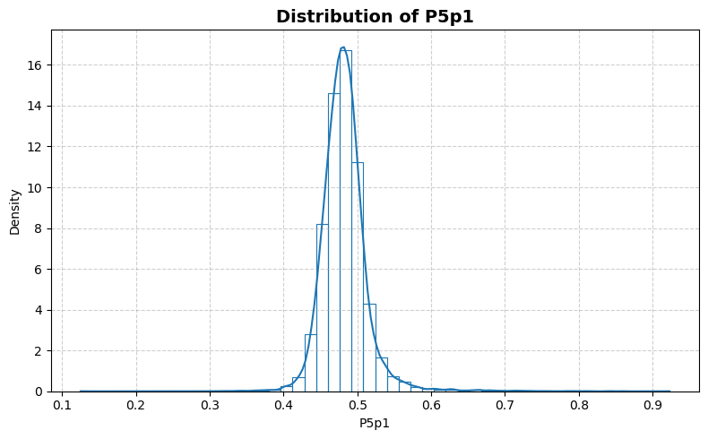
    


    
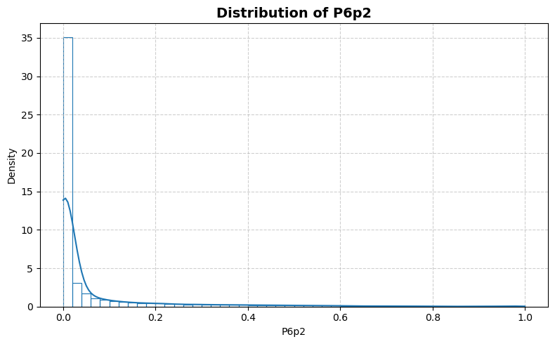
    


    
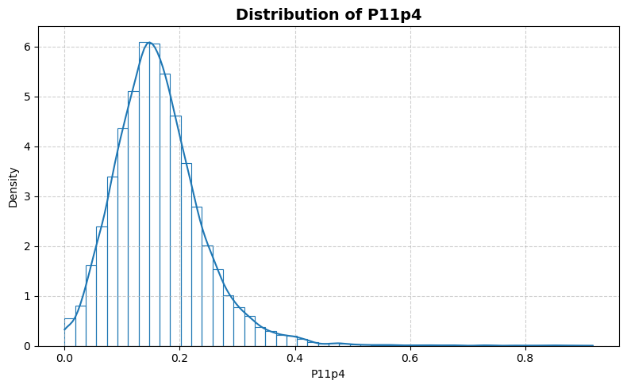
    


    
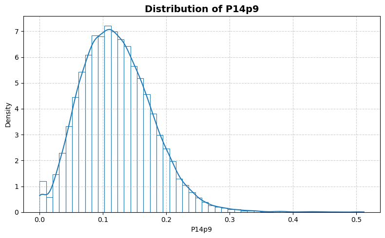
    


    
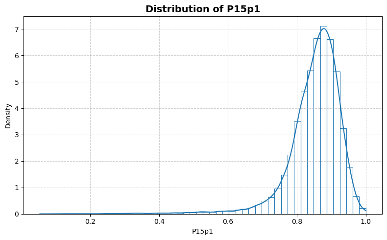
    


    
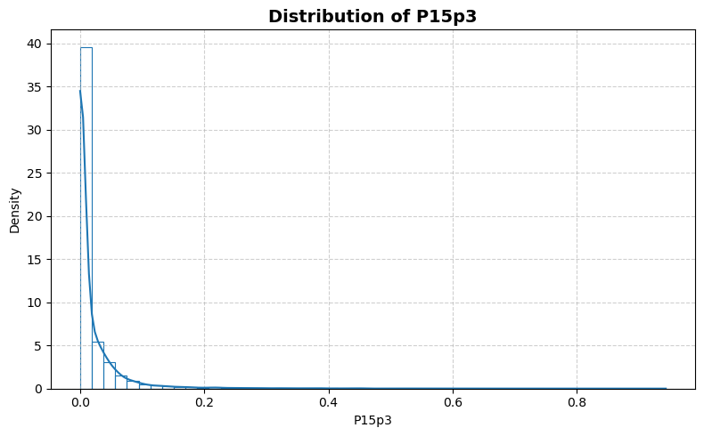
    


    
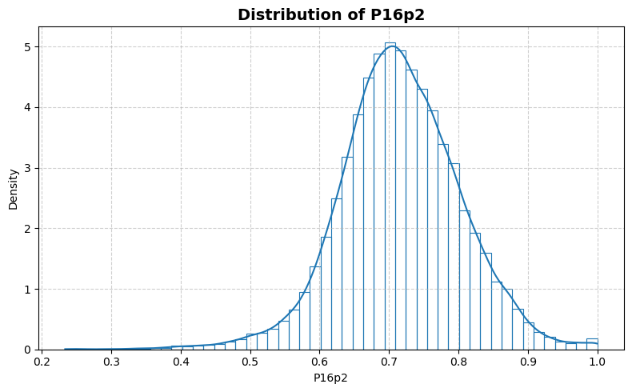
    


    
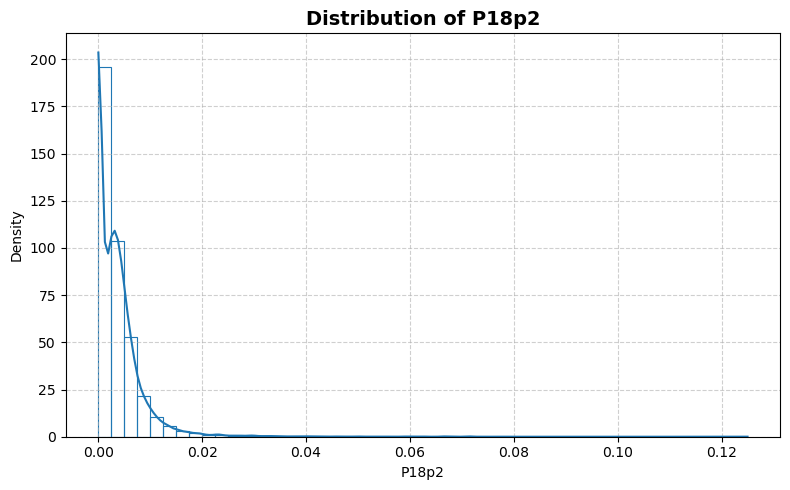
    


    
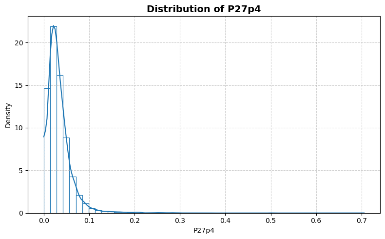
    


    
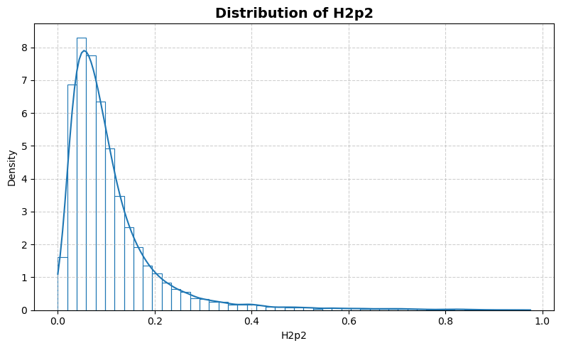
    


    

    


    
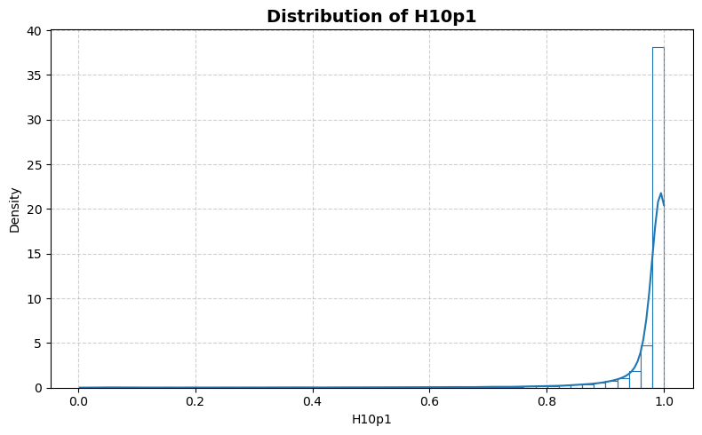
    


    
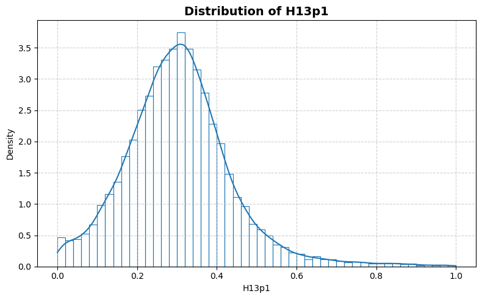
    


    
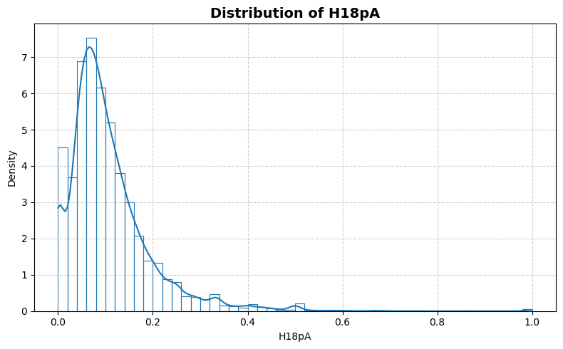
    


    

    


    
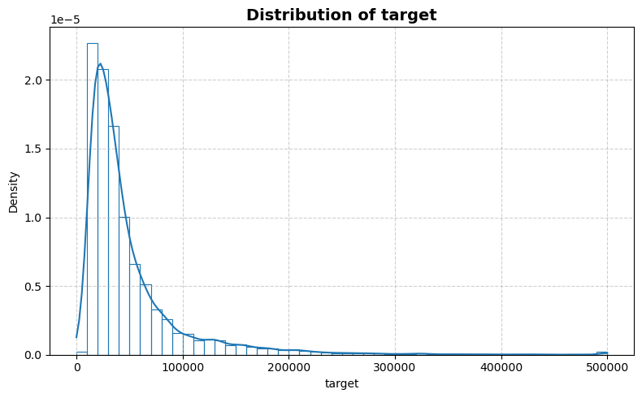
    


```python
statistics_man.plot_box()
```


    
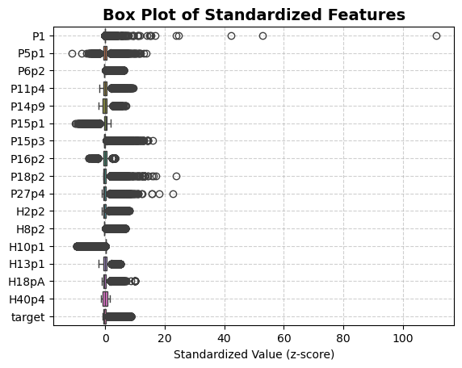
    


```python
statistics_man.print_stat_sum()
```

    Number of samples : 22784
    Number of features: 16
    ==============================


<div>
<table border="1" class="dataframe">
  <thead>
    <tr style="text-align: right;">
      <th></th>
      <th>dtype</th>
      <th>missing</th>
      <th>count</th>
      <th>median</th>
      <th>mean</th>
      <th>std</th>
      <th>min</th>
      <th>25%</th>
      <th>50%</th>
      <th>75%</th>
      <th>max</th>
    </tr>
  </thead>
  <tbody>
    <tr>
      <th>P1</th>
      <td>float64</td>
      <td>0</td>
      <td>22784.0</td>
      <td>1345.500000</td>
      <td>7808.669198</td>
      <td>65872.423580</td>
      <td>2.000000</td>
      <td>427.000000</td>
      <td>1345.500000</td>
      <td>4518.250000</td>
      <td>7.322564e+06</td>
    </tr>
    <tr>
      <th>P5p1</th>
      <td>float64</td>
      <td>0</td>
      <td>22784.0</td>
      <td>0.480396</td>
      <td>0.482297</td>
      <td>0.031876</td>
      <td>0.125000</td>
      <td>0.464646</td>
      <td>0.480396</td>
      <td>0.496040</td>
      <td>9.230769e-01</td>
    </tr>
    <tr>
      <th>P6p2</th>
      <td>float64</td>
      <td>0</td>
      <td>22784.0</td>
      <td>0.003413</td>
      <td>0.063982</td>
      <td>0.150921</td>
      <td>0.000000</td>
      <td>0.000000</td>
      <td>0.003413</td>
      <td>0.033376</td>
      <td>1.000000e+00</td>
    </tr>
    <tr>
      <th>P11p4</th>
      <td>float64</td>
      <td>0</td>
      <td>22784.0</td>
      <td>0.155485</td>
      <td>0.163900</td>
      <td>0.080461</td>
      <td>0.000000</td>
      <td>0.112069</td>
      <td>0.155485</td>
      <td>0.203596</td>
      <td>9.172546e-01</td>
    </tr>
    <tr>
      <th>P14p9</th>
      <td>float64</td>
      <td>0</td>
      <td>22784.0</td>
      <td>0.117127</td>
      <td>0.121538</td>
      <td>0.056687</td>
      <td>0.000000</td>
      <td>0.081236</td>
      <td>0.117127</td>
      <td>0.156757</td>
      <td>5.118719e-01</td>
    </tr>
    <tr>
      <th>P15p1</th>
      <td>float64</td>
      <td>0</td>
      <td>22784.0</td>
      <td>0.863645</td>
      <td>0.851076</td>
      <td>0.079455</td>
      <td>0.054156</td>
      <td>0.819686</td>
      <td>0.863645</td>
      <td>0.899657</td>
      <td>1.000000e+00</td>
    </tr>
    <tr>
      <th>P15p3</th>
      <td>float64</td>
      <td>0</td>
      <td>22784.0</td>
      <td>0.000000</td>
      <td>0.020487</td>
      <td>0.057666</td>
      <td>0.000000</td>
      <td>0.000000</td>
      <td>0.000000</td>
      <td>0.019196</td>
      <td>9.433249e-01</td>
    </tr>
    <tr>
      <th>P16p2</th>
      <td>float64</td>
      <td>0</td>
      <td>22784.0</td>
      <td>0.714286</td>
      <td>0.716131</td>
      <td>0.087264</td>
      <td>0.233702</td>
      <td>0.662283</td>
      <td>0.714286</td>
      <td>0.771039</td>
      <td>1.000000e+00</td>
    </tr>
    <tr>
      <th>P18p2</th>
      <td>float64</td>
      <td>0</td>
      <td>22784.0</td>
      <td>0.002591</td>
      <td>0.003589</td>
      <td>0.005100</td>
      <td>0.000000</td>
      <td>0.000000</td>
      <td>0.002591</td>
      <td>0.005007</td>
      <td>1.250000e-01</td>
    </tr>
    <tr>
      <th>P27p4</th>
      <td>float64</td>
      <td>0</td>
      <td>22784.0</td>
      <td>0.027523</td>
      <td>0.033263</td>
      <td>0.029567</td>
      <td>0.000000</td>
      <td>0.016260</td>
      <td>0.027523</td>
      <td>0.042827</td>
      <td>7.057357e-01</td>
    </tr>
    <tr>
      <th>H2p2</th>
      <td>float64</td>
      <td>0</td>
      <td>22784.0</td>
      <td>0.081179</td>
      <td>0.110527</td>
      <td>0.105925</td>
      <td>0.000000</td>
      <td>0.049303</td>
      <td>0.081179</td>
      <td>0.131430</td>
      <td>9.751773e-01</td>
    </tr>
    <tr>
      <th>H8p2</th>
      <td>float64</td>
      <td>0</td>
      <td>22784.0</td>
      <td>0.002538</td>
      <td>0.057437</td>
      <td>0.139811</td>
      <td>0.000000</td>
      <td>0.000000</td>
      <td>0.002538</td>
      <td>0.029928</td>
      <td>1.000000e+00</td>
    </tr>
    <tr>
      <th>H10p1</th>
      <td>float64</td>
      <td>0</td>
      <td>22784.0</td>
      <td>0.994100</td>
      <td>0.967045</td>
      <td>0.099953</td>
      <td>0.003257</td>
      <td>0.981410</td>
      <td>0.994100</td>
      <td>1.000000</td>
      <td>1.000000e+00</td>
    </tr>
    <tr>
      <th>H13p1</th>
      <td>float64</td>
      <td>0</td>
      <td>22784.0</td>
      <td>0.299800</td>
      <td>0.304993</td>
      <td>0.133998</td>
      <td>0.000000</td>
      <td>0.221673</td>
      <td>0.299800</td>
      <td>0.375000</td>
      <td>1.000000e+00</td>
    </tr>
    <tr>
      <th>H18pA</th>
      <td>float64</td>
      <td>0</td>
      <td>22784.0</td>
      <td>0.086957</td>
      <td>0.107377</td>
      <td>0.090065</td>
      <td>0.000000</td>
      <td>0.052770</td>
      <td>0.086957</td>
      <td>0.137931</td>
      <td>1.000000e+00</td>
    </tr>
    <tr>
      <th>H40p4</th>
      <td>float64</td>
      <td>0</td>
      <td>22784.0</td>
      <td>0.500000</td>
      <td>0.491626</td>
      <td>0.331655</td>
      <td>0.000000</td>
      <td>0.243243</td>
      <td>0.500000</td>
      <td>0.750000</td>
      <td>1.000000e+00</td>
    </tr>
    <tr>
      <th>target</th>
      <td>float64</td>
      <td>0</td>
      <td>22784.0</td>
      <td>33200.000000</td>
      <td>50074.439782</td>
      <td>52843.475551</td>
      <td>0.000000</td>
      <td>21000.000000</td>
      <td>33200.000000</td>
      <td>56100.000000</td>
      <td>5.000010e+05</td>
    </tr>
  </tbody>
</table>
</div>


```python
statistics_man.plot_corr_heatmap()
```


    
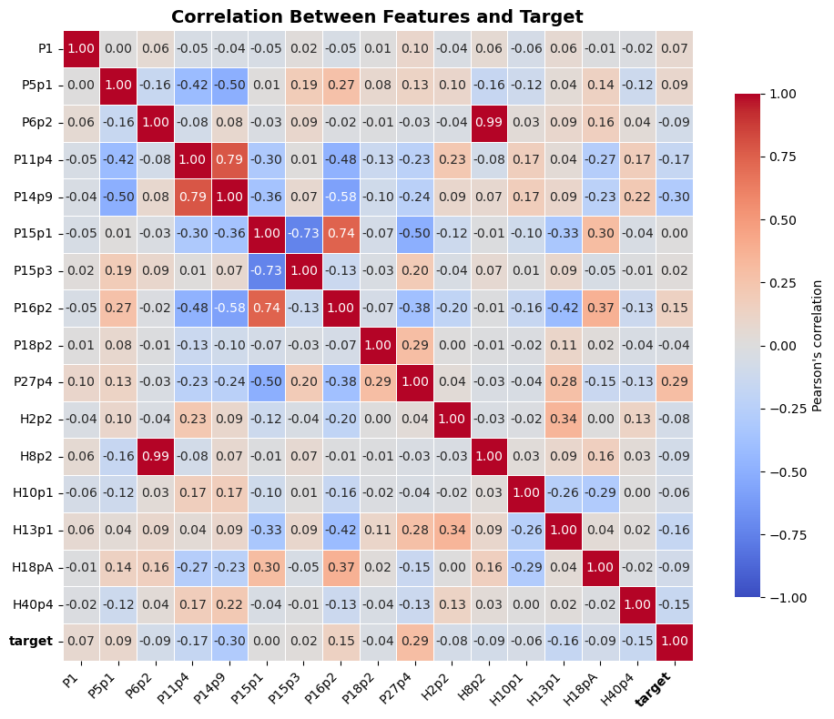
    

