```python
from stat_sum_func import ToParquet, DatasetStatistics
```


```python
file = "CASP"
path = f"raw/{file}/{file}.parquet"
statistics_man = DatasetStatistics(path)
statistics_man.df
```


<div>
<table border="1" class="dataframe">
  <thead>
    <tr style="text-align: right;">
      <th></th>
      <th>F1</th>
      <th>F2</th>
      <th>F3</th>
      <th>F4</th>
      <th>F5</th>
      <th>F6</th>
      <th>F7</th>
      <th>F8</th>
      <th>F9</th>
      <th>RMSD</th>
    </tr>
  </thead>
  <tbody>
    <tr>
      <th>0</th>
      <td>13558.30</td>
      <td>4305.35</td>
      <td>0.31754</td>
      <td>162.1730</td>
      <td>1.872791e+06</td>
      <td>215.3590</td>
      <td>4287.87</td>
      <td>102</td>
      <td>27.0302</td>
      <td>17.284</td>
    </tr>
    <tr>
      <th>1</th>
      <td>6191.96</td>
      <td>1623.16</td>
      <td>0.26213</td>
      <td>53.3894</td>
      <td>8.034467e+05</td>
      <td>87.2024</td>
      <td>3328.91</td>
      <td>39</td>
      <td>38.5468</td>
      <td>6.021</td>
    </tr>
    <tr>
      <th>2</th>
      <td>7725.98</td>
      <td>1726.28</td>
      <td>0.22343</td>
      <td>67.2887</td>
      <td>1.075648e+06</td>
      <td>81.7913</td>
      <td>2981.04</td>
      <td>29</td>
      <td>38.8119</td>
      <td>9.275</td>
    </tr>
    <tr>
      <th>3</th>
      <td>8424.58</td>
      <td>2368.25</td>
      <td>0.28111</td>
      <td>67.8325</td>
      <td>1.210472e+06</td>
      <td>109.4390</td>
      <td>3248.22</td>
      <td>70</td>
      <td>39.0651</td>
      <td>15.851</td>
    </tr>
    <tr>
      <th>4</th>
      <td>7460.84</td>
      <td>1736.94</td>
      <td>0.23280</td>
      <td>52.4123</td>
      <td>1.021020e+06</td>
      <td>94.5234</td>
      <td>2814.42</td>
      <td>41</td>
      <td>39.9147</td>
      <td>7.962</td>
    </tr>
    <tr>
      <th>...</th>
      <td>...</td>
      <td>...</td>
      <td>...</td>
      <td>...</td>
      <td>...</td>
      <td>...</td>
      <td>...</td>
      <td>...</td>
      <td>...</td>
      <td>...</td>
    </tr>
    <tr>
      <th>45725</th>
      <td>8037.12</td>
      <td>2777.68</td>
      <td>0.34560</td>
      <td>64.3390</td>
      <td>1.105797e+06</td>
      <td>112.7460</td>
      <td>3384.21</td>
      <td>84</td>
      <td>36.8036</td>
      <td>3.762</td>
    </tr>
    <tr>
      <th>45726</th>
      <td>7978.76</td>
      <td>2508.57</td>
      <td>0.31440</td>
      <td>75.8654</td>
      <td>1.116725e+06</td>
      <td>102.2770</td>
      <td>3974.52</td>
      <td>54</td>
      <td>36.0470</td>
      <td>6.521</td>
    </tr>
    <tr>
      <th>45727</th>
      <td>7726.65</td>
      <td>2489.58</td>
      <td>0.32220</td>
      <td>70.9903</td>
      <td>1.076560e+06</td>
      <td>103.6780</td>
      <td>3290.46</td>
      <td>46</td>
      <td>37.4718</td>
      <td>10.356</td>
    </tr>
    <tr>
      <th>45728</th>
      <td>8878.93</td>
      <td>3055.78</td>
      <td>0.34416</td>
      <td>94.0314</td>
      <td>1.242266e+06</td>
      <td>115.1950</td>
      <td>3421.79</td>
      <td>41</td>
      <td>35.6045</td>
      <td>9.791</td>
    </tr>
    <tr>
      <th>45729</th>
      <td>12732.40</td>
      <td>4444.36</td>
      <td>0.34905</td>
      <td>157.6300</td>
      <td>1.788897e+06</td>
      <td>229.4590</td>
      <td>4626.85</td>
      <td>141</td>
      <td>29.8118</td>
      <td>18.827</td>
    </tr>
  </tbody>
</table>
<p>45730 rows × 10 columns</p>
</div>


```python
for feature in statistics_man.df.columns:
    statistics_man.plot_distribution(feature)
```


    
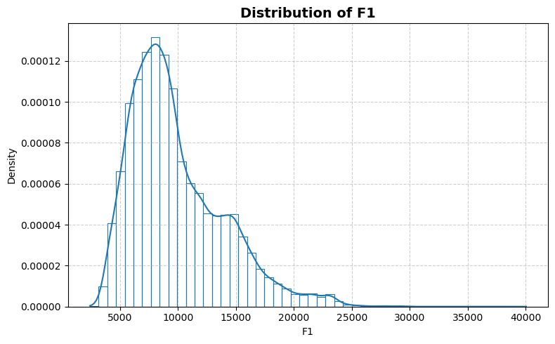
    


    
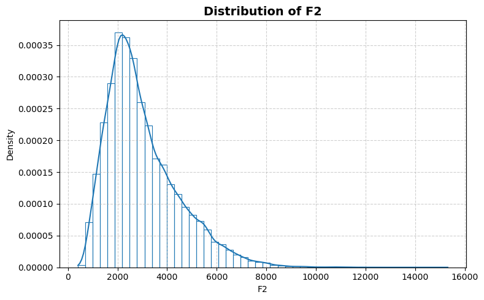
    


    
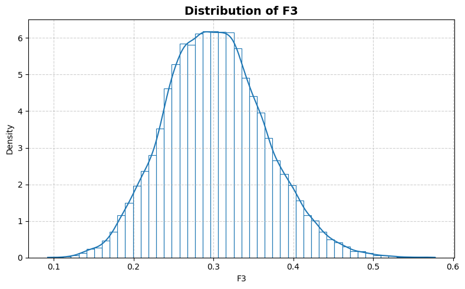
    


    
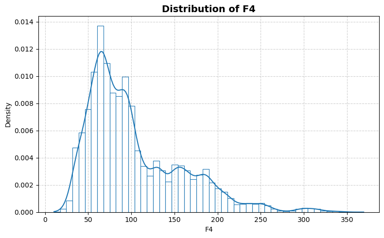
    


    
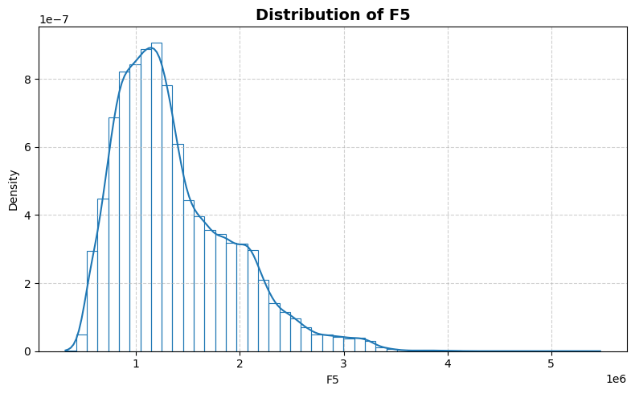
    


    
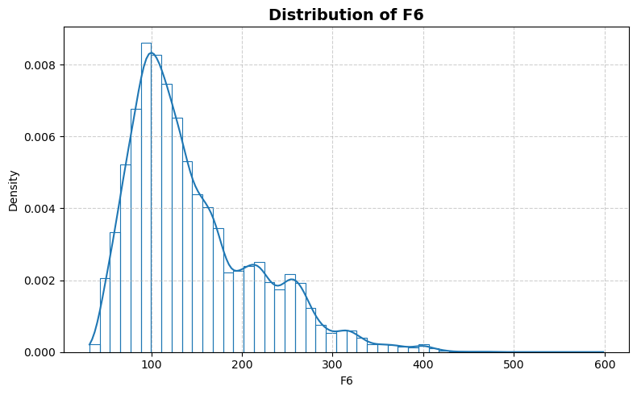
    


    
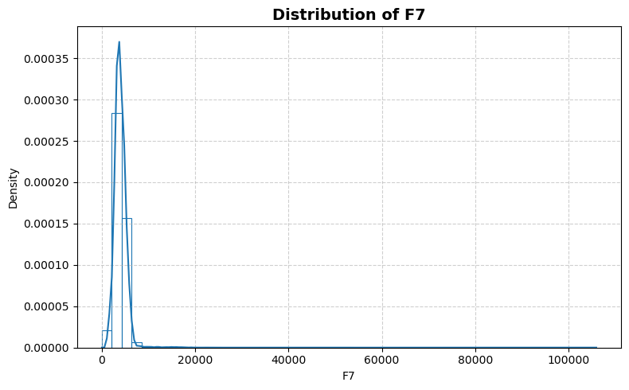
    


    
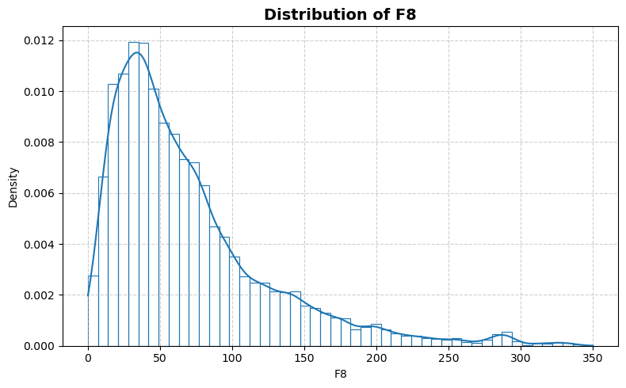
    


    
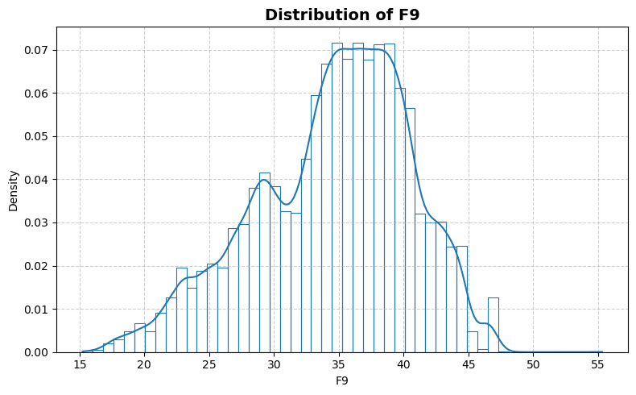
    


    
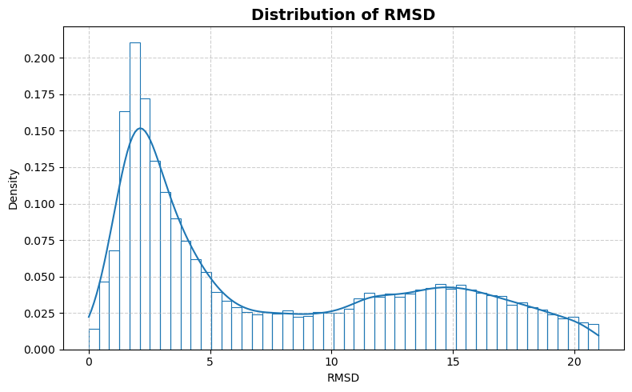
    


```python
statistics_man.plot_box()
```


    
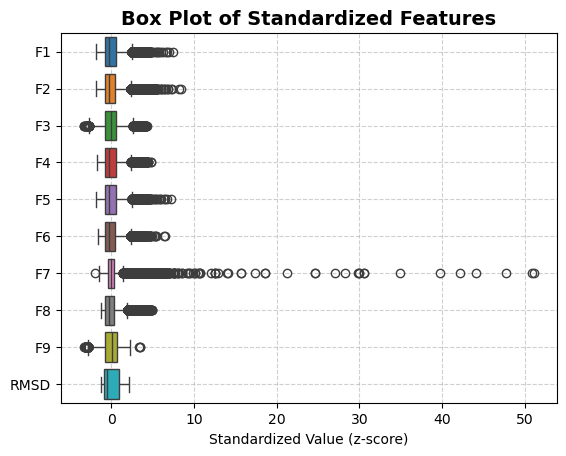
    


```python
statistics_man.print_stat_sum()
```

    Number of samples : 45730
    Number of features: 9
    ==============================


<div>
<table border="1" class="dataframe">
  <thead>
    <tr style="text-align: right;">
      <th></th>
      <th>dtype</th>
      <th>missing</th>
      <th>count</th>
      <th>median</th>
      <th>mean</th>
      <th>std</th>
      <th>min</th>
      <th>25%</th>
      <th>50%</th>
      <th>75%</th>
      <th>max</th>
    </tr>
  </thead>
  <tbody>
    <tr>
      <th>F1</th>
      <td>float64</td>
      <td>0</td>
      <td>45730.0</td>
      <td>8.898805e+03</td>
      <td>9.871597e+03</td>
      <td>4058.138034</td>
      <td>2392.0500</td>
      <td>6936.680000</td>
      <td>8.898805e+03</td>
      <td>1.212615e+04</td>
      <td>4.003490e+04</td>
    </tr>
    <tr>
      <th>F2</th>
      <td>float64</td>
      <td>0</td>
      <td>45730.0</td>
      <td>2.668155e+03</td>
      <td>3.017367e+03</td>
      <td>1464.324663</td>
      <td>403.5000</td>
      <td>1979.045000</td>
      <td>2.668155e+03</td>
      <td>3.786410e+03</td>
      <td>1.531200e+04</td>
    </tr>
    <tr>
      <th>F3</th>
      <td>float64</td>
      <td>0</td>
      <td>45730.0</td>
      <td>3.001500e-01</td>
      <td>3.023919e-01</td>
      <td>0.062886</td>
      <td>0.0925</td>
      <td>0.258740</td>
      <td>3.001500e-01</td>
      <td>3.428900e-01</td>
      <td>5.776900e-01</td>
    </tr>
    <tr>
      <th>F4</th>
      <td>float64</td>
      <td>0</td>
      <td>45730.0</td>
      <td>8.774080e+01</td>
      <td>1.034924e+02</td>
      <td>55.424985</td>
      <td>10.3101</td>
      <td>63.563900</td>
      <td>8.774080e+01</td>
      <td>1.336467e+02</td>
      <td>3.693170e+02</td>
    </tr>
    <tr>
      <th>F5</th>
      <td>float64</td>
      <td>0</td>
      <td>45730.0</td>
      <td>1.237219e+06</td>
      <td>1.368299e+06</td>
      <td>564036.688407</td>
      <td>319490.2166</td>
      <td>953591.221150</td>
      <td>1.237219e+06</td>
      <td>1.690920e+06</td>
      <td>5.472011e+06</td>
    </tr>
    <tr>
      <th>F6</th>
      <td>float64</td>
      <td>0</td>
      <td>45730.0</td>
      <td>1.261760e+02</td>
      <td>1.456381e+02</td>
      <td>69.999230</td>
      <td>31.9704</td>
      <td>94.757500</td>
      <td>1.261760e+02</td>
      <td>1.814685e+02</td>
      <td>5.984080e+02</td>
    </tr>
    <tr>
      <th>F7</th>
      <td>float64</td>
      <td>0</td>
      <td>45730.0</td>
      <td>3.840170e+03</td>
      <td>3.989756e+03</td>
      <td>1993.574575</td>
      <td>0.0000</td>
      <td>3165.322500</td>
      <td>3.840170e+03</td>
      <td>4.644193e+03</td>
      <td>1.059482e+05</td>
    </tr>
    <tr>
      <th>F8</th>
      <td>int64</td>
      <td>0</td>
      <td>45730.0</td>
      <td>5.400000e+01</td>
      <td>6.997507e+01</td>
      <td>56.493443</td>
      <td>0.0000</td>
      <td>31.000000</td>
      <td>5.400000e+01</td>
      <td>9.100000e+01</td>
      <td>3.500000e+02</td>
    </tr>
    <tr>
      <th>F9</th>
      <td>float64</td>
      <td>0</td>
      <td>45730.0</td>
      <td>3.529930e+01</td>
      <td>3.452366e+01</td>
      <td>5.979755</td>
      <td>15.2280</td>
      <td>30.424725</td>
      <td>3.529930e+01</td>
      <td>3.887080e+01</td>
      <td>5.530090e+01</td>
    </tr>
    <tr>
      <th>RMSD</th>
      <td>float64</td>
      <td>0</td>
      <td>45730.0</td>
      <td>5.030000e+00</td>
      <td>7.748528e+00</td>
      <td>6.118312</td>
      <td>0.0000</td>
      <td>2.305000</td>
      <td>5.030000e+00</td>
      <td>1.337900e+01</td>
      <td>2.099900e+01</td>
    </tr>
  </tbody>
</table>
</div>


```python
statistics_man.plot_corr_heatmap()
```


    
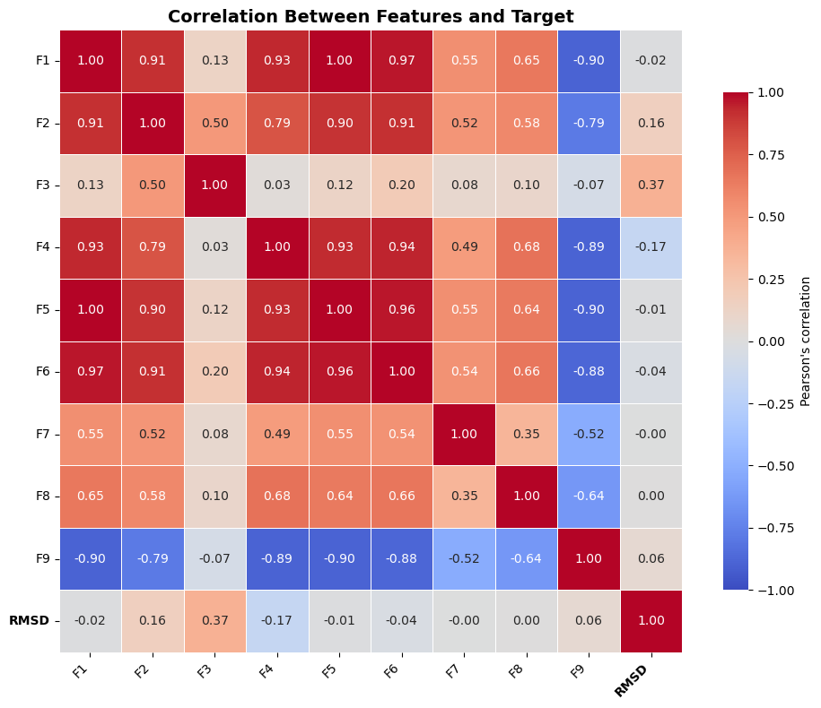
    

