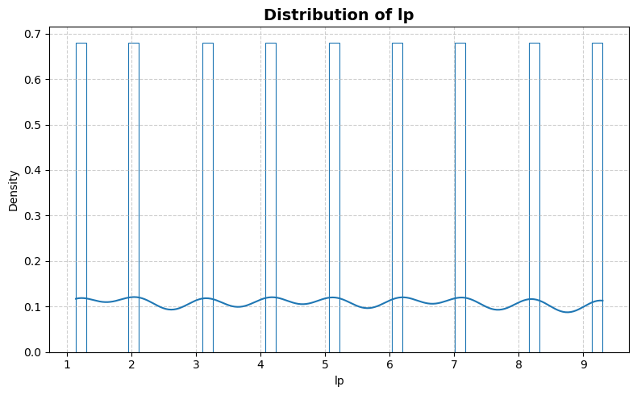
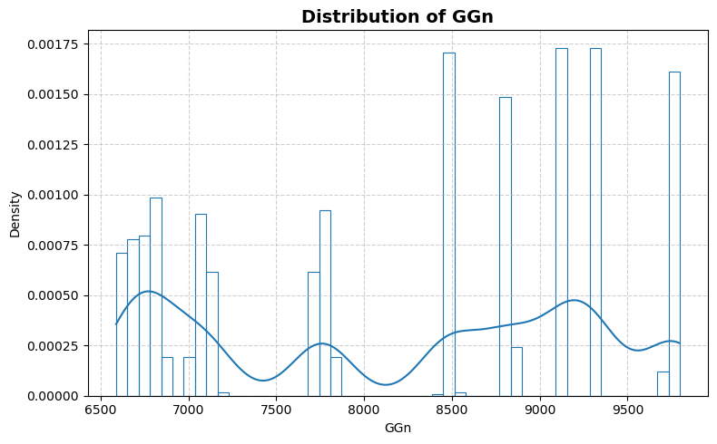
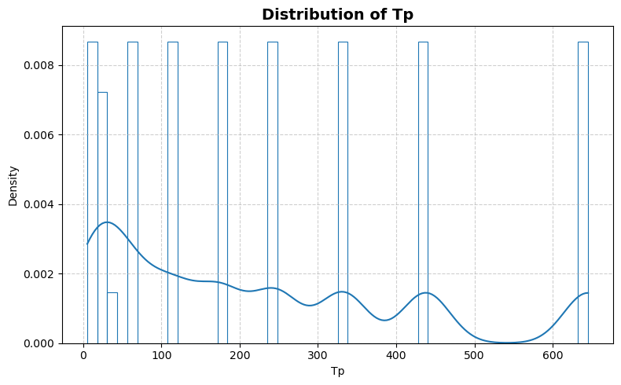
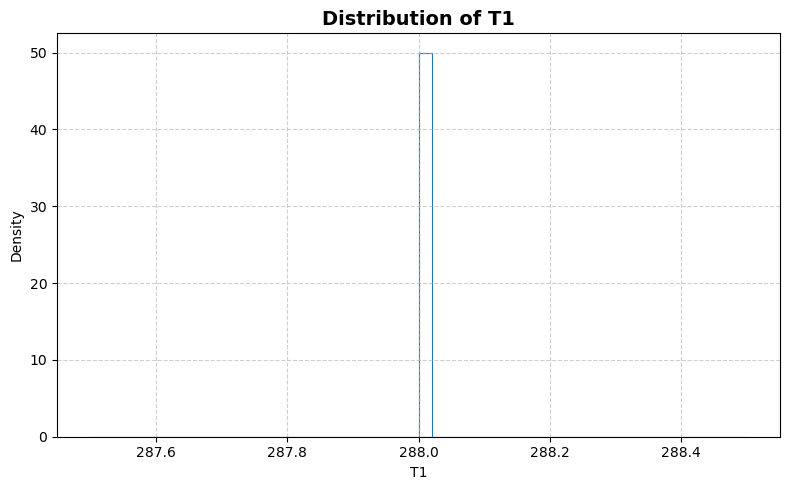
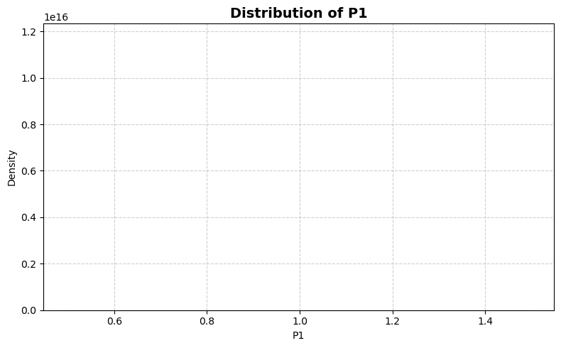
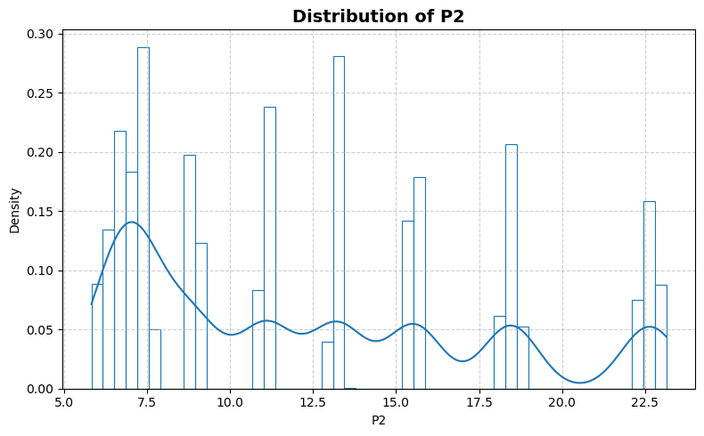
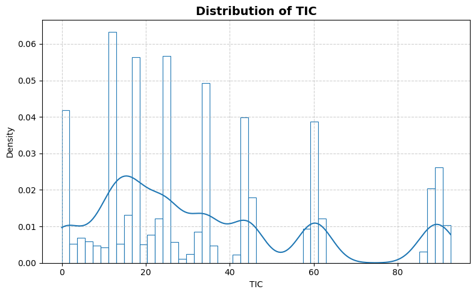
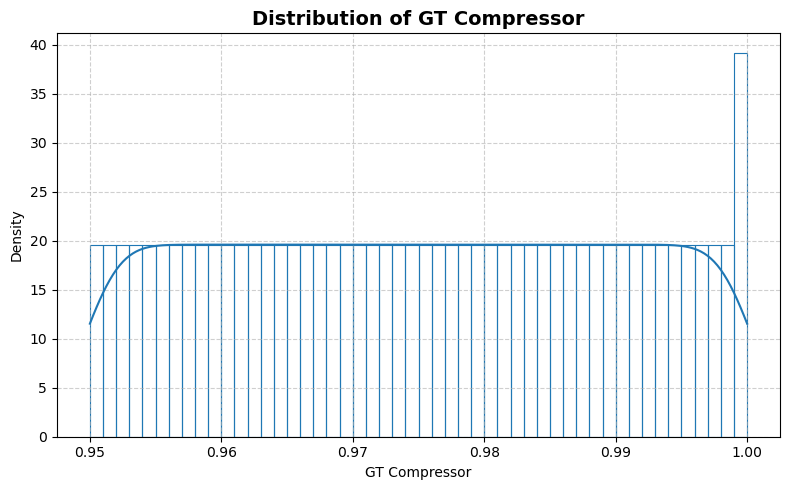
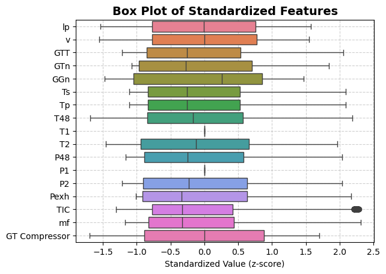
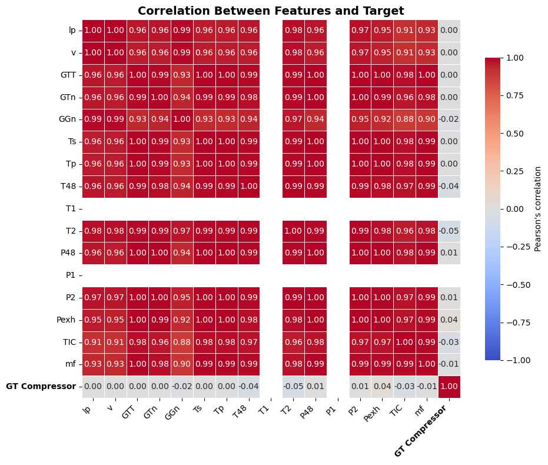

```python
from stat_sum_func import ToParquet, DatasetStatistics
```


```python
file = "CBM_1"
path = f"raw/{file}/{file}.parquet"
statistics_man = DatasetStatistics(path)
statistics_man.df
```


<div>
<table border="1" class="dataframe">
  <thead>
    <tr style="text-align: right;">
      <th></th>
      <th>lp</th>
      <th>v</th>
      <th>GTT</th>
      <th>GTn</th>
      <th>GGn</th>
      <th>Ts</th>
      <th>Tp</th>
      <th>T48</th>
      <th>T1</th>
      <th>T2</th>
      <th>P48</th>
      <th>P1</th>
      <th>P2</th>
      <th>Pexh</th>
      <th>TIC</th>
      <th>mf</th>
      <th>GT Compressor</th>
    </tr>
  </thead>
  <tbody>
    <tr>
      <th>0</th>
      <td>1.138</td>
      <td>3.0</td>
      <td>289.964</td>
      <td>1349.489</td>
      <td>6677.380</td>
      <td>7.584</td>
      <td>7.584</td>
      <td>464.006</td>
      <td>288.0</td>
      <td>550.563</td>
      <td>1.096</td>
      <td>0.998</td>
      <td>5.947</td>
      <td>1.019</td>
      <td>7.137</td>
      <td>0.082</td>
      <td>0.95</td>
    </tr>
    <tr>
      <th>1</th>
      <td>2.088</td>
      <td>6.0</td>
      <td>6960.180</td>
      <td>1376.166</td>
      <td>6828.469</td>
      <td>28.204</td>
      <td>28.204</td>
      <td>635.401</td>
      <td>288.0</td>
      <td>581.658</td>
      <td>1.331</td>
      <td>0.998</td>
      <td>7.282</td>
      <td>1.019</td>
      <td>10.655</td>
      <td>0.287</td>
      <td>0.95</td>
    </tr>
    <tr>
      <th>2</th>
      <td>3.144</td>
      <td>9.0</td>
      <td>8379.229</td>
      <td>1386.757</td>
      <td>7111.811</td>
      <td>60.358</td>
      <td>60.358</td>
      <td>606.002</td>
      <td>288.0</td>
      <td>587.587</td>
      <td>1.389</td>
      <td>0.998</td>
      <td>7.574</td>
      <td>1.020</td>
      <td>13.086</td>
      <td>0.259</td>
      <td>0.95</td>
    </tr>
    <tr>
      <th>3</th>
      <td>4.161</td>
      <td>12.0</td>
      <td>14724.395</td>
      <td>1547.465</td>
      <td>7792.630</td>
      <td>113.774</td>
      <td>113.774</td>
      <td>661.471</td>
      <td>288.0</td>
      <td>613.851</td>
      <td>1.658</td>
      <td>0.998</td>
      <td>9.007</td>
      <td>1.022</td>
      <td>18.109</td>
      <td>0.358</td>
      <td>0.95</td>
    </tr>
    <tr>
      <th>4</th>
      <td>5.140</td>
      <td>15.0</td>
      <td>21636.432</td>
      <td>1924.313</td>
      <td>8494.777</td>
      <td>175.306</td>
      <td>175.306</td>
      <td>731.494</td>
      <td>288.0</td>
      <td>645.642</td>
      <td>2.078</td>
      <td>0.998</td>
      <td>11.197</td>
      <td>1.026</td>
      <td>26.373</td>
      <td>0.522</td>
      <td>0.95</td>
    </tr>
    <tr>
      <th>...</th>
      <td>...</td>
      <td>...</td>
      <td>...</td>
      <td>...</td>
      <td>...</td>
      <td>...</td>
      <td>...</td>
      <td>...</td>
      <td>...</td>
      <td>...</td>
      <td>...</td>
      <td>...</td>
      <td>...</td>
      <td>...</td>
      <td>...</td>
      <td>...</td>
      <td>...</td>
    </tr>
    <tr>
      <th>11929</th>
      <td>5.140</td>
      <td>15.0</td>
      <td>21624.934</td>
      <td>1924.342</td>
      <td>8470.013</td>
      <td>175.239</td>
      <td>175.239</td>
      <td>681.658</td>
      <td>288.0</td>
      <td>628.950</td>
      <td>2.087</td>
      <td>0.998</td>
      <td>10.990</td>
      <td>1.027</td>
      <td>23.803</td>
      <td>0.471</td>
      <td>1.00</td>
    </tr>
    <tr>
      <th>11930</th>
      <td>6.175</td>
      <td>18.0</td>
      <td>29763.213</td>
      <td>2306.745</td>
      <td>8800.352</td>
      <td>245.954</td>
      <td>245.954</td>
      <td>747.405</td>
      <td>288.0</td>
      <td>658.853</td>
      <td>2.512</td>
      <td>0.998</td>
      <td>13.109</td>
      <td>1.031</td>
      <td>32.671</td>
      <td>0.647</td>
      <td>1.00</td>
    </tr>
    <tr>
      <th>11931</th>
      <td>7.148</td>
      <td>21.0</td>
      <td>39003.867</td>
      <td>2678.052</td>
      <td>9120.889</td>
      <td>332.389</td>
      <td>332.389</td>
      <td>796.457</td>
      <td>288.0</td>
      <td>680.393</td>
      <td>2.982</td>
      <td>0.998</td>
      <td>15.420</td>
      <td>1.036</td>
      <td>42.104</td>
      <td>0.834</td>
      <td>1.00</td>
    </tr>
    <tr>
      <th>11932</th>
      <td>8.206</td>
      <td>24.0</td>
      <td>50992.579</td>
      <td>3087.434</td>
      <td>9300.274</td>
      <td>438.024</td>
      <td>438.024</td>
      <td>892.945</td>
      <td>288.0</td>
      <td>722.029</td>
      <td>3.594</td>
      <td>0.998</td>
      <td>18.293</td>
      <td>1.043</td>
      <td>58.064</td>
      <td>1.149</td>
      <td>1.00</td>
    </tr>
    <tr>
      <th>11933</th>
      <td>9.300</td>
      <td>27.0</td>
      <td>72775.130</td>
      <td>3560.400</td>
      <td>9742.950</td>
      <td>644.880</td>
      <td>644.880</td>
      <td>1038.411</td>
      <td>288.0</td>
      <td>767.595</td>
      <td>4.531</td>
      <td>0.998</td>
      <td>22.464</td>
      <td>1.052</td>
      <td>86.067</td>
      <td>1.704</td>
      <td>1.00</td>
    </tr>
  </tbody>
</table>
<p>11934 rows × 17 columns</p>
</div>


```python
for feature in statistics_man.df.columns:
    statistics_man.plot_distribution(feature)
```


    

    


    

    


    

    


    

    


    

    


    

    


    

    


    

    


    

    


    

    


    

    


    

    


    

    


    

    


    

    


    

    


    

    


```python
statistics_man.plot_box()
```


    

    


```python
statistics_man.print_stat_sum()
```

    Number of samples : 11934
    Number of features: 16
    ==============================


<div>
<table border="1" class="dataframe">
  <thead>
    <tr style="text-align: right;">
      <th></th>
      <th>dtype</th>
      <th>missing</th>
      <th>count</th>
      <th>median</th>
      <th>mean</th>
      <th>std</th>
      <th>min</th>
      <th>25%</th>
      <th>50%</th>
      <th>75%</th>
      <th>max</th>
    </tr>
  </thead>
  <tbody>
    <tr>
      <th>lp</th>
      <td>float64</td>
      <td>0</td>
      <td>11934.0</td>
      <td>5.1400</td>
      <td>5.166667</td>
      <td>2.626388e+00</td>
      <td>1.138</td>
      <td>3.14400</td>
      <td>5.1400</td>
      <td>7.14800</td>
      <td>9.300</td>
    </tr>
    <tr>
      <th>v</th>
      <td>float64</td>
      <td>0</td>
      <td>11934.0</td>
      <td>15.0000</td>
      <td>15.000000</td>
      <td>7.746291e+00</td>
      <td>3.000</td>
      <td>9.00000</td>
      <td>15.0000</td>
      <td>21.00000</td>
      <td>27.000</td>
    </tr>
    <tr>
      <th>GTT</th>
      <td>float64</td>
      <td>0</td>
      <td>11934.0</td>
      <td>21630.6590</td>
      <td>27247.498685</td>
      <td>2.214861e+04</td>
      <td>253.547</td>
      <td>8375.88375</td>
      <td>21630.6590</td>
      <td>39001.42675</td>
      <td>72784.872</td>
    </tr>
    <tr>
      <th>GTn</th>
      <td>float64</td>
      <td>0</td>
      <td>11934.0</td>
      <td>1924.3260</td>
      <td>2136.289256</td>
      <td>7.740839e+02</td>
      <td>1307.675</td>
      <td>1386.75800</td>
      <td>1924.3260</td>
      <td>2678.07900</td>
      <td>3560.741</td>
    </tr>
    <tr>
      <th>GGn</th>
      <td>float64</td>
      <td>0</td>
      <td>11934.0</td>
      <td>8482.0815</td>
      <td>8200.947312</td>
      <td>1.091316e+03</td>
      <td>6589.002</td>
      <td>7058.32400</td>
      <td>8482.0815</td>
      <td>9132.60600</td>
      <td>9797.103</td>
    </tr>
    <tr>
      <th>Ts</th>
      <td>float64</td>
      <td>0</td>
      <td>11934.0</td>
      <td>175.2680</td>
      <td>227.335768</td>
      <td>2.004959e+02</td>
      <td>5.304</td>
      <td>60.31700</td>
      <td>175.2680</td>
      <td>332.36475</td>
      <td>645.249</td>
    </tr>
    <tr>
      <th>Tp</th>
      <td>float64</td>
      <td>0</td>
      <td>11934.0</td>
      <td>175.2680</td>
      <td>227.335768</td>
      <td>2.004959e+02</td>
      <td>5.304</td>
      <td>60.31700</td>
      <td>175.2680</td>
      <td>332.36475</td>
      <td>645.249</td>
    </tr>
    <tr>
      <th>T48</th>
      <td>float64</td>
      <td>0</td>
      <td>11934.0</td>
      <td>706.0380</td>
      <td>735.495446</td>
      <td>1.736806e+02</td>
      <td>442.364</td>
      <td>589.87275</td>
      <td>706.0380</td>
      <td>834.06625</td>
      <td>1115.797</td>
    </tr>
    <tr>
      <th>T1</th>
      <td>float64</td>
      <td>0</td>
      <td>11934.0</td>
      <td>288.0000</td>
      <td>288.000000</td>
      <td>0.000000e+00</td>
      <td>288.000</td>
      <td>288.00000</td>
      <td>288.0000</td>
      <td>288.00000</td>
      <td>288.000</td>
    </tr>
    <tr>
      <th>T2</th>
      <td>float64</td>
      <td>0</td>
      <td>11934.0</td>
      <td>637.1415</td>
      <td>646.215331</td>
      <td>7.267588e+01</td>
      <td>540.442</td>
      <td>578.09225</td>
      <td>637.1415</td>
      <td>693.92450</td>
      <td>789.094</td>
    </tr>
    <tr>
      <th>P48</th>
      <td>float64</td>
      <td>0</td>
      <td>11934.0</td>
      <td>2.0830</td>
      <td>2.352963</td>
      <td>1.084770e+00</td>
      <td>1.093</td>
      <td>1.38900</td>
      <td>2.0830</td>
      <td>2.98100</td>
      <td>4.560</td>
    </tr>
    <tr>
      <th>P1</th>
      <td>float64</td>
      <td>0</td>
      <td>11934.0</td>
      <td>0.9980</td>
      <td>0.998000</td>
      <td>2.533635e-13</td>
      <td>0.998</td>
      <td>0.99800</td>
      <td>0.9980</td>
      <td>0.99800</td>
      <td>0.998</td>
    </tr>
    <tr>
      <th>P2</th>
      <td>float64</td>
      <td>0</td>
      <td>11934.0</td>
      <td>11.0920</td>
      <td>12.297123</td>
      <td>5.337448e+00</td>
      <td>5.828</td>
      <td>7.44725</td>
      <td>11.0920</td>
      <td>15.65800</td>
      <td>23.140</td>
    </tr>
    <tr>
      <th>Pexh</th>
      <td>float64</td>
      <td>0</td>
      <td>11934.0</td>
      <td>1.0260</td>
      <td>1.029474</td>
      <td>1.039032e-02</td>
      <td>1.019</td>
      <td>1.02000</td>
      <td>1.0260</td>
      <td>1.03600</td>
      <td>1.052</td>
    </tr>
    <tr>
      <th>TIC</th>
      <td>float64</td>
      <td>0</td>
      <td>11934.0</td>
      <td>25.2765</td>
      <td>33.641261</td>
      <td>2.584136e+01</td>
      <td>0.000</td>
      <td>13.67750</td>
      <td>25.2765</td>
      <td>44.55250</td>
      <td>92.556</td>
    </tr>
    <tr>
      <th>mf</th>
      <td>float64</td>
      <td>0</td>
      <td>11934.0</td>
      <td>0.4960</td>
      <td>0.662440</td>
      <td>5.071316e-01</td>
      <td>0.068</td>
      <td>0.24600</td>
      <td>0.4960</td>
      <td>0.88200</td>
      <td>1.832</td>
    </tr>
    <tr>
      <th>GT Compressor</th>
      <td>float64</td>
      <td>0</td>
      <td>11934.0</td>
      <td>0.9750</td>
      <td>0.975000</td>
      <td>1.472022e-02</td>
      <td>0.950</td>
      <td>0.96200</td>
      <td>0.9750</td>
      <td>0.98800</td>
      <td>1.000</td>
    </tr>
  </tbody>
</table>
</div>


```python
statistics_man.plot_corr_heatmap()
```


    

    

