```python
from stat_sum_func import ToParquet, DatasetStatistics
```


```python
file = "MiamiHousing2016"
path = f"raw/{file}/{file}.parquet"
statistics_man = DatasetStatistics(path)
statistics_man.df
```


<div>
<table border="1" class="dataframe">
  <thead>
    <tr style="text-align: right;">
      <th></th>
      <th>LATITUDE</th>
      <th>LONGITUDE</th>
      <th>LND_SQFOOT</th>
      <th>TOT_LVG_AREA REAL</th>
      <th>SPEC_FEAT_VAL</th>
      <th>RAIL_DIST</th>
      <th>OCEAN_DIST</th>
      <th>WATER_DIST</th>
      <th>CNTR_DIST</th>
      <th>SUBCNTR_DI</th>
      <th>HWY_DIST</th>
      <th>age</th>
      <th>month_sold</th>
      <th>SALEPRC</th>
    </tr>
  </thead>
  <tbody>
    <tr>
      <th>0</th>
      <td>25.891031</td>
      <td>-80.160561</td>
      <td>9375.0</td>
      <td>1753.0</td>
      <td>0.0</td>
      <td>2815.9</td>
      <td>12811.4</td>
      <td>347.6</td>
      <td>42815.3</td>
      <td>37742.2</td>
      <td>15954.9</td>
      <td>67.0</td>
      <td>8.0</td>
      <td>12.994532</td>
    </tr>
    <tr>
      <th>1</th>
      <td>25.891324</td>
      <td>-80.153968</td>
      <td>9375.0</td>
      <td>1715.0</td>
      <td>0.0</td>
      <td>4359.1</td>
      <td>10648.4</td>
      <td>337.8</td>
      <td>43504.9</td>
      <td>37340.5</td>
      <td>18125.0</td>
      <td>63.0</td>
      <td>9.0</td>
      <td>12.762830</td>
    </tr>
    <tr>
      <th>2</th>
      <td>25.891334</td>
      <td>-80.153740</td>
      <td>9375.0</td>
      <td>2276.0</td>
      <td>49206.0</td>
      <td>4412.9</td>
      <td>10574.1</td>
      <td>297.1</td>
      <td>43530.4</td>
      <td>37328.7</td>
      <td>18200.5</td>
      <td>61.0</td>
      <td>2.0</td>
      <td>13.592368</td>
    </tr>
    <tr>
      <th>3</th>
      <td>25.891765</td>
      <td>-80.152657</td>
      <td>12450.0</td>
      <td>2058.0</td>
      <td>10033.0</td>
      <td>4585.0</td>
      <td>10156.5</td>
      <td>0.0</td>
      <td>43797.5</td>
      <td>37423.2</td>
      <td>18514.4</td>
      <td>63.0</td>
      <td>9.0</td>
      <td>13.803439</td>
    </tr>
    <tr>
      <th>4</th>
      <td>25.891825</td>
      <td>-80.154639</td>
      <td>12800.0</td>
      <td>1684.0</td>
      <td>16681.0</td>
      <td>4063.4</td>
      <td>10836.8</td>
      <td>326.6</td>
      <td>43599.7</td>
      <td>37550.8</td>
      <td>17903.4</td>
      <td>42.0</td>
      <td>7.0</td>
      <td>13.534474</td>
    </tr>
    <tr>
      <th>...</th>
      <td>...</td>
      <td>...</td>
      <td>...</td>
      <td>...</td>
      <td>...</td>
      <td>...</td>
      <td>...</td>
      <td>...</td>
      <td>...</td>
      <td>...</td>
      <td>...</td>
      <td>...</td>
      <td>...</td>
      <td>...</td>
    </tr>
    <tr>
      <th>13927</th>
      <td>25.783130</td>
      <td>-80.259795</td>
      <td>6780.0</td>
      <td>967.0</td>
      <td>6580.0</td>
      <td>3844.5</td>
      <td>20568.0</td>
      <td>3252.4</td>
      <td>22175.9</td>
      <td>12150.1</td>
      <td>917.4</td>
      <td>16.0</td>
      <td>4.0</td>
      <td>12.524530</td>
    </tr>
    <tr>
      <th>13928</th>
      <td>25.783585</td>
      <td>-80.260354</td>
      <td>7500.0</td>
      <td>1854.0</td>
      <td>2544.0</td>
      <td>3593.6</td>
      <td>20791.9</td>
      <td>3077.7</td>
      <td>22375.1</td>
      <td>12316.8</td>
      <td>738.2</td>
      <td>26.0</td>
      <td>5.0</td>
      <td>12.736704</td>
    </tr>
    <tr>
      <th>13929</th>
      <td>25.783793</td>
      <td>-80.256126</td>
      <td>8460.0</td>
      <td>1271.0</td>
      <td>2064.0</td>
      <td>4143.2</td>
      <td>20307.9</td>
      <td>3588.4</td>
      <td>20966.9</td>
      <td>12433.0</td>
      <td>743.7</td>
      <td>16.0</td>
      <td>7.0</td>
      <td>12.568982</td>
    </tr>
    <tr>
      <th>13930</th>
      <td>25.784007</td>
      <td>-80.257542</td>
      <td>7500.0</td>
      <td>1613.0</td>
      <td>3136.0</td>
      <td>3986.9</td>
      <td>20542.6</td>
      <td>3589.1</td>
      <td>21475.6</td>
      <td>12458.0</td>
      <td>626.1</td>
      <td>16.0</td>
      <td>8.0</td>
      <td>12.660331</td>
    </tr>
    <tr>
      <th>13931</th>
      <td>25.784387</td>
      <td>-80.258901</td>
      <td>8833.0</td>
      <td>1867.0</td>
      <td>266.0</td>
      <td>3793.9</td>
      <td>20859.6</td>
      <td>3421.0</td>
      <td>21928.6</td>
      <td>12599.0</td>
      <td>474.7</td>
      <td>62.0</td>
      <td>11.0</td>
      <td>12.429220</td>
    </tr>
  </tbody>
</table>
<p>13932 rows × 14 columns</p>
</div>


```python
for feature in statistics_man.df.columns:
    statistics_man.plot_distribution(feature)
```


    
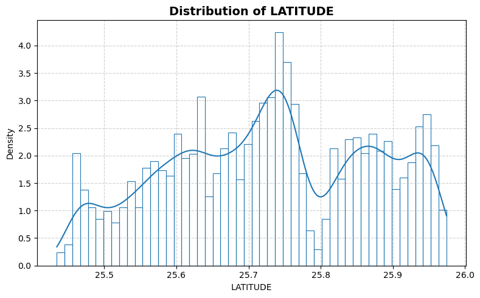
    


    
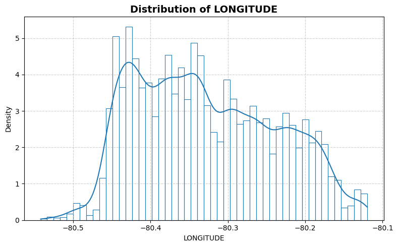
    


    
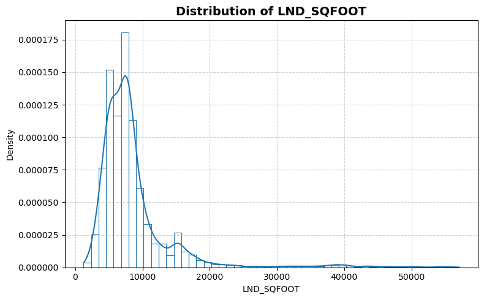
    


    
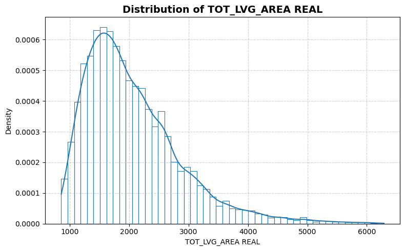
    


    
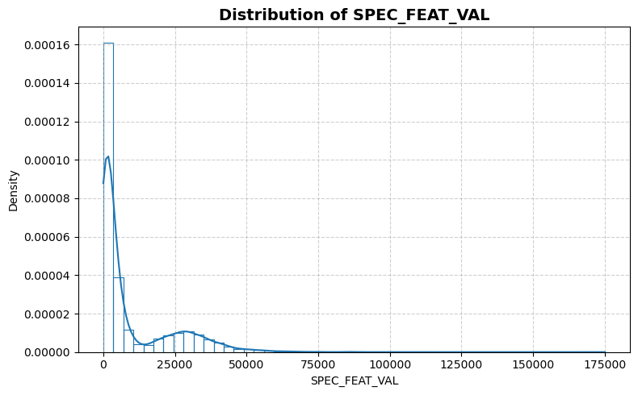
    


    
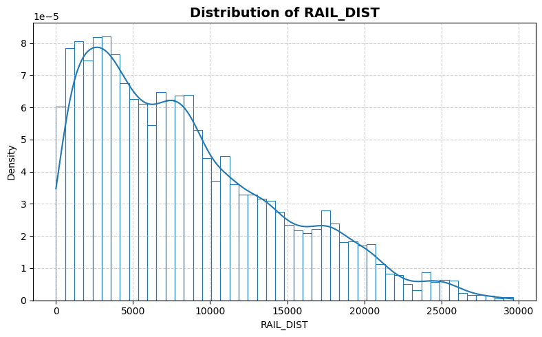
    


    
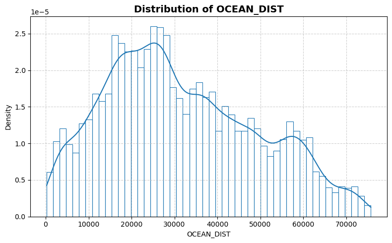
    


    
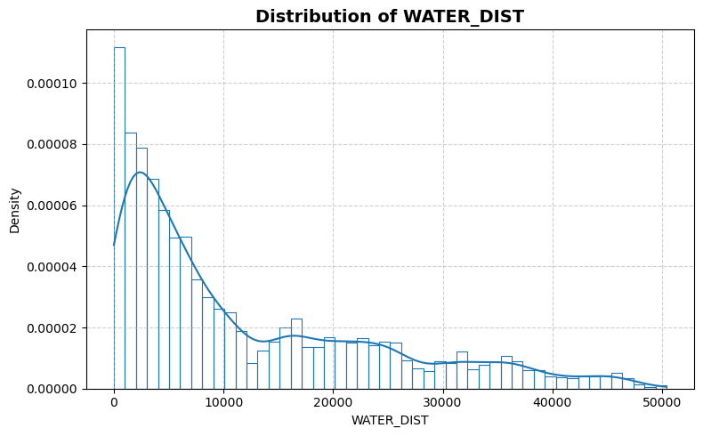
    


    
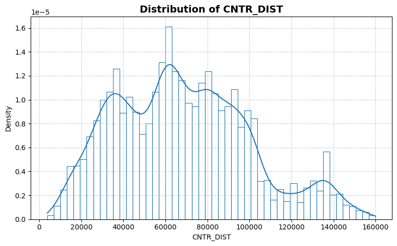
    


    
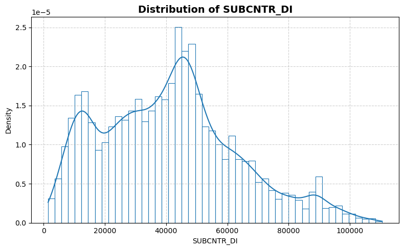
    


    
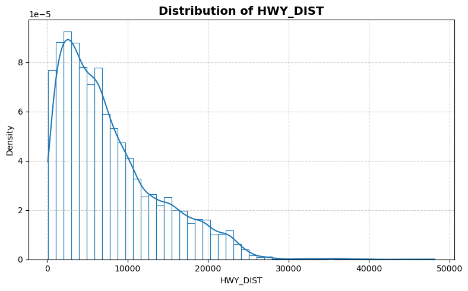
    


    
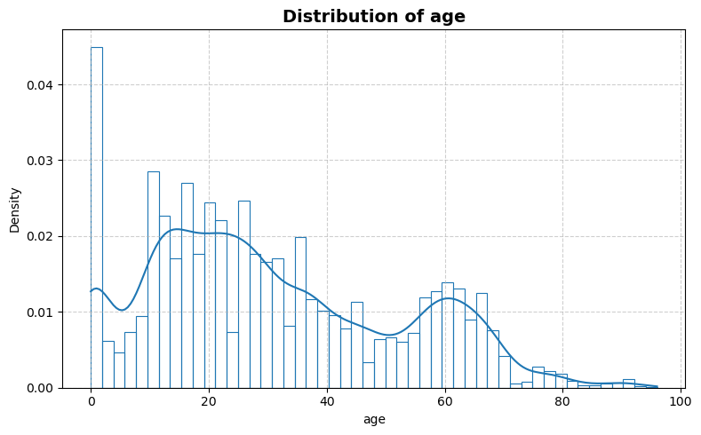
    


    
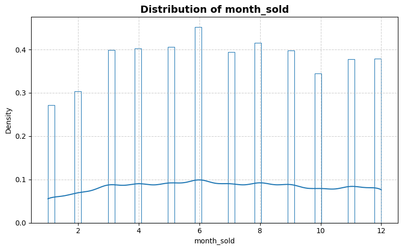
    


    
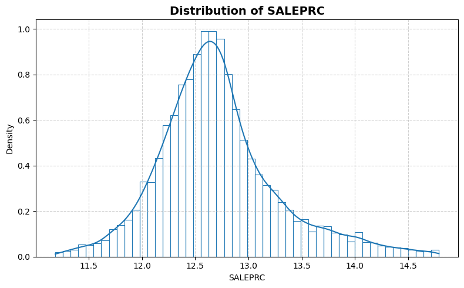
    


```python
statistics_man.plot_box()
```


    
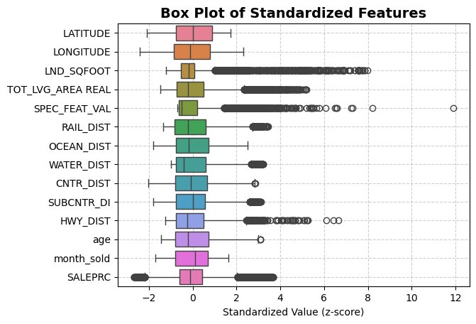
    


```python
statistics_man.print_stat_sum()
```

    Number of samples : 13932
    Number of features: 13
    ==============================


<div>
<table border="1" class="dataframe">
  <thead>
    <tr style="text-align: right;">
      <th></th>
      <th>dtype</th>
      <th>missing</th>
      <th>count</th>
      <th>median</th>
      <th>mean</th>
      <th>std</th>
      <th>min</th>
      <th>25%</th>
      <th>50%</th>
      <th>75%</th>
      <th>max</th>
    </tr>
  </thead>
  <tbody>
    <tr>
      <th>LATITUDE</th>
      <td>float64</td>
      <td>0</td>
      <td>13932.0</td>
      <td>25.731810</td>
      <td>25.728811</td>
      <td>0.140633</td>
      <td>25.434333</td>
      <td>25.620056</td>
      <td>25.731810</td>
      <td>25.852269</td>
      <td>25.974382</td>
    </tr>
    <tr>
      <th>LONGITUDE</th>
      <td>float64</td>
      <td>0</td>
      <td>13932.0</td>
      <td>-80.338911</td>
      <td>-80.327475</td>
      <td>0.089199</td>
      <td>-80.542172</td>
      <td>-80.403278</td>
      <td>-80.338911</td>
      <td>-80.258019</td>
      <td>-80.119746</td>
    </tr>
    <tr>
      <th>LND_SQFOOT</th>
      <td>float64</td>
      <td>0</td>
      <td>13932.0</td>
      <td>7500.000000</td>
      <td>8620.879917</td>
      <td>6070.088742</td>
      <td>1248.000000</td>
      <td>5400.000000</td>
      <td>7500.000000</td>
      <td>9126.250000</td>
      <td>57064.000000</td>
    </tr>
    <tr>
      <th>TOT_LVG_AREA REAL</th>
      <td>float64</td>
      <td>0</td>
      <td>13932.0</td>
      <td>1877.500000</td>
      <td>2058.044574</td>
      <td>813.538535</td>
      <td>854.000000</td>
      <td>1470.000000</td>
      <td>1877.500000</td>
      <td>2471.000000</td>
      <td>6287.000000</td>
    </tr>
    <tr>
      <th>SPEC_FEAT_VAL</th>
      <td>float64</td>
      <td>0</td>
      <td>13932.0</td>
      <td>2765.500000</td>
      <td>9562.493468</td>
      <td>13890.967782</td>
      <td>0.000000</td>
      <td>810.000000</td>
      <td>2765.500000</td>
      <td>12352.250000</td>
      <td>175020.000000</td>
    </tr>
    <tr>
      <th>RAIL_DIST</th>
      <td>float64</td>
      <td>0</td>
      <td>13932.0</td>
      <td>7106.300000</td>
      <td>8348.548715</td>
      <td>6178.027333</td>
      <td>10.500000</td>
      <td>3299.450000</td>
      <td>7106.300000</td>
      <td>12102.600000</td>
      <td>29621.500000</td>
    </tr>
    <tr>
      <th>OCEAN_DIST</th>
      <td>float64</td>
      <td>0</td>
      <td>13932.0</td>
      <td>28541.750000</td>
      <td>31690.993798</td>
      <td>17595.079468</td>
      <td>236.100000</td>
      <td>18079.350000</td>
      <td>28541.750000</td>
      <td>44310.650000</td>
      <td>75744.900000</td>
    </tr>
    <tr>
      <th>WATER_DIST</th>
      <td>float64</td>
      <td>0</td>
      <td>13932.0</td>
      <td>6922.600000</td>
      <td>11960.285235</td>
      <td>11932.992369</td>
      <td>0.000000</td>
      <td>2675.850000</td>
      <td>6922.600000</td>
      <td>19200.000000</td>
      <td>50399.800000</td>
    </tr>
    <tr>
      <th>CNTR_DIST</th>
      <td>float64</td>
      <td>0</td>
      <td>13932.0</td>
      <td>65852.400000</td>
      <td>68490.327132</td>
      <td>32008.474808</td>
      <td>3825.600000</td>
      <td>42823.100000</td>
      <td>65852.400000</td>
      <td>89358.325000</td>
      <td>159976.500000</td>
    </tr>
    <tr>
      <th>SUBCNTR_DI</th>
      <td>float64</td>
      <td>0</td>
      <td>13932.0</td>
      <td>41109.900000</td>
      <td>41115.047265</td>
      <td>22161.825935</td>
      <td>1462.800000</td>
      <td>23996.250000</td>
      <td>41109.900000</td>
      <td>53949.375000</td>
      <td>110553.800000</td>
    </tr>
    <tr>
      <th>HWY_DIST</th>
      <td>float64</td>
      <td>0</td>
      <td>13932.0</td>
      <td>6159.750000</td>
      <td>7723.770693</td>
      <td>6068.936108</td>
      <td>90.200000</td>
      <td>2998.125000</td>
      <td>6159.750000</td>
      <td>10854.200000</td>
      <td>48167.300000</td>
    </tr>
    <tr>
      <th>age</th>
      <td>float64</td>
      <td>0</td>
      <td>13932.0</td>
      <td>26.000000</td>
      <td>30.669251</td>
      <td>21.153068</td>
      <td>0.000000</td>
      <td>14.000000</td>
      <td>26.000000</td>
      <td>46.000000</td>
      <td>96.000000</td>
    </tr>
    <tr>
      <th>month_sold</th>
      <td>float64</td>
      <td>0</td>
      <td>13932.0</td>
      <td>7.000000</td>
      <td>6.655828</td>
      <td>3.301523</td>
      <td>1.000000</td>
      <td>4.000000</td>
      <td>7.000000</td>
      <td>9.000000</td>
      <td>12.000000</td>
    </tr>
    <tr>
      <th>SALEPRC</th>
      <td>float64</td>
      <td>0</td>
      <td>13932.0</td>
      <td>12.644331</td>
      <td>12.710989</td>
      <td>0.567810</td>
      <td>11.184435</td>
      <td>12.367345</td>
      <td>12.644331</td>
      <td>12.966881</td>
      <td>14.790071</td>
    </tr>
  </tbody>
</table>
</div>


```python
statistics_man.plot_corr_heatmap()
```


    
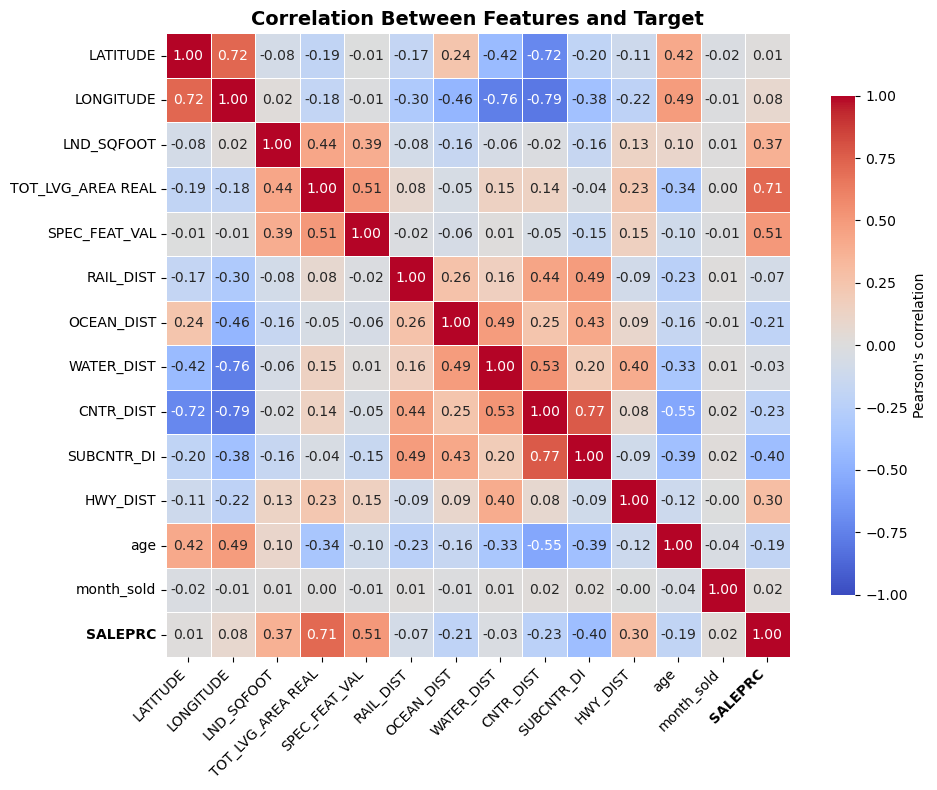
    

