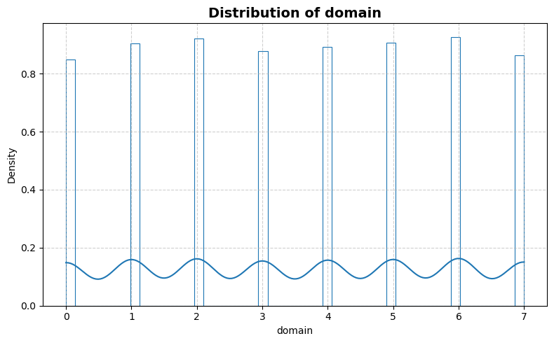
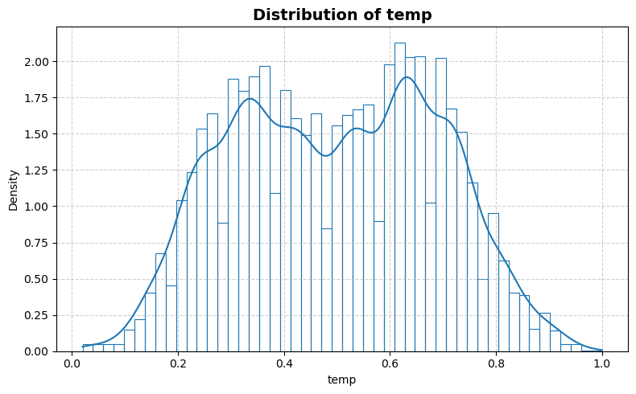
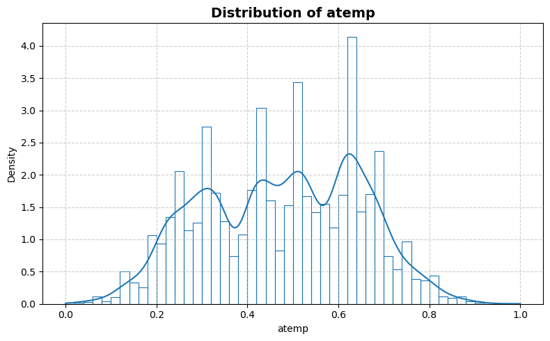
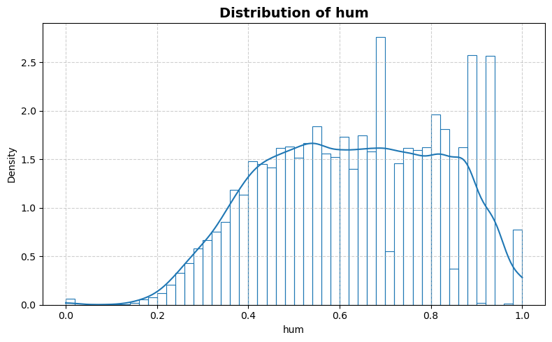
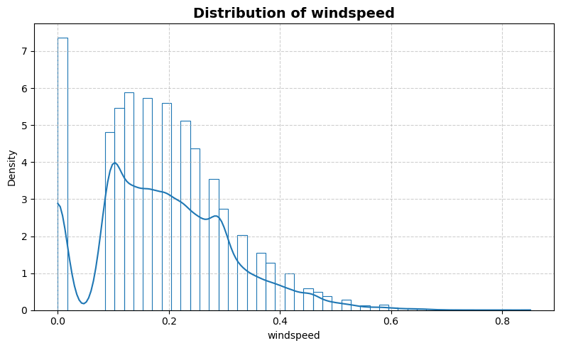
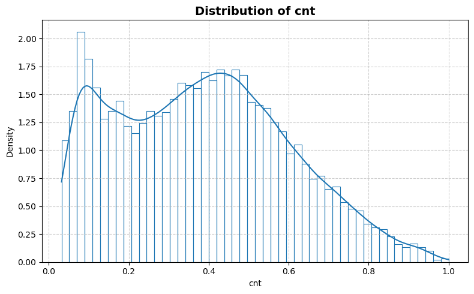
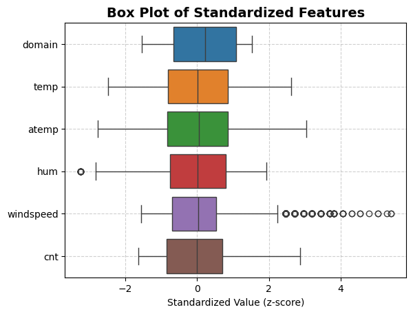
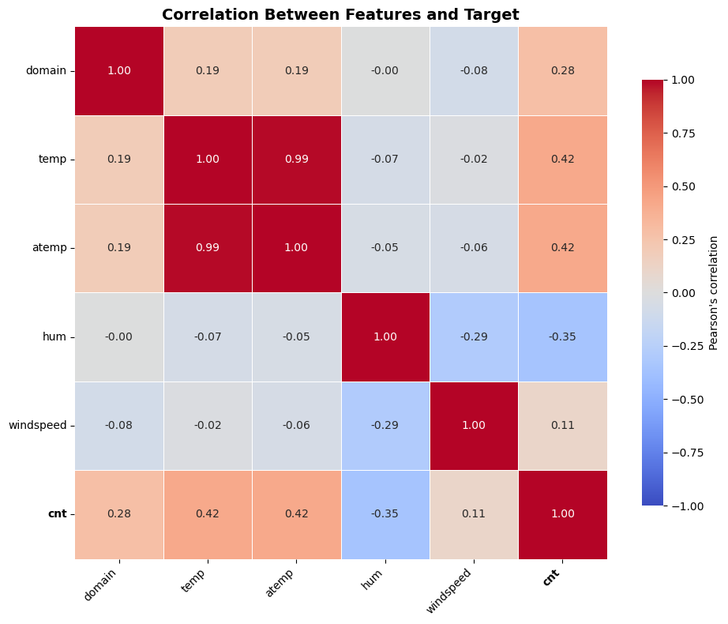

```python
from stat_sum_func import ToParquet, DatasetStatistics
```


```python
file = "bike"
path = f"raw/{file}/{file}.parquet"
statistics_man = DatasetStatistics(path)
statistics_man.df
```


<div>
<table border="1" class="dataframe">
  <thead>
    <tr style="text-align: right;">
      <th></th>
      <th>domain</th>
      <th>temp</th>
      <th>atemp</th>
      <th>hum</th>
      <th>windspeed</th>
      <th>cnt</th>
    </tr>
  </thead>
  <tbody>
    <tr>
      <th>0</th>
      <td>0</td>
      <td>0.24</td>
      <td>0.2879</td>
      <td>0.81</td>
      <td>0.0000</td>
      <td>0.127971</td>
    </tr>
    <tr>
      <th>1</th>
      <td>0</td>
      <td>0.22</td>
      <td>0.2727</td>
      <td>0.80</td>
      <td>0.0000</td>
      <td>0.202340</td>
    </tr>
    <tr>
      <th>2</th>
      <td>0</td>
      <td>0.22</td>
      <td>0.2727</td>
      <td>0.80</td>
      <td>0.0000</td>
      <td>0.180979</td>
    </tr>
    <tr>
      <th>3</th>
      <td>0</td>
      <td>0.24</td>
      <td>0.2879</td>
      <td>0.75</td>
      <td>0.0000</td>
      <td>0.115352</td>
    </tr>
    <tr>
      <th>4</th>
      <td>0</td>
      <td>0.24</td>
      <td>0.2879</td>
      <td>0.75</td>
      <td>0.0000</td>
      <td>0.031993</td>
    </tr>
    <tr>
      <th>...</th>
      <td>...</td>
      <td>...</td>
      <td>...</td>
      <td>...</td>
      <td>...</td>
      <td>...</td>
    </tr>
    <tr>
      <th>17374</th>
      <td>7</td>
      <td>0.34</td>
      <td>0.3182</td>
      <td>0.71</td>
      <td>0.2537</td>
      <td>0.347531</td>
    </tr>
    <tr>
      <th>17375</th>
      <td>7</td>
      <td>0.34</td>
      <td>0.3333</td>
      <td>0.76</td>
      <td>0.1642</td>
      <td>0.226224</td>
    </tr>
    <tr>
      <th>17376</th>
      <td>7</td>
      <td>0.34</td>
      <td>0.3333</td>
      <td>0.76</td>
      <td>0.1642</td>
      <td>0.163132</td>
    </tr>
    <tr>
      <th>17377</th>
      <td>7</td>
      <td>0.34</td>
      <td>0.3333</td>
      <td>0.87</td>
      <td>0.1940</td>
      <td>0.146610</td>
    </tr>
    <tr>
      <th>17378</th>
      <td>7</td>
      <td>0.40</td>
      <td>0.4091</td>
      <td>0.82</td>
      <td>0.2985</td>
      <td>0.115352</td>
    </tr>
  </tbody>
</table>
<p>17379 rows × 6 columns</p>
</div>


```python
for feature in statistics_man.df.columns:
    statistics_man.plot_distribution(feature)
```


    

    


    

    


    

    


    

    


    

    


    

    


```python
statistics_man.plot_box()
```


    

    


```python
statistics_man.print_stat_sum()
```

    Number of samples : 17379
    Number of features: 5
    ==============================


<div>
<table border="1" class="dataframe">
  <thead>
    <tr style="text-align: right;">
      <th></th>
      <th>dtype</th>
      <th>missing</th>
      <th>count</th>
      <th>median</th>
      <th>mean</th>
      <th>std</th>
      <th>min</th>
      <th>25%</th>
      <th>50%</th>
      <th>75%</th>
      <th>max</th>
    </tr>
  </thead>
  <tbody>
    <tr>
      <th>domain</th>
      <td>int64</td>
      <td>0</td>
      <td>17379.0</td>
      <td>4.000000</td>
      <td>3.511882</td>
      <td>2.275484</td>
      <td>0.000000</td>
      <td>2.00000</td>
      <td>4.000000</td>
      <td>6.000000</td>
      <td>7.0000</td>
    </tr>
    <tr>
      <th>temp</th>
      <td>float64</td>
      <td>0</td>
      <td>17379.0</td>
      <td>0.500000</td>
      <td>0.496987</td>
      <td>0.192556</td>
      <td>0.020000</td>
      <td>0.34000</td>
      <td>0.500000</td>
      <td>0.660000</td>
      <td>1.0000</td>
    </tr>
    <tr>
      <th>atemp</th>
      <td>float64</td>
      <td>0</td>
      <td>17379.0</td>
      <td>0.484800</td>
      <td>0.475775</td>
      <td>0.171850</td>
      <td>0.000000</td>
      <td>0.33330</td>
      <td>0.484800</td>
      <td>0.621200</td>
      <td>1.0000</td>
    </tr>
    <tr>
      <th>hum</th>
      <td>float64</td>
      <td>0</td>
      <td>17379.0</td>
      <td>0.630000</td>
      <td>0.627229</td>
      <td>0.192930</td>
      <td>0.000000</td>
      <td>0.48000</td>
      <td>0.630000</td>
      <td>0.780000</td>
      <td>1.0000</td>
    </tr>
    <tr>
      <th>windspeed</th>
      <td>float64</td>
      <td>0</td>
      <td>17379.0</td>
      <td>0.194000</td>
      <td>0.190098</td>
      <td>0.122340</td>
      <td>0.000000</td>
      <td>0.10450</td>
      <td>0.194000</td>
      <td>0.253700</td>
      <td>0.8507</td>
    </tr>
    <tr>
      <th>cnt</th>
      <td>float64</td>
      <td>0</td>
      <td>17379.0</td>
      <td>0.381239</td>
      <td>0.384421</td>
      <td>0.214817</td>
      <td>0.031993</td>
      <td>0.20234</td>
      <td>0.381239</td>
      <td>0.536298</td>
      <td>1.0000</td>
    </tr>
  </tbody>
</table>
</div>


```python
statistics_man.plot_corr_heatmap()
```


    

    

