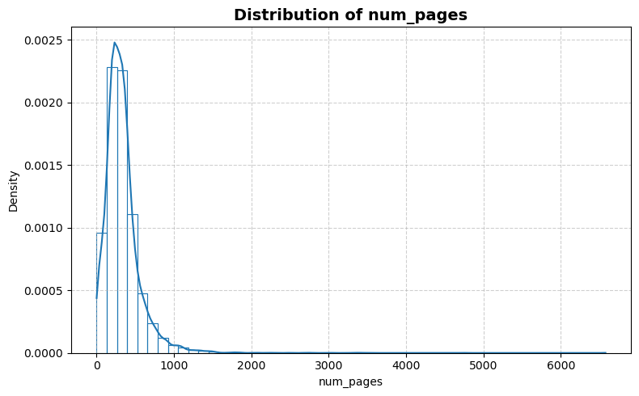
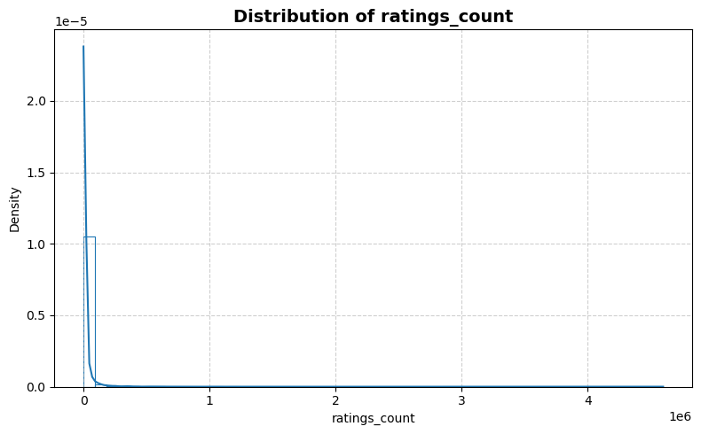
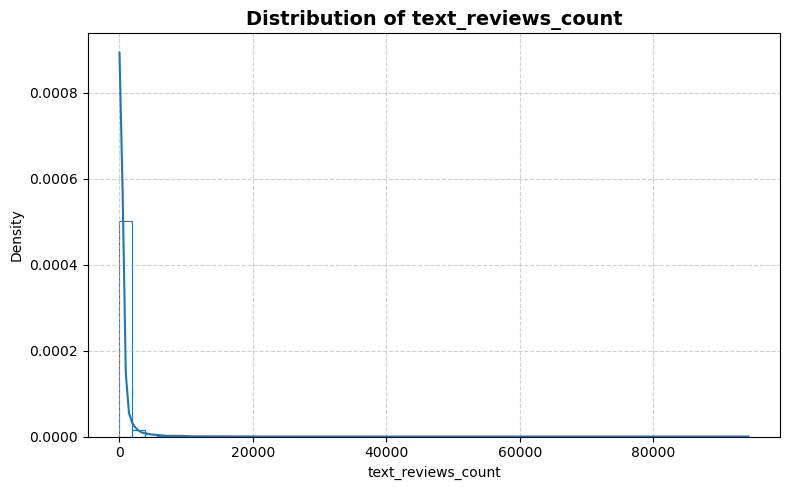
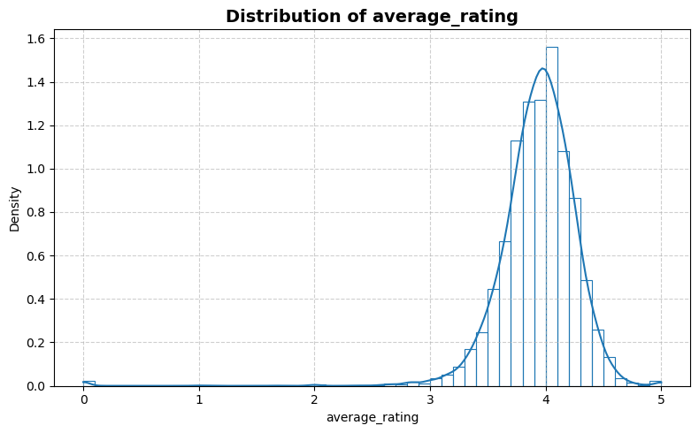
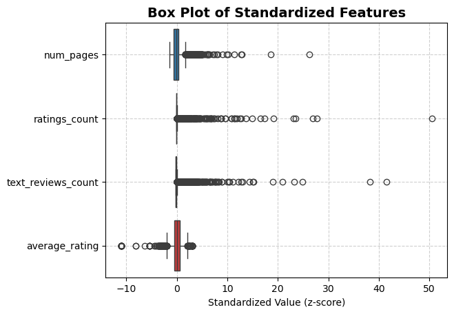
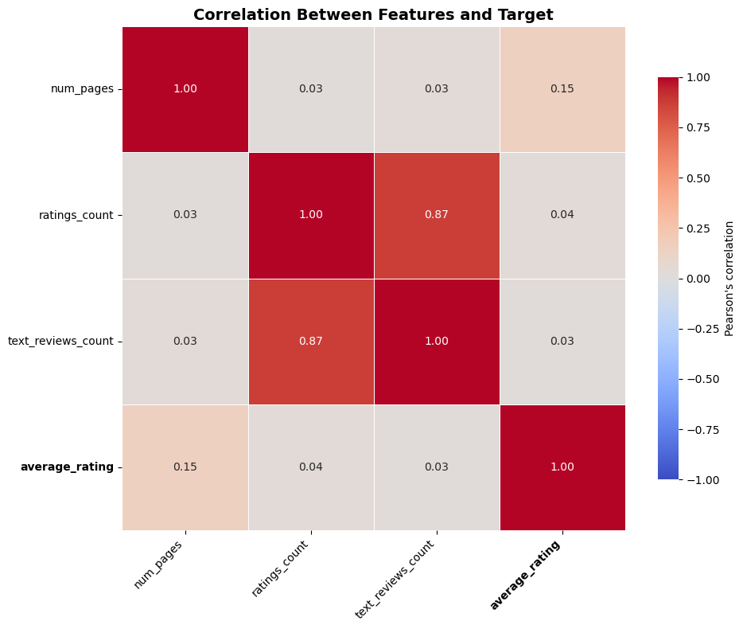

```python
from stat_sum_func import ToParquet, DatasetStatistics
```


```python
file = "books"
path = f"raw/{file}/{file}.parquet"
statistics_man = DatasetStatistics(path)
statistics_man.df
```


<div>
<table border="1" class="dataframe">
  <thead>
    <tr style="text-align: right;">
      <th></th>
      <th>num_pages</th>
      <th>ratings_count</th>
      <th>text_reviews_count</th>
      <th>average_rating</th>
    </tr>
  </thead>
  <tbody>
    <tr>
      <th>0</th>
      <td>192.000</td>
      <td>2762.0</td>
      <td>214.00</td>
      <td>4.22000</td>
    </tr>
    <tr>
      <th>1</th>
      <td>528.000</td>
      <td>30.0</td>
      <td>4.00</td>
      <td>3.49000</td>
    </tr>
    <tr>
      <th>2</th>
      <td>409.125</td>
      <td>10731.5</td>
      <td>103.25</td>
      <td>4.04875</td>
    </tr>
    <tr>
      <th>3</th>
      <td>992.000</td>
      <td>36303.0</td>
      <td>439.00</td>
      <td>3.85000</td>
    </tr>
    <tr>
      <th>4</th>
      <td>320.000</td>
      <td>3490.0</td>
      <td>177.00</td>
      <td>3.90000</td>
    </tr>
    <tr>
      <th>...</th>
      <td>...</td>
      <td>...</td>
      <td>...</td>
      <td>...</td>
    </tr>
    <tr>
      <th>10343</th>
      <td>191.000</td>
      <td>5.0</td>
      <td>0.00</td>
      <td>4.58000</td>
    </tr>
    <tr>
      <th>10344</th>
      <td>191.000</td>
      <td>5.0</td>
      <td>0.00</td>
      <td>4.57000</td>
    </tr>
    <tr>
      <th>10345</th>
      <td>184.000</td>
      <td>4.0</td>
      <td>0.00</td>
      <td>4.57000</td>
    </tr>
    <tr>
      <th>10346</th>
      <td>467.000</td>
      <td>24.0</td>
      <td>0.00</td>
      <td>4.44000</td>
    </tr>
    <tr>
      <th>10347</th>
      <td>608.000</td>
      <td>26.0</td>
      <td>0.00</td>
      <td>4.36000</td>
    </tr>
  </tbody>
</table>
<p>10348 rows × 4 columns</p>
</div>


```python
for feature in statistics_man.df.columns:
    statistics_man.plot_distribution(feature)
```


    

    


    

    


    

    


    

    


```python
statistics_man.plot_box()
```


    

    


```python
statistics_man.print_stat_sum()
```

    Number of samples : 10348
    Number of features: 3
    ==============================


<div>
<table border="1" class="dataframe">
  <thead>
    <tr style="text-align: right;">
      <th></th>
      <th>dtype</th>
      <th>missing</th>
      <th>count</th>
      <th>median</th>
      <th>mean</th>
      <th>std</th>
      <th>min</th>
      <th>25%</th>
      <th>50%</th>
      <th>75%</th>
      <th>max</th>
    </tr>
  </thead>
  <tbody>
    <tr>
      <th>num_pages</th>
      <td>float64</td>
      <td>0</td>
      <td>10348.0</td>
      <td>295.00</td>
      <td>333.279307</td>
      <td>237.458995</td>
      <td>0.0</td>
      <td>193.00</td>
      <td>295.00</td>
      <td>410.00</td>
      <td>6576.0</td>
    </tr>
    <tr>
      <th>ratings_count</th>
      <td>float64</td>
      <td>0</td>
      <td>10348.0</td>
      <td>843.00</td>
      <td>15160.938090</td>
      <td>90702.387372</td>
      <td>0.0</td>
      <td>110.00</td>
      <td>843.00</td>
      <td>5555.00</td>
      <td>4597666.0</td>
    </tr>
    <tr>
      <th>text_reviews_count</th>
      <td>float64</td>
      <td>0</td>
      <td>10348.0</td>
      <td>49.00</td>
      <td>486.883041</td>
      <td>2255.170277</td>
      <td>0.0</td>
      <td>9.00</td>
      <td>49.00</td>
      <td>252.00</td>
      <td>94265.0</td>
    </tr>
    <tr>
      <th>average_rating</th>
      <td>float64</td>
      <td>0</td>
      <td>10348.0</td>
      <td>3.96</td>
      <td>3.932918</td>
      <td>0.356969</td>
      <td>0.0</td>
      <td>3.77</td>
      <td>3.96</td>
      <td>4.14</td>
      <td>5.0</td>
    </tr>
  </tbody>
</table>
</div>


```python
statistics_man.plot_corr_heatmap()
```


    

    

