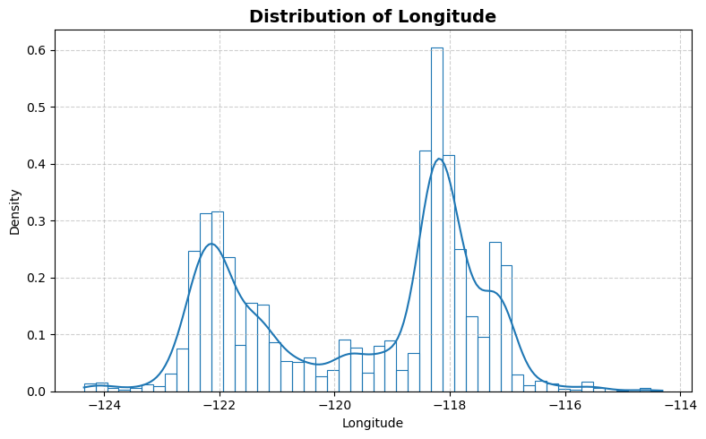
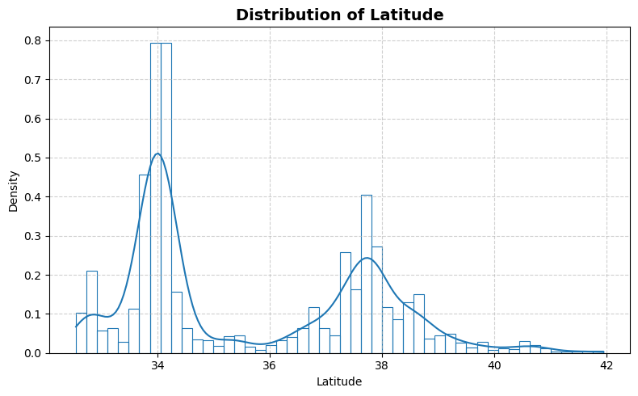
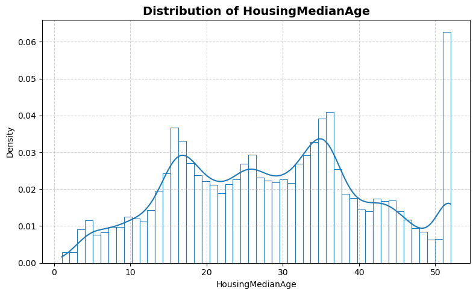
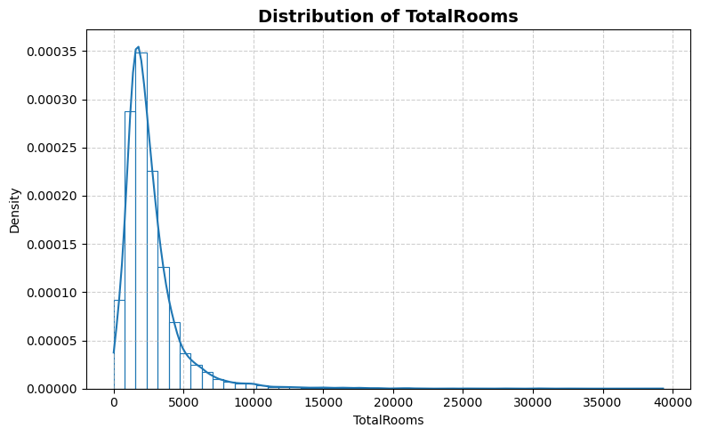
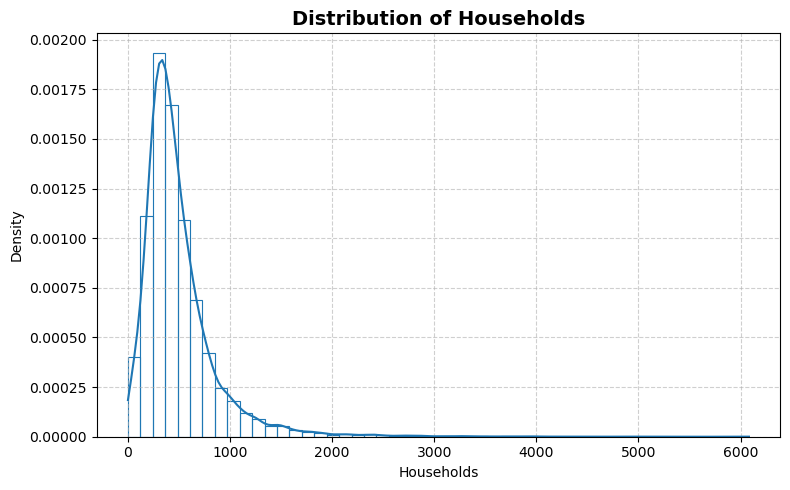
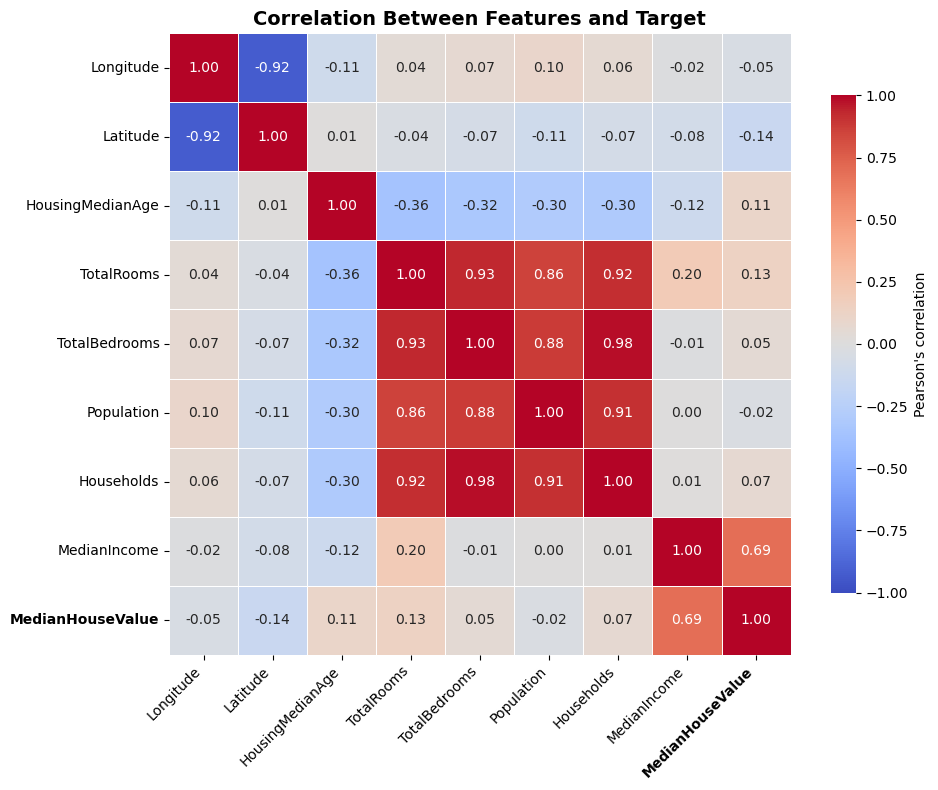

```python
from stat_sum_func import ToParquet, DatasetStatistics
```


```python
path = "raw/california/california.parquet"
statistics_man = DatasetStatistics(path)
statistics_man.df
```


<div>
<style scoped>
    .dataframe tbody tr th:only-of-type {
        vertical-align: middle;
    }

    .dataframe tbody tr th {
        vertical-align: top;
    }

    .dataframe thead th {
        text-align: right;
    }
</style>
<table border="1" class="dataframe">
  <thead>
    <tr style="text-align: right;">
      <th></th>
      <th>Longitude</th>
      <th>Latitude</th>
      <th>HousingMedianAge</th>
      <th>TotalRooms</th>
      <th>TotalBedrooms</th>
      <th>Population</th>
      <th>Households</th>
      <th>MedianIncome</th>
      <th>MedianHouseValue</th>
    </tr>
  </thead>
  <tbody>
    <tr>
      <th>0</th>
      <td>-117.03</td>
      <td>32.78</td>
      <td>17</td>
      <td>5481</td>
      <td>1618</td>
      <td>2957</td>
      <td>1537</td>
      <td>2.5707</td>
      <td>171300</td>
    </tr>
    <tr>
      <th>1</th>
      <td>-118.23</td>
      <td>33.80</td>
      <td>26</td>
      <td>239</td>
      <td>135</td>
      <td>165</td>
      <td>112</td>
      <td>1.3333</td>
      <td>187500</td>
    </tr>
    <tr>
      <th>2</th>
      <td>-122.46</td>
      <td>37.71</td>
      <td>39</td>
      <td>2076</td>
      <td>482</td>
      <td>1738</td>
      <td>445</td>
      <td>3.1958</td>
      <td>232100</td>
    </tr>
    <tr>
      <th>3</th>
      <td>-122.06</td>
      <td>37.94</td>
      <td>19</td>
      <td>4005</td>
      <td>972</td>
      <td>1896</td>
      <td>893</td>
      <td>2.5268</td>
      <td>235700</td>
    </tr>
    <tr>
      <th>4</th>
      <td>-122.87</td>
      <td>38.68</td>
      <td>32</td>
      <td>4073</td>
      <td>718</td>
      <td>2053</td>
      <td>629</td>
      <td>3.7352</td>
      <td>228000</td>
    </tr>
    <tr>
      <th>...</th>
      <td>...</td>
      <td>...</td>
      <td>...</td>
      <td>...</td>
      <td>...</td>
      <td>...</td>
      <td>...</td>
      <td>...</td>
      <td>...</td>
    </tr>
    <tr>
      <th>20635</th>
      <td>-118.99</td>
      <td>35.33</td>
      <td>36</td>
      <td>1590</td>
      <td>367</td>
      <td>1311</td>
      <td>390</td>
      <td>1.6786</td>
      <td>52900</td>
    </tr>
    <tr>
      <th>20636</th>
      <td>-118.32</td>
      <td>34.09</td>
      <td>27</td>
      <td>210</td>
      <td>98</td>
      <td>332</td>
      <td>112</td>
      <td>2.5556</td>
      <td>175000</td>
    </tr>
    <tr>
      <th>20637</th>
      <td>-117.08</td>
      <td>32.58</td>
      <td>15</td>
      <td>1462</td>
      <td>274</td>
      <td>1002</td>
      <td>271</td>
      <td>3.9698</td>
      <td>142700</td>
    </tr>
    <tr>
      <th>20638</th>
      <td>-117.63</td>
      <td>33.46</td>
      <td>7</td>
      <td>7684</td>
      <td>1088</td>
      <td>2812</td>
      <td>1057</td>
      <td>6.3401</td>
      <td>387300</td>
    </tr>
    <tr>
      <th>20639</th>
      <td>-118.09</td>
      <td>34.09</td>
      <td>36</td>
      <td>1068</td>
      <td>246</td>
      <td>949</td>
      <td>250</td>
      <td>2.3462</td>
      <td>188500</td>
    </tr>
  </tbody>
</table>
<p>20640 rows × 9 columns</p>
</div>


```python
statistics_man.print_samples()
```

    THE FIRST 5 SAMPLES


<div>
<style scoped>
    .dataframe tbody tr th:only-of-type {
        vertical-align: middle;
    }

    .dataframe tbody tr th {
        vertical-align: top;
    }

    .dataframe thead th {
        text-align: right;
    }
</style>
<table border="1" class="dataframe">
  <thead>
    <tr style="text-align: right;">
      <th></th>
      <th>Longitude</th>
      <th>Latitude</th>
      <th>HousingMedianAge</th>
      <th>TotalRooms</th>
      <th>TotalBedrooms</th>
      <th>Population</th>
      <th>Households</th>
      <th>MedianIncome</th>
      <th>MedianHouseValue</th>
    </tr>
  </thead>
  <tbody>
    <tr>
      <th>0</th>
      <td>-117.03</td>
      <td>32.78</td>
      <td>17</td>
      <td>5481</td>
      <td>1618</td>
      <td>2957</td>
      <td>1537</td>
      <td>2.5707</td>
      <td>171300</td>
    </tr>
    <tr>
      <th>1</th>
      <td>-118.23</td>
      <td>33.80</td>
      <td>26</td>
      <td>239</td>
      <td>135</td>
      <td>165</td>
      <td>112</td>
      <td>1.3333</td>
      <td>187500</td>
    </tr>
    <tr>
      <th>2</th>
      <td>-122.46</td>
      <td>37.71</td>
      <td>39</td>
      <td>2076</td>
      <td>482</td>
      <td>1738</td>
      <td>445</td>
      <td>3.1958</td>
      <td>232100</td>
    </tr>
    <tr>
      <th>3</th>
      <td>-122.06</td>
      <td>37.94</td>
      <td>19</td>
      <td>4005</td>
      <td>972</td>
      <td>1896</td>
      <td>893</td>
      <td>2.5268</td>
      <td>235700</td>
    </tr>
    <tr>
      <th>4</th>
      <td>-122.87</td>
      <td>38.68</td>
      <td>32</td>
      <td>4073</td>
      <td>718</td>
      <td>2053</td>
      <td>629</td>
      <td>3.7352</td>
      <td>228000</td>
    </tr>
  </tbody>
</table>
</div>


    THE LAST 5 SAMPLES


<div>
<style scoped>
    .dataframe tbody tr th:only-of-type {
        vertical-align: middle;
    }

    .dataframe tbody tr th {
        vertical-align: top;
    }

    .dataframe thead th {
        text-align: right;
    }
</style>
<table border="1" class="dataframe">
  <thead>
    <tr style="text-align: right;">
      <th></th>
      <th>Longitude</th>
      <th>Latitude</th>
      <th>HousingMedianAge</th>
      <th>TotalRooms</th>
      <th>TotalBedrooms</th>
      <th>Population</th>
      <th>Households</th>
      <th>MedianIncome</th>
      <th>MedianHouseValue</th>
    </tr>
  </thead>
  <tbody>
    <tr>
      <th>20635</th>
      <td>-118.99</td>
      <td>35.33</td>
      <td>36</td>
      <td>1590</td>
      <td>367</td>
      <td>1311</td>
      <td>390</td>
      <td>1.6786</td>
      <td>52900</td>
    </tr>
    <tr>
      <th>20636</th>
      <td>-118.32</td>
      <td>34.09</td>
      <td>27</td>
      <td>210</td>
      <td>98</td>
      <td>332</td>
      <td>112</td>
      <td>2.5556</td>
      <td>175000</td>
    </tr>
    <tr>
      <th>20637</th>
      <td>-117.08</td>
      <td>32.58</td>
      <td>15</td>
      <td>1462</td>
      <td>274</td>
      <td>1002</td>
      <td>271</td>
      <td>3.9698</td>
      <td>142700</td>
    </tr>
    <tr>
      <th>20638</th>
      <td>-117.63</td>
      <td>33.46</td>
      <td>7</td>
      <td>7684</td>
      <td>1088</td>
      <td>2812</td>
      <td>1057</td>
      <td>6.3401</td>
      <td>387300</td>
    </tr>
    <tr>
      <th>20639</th>
      <td>-118.09</td>
      <td>34.09</td>
      <td>36</td>
      <td>1068</td>
      <td>246</td>
      <td>949</td>
      <td>250</td>
      <td>2.3462</td>
      <td>188500</td>
    </tr>
  </tbody>
</table>
</div>


```python
for feature in statistics_man.df.columns:
    statistics_man.plot_distribution(feature)
```


    

    


    

    


    

    


    

    


    

    


    

    


    

    


    

    


    

    


```python
statistics_man.plot_box()
```


    

    


```python
statistics_man.print_stat_sum()
```

    Number of samples : 20640
    Number of features: 8
    ==============================


<div>
<style scoped>
    .dataframe tbody tr th:only-of-type {
        vertical-align: middle;
    }

    .dataframe tbody tr th {
        vertical-align: top;
    }

    .dataframe thead th {
        text-align: right;
    }
</style>
<table border="1" class="dataframe">
  <thead>
    <tr style="text-align: right;">
      <th></th>
      <th>dtype</th>
      <th>missing</th>
      <th>count</th>
      <th>median</th>
      <th>mean</th>
      <th>std</th>
      <th>min</th>
      <th>25%</th>
      <th>50%</th>
      <th>75%</th>
      <th>max</th>
    </tr>
  </thead>
  <tbody>
    <tr>
      <th>Longitude</th>
      <td>float64</td>
      <td>0</td>
      <td>20640.0</td>
      <td>-118.4900</td>
      <td>-119.569704</td>
      <td>2.003532</td>
      <td>-124.3500</td>
      <td>-121.8000</td>
      <td>-118.4900</td>
      <td>-118.01000</td>
      <td>-114.3100</td>
    </tr>
    <tr>
      <th>Latitude</th>
      <td>float64</td>
      <td>0</td>
      <td>20640.0</td>
      <td>34.2600</td>
      <td>35.631861</td>
      <td>2.135952</td>
      <td>32.5400</td>
      <td>33.9300</td>
      <td>34.2600</td>
      <td>37.71000</td>
      <td>41.9500</td>
    </tr>
    <tr>
      <th>HousingMedianAge</th>
      <td>int64</td>
      <td>0</td>
      <td>20640.0</td>
      <td>29.0000</td>
      <td>28.639486</td>
      <td>12.585558</td>
      <td>1.0000</td>
      <td>18.0000</td>
      <td>29.0000</td>
      <td>37.00000</td>
      <td>52.0000</td>
    </tr>
    <tr>
      <th>TotalRooms</th>
      <td>int64</td>
      <td>0</td>
      <td>20640.0</td>
      <td>2127.0000</td>
      <td>2635.763081</td>
      <td>2181.615252</td>
      <td>2.0000</td>
      <td>1447.7500</td>
      <td>2127.0000</td>
      <td>3148.00000</td>
      <td>39320.0000</td>
    </tr>
    <tr>
      <th>TotalBedrooms</th>
      <td>int64</td>
      <td>0</td>
      <td>20640.0</td>
      <td>435.0000</td>
      <td>537.898014</td>
      <td>421.247906</td>
      <td>1.0000</td>
      <td>295.0000</td>
      <td>435.0000</td>
      <td>647.00000</td>
      <td>6445.0000</td>
    </tr>
    <tr>
      <th>Population</th>
      <td>int64</td>
      <td>0</td>
      <td>20640.0</td>
      <td>1166.0000</td>
      <td>1425.476744</td>
      <td>1132.462122</td>
      <td>3.0000</td>
      <td>787.0000</td>
      <td>1166.0000</td>
      <td>1725.00000</td>
      <td>35682.0000</td>
    </tr>
    <tr>
      <th>Households</th>
      <td>int64</td>
      <td>0</td>
      <td>20640.0</td>
      <td>409.0000</td>
      <td>499.539680</td>
      <td>382.329753</td>
      <td>1.0000</td>
      <td>280.0000</td>
      <td>409.0000</td>
      <td>605.00000</td>
      <td>6082.0000</td>
    </tr>
    <tr>
      <th>MedianIncome</th>
      <td>float64</td>
      <td>0</td>
      <td>20640.0</td>
      <td>3.5348</td>
      <td>3.870671</td>
      <td>1.899822</td>
      <td>0.4999</td>
      <td>2.5634</td>
      <td>3.5348</td>
      <td>4.74325</td>
      <td>15.0001</td>
    </tr>
    <tr>
      <th>MedianHouseValue</th>
      <td>int64</td>
      <td>0</td>
      <td>20640.0</td>
      <td>179700.0000</td>
      <td>206855.816909</td>
      <td>115395.615874</td>
      <td>14999.0000</td>
      <td>119600.0000</td>
      <td>179700.0000</td>
      <td>264725.00000</td>
      <td>500001.0000</td>
    </tr>
  </tbody>
</table>
</div>


```python
statistics_man.plot_corr_heatmap()
```


    

    

