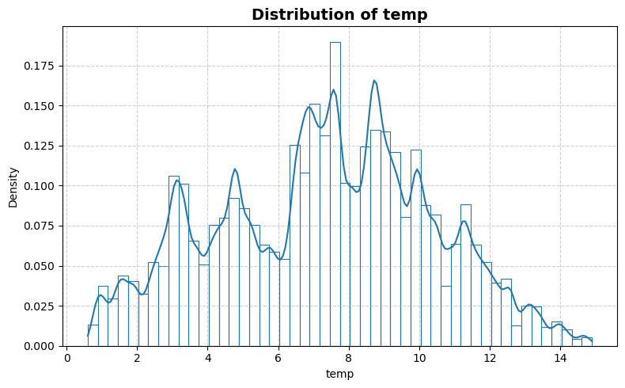
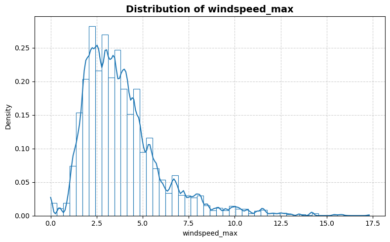
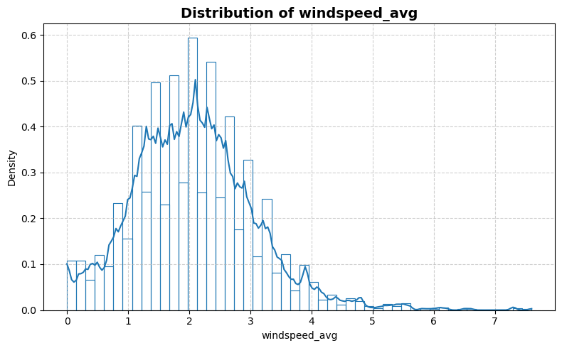
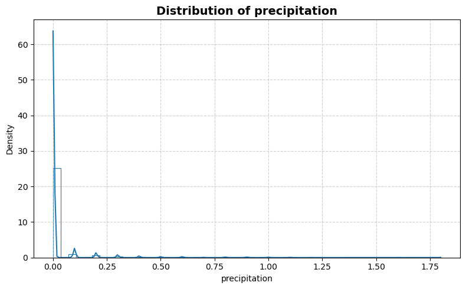
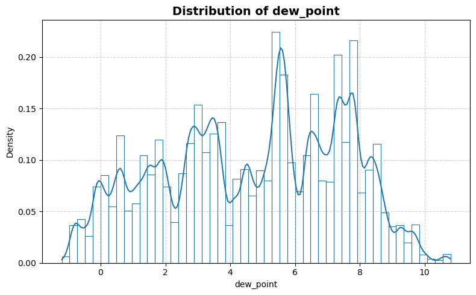
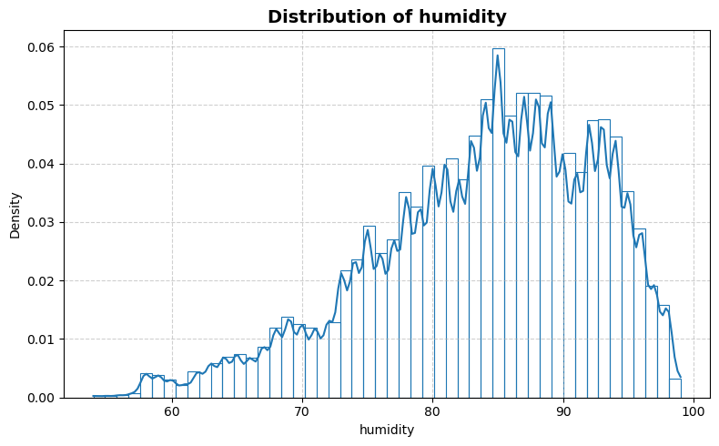
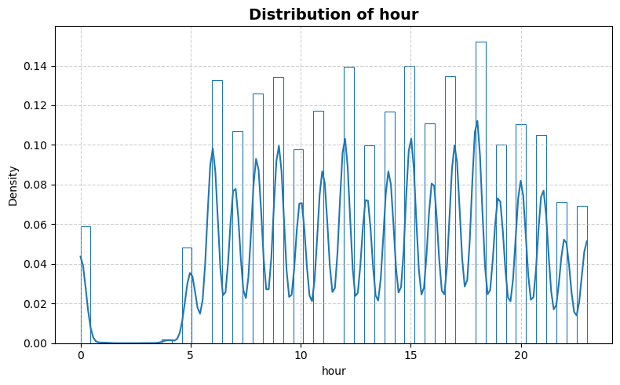
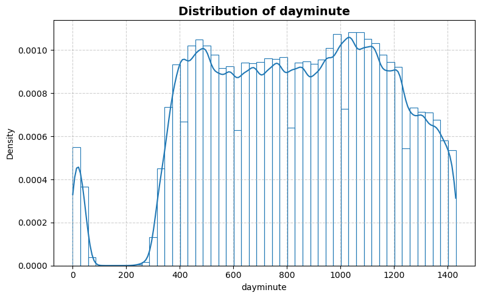
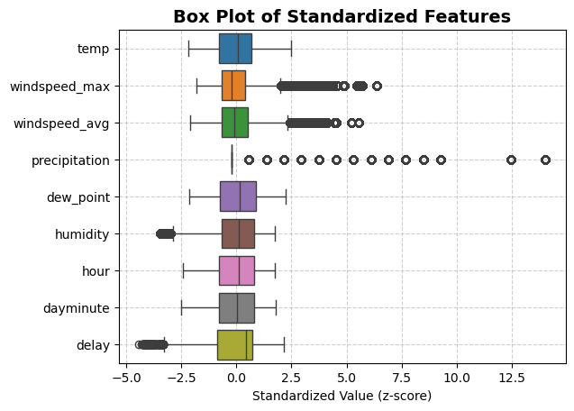
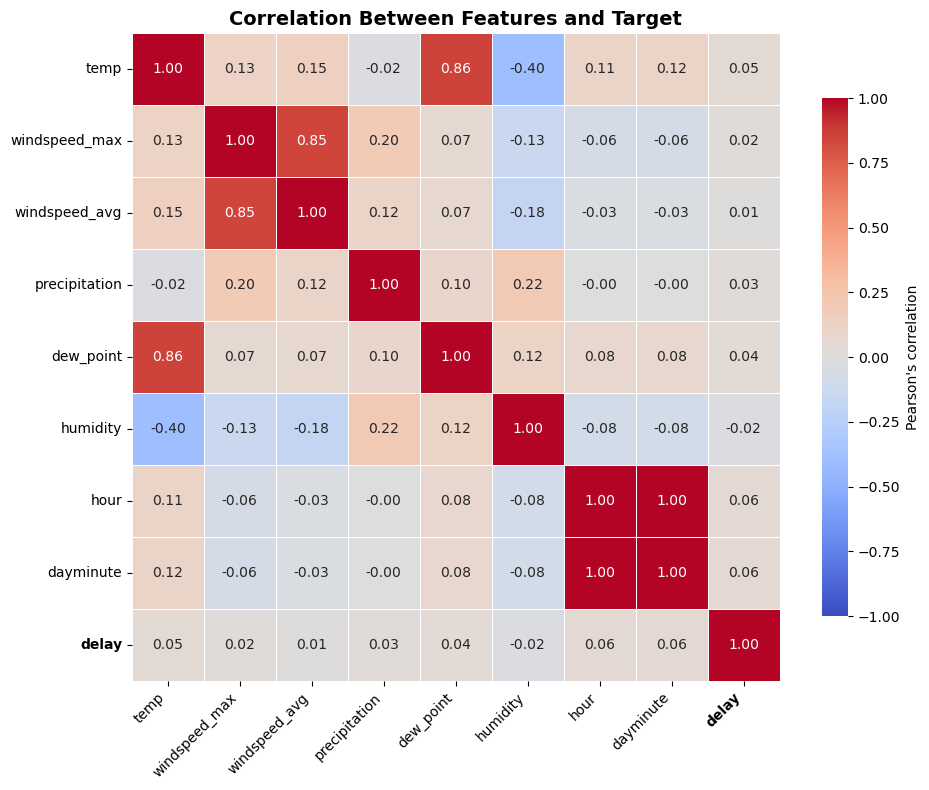

```python
from stat_sum_func import ToParquet, DatasetStatistics
```


```python
file = "diamonds"
path = f"raw/{file}/{file}.parquet"
statistics_man = DatasetStatistics(path)
statistics_man.df
```


<div>
<table border="1" class="dataframe">
  <thead>
    <tr style="text-align: right;">
      <th></th>
      <th>temp</th>
      <th>windspeed_max</th>
      <th>windspeed_avg</th>
      <th>precipitation</th>
      <th>dew_point</th>
      <th>humidity</th>
      <th>hour</th>
      <th>dayminute</th>
      <th>delay</th>
    </tr>
  </thead>
  <tbody>
    <tr>
      <th>0</th>
      <td>0.9</td>
      <td>1.9</td>
      <td>1.4</td>
      <td>0.0</td>
      <td>0.6</td>
      <td>98.0</td>
      <td>5.0</td>
      <td>300.0</td>
      <td>4.510860</td>
    </tr>
    <tr>
      <th>1</th>
      <td>0.9</td>
      <td>1.9</td>
      <td>1.4</td>
      <td>0.0</td>
      <td>0.6</td>
      <td>98.0</td>
      <td>5.0</td>
      <td>300.0</td>
      <td>4.465908</td>
    </tr>
    <tr>
      <th>2</th>
      <td>0.9</td>
      <td>1.9</td>
      <td>1.4</td>
      <td>0.0</td>
      <td>0.6</td>
      <td>98.0</td>
      <td>5.0</td>
      <td>300.0</td>
      <td>3.637586</td>
    </tr>
    <tr>
      <th>3</th>
      <td>0.9</td>
      <td>1.9</td>
      <td>1.4</td>
      <td>0.0</td>
      <td>0.6</td>
      <td>98.0</td>
      <td>5.0</td>
      <td>300.0</td>
      <td>3.951244</td>
    </tr>
    <tr>
      <th>4</th>
      <td>0.9</td>
      <td>1.9</td>
      <td>1.4</td>
      <td>0.0</td>
      <td>0.6</td>
      <td>98.0</td>
      <td>5.0</td>
      <td>300.0</td>
      <td>3.912023</td>
    </tr>
    <tr>
      <th>...</th>
      <td>...</td>
      <td>...</td>
      <td>...</td>
      <td>...</td>
      <td>...</td>
      <td>...</td>
      <td>...</td>
      <td>...</td>
      <td>...</td>
    </tr>
    <tr>
      <th>5465570</th>
      <td>9.8</td>
      <td>1.9</td>
      <td>1.3</td>
      <td>1.1</td>
      <td>9.2</td>
      <td>96.0</td>
      <td>20.0</td>
      <td>1200.0</td>
      <td>4.779123</td>
    </tr>
    <tr>
      <th>5465571</th>
      <td>9.8</td>
      <td>1.9</td>
      <td>1.3</td>
      <td>1.1</td>
      <td>9.2</td>
      <td>96.0</td>
      <td>20.0</td>
      <td>1200.0</td>
      <td>4.753590</td>
    </tr>
    <tr>
      <th>5465572</th>
      <td>9.8</td>
      <td>1.9</td>
      <td>1.3</td>
      <td>1.1</td>
      <td>9.2</td>
      <td>96.0</td>
      <td>20.0</td>
      <td>1200.0</td>
      <td>4.543295</td>
    </tr>
    <tr>
      <th>5465573</th>
      <td>9.8</td>
      <td>2.1</td>
      <td>1.3</td>
      <td>0.9</td>
      <td>9.3</td>
      <td>96.0</td>
      <td>19.0</td>
      <td>1190.0</td>
      <td>4.060443</td>
    </tr>
    <tr>
      <th>5465574</th>
      <td>9.8</td>
      <td>2.1</td>
      <td>1.3</td>
      <td>0.9</td>
      <td>9.3</td>
      <td>96.0</td>
      <td>19.0</td>
      <td>1190.0</td>
      <td>3.135494</td>
    </tr>
  </tbody>
</table>
<p>5465575 rows × 9 columns</p>
</div>


```python
for feature in statistics_man.df.columns:
    statistics_man.plot_distribution(feature)
```


    

    


    

    


    

    


    

    


    

    


    

    


    

    


    

    


    

    


```python
statistics_man.plot_box()
```


    

    


```python
statistics_man.print_stat_sum()
```

    Number of samples : 5465575
    Number of features: 8
    ==============================


<div>
<table border="1" class="dataframe">
  <thead>
    <tr style="text-align: right;">
      <th></th>
      <th>dtype</th>
      <th>missing</th>
      <th>count</th>
      <th>median</th>
      <th>mean</th>
      <th>std</th>
      <th>min</th>
      <th>25%</th>
      <th>50%</th>
      <th>75%</th>
      <th>max</th>
    </tr>
  </thead>
  <tbody>
    <tr>
      <th>temp</th>
      <td>float64</td>
      <td>0</td>
      <td>5465575.0</td>
      <td>7.500000</td>
      <td>7.294720</td>
      <td>3.054393</td>
      <td>0.60000</td>
      <td>4.900000</td>
      <td>7.500000</td>
      <td>9.400000</td>
      <td>14.900000</td>
    </tr>
    <tr>
      <th>windspeed_max</th>
      <td>float64</td>
      <td>0</td>
      <td>5465575.0</td>
      <td>3.400000</td>
      <td>3.857754</td>
      <td>2.118816</td>
      <td>0.00000</td>
      <td>2.400000</td>
      <td>3.400000</td>
      <td>4.700000</td>
      <td>17.300000</td>
    </tr>
    <tr>
      <th>windspeed_avg</th>
      <td>float64</td>
      <td>0</td>
      <td>5465575.0</td>
      <td>2.000000</td>
      <td>2.078061</td>
      <td>0.997901</td>
      <td>0.00000</td>
      <td>1.400000</td>
      <td>2.000000</td>
      <td>2.600000</td>
      <td>7.600000</td>
    </tr>
    <tr>
      <th>precipitation</th>
      <td>float64</td>
      <td>0</td>
      <td>5465575.0</td>
      <td>0.000000</td>
      <td>0.028233</td>
      <td>0.126350</td>
      <td>0.00000</td>
      <td>0.000000</td>
      <td>0.000000</td>
      <td>0.000000</td>
      <td>1.800000</td>
    </tr>
    <tr>
      <th>dew_point</th>
      <td>float64</td>
      <td>0</td>
      <td>5465575.0</td>
      <td>5.100000</td>
      <td>4.675570</td>
      <td>2.755557</td>
      <td>-1.20000</td>
      <td>2.600000</td>
      <td>5.100000</td>
      <td>7.100000</td>
      <td>10.800000</td>
    </tr>
    <tr>
      <th>humidity</th>
      <td>float64</td>
      <td>0</td>
      <td>5465575.0</td>
      <td>85.000000</td>
      <td>83.891820</td>
      <td>8.660689</td>
      <td>54.00000</td>
      <td>78.000000</td>
      <td>85.000000</td>
      <td>91.000000</td>
      <td>99.000000</td>
    </tr>
    <tr>
      <th>hour</th>
      <td>float64</td>
      <td>0</td>
      <td>5465575.0</td>
      <td>14.000000</td>
      <td>13.458387</td>
      <td>5.510484</td>
      <td>0.00000</td>
      <td>9.000000</td>
      <td>14.000000</td>
      <td>18.000000</td>
      <td>23.000000</td>
    </tr>
    <tr>
      <th>dayminute</th>
      <td>float64</td>
      <td>0</td>
      <td>5465575.0</td>
      <td>850.000000</td>
      <td>835.436066</td>
      <td>330.814336</td>
      <td>0.00000</td>
      <td>570.000000</td>
      <td>850.000000</td>
      <td>1100.000000</td>
      <td>1430.000000</td>
    </tr>
    <tr>
      <th>delay</th>
      <td>float64</td>
      <td>0</td>
      <td>5465575.0</td>
      <td>3.401197</td>
      <td>2.094174</td>
      <td>3.127952</td>
      <td>-11.71039</td>
      <td>-0.693147</td>
      <td>3.401197</td>
      <td>4.343805</td>
      <td>8.880586</td>
    </tr>
  </tbody>
</table>
</div>


```python
statistics_man.plot_corr_heatmap()
```


    

    

