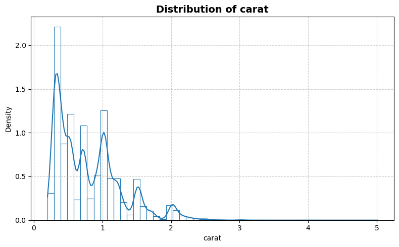
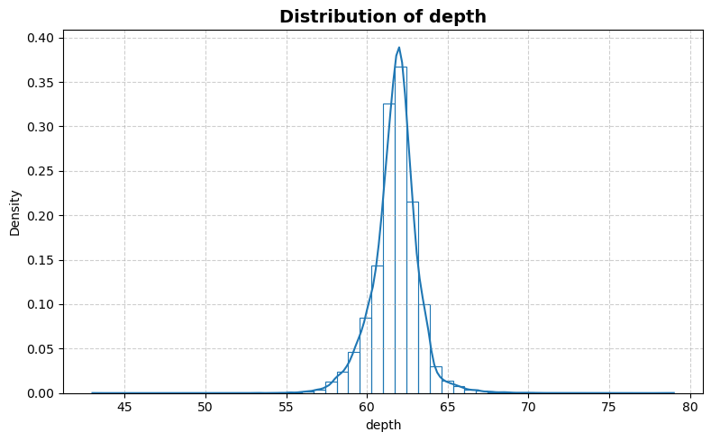
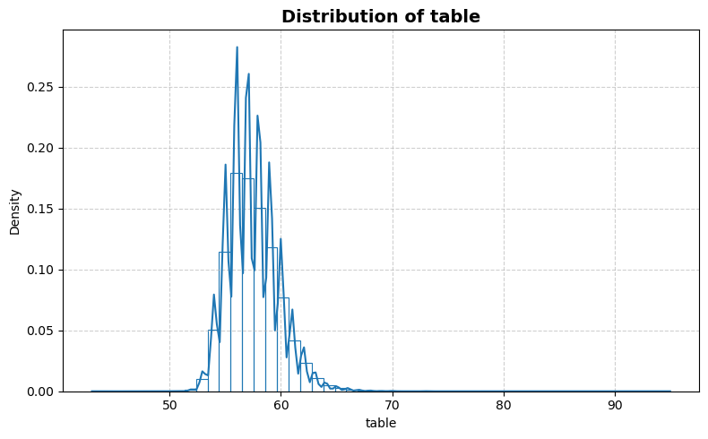
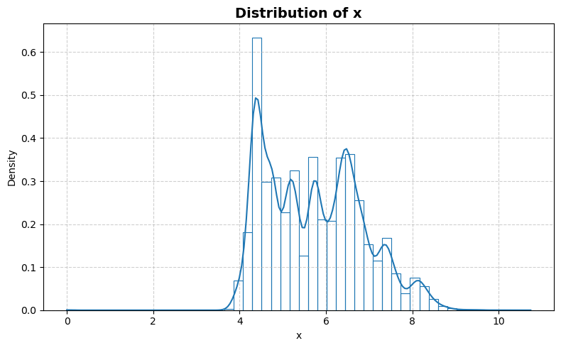
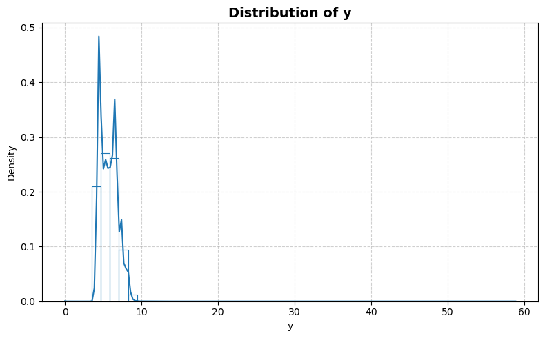
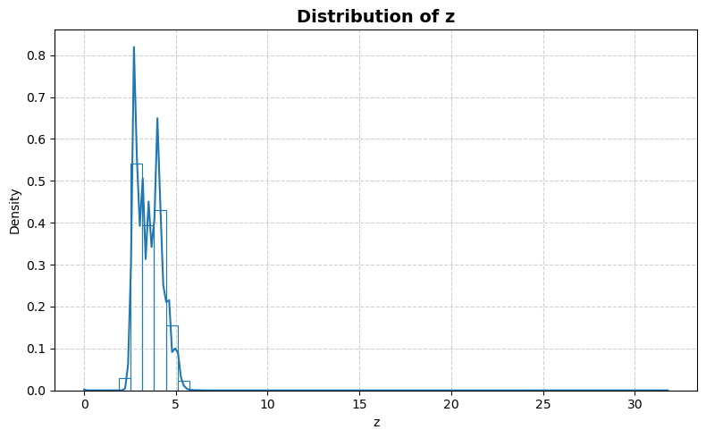
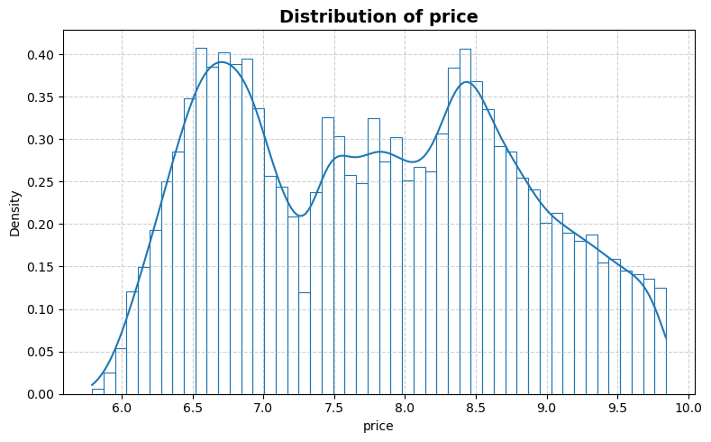
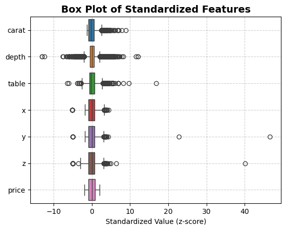
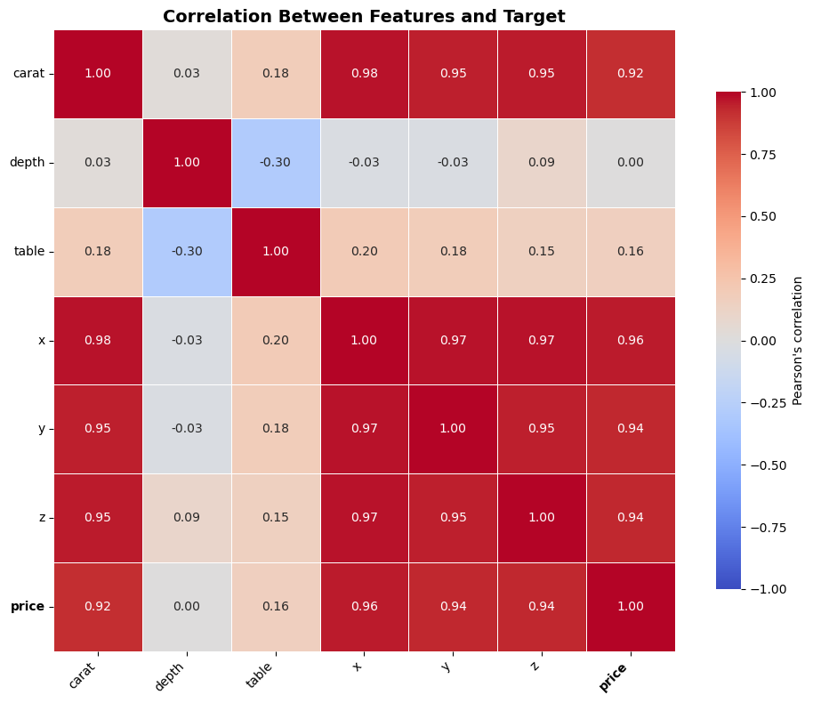

```python
from stat_sum_func import ToParquet, DatasetStatistics
```


```python
file = "diamonds"
path = f"raw/{file}/{file}.parquet"
statistics_man = DatasetStatistics(path)
statistics_man.df
```


<div>
<table border="1" class="dataframe">
  <thead>
    <tr style="text-align: right;">
      <th></th>
      <th>carat</th>
      <th>depth</th>
      <th>table</th>
      <th>x</th>
      <th>y</th>
      <th>z</th>
      <th>price</th>
    </tr>
  </thead>
  <tbody>
    <tr>
      <th>0</th>
      <td>0.23</td>
      <td>61.5</td>
      <td>55.0</td>
      <td>3.95</td>
      <td>3.98</td>
      <td>2.43</td>
      <td>5.789960</td>
    </tr>
    <tr>
      <th>1</th>
      <td>0.21</td>
      <td>59.8</td>
      <td>61.0</td>
      <td>3.89</td>
      <td>3.84</td>
      <td>2.31</td>
      <td>5.789960</td>
    </tr>
    <tr>
      <th>2</th>
      <td>0.23</td>
      <td>56.9</td>
      <td>65.0</td>
      <td>4.05</td>
      <td>4.07</td>
      <td>2.31</td>
      <td>5.793014</td>
    </tr>
    <tr>
      <th>3</th>
      <td>0.29</td>
      <td>62.4</td>
      <td>58.0</td>
      <td>4.20</td>
      <td>4.23</td>
      <td>2.63</td>
      <td>5.814131</td>
    </tr>
    <tr>
      <th>4</th>
      <td>0.31</td>
      <td>63.3</td>
      <td>58.0</td>
      <td>4.34</td>
      <td>4.35</td>
      <td>2.75</td>
      <td>5.817111</td>
    </tr>
    <tr>
      <th>...</th>
      <td>...</td>
      <td>...</td>
      <td>...</td>
      <td>...</td>
      <td>...</td>
      <td>...</td>
      <td>...</td>
    </tr>
    <tr>
      <th>53935</th>
      <td>0.72</td>
      <td>60.8</td>
      <td>57.0</td>
      <td>5.75</td>
      <td>5.76</td>
      <td>3.50</td>
      <td>7.922261</td>
    </tr>
    <tr>
      <th>53936</th>
      <td>0.72</td>
      <td>63.1</td>
      <td>55.0</td>
      <td>5.69</td>
      <td>5.75</td>
      <td>3.61</td>
      <td>7.922261</td>
    </tr>
    <tr>
      <th>53937</th>
      <td>0.70</td>
      <td>62.8</td>
      <td>60.0</td>
      <td>5.66</td>
      <td>5.68</td>
      <td>3.56</td>
      <td>7.922261</td>
    </tr>
    <tr>
      <th>53938</th>
      <td>0.86</td>
      <td>61.0</td>
      <td>58.0</td>
      <td>6.15</td>
      <td>6.12</td>
      <td>3.74</td>
      <td>7.922261</td>
    </tr>
    <tr>
      <th>53939</th>
      <td>0.75</td>
      <td>62.2</td>
      <td>55.0</td>
      <td>5.83</td>
      <td>5.87</td>
      <td>3.64</td>
      <td>7.922261</td>
    </tr>
  </tbody>
</table>
<p>53940 rows × 7 columns</p>
</div>


```python
for feature in statistics_man.df.columns:
    statistics_man.plot_distribution(feature)
```


    

    


    

    


    

    


    

    


    

    


    

    


    

    


```python
statistics_man.plot_box()
```


    

    


```python
statistics_man.print_stat_sum()
```

    Number of samples : 53940
    Number of features: 6
    ==============================


<div>
<table border="1" class="dataframe">
  <thead>
    <tr style="text-align: right;">
      <th></th>
      <th>dtype</th>
      <th>missing</th>
      <th>count</th>
      <th>median</th>
      <th>mean</th>
      <th>std</th>
      <th>min</th>
      <th>25%</th>
      <th>50%</th>
      <th>75%</th>
      <th>max</th>
    </tr>
  </thead>
  <tbody>
    <tr>
      <th>carat</th>
      <td>float64</td>
      <td>0</td>
      <td>53940.0</td>
      <td>0.700000</td>
      <td>0.797940</td>
      <td>0.474011</td>
      <td>0.20000</td>
      <td>0.400000</td>
      <td>0.700000</td>
      <td>1.040000</td>
      <td>5.010000</td>
    </tr>
    <tr>
      <th>depth</th>
      <td>float64</td>
      <td>0</td>
      <td>53940.0</td>
      <td>61.800000</td>
      <td>61.749405</td>
      <td>1.432621</td>
      <td>43.00000</td>
      <td>61.000000</td>
      <td>61.800000</td>
      <td>62.500000</td>
      <td>79.000000</td>
    </tr>
    <tr>
      <th>table</th>
      <td>float64</td>
      <td>0</td>
      <td>53940.0</td>
      <td>57.000000</td>
      <td>57.457184</td>
      <td>2.234491</td>
      <td>43.00000</td>
      <td>56.000000</td>
      <td>57.000000</td>
      <td>59.000000</td>
      <td>95.000000</td>
    </tr>
    <tr>
      <th>x</th>
      <td>float64</td>
      <td>0</td>
      <td>53940.0</td>
      <td>5.700000</td>
      <td>5.731157</td>
      <td>1.121761</td>
      <td>0.00000</td>
      <td>4.710000</td>
      <td>5.700000</td>
      <td>6.540000</td>
      <td>10.740000</td>
    </tr>
    <tr>
      <th>y</th>
      <td>float64</td>
      <td>0</td>
      <td>53940.0</td>
      <td>5.710000</td>
      <td>5.734526</td>
      <td>1.142135</td>
      <td>0.00000</td>
      <td>4.720000</td>
      <td>5.710000</td>
      <td>6.540000</td>
      <td>58.900000</td>
    </tr>
    <tr>
      <th>z</th>
      <td>float64</td>
      <td>0</td>
      <td>53940.0</td>
      <td>3.530000</td>
      <td>3.538734</td>
      <td>0.705699</td>
      <td>0.00000</td>
      <td>2.910000</td>
      <td>3.530000</td>
      <td>4.040000</td>
      <td>31.800000</td>
    </tr>
    <tr>
      <th>price</th>
      <td>float64</td>
      <td>0</td>
      <td>53940.0</td>
      <td>7.784057</td>
      <td>7.787424</td>
      <td>1.014111</td>
      <td>5.78996</td>
      <td>6.857514</td>
      <td>7.784057</td>
      <td>8.580215</td>
      <td>9.842888</td>
    </tr>
  </tbody>
</table>
</div>


```python
statistics_man.plot_corr_heatmap()
```


    

    

