```python
from stat_sum_func import ToParquet, DatasetStatistics
```


```python
file = "elevators"
path = f"raw/{file}/{file}.parquet"
statistics_man = DatasetStatistics(path)
statistics_man.df
```


<div>
<table border="1" class="dataframe">
  <thead>
    <tr style="text-align: right;">
      <th></th>
      <th>ClimbRate</th>
      <th>Sgz</th>
      <th>P</th>
      <th>Q</th>
      <th>CurRoll</th>
      <th>AbsRoll</th>
      <th>DiffClb</th>
      <th>DiffRollRate</th>
      <th>DiffDiffClb</th>
      <th>SaTime1</th>
      <th>SaTime2</th>
      <th>SaTime3</th>
      <th>SaTime4</th>
      <th>DiffSaTime1</th>
      <th>DiffSaTime2</th>
      <th>DiffSaTime3</th>
      <th>DiffSaTime4</th>
      <th>Sa</th>
      <th>Goal</th>
    </tr>
  </thead>
  <tbody>
    <tr>
      <th>0</th>
      <td>-178</td>
      <td>40</td>
      <td>-0.11</td>
      <td>0.13</td>
      <td>1.1</td>
      <td>-9</td>
      <td>-12</td>
      <td>-0.011</td>
      <td>0.0</td>
      <td>-0.0007</td>
      <td>-0.0007</td>
      <td>-0.0007</td>
      <td>-0.0007</td>
      <td>0.0000</td>
      <td>0.0</td>
      <td>0.0000</td>
      <td>0.0</td>
      <td>-0.0007</td>
      <td>0.018</td>
    </tr>
    <tr>
      <th>1</th>
      <td>-122</td>
      <td>9</td>
      <td>0.27</td>
      <td>0.05</td>
      <td>0.0</td>
      <td>-10</td>
      <td>-2</td>
      <td>-0.005</td>
      <td>0.4</td>
      <td>-0.0007</td>
      <td>-0.0007</td>
      <td>-0.0007</td>
      <td>-0.0007</td>
      <td>0.0000</td>
      <td>0.0</td>
      <td>0.0000</td>
      <td>0.0</td>
      <td>-0.0007</td>
      <td>0.017</td>
    </tr>
    <tr>
      <th>2</th>
      <td>196</td>
      <td>-10</td>
      <td>-0.44</td>
      <td>0.10</td>
      <td>0.6</td>
      <td>-10</td>
      <td>-7</td>
      <td>0.003</td>
      <td>0.2</td>
      <td>-0.0006</td>
      <td>-0.0006</td>
      <td>-0.0006</td>
      <td>-0.0006</td>
      <td>0.0000</td>
      <td>0.0</td>
      <td>0.0000</td>
      <td>0.0</td>
      <td>-0.0006</td>
      <td>0.021</td>
    </tr>
    <tr>
      <th>3</th>
      <td>507</td>
      <td>-6</td>
      <td>0.14</td>
      <td>0.10</td>
      <td>-0.2</td>
      <td>-10</td>
      <td>2</td>
      <td>0.001</td>
      <td>-0.7</td>
      <td>-0.0007</td>
      <td>-0.0006</td>
      <td>-0.0006</td>
      <td>-0.0006</td>
      <td>-0.0001</td>
      <td>0.0</td>
      <td>0.0000</td>
      <td>0.0</td>
      <td>-0.0006</td>
      <td>0.024</td>
    </tr>
    <tr>
      <th>4</th>
      <td>-189</td>
      <td>-67</td>
      <td>-0.60</td>
      <td>-0.08</td>
      <td>0.5</td>
      <td>-14</td>
      <td>17</td>
      <td>-0.017</td>
      <td>-0.7</td>
      <td>-0.0013</td>
      <td>-0.0013</td>
      <td>-0.0013</td>
      <td>-0.0013</td>
      <td>0.0000</td>
      <td>0.0</td>
      <td>0.0000</td>
      <td>0.0</td>
      <td>-0.0013</td>
      <td>0.018</td>
    </tr>
    <tr>
      <th>...</th>
      <td>...</td>
      <td>...</td>
      <td>...</td>
      <td>...</td>
      <td>...</td>
      <td>...</td>
      <td>...</td>
      <td>...</td>
      <td>...</td>
      <td>...</td>
      <td>...</td>
      <td>...</td>
      <td>...</td>
      <td>...</td>
      <td>...</td>
      <td>...</td>
      <td>...</td>
      <td>...</td>
      <td>...</td>
    </tr>
    <tr>
      <th>16594</th>
      <td>-162</td>
      <td>-24</td>
      <td>0.27</td>
      <td>0.03</td>
      <td>0.8</td>
      <td>-10</td>
      <td>2</td>
      <td>-0.009</td>
      <td>-0.1</td>
      <td>-0.0022</td>
      <td>-0.0021</td>
      <td>-0.0021</td>
      <td>-0.0017</td>
      <td>-0.0002</td>
      <td>0.0</td>
      <td>-0.0004</td>
      <td>0.0</td>
      <td>-0.0017</td>
      <td>0.052</td>
    </tr>
    <tr>
      <th>16595</th>
      <td>12</td>
      <td>-31</td>
      <td>0.20</td>
      <td>-0.08</td>
      <td>-0.3</td>
      <td>-13</td>
      <td>12</td>
      <td>-0.003</td>
      <td>1.3</td>
      <td>-0.0008</td>
      <td>-0.0008</td>
      <td>-0.0008</td>
      <td>-0.0008</td>
      <td>0.0000</td>
      <td>0.0</td>
      <td>0.0000</td>
      <td>0.0</td>
      <td>-0.0008</td>
      <td>0.017</td>
    </tr>
    <tr>
      <th>16596</th>
      <td>-243</td>
      <td>-23</td>
      <td>0.08</td>
      <td>-0.11</td>
      <td>-0.7</td>
      <td>-7</td>
      <td>13</td>
      <td>0.007</td>
      <td>-0.2</td>
      <td>-0.0005</td>
      <td>-0.0005</td>
      <td>-0.0005</td>
      <td>-0.0005</td>
      <td>0.0000</td>
      <td>0.0</td>
      <td>0.0000</td>
      <td>0.0</td>
      <td>-0.0005</td>
      <td>0.033</td>
    </tr>
    <tr>
      <th>16597</th>
      <td>-226</td>
      <td>15</td>
      <td>-0.17</td>
      <td>-0.01</td>
      <td>-0.5</td>
      <td>-7</td>
      <td>6</td>
      <td>0.001</td>
      <td>-0.8</td>
      <td>-0.0005</td>
      <td>-0.0005</td>
      <td>-0.0005</td>
      <td>-0.0005</td>
      <td>0.0000</td>
      <td>0.0</td>
      <td>0.0000</td>
      <td>0.0</td>
      <td>-0.0005</td>
      <td>0.016</td>
    </tr>
    <tr>
      <th>16598</th>
      <td>-193</td>
      <td>-2</td>
      <td>-0.36</td>
      <td>0.04</td>
      <td>-0.8</td>
      <td>-16</td>
      <td>-11</td>
      <td>-0.026</td>
      <td>3.6</td>
      <td>-0.0014</td>
      <td>-0.0014</td>
      <td>-0.0014</td>
      <td>-0.0014</td>
      <td>0.0000</td>
      <td>0.0</td>
      <td>0.0000</td>
      <td>0.0</td>
      <td>-0.0014</td>
      <td>0.018</td>
    </tr>
  </tbody>
</table>
<p>16599 rows × 19 columns</p>
</div>


```python
for feature in statistics_man.df.columns:
    statistics_man.plot_distribution(feature)
```


    
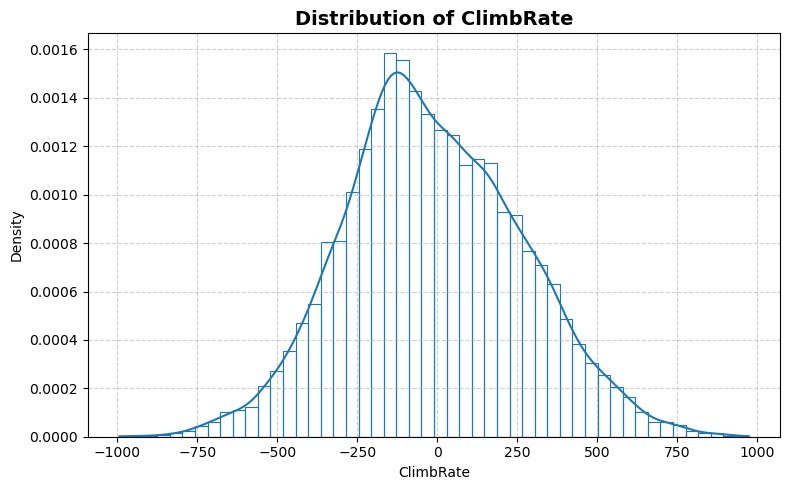
    


    
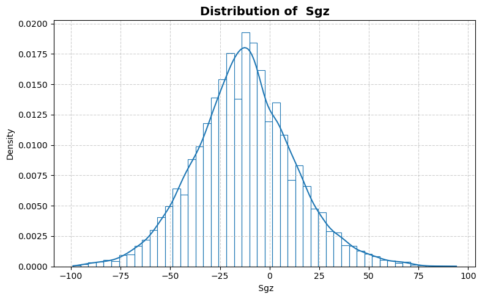
    


    
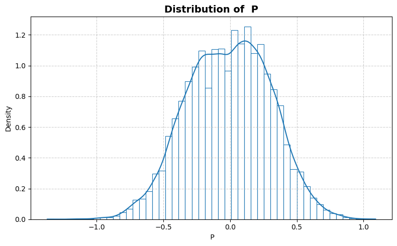
    


    

    


    
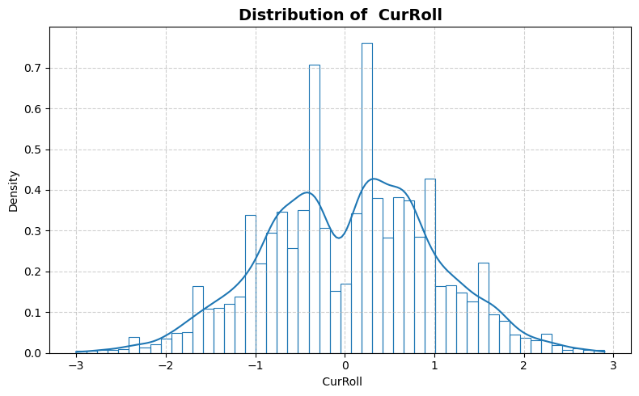
    


    
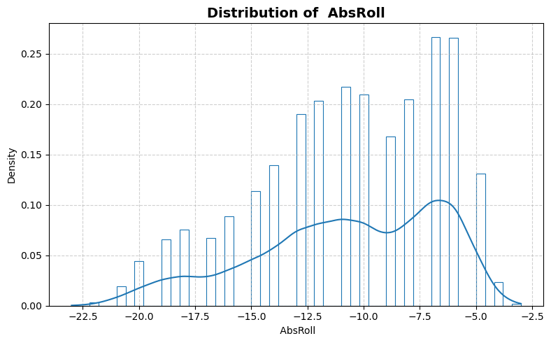
    


    
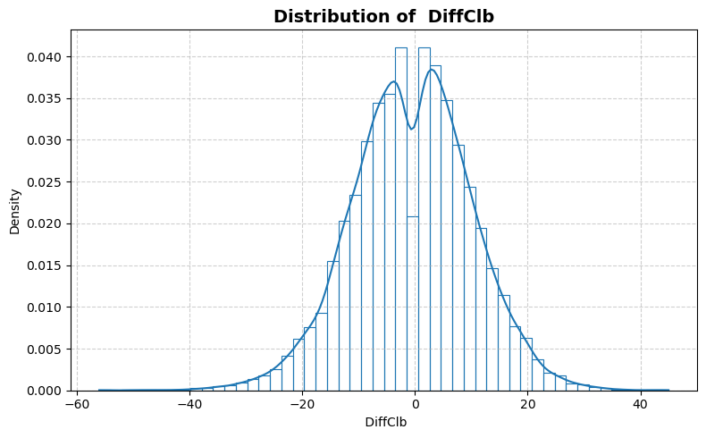
    


    
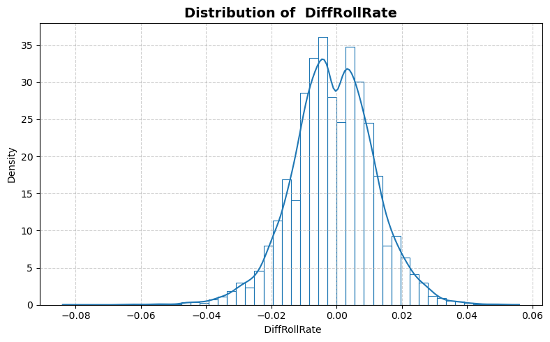
    


    
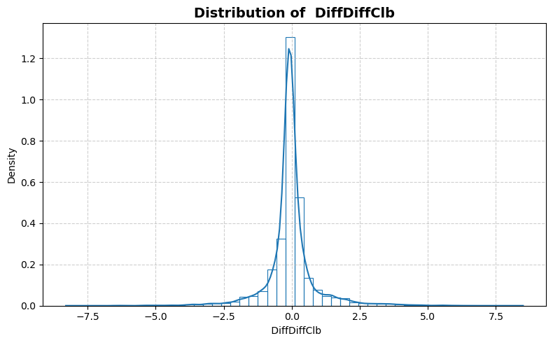
    


    
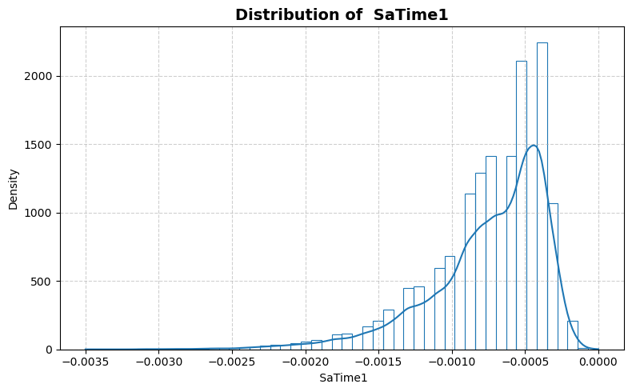
    


    
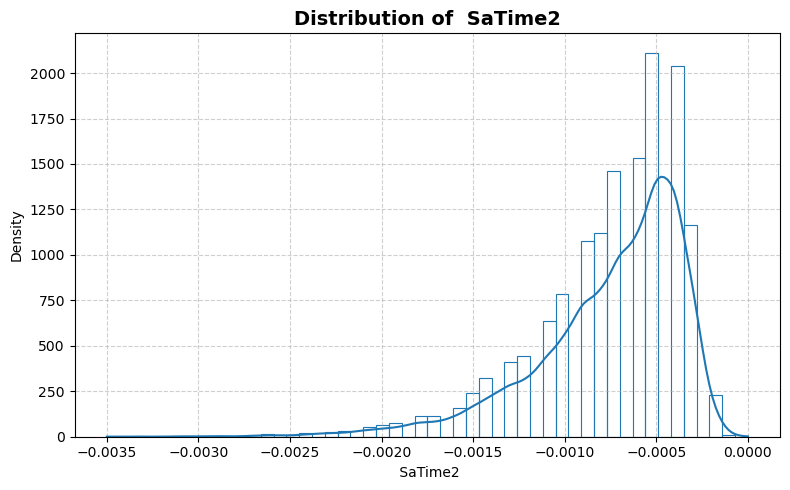
    


    
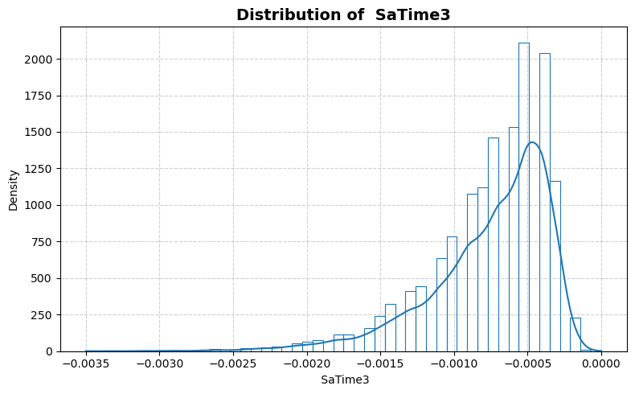
    


    
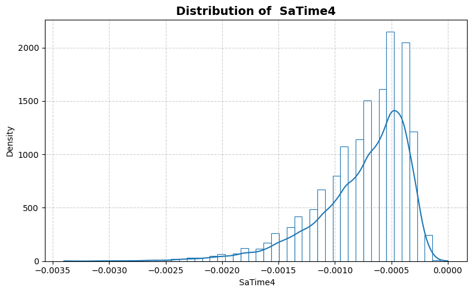
    


    

    


    
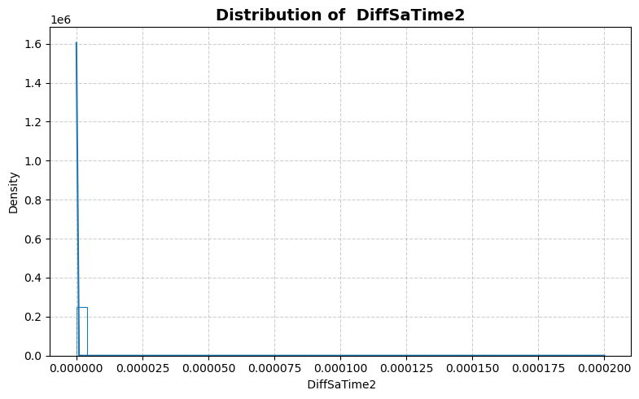
    


    
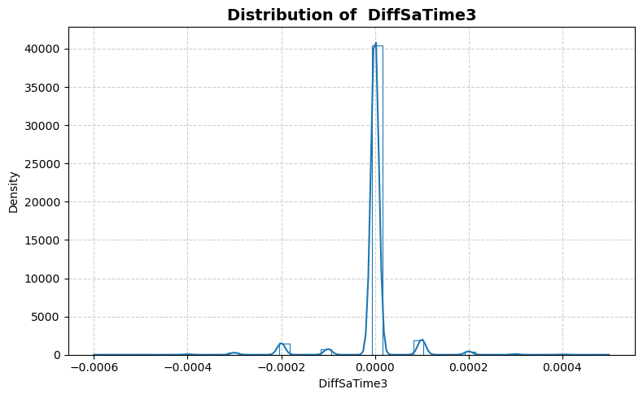
    


    
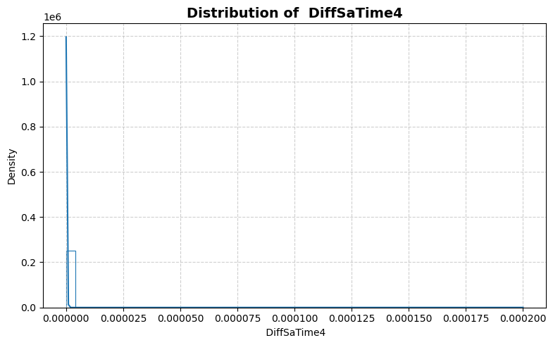
    


    
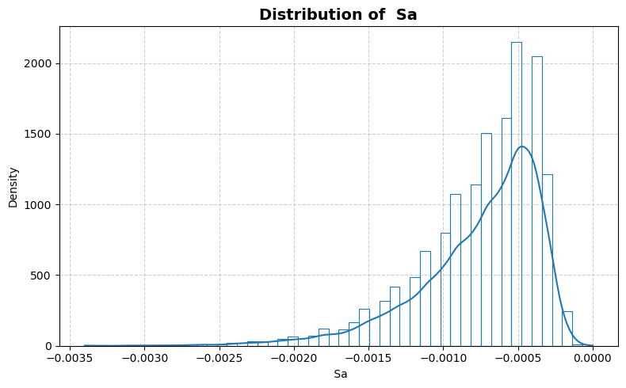
    


    
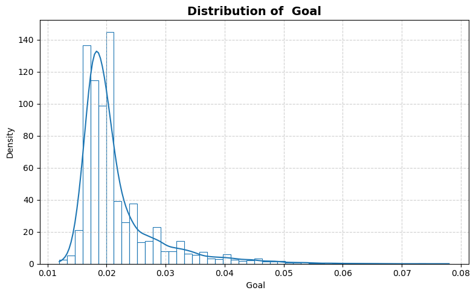
    


```python
statistics_man.plot_box()
```


    
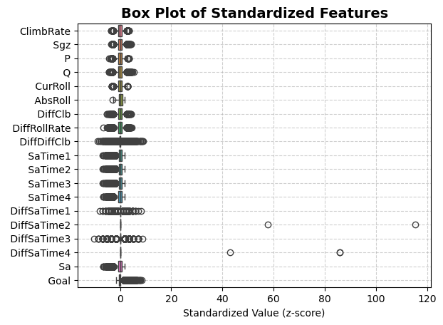
    


```python
statistics_man.print_stat_sum()
```

    Number of samples : 16599
    Number of features: 18
    ==============================


<div>
<table border="1" class="dataframe">
  <thead>
    <tr style="text-align: right;">
      <th></th>
      <th>dtype</th>
      <th>missing</th>
      <th>count</th>
      <th>median</th>
      <th>mean</th>
      <th>std</th>
      <th>min</th>
      <th>25%</th>
      <th>50%</th>
      <th>75%</th>
      <th>max</th>
    </tr>
  </thead>
  <tbody>
    <tr>
      <th>ClimbRate</th>
      <td>int64</td>
      <td>0</td>
      <td>16599.0</td>
      <td>-31.0000</td>
      <td>-1.179577e+01</td>
      <td>277.593632</td>
      <td>-993.0000</td>
      <td>-200.0000</td>
      <td>-31.0000</td>
      <td>177.0000</td>
      <td>973.0000</td>
    </tr>
    <tr>
      <th>Sgz</th>
      <td>int64</td>
      <td>0</td>
      <td>16599.0</td>
      <td>-13.0000</td>
      <td>-1.279878e+01</td>
      <td>25.439814</td>
      <td>-99.0000</td>
      <td>-29.0000</td>
      <td>-13.0000</td>
      <td>3.0000</td>
      <td>94.0000</td>
    </tr>
    <tr>
      <th>P</th>
      <td>float64</td>
      <td>0</td>
      <td>16599.0</td>
      <td>0.0000</td>
      <td>-1.007591e-02</td>
      <td>0.310457</td>
      <td>-1.3700</td>
      <td>-0.2300</td>
      <td>0.0000</td>
      <td>0.2200</td>
      <td>1.0900</td>
    </tr>
    <tr>
      <th>Q</th>
      <td>float64</td>
      <td>0</td>
      <td>16599.0</td>
      <td>0.0500</td>
      <td>5.449003e-02</td>
      <td>0.115866</td>
      <td>-0.4500</td>
      <td>-0.0300</td>
      <td>0.0500</td>
      <td>0.1300</td>
      <td>0.6900</td>
    </tr>
    <tr>
      <th>CurRoll</th>
      <td>float64</td>
      <td>0</td>
      <td>16599.0</td>
      <td>0.1000</td>
      <td>4.689439e-02</td>
      <td>0.951701</td>
      <td>-3.0000</td>
      <td>-0.6000</td>
      <td>0.1000</td>
      <td>0.7000</td>
      <td>2.9000</td>
    </tr>
    <tr>
      <th>AbsRoll</th>
      <td>int64</td>
      <td>0</td>
      <td>16599.0</td>
      <td>-10.0000</td>
      <td>-1.078963e+01</td>
      <td>4.102681</td>
      <td>-23.0000</td>
      <td>-13.0000</td>
      <td>-10.0000</td>
      <td>-7.0000</td>
      <td>-3.0000</td>
    </tr>
    <tr>
      <th>DiffClb</th>
      <td>int64</td>
      <td>0</td>
      <td>16599.0</td>
      <td>0.0000</td>
      <td>-5.697934e-01</td>
      <td>10.568555</td>
      <td>-56.0000</td>
      <td>-8.0000</td>
      <td>0.0000</td>
      <td>6.0000</td>
      <td>45.0000</td>
    </tr>
    <tr>
      <th>DiffRollRate</th>
      <td>float64</td>
      <td>0</td>
      <td>16599.0</td>
      <td>-0.0010</td>
      <td>-1.049039e-03</td>
      <td>0.012587</td>
      <td>-0.0840</td>
      <td>-0.0090</td>
      <td>-0.0010</td>
      <td>0.0070</td>
      <td>0.0560</td>
    </tr>
    <tr>
      <th>DiffDiffClb</th>
      <td>float64</td>
      <td>0</td>
      <td>16599.0</td>
      <td>-0.1000</td>
      <td>-3.397795e-02</td>
      <td>0.949416</td>
      <td>-8.3000</td>
      <td>-0.2000</td>
      <td>-0.1000</td>
      <td>0.1000</td>
      <td>8.5000</td>
    </tr>
    <tr>
      <th>SaTime1</th>
      <td>float64</td>
      <td>0</td>
      <td>16599.0</td>
      <td>-0.0007</td>
      <td>-7.504789e-04</td>
      <td>0.000402</td>
      <td>-0.0035</td>
      <td>-0.0009</td>
      <td>-0.0007</td>
      <td>-0.0005</td>
      <td>0.0000</td>
    </tr>
    <tr>
      <th>SaTime2</th>
      <td>float64</td>
      <td>0</td>
      <td>16599.0</td>
      <td>-0.0007</td>
      <td>-7.541539e-04</td>
      <td>0.000407</td>
      <td>-0.0035</td>
      <td>-0.0009</td>
      <td>-0.0007</td>
      <td>-0.0005</td>
      <td>0.0000</td>
    </tr>
    <tr>
      <th>SaTime3</th>
      <td>float64</td>
      <td>0</td>
      <td>16599.0</td>
      <td>-0.0007</td>
      <td>-7.541719e-04</td>
      <td>0.000408</td>
      <td>-0.0035</td>
      <td>-0.0009</td>
      <td>-0.0007</td>
      <td>-0.0005</td>
      <td>0.0000</td>
    </tr>
    <tr>
      <th>SaTime4</th>
      <td>float64</td>
      <td>0</td>
      <td>16599.0</td>
      <td>-0.0007</td>
      <td>-7.565396e-04</td>
      <td>0.000410</td>
      <td>-0.0034</td>
      <td>-0.0010</td>
      <td>-0.0007</td>
      <td>-0.0005</td>
      <td>0.0000</td>
    </tr>
    <tr>
      <th>DiffSaTime1</th>
      <td>float64</td>
      <td>0</td>
      <td>16599.0</td>
      <td>0.0000</td>
      <td>-9.241521e-06</td>
      <td>0.000086</td>
      <td>-0.0007</td>
      <td>0.0000</td>
      <td>0.0000</td>
      <td>0.0000</td>
      <td>0.0007</td>
    </tr>
    <tr>
      <th>DiffSaTime2</th>
      <td>float64</td>
      <td>0</td>
      <td>16599.0</td>
      <td>0.0000</td>
      <td>1.807338e-08</td>
      <td>0.000002</td>
      <td>0.0000</td>
      <td>0.0000</td>
      <td>0.0000</td>
      <td>0.0000</td>
      <td>0.0002</td>
    </tr>
    <tr>
      <th>DiffSaTime3</th>
      <td>float64</td>
      <td>0</td>
      <td>16599.0</td>
      <td>0.0000</td>
      <td>-3.403820e-06</td>
      <td>0.000058</td>
      <td>-0.0006</td>
      <td>0.0000</td>
      <td>0.0000</td>
      <td>0.0000</td>
      <td>0.0005</td>
    </tr>
    <tr>
      <th>DiffSaTime4</th>
      <td>float64</td>
      <td>0</td>
      <td>16599.0</td>
      <td>0.0000</td>
      <td>3.012230e-08</td>
      <td>0.000002</td>
      <td>0.0000</td>
      <td>0.0000</td>
      <td>0.0000</td>
      <td>0.0000</td>
      <td>0.0002</td>
    </tr>
    <tr>
      <th>Sa</th>
      <td>float64</td>
      <td>0</td>
      <td>16599.0</td>
      <td>-0.0007</td>
      <td>-7.565757e-04</td>
      <td>0.000410</td>
      <td>-0.0034</td>
      <td>-0.0010</td>
      <td>-0.0007</td>
      <td>-0.0005</td>
      <td>0.0000</td>
    </tr>
    <tr>
      <th>Goal</th>
      <td>float64</td>
      <td>0</td>
      <td>16599.0</td>
      <td>0.0200</td>
      <td>2.162498e-02</td>
      <td>0.006717</td>
      <td>0.0120</td>
      <td>0.0180</td>
      <td>0.0200</td>
      <td>0.0230</td>
      <td>0.0780</td>
    </tr>
  </tbody>
</table>
</div>


```python
statistics_man.plot_corr_heatmap()
```


    
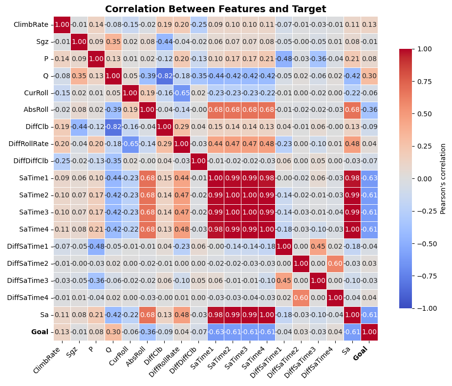
    

