```python
from stat_sum_func import ToParquet, DatasetStatistics
```


```python
file = "gas_turbine_co_and_nox_emission"
path = f"raw/{file}/{file}.parquet"
statistics_man = DatasetStatistics(path)
statistics_man.df
```


<div>
<table border="1" class="dataframe">
  <thead>
    <tr style="text-align: right;">
      <th></th>
      <th>AT</th>
      <th>AP</th>
      <th>AH</th>
      <th>AFDP</th>
      <th>GTEP</th>
      <th>TIT</th>
      <th>TAT</th>
      <th>CDP</th>
      <th>CO</th>
      <th>NOX</th>
      <th>TEY</th>
    </tr>
  </thead>
  <tbody>
    <tr>
      <th>0</th>
      <td>4.5878</td>
      <td>1018.7</td>
      <td>83.675</td>
      <td>3.5758</td>
      <td>23.979</td>
      <td>1086.2</td>
      <td>549.83</td>
      <td>11.898</td>
      <td>0.32663</td>
      <td>81.952</td>
      <td>134.67</td>
    </tr>
    <tr>
      <th>1</th>
      <td>4.2932</td>
      <td>1018.3</td>
      <td>84.235</td>
      <td>3.5709</td>
      <td>23.951</td>
      <td>1086.1</td>
      <td>550.05</td>
      <td>11.892</td>
      <td>0.44784</td>
      <td>82.377</td>
      <td>134.67</td>
    </tr>
    <tr>
      <th>2</th>
      <td>3.9045</td>
      <td>1018.4</td>
      <td>84.858</td>
      <td>3.5828</td>
      <td>23.990</td>
      <td>1086.5</td>
      <td>550.19</td>
      <td>12.042</td>
      <td>0.45144</td>
      <td>83.776</td>
      <td>135.10</td>
    </tr>
    <tr>
      <th>3</th>
      <td>3.7436</td>
      <td>1018.3</td>
      <td>85.434</td>
      <td>3.5808</td>
      <td>23.911</td>
      <td>1086.5</td>
      <td>550.17</td>
      <td>11.990</td>
      <td>0.23107</td>
      <td>82.505</td>
      <td>135.03</td>
    </tr>
    <tr>
      <th>4</th>
      <td>3.7516</td>
      <td>1017.8</td>
      <td>85.182</td>
      <td>3.5781</td>
      <td>23.917</td>
      <td>1085.9</td>
      <td>550.00</td>
      <td>11.910</td>
      <td>0.26747</td>
      <td>82.028</td>
      <td>134.67</td>
    </tr>
    <tr>
      <th>...</th>
      <td>...</td>
      <td>...</td>
      <td>...</td>
      <td>...</td>
      <td>...</td>
      <td>...</td>
      <td>...</td>
      <td>...</td>
      <td>...</td>
      <td>...</td>
      <td>...</td>
    </tr>
    <tr>
      <th>36728</th>
      <td>3.6268</td>
      <td>1028.5</td>
      <td>93.200</td>
      <td>3.1661</td>
      <td>19.087</td>
      <td>1037.0</td>
      <td>541.59</td>
      <td>10.411</td>
      <td>10.99300</td>
      <td>89.172</td>
      <td>109.08</td>
    </tr>
    <tr>
      <th>36729</th>
      <td>4.1674</td>
      <td>1028.6</td>
      <td>94.036</td>
      <td>3.1923</td>
      <td>19.016</td>
      <td>1037.6</td>
      <td>542.28</td>
      <td>10.344</td>
      <td>11.14400</td>
      <td>88.849</td>
      <td>108.79</td>
    </tr>
    <tr>
      <th>36730</th>
      <td>5.4820</td>
      <td>1028.5</td>
      <td>95.219</td>
      <td>3.3128</td>
      <td>18.857</td>
      <td>1038.0</td>
      <td>543.48</td>
      <td>10.462</td>
      <td>11.41400</td>
      <td>96.147</td>
      <td>107.81</td>
    </tr>
    <tr>
      <th>36731</th>
      <td>5.8837</td>
      <td>1028.7</td>
      <td>94.200</td>
      <td>3.9831</td>
      <td>23.563</td>
      <td>1076.9</td>
      <td>550.11</td>
      <td>11.771</td>
      <td>3.31340</td>
      <td>64.738</td>
      <td>131.41</td>
    </tr>
    <tr>
      <th>36732</th>
      <td>6.0392</td>
      <td>1028.8</td>
      <td>94.547</td>
      <td>3.8752</td>
      <td>22.524</td>
      <td>1067.9</td>
      <td>548.23</td>
      <td>11.462</td>
      <td>11.98100</td>
      <td>109.240</td>
      <td>125.41</td>
    </tr>
  </tbody>
</table>
<p>36733 rows × 11 columns</p>
</div>


```python
for feature in statistics_man.df.columns:
    statistics_man.plot_distribution(feature)
```


    
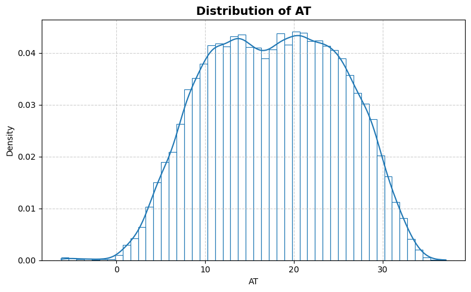
    


    
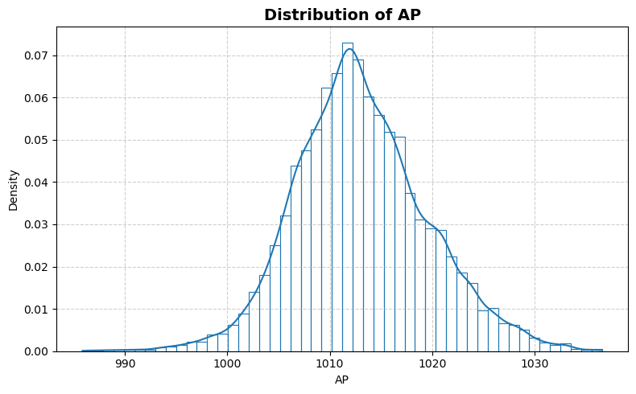
    


    
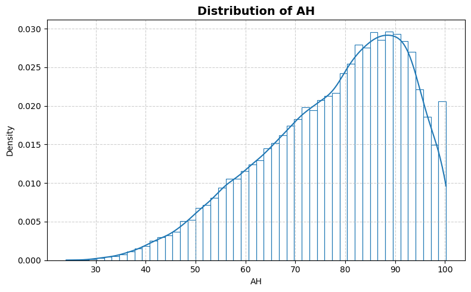
    


    
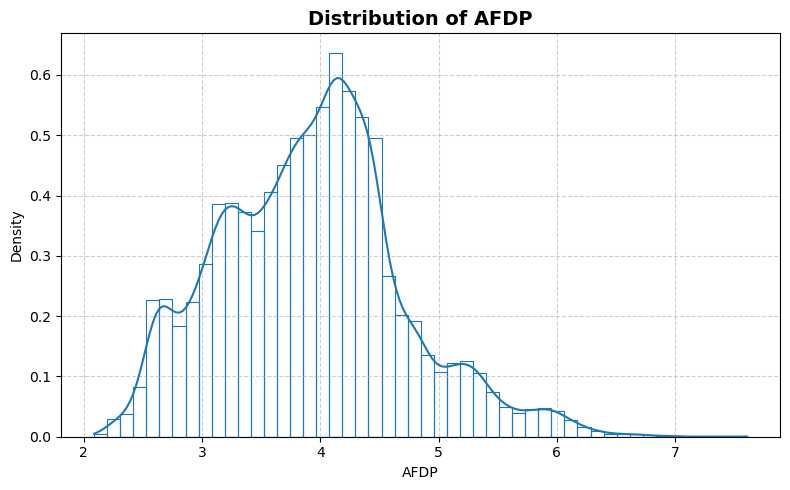
    


    
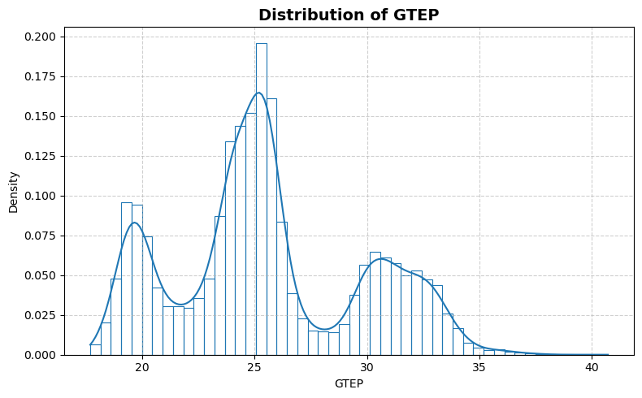
    


    
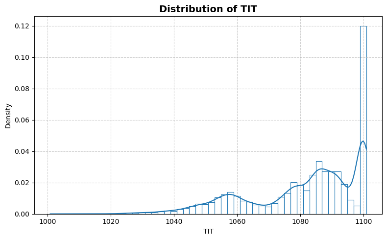
    


    
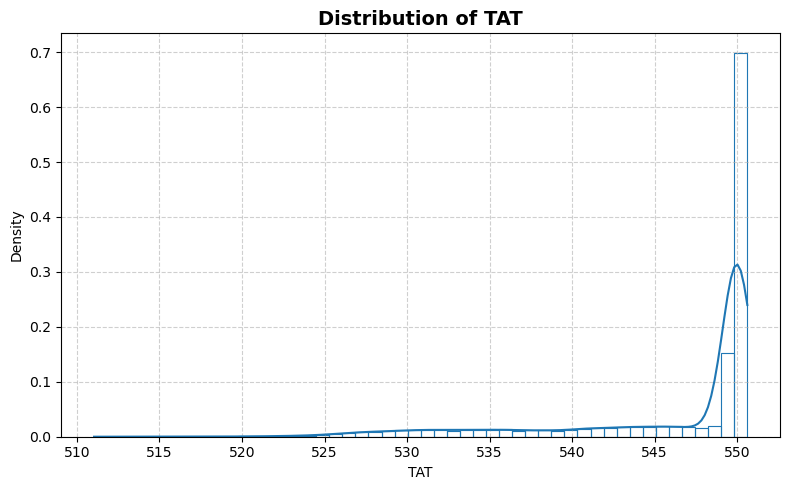
    


    
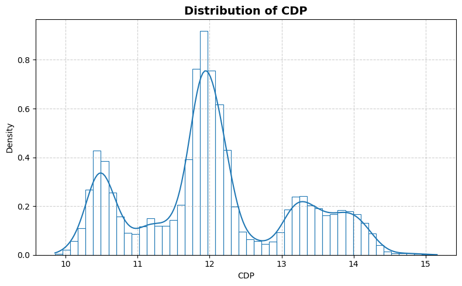
    


    
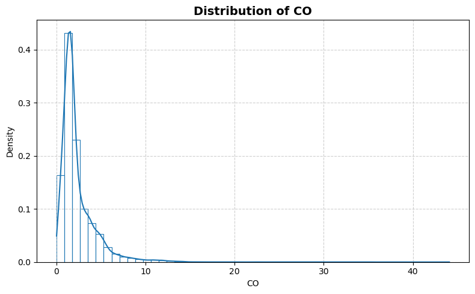
    


    
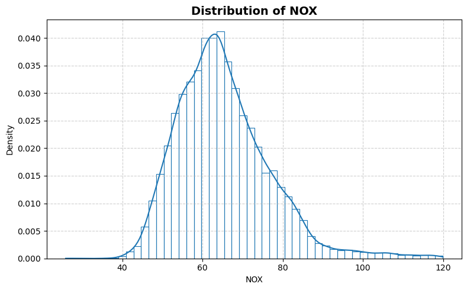
    


    
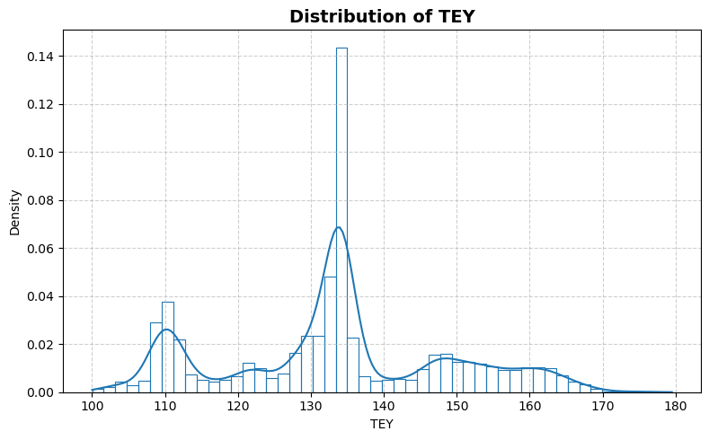
    


```python
statistics_man.plot_box()
```


    
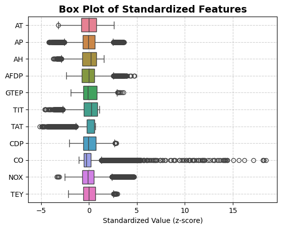
    


```python
statistics_man.print_stat_sum()
```

    Number of samples : 36733
    Number of features: 10
    ==============================


<div>
<table border="1" class="dataframe">
  <thead>
    <tr style="text-align: right;">
      <th></th>
      <th>dtype</th>
      <th>missing</th>
      <th>count</th>
      <th>median</th>
      <th>mean</th>
      <th>std</th>
      <th>min</th>
      <th>25%</th>
      <th>50%</th>
      <th>75%</th>
      <th>max</th>
    </tr>
  </thead>
  <tbody>
    <tr>
      <th>AT</th>
      <td>float64</td>
      <td>0</td>
      <td>36733.0</td>
      <td>17.8010</td>
      <td>17.712726</td>
      <td>7.447451</td>
      <td>-6.234800</td>
      <td>11.7810</td>
      <td>17.8010</td>
      <td>23.6650</td>
      <td>37.1030</td>
    </tr>
    <tr>
      <th>AP</th>
      <td>float64</td>
      <td>0</td>
      <td>36733.0</td>
      <td>1012.6000</td>
      <td>1013.070165</td>
      <td>6.463346</td>
      <td>985.850000</td>
      <td>1008.8000</td>
      <td>1012.6000</td>
      <td>1017.0000</td>
      <td>1036.6000</td>
    </tr>
    <tr>
      <th>AH</th>
      <td>float64</td>
      <td>0</td>
      <td>36733.0</td>
      <td>80.4700</td>
      <td>77.867015</td>
      <td>14.461355</td>
      <td>24.085000</td>
      <td>68.1880</td>
      <td>80.4700</td>
      <td>89.3760</td>
      <td>100.2000</td>
    </tr>
    <tr>
      <th>AFDP</th>
      <td>float64</td>
      <td>0</td>
      <td>36733.0</td>
      <td>3.9377</td>
      <td>3.925518</td>
      <td>0.773936</td>
      <td>2.087400</td>
      <td>3.3556</td>
      <td>3.9377</td>
      <td>4.3769</td>
      <td>7.6106</td>
    </tr>
    <tr>
      <th>GTEP</th>
      <td>float64</td>
      <td>0</td>
      <td>36733.0</td>
      <td>25.1040</td>
      <td>25.563801</td>
      <td>4.195957</td>
      <td>17.698000</td>
      <td>23.1290</td>
      <td>25.1040</td>
      <td>29.0610</td>
      <td>40.7160</td>
    </tr>
    <tr>
      <th>TIT</th>
      <td>float64</td>
      <td>0</td>
      <td>36733.0</td>
      <td>1085.9000</td>
      <td>1081.428084</td>
      <td>17.536373</td>
      <td>1000.800000</td>
      <td>1071.8000</td>
      <td>1085.9000</td>
      <td>1097.0000</td>
      <td>1100.9000</td>
    </tr>
    <tr>
      <th>TAT</th>
      <td>float64</td>
      <td>0</td>
      <td>36733.0</td>
      <td>549.8800</td>
      <td>546.158517</td>
      <td>6.842360</td>
      <td>511.040000</td>
      <td>544.7200</td>
      <td>549.8800</td>
      <td>550.0400</td>
      <td>550.6100</td>
    </tr>
    <tr>
      <th>CDP</th>
      <td>float64</td>
      <td>0</td>
      <td>36733.0</td>
      <td>11.9650</td>
      <td>12.060525</td>
      <td>1.088795</td>
      <td>9.851800</td>
      <td>11.4350</td>
      <td>11.9650</td>
      <td>12.8550</td>
      <td>15.1590</td>
    </tr>
    <tr>
      <th>CO</th>
      <td>float64</td>
      <td>0</td>
      <td>36733.0</td>
      <td>1.7135</td>
      <td>2.372468</td>
      <td>2.262672</td>
      <td>0.000388</td>
      <td>1.1824</td>
      <td>1.7135</td>
      <td>2.8429</td>
      <td>44.1030</td>
    </tr>
    <tr>
      <th>NOX</th>
      <td>float64</td>
      <td>0</td>
      <td>36733.0</td>
      <td>63.8490</td>
      <td>65.293067</td>
      <td>11.678357</td>
      <td>25.905000</td>
      <td>57.1620</td>
      <td>63.8490</td>
      <td>71.5480</td>
      <td>119.9100</td>
    </tr>
    <tr>
      <th>TEY</th>
      <td>float64</td>
      <td>0</td>
      <td>36733.0</td>
      <td>133.7300</td>
      <td>133.506404</td>
      <td>15.618634</td>
      <td>100.020000</td>
      <td>124.4500</td>
      <td>133.7300</td>
      <td>144.0800</td>
      <td>179.5000</td>
    </tr>
  </tbody>
</table>
</div>


```python
statistics_man.plot_corr_heatmap()
```


    

    

