```python
from stat_sum_func import ToParquet, DatasetStatistics
```


```python
file = "house"
path = f"raw/{file}/{file}.parquet"
statistics_man = DatasetStatistics(path)
statistics_man.df
```


<div>
<table border="1" class="dataframe">
  <thead>
    <tr style="text-align: right;">
      <th></th>
      <th>P1</th>
      <th>P5p1</th>
      <th>P6p2</th>
      <th>P11p4</th>
      <th>P14p9</th>
      <th>P15p1</th>
      <th>P15p3</th>
      <th>P16p2</th>
      <th>P18p2</th>
      <th>P27p4</th>
      <th>H2p2</th>
      <th>H8p2</th>
      <th>H10p1</th>
      <th>H13p1</th>
      <th>H18pA</th>
      <th>H40p4</th>
      <th>Price</th>
    </tr>
  </thead>
  <tbody>
    <tr>
      <th>0</th>
      <td>3961</td>
      <td>0.476395</td>
      <td>0.003534</td>
      <td>0.123454</td>
      <td>0.093057</td>
      <td>0.885887</td>
      <td>0.021712</td>
      <td>0.773015</td>
      <td>0.002811</td>
      <td>0.024596</td>
      <td>0.046247</td>
      <td>0.003514</td>
      <td>0.995784</td>
      <td>0.182976</td>
      <td>0.101093</td>
      <td>0.384615</td>
      <td>125500</td>
    </tr>
    <tr>
      <th>1</th>
      <td>2199</td>
      <td>0.450659</td>
      <td>0.343793</td>
      <td>0.197362</td>
      <td>0.165563</td>
      <td>0.853115</td>
      <td>0.023647</td>
      <td>0.694411</td>
      <td>0.001189</td>
      <td>0.013080</td>
      <td>0.146193</td>
      <td>0.321046</td>
      <td>0.992866</td>
      <td>0.271066</td>
      <td>0.118518</td>
      <td>0.777778</td>
      <td>19100</td>
    </tr>
    <tr>
      <th>2</th>
      <td>74</td>
      <td>0.527027</td>
      <td>0.000000</td>
      <td>0.283784</td>
      <td>0.171429</td>
      <td>0.783784</td>
      <td>0.000000</td>
      <td>0.529412</td>
      <td>0.000000</td>
      <td>0.000000</td>
      <td>0.381818</td>
      <td>0.000000</td>
      <td>1.000000</td>
      <td>0.327273</td>
      <td>0.200000</td>
      <td>0.000000</td>
      <td>14999</td>
    </tr>
    <tr>
      <th>3</th>
      <td>239</td>
      <td>0.430962</td>
      <td>0.000000</td>
      <td>0.075314</td>
      <td>0.066176</td>
      <td>0.949791</td>
      <td>0.000000</td>
      <td>0.860760</td>
      <td>0.000000</td>
      <td>0.012658</td>
      <td>0.024691</td>
      <td>0.000000</td>
      <td>1.000000</td>
      <td>0.308642</td>
      <td>0.300000</td>
      <td>0.000000</td>
      <td>38000</td>
    </tr>
    <tr>
      <th>4</th>
      <td>1892</td>
      <td>0.508985</td>
      <td>0.000528</td>
      <td>0.211417</td>
      <td>0.100108</td>
      <td>0.799154</td>
      <td>0.003171</td>
      <td>0.634434</td>
      <td>0.007076</td>
      <td>0.067217</td>
      <td>0.258093</td>
      <td>0.001179</td>
      <td>0.988208</td>
      <td>0.554681</td>
      <td>0.060060</td>
      <td>0.333333</td>
      <td>38600</td>
    </tr>
    <tr>
      <th>...</th>
      <td>...</td>
      <td>...</td>
      <td>...</td>
      <td>...</td>
      <td>...</td>
      <td>...</td>
      <td>...</td>
      <td>...</td>
      <td>...</td>
      <td>...</td>
      <td>...</td>
      <td>...</td>
      <td>...</td>
      <td>...</td>
      <td>...</td>
      <td>...</td>
      <td>...</td>
    </tr>
    <tr>
      <th>22779</th>
      <td>2515</td>
      <td>0.479125</td>
      <td>0.000398</td>
      <td>0.120080</td>
      <td>0.090076</td>
      <td>0.895427</td>
      <td>0.000795</td>
      <td>0.764579</td>
      <td>0.005400</td>
      <td>0.035637</td>
      <td>0.019068</td>
      <td>0.000000</td>
      <td>0.993521</td>
      <td>0.268008</td>
      <td>0.044728</td>
      <td>0.000000</td>
      <td>56700</td>
    </tr>
    <tr>
      <th>22780</th>
      <td>1106</td>
      <td>0.489150</td>
      <td>0.010850</td>
      <td>0.195298</td>
      <td>0.153982</td>
      <td>0.744123</td>
      <td>0.135624</td>
      <td>0.688608</td>
      <td>0.000000</td>
      <td>0.025316</td>
      <td>0.031863</td>
      <td>0.000000</td>
      <td>0.997468</td>
      <td>0.379902</td>
      <td>0.040323</td>
      <td>1.000000</td>
      <td>35400</td>
    </tr>
    <tr>
      <th>22781</th>
      <td>70580</td>
      <td>0.473477</td>
      <td>0.416364</td>
      <td>0.132304</td>
      <td>0.115737</td>
      <td>0.836894</td>
      <td>0.023193</td>
      <td>0.683871</td>
      <td>0.004512</td>
      <td>0.039083</td>
      <td>0.101494</td>
      <td>0.359761</td>
      <td>0.990229</td>
      <td>0.357861</td>
      <td>0.101578</td>
      <td>0.620137</td>
      <td>36300</td>
    </tr>
    <tr>
      <th>22782</th>
      <td>4215</td>
      <td>0.487307</td>
      <td>0.016845</td>
      <td>0.071412</td>
      <td>0.056455</td>
      <td>0.679478</td>
      <td>0.229656</td>
      <td>0.744262</td>
      <td>0.000820</td>
      <td>0.049180</td>
      <td>0.052059</td>
      <td>0.018853</td>
      <td>0.989344</td>
      <td>0.438228</td>
      <td>0.097264</td>
      <td>0.250000</td>
      <td>45900</td>
    </tr>
    <tr>
      <th>22783</th>
      <td>376</td>
      <td>0.449468</td>
      <td>0.000000</td>
      <td>0.196808</td>
      <td>0.135266</td>
      <td>0.845745</td>
      <td>0.000000</td>
      <td>0.666667</td>
      <td>0.006173</td>
      <td>0.012346</td>
      <td>0.133690</td>
      <td>0.000000</td>
      <td>1.000000</td>
      <td>0.443850</td>
      <td>0.065574</td>
      <td>1.000000</td>
      <td>26600</td>
    </tr>
  </tbody>
</table>
<p>22784 rows × 17 columns</p>
</div>


```python
for feature in statistics_man.df.columns:
    statistics_man.plot_distribution(feature)
```


    
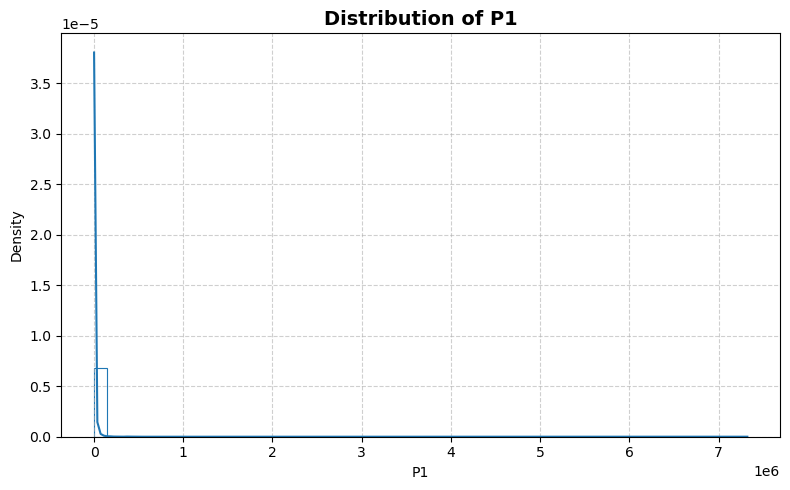
    


    
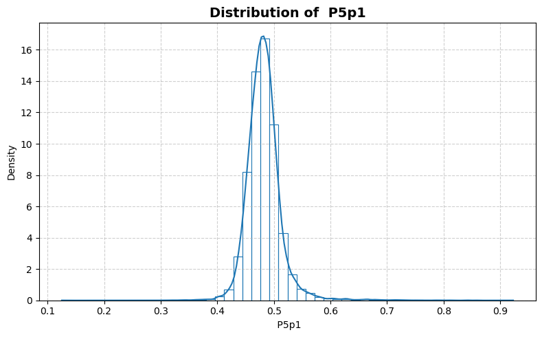
    


    
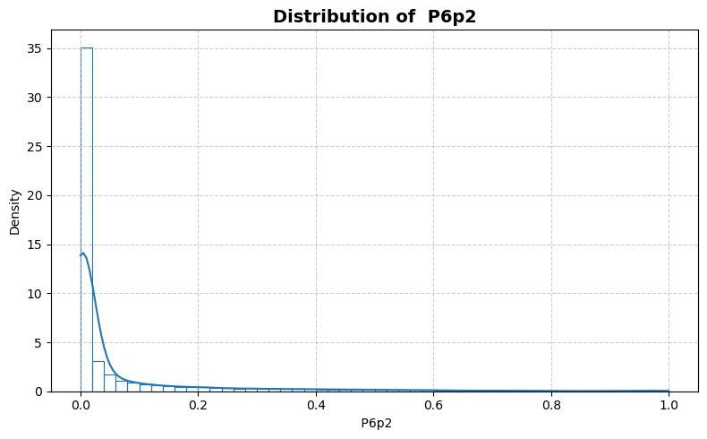
    


    
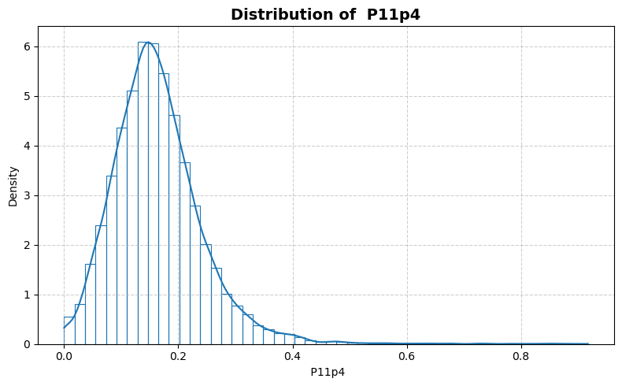
    


    

    


    
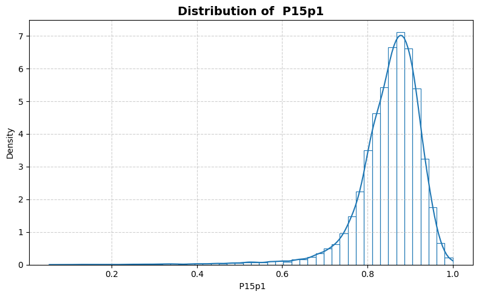
    


    
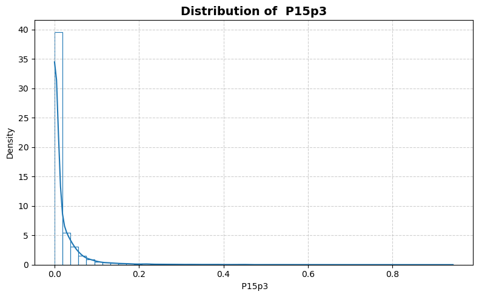
    


    
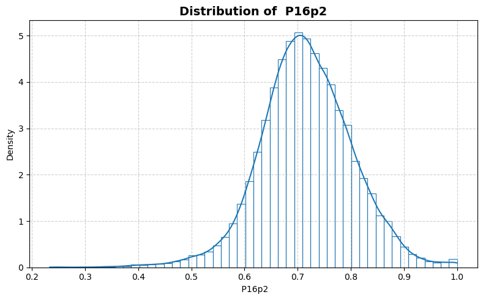
    


    
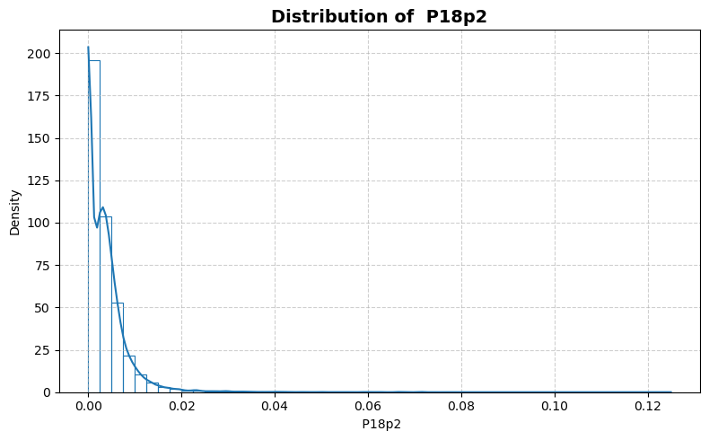
    


    
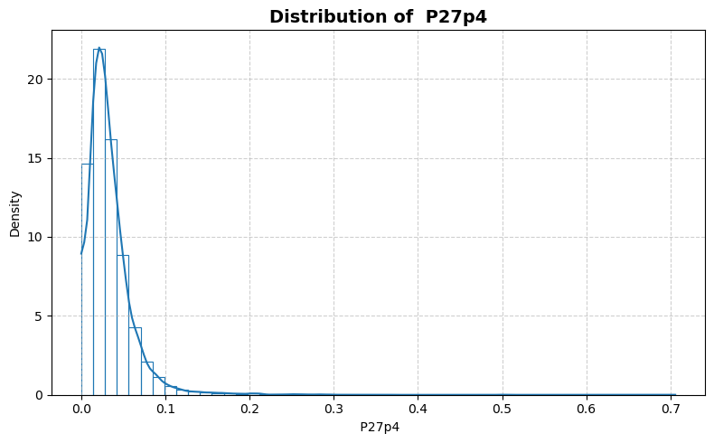
    


    
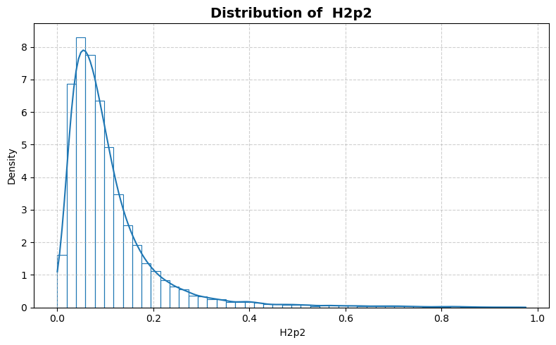
    


    
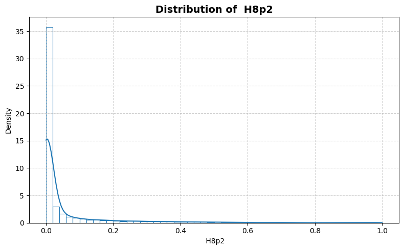
    


    
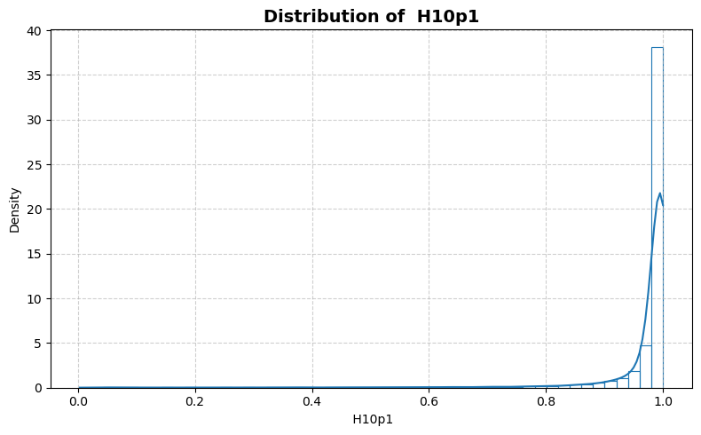
    


    
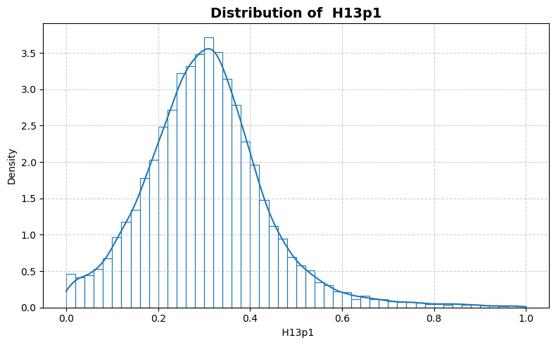
    


    
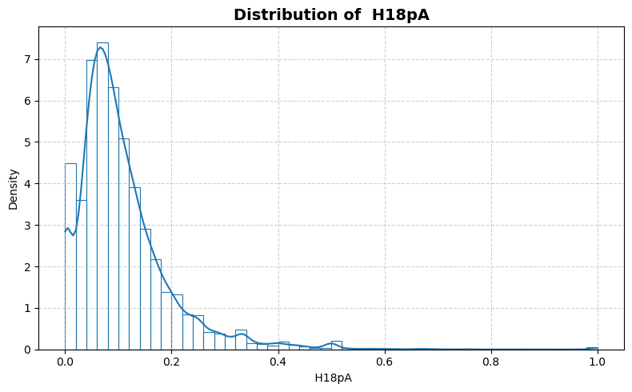
    


    
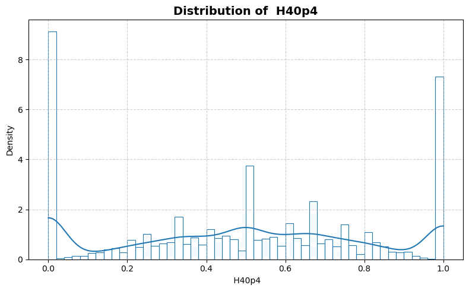
    


    
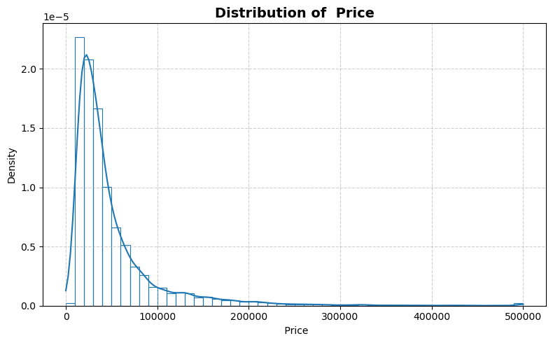
    


```python
statistics_man.plot_box()
```


    
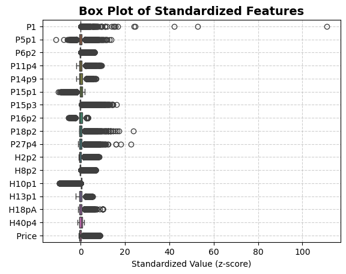
    


```python
statistics_man.print_stat_sum()
```

    Number of samples : 22784
    Number of features: 16
    ==============================


<div>
<table border="1" class="dataframe">
  <thead>
    <tr style="text-align: right;">
      <th></th>
      <th>dtype</th>
      <th>missing</th>
      <th>count</th>
      <th>median</th>
      <th>mean</th>
      <th>std</th>
      <th>min</th>
      <th>25%</th>
      <th>50%</th>
      <th>75%</th>
      <th>max</th>
    </tr>
  </thead>
  <tbody>
    <tr>
      <th>P1</th>
      <td>int64</td>
      <td>0</td>
      <td>22784.0</td>
      <td>1345.500000</td>
      <td>7808.669198</td>
      <td>65872.423580</td>
      <td>2.000000</td>
      <td>427.000000</td>
      <td>1345.500000</td>
      <td>4518.250000</td>
      <td>7.322564e+06</td>
    </tr>
    <tr>
      <th>P5p1</th>
      <td>float64</td>
      <td>0</td>
      <td>22784.0</td>
      <td>0.480396</td>
      <td>0.482297</td>
      <td>0.031876</td>
      <td>0.125000</td>
      <td>0.464647</td>
      <td>0.480396</td>
      <td>0.496040</td>
      <td>9.230769e-01</td>
    </tr>
    <tr>
      <th>P6p2</th>
      <td>float64</td>
      <td>0</td>
      <td>22784.0</td>
      <td>0.003413</td>
      <td>0.063982</td>
      <td>0.150921</td>
      <td>0.000000</td>
      <td>0.000000</td>
      <td>0.003413</td>
      <td>0.033376</td>
      <td>1.000000e+00</td>
    </tr>
    <tr>
      <th>P11p4</th>
      <td>float64</td>
      <td>0</td>
      <td>22784.0</td>
      <td>0.155485</td>
      <td>0.163900</td>
      <td>0.080461</td>
      <td>0.000000</td>
      <td>0.112069</td>
      <td>0.155485</td>
      <td>0.203596</td>
      <td>9.172546e-01</td>
    </tr>
    <tr>
      <th>P14p9</th>
      <td>float64</td>
      <td>0</td>
      <td>22784.0</td>
      <td>0.117127</td>
      <td>0.121538</td>
      <td>0.056687</td>
      <td>0.000000</td>
      <td>0.081236</td>
      <td>0.117127</td>
      <td>0.156757</td>
      <td>5.118719e-01</td>
    </tr>
    <tr>
      <th>P15p1</th>
      <td>float64</td>
      <td>0</td>
      <td>22784.0</td>
      <td>0.863645</td>
      <td>0.851076</td>
      <td>0.079455</td>
      <td>0.054156</td>
      <td>0.819686</td>
      <td>0.863645</td>
      <td>0.899657</td>
      <td>1.000000e+00</td>
    </tr>
    <tr>
      <th>P15p3</th>
      <td>float64</td>
      <td>0</td>
      <td>22784.0</td>
      <td>0.000000</td>
      <td>0.020487</td>
      <td>0.057666</td>
      <td>0.000000</td>
      <td>0.000000</td>
      <td>0.000000</td>
      <td>0.019196</td>
      <td>9.433249e-01</td>
    </tr>
    <tr>
      <th>P16p2</th>
      <td>float64</td>
      <td>0</td>
      <td>22784.0</td>
      <td>0.714286</td>
      <td>0.716131</td>
      <td>0.087264</td>
      <td>0.233702</td>
      <td>0.662283</td>
      <td>0.714286</td>
      <td>0.771039</td>
      <td>1.000000e+00</td>
    </tr>
    <tr>
      <th>P18p2</th>
      <td>float64</td>
      <td>0</td>
      <td>22784.0</td>
      <td>0.002591</td>
      <td>0.003589</td>
      <td>0.005100</td>
      <td>0.000000</td>
      <td>0.000000</td>
      <td>0.002591</td>
      <td>0.005007</td>
      <td>1.250000e-01</td>
    </tr>
    <tr>
      <th>P27p4</th>
      <td>float64</td>
      <td>0</td>
      <td>22784.0</td>
      <td>0.027523</td>
      <td>0.033263</td>
      <td>0.029567</td>
      <td>0.000000</td>
      <td>0.016260</td>
      <td>0.027523</td>
      <td>0.042827</td>
      <td>7.057357e-01</td>
    </tr>
    <tr>
      <th>H2p2</th>
      <td>float64</td>
      <td>0</td>
      <td>22784.0</td>
      <td>0.081179</td>
      <td>0.110527</td>
      <td>0.105925</td>
      <td>0.000000</td>
      <td>0.049303</td>
      <td>0.081179</td>
      <td>0.131430</td>
      <td>9.751773e-01</td>
    </tr>
    <tr>
      <th>H8p2</th>
      <td>float64</td>
      <td>0</td>
      <td>22784.0</td>
      <td>0.002538</td>
      <td>0.057437</td>
      <td>0.139811</td>
      <td>0.000000</td>
      <td>0.000000</td>
      <td>0.002538</td>
      <td>0.029928</td>
      <td>1.000000e+00</td>
    </tr>
    <tr>
      <th>H10p1</th>
      <td>float64</td>
      <td>0</td>
      <td>22784.0</td>
      <td>0.994100</td>
      <td>0.967045</td>
      <td>0.099953</td>
      <td>0.003257</td>
      <td>0.981410</td>
      <td>0.994100</td>
      <td>1.000000</td>
      <td>1.000000e+00</td>
    </tr>
    <tr>
      <th>H13p1</th>
      <td>float64</td>
      <td>0</td>
      <td>22784.0</td>
      <td>0.299800</td>
      <td>0.304993</td>
      <td>0.133998</td>
      <td>0.000000</td>
      <td>0.221673</td>
      <td>0.299800</td>
      <td>0.375000</td>
      <td>1.000000e+00</td>
    </tr>
    <tr>
      <th>H18pA</th>
      <td>float64</td>
      <td>0</td>
      <td>22784.0</td>
      <td>0.086957</td>
      <td>0.107377</td>
      <td>0.090065</td>
      <td>0.000000</td>
      <td>0.052770</td>
      <td>0.086957</td>
      <td>0.137931</td>
      <td>1.000000e+00</td>
    </tr>
    <tr>
      <th>H40p4</th>
      <td>float64</td>
      <td>0</td>
      <td>22784.0</td>
      <td>0.500000</td>
      <td>0.491626</td>
      <td>0.331655</td>
      <td>0.000000</td>
      <td>0.243243</td>
      <td>0.500000</td>
      <td>0.750000</td>
      <td>1.000000e+00</td>
    </tr>
    <tr>
      <th>Price</th>
      <td>int64</td>
      <td>0</td>
      <td>22784.0</td>
      <td>33200.000000</td>
      <td>50074.439782</td>
      <td>52843.475551</td>
      <td>0.000000</td>
      <td>21000.000000</td>
      <td>33200.000000</td>
      <td>56100.000000</td>
      <td>5.000010e+05</td>
    </tr>
  </tbody>
</table>
</div>


```python
statistics_man.plot_corr_heatmap()
```


    
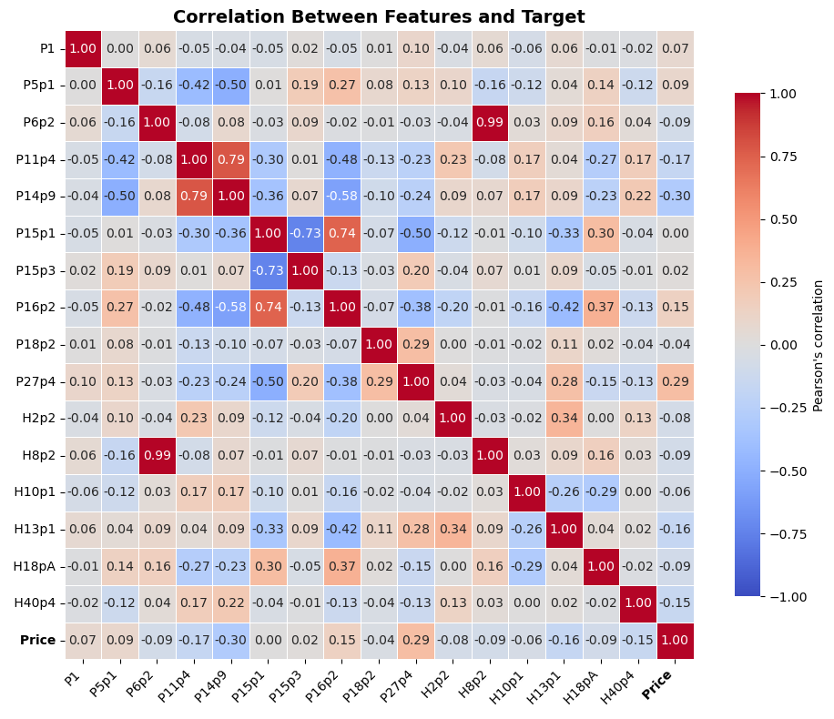
    

