```python
from stat_sum_func import ToParquet, DatasetStatistics
```


```python
file = "house_sales"
path = f"raw/{file}/{file}.parquet"
statistics_man = DatasetStatistics(path)
statistics_man.df
```


<div>
<table border="1" class="dataframe">
  <thead>
    <tr style="text-align: right;">
      <th></th>
      <th>bedrooms</th>
      <th>bathrooms</th>
      <th>sqft_living</th>
      <th>sqft_lot</th>
      <th>grade</th>
      <th>sqft_above</th>
      <th>sqft_basement</th>
      <th>yr_built</th>
      <th>yr_renovated</th>
      <th>lat</th>
      <th>long</th>
      <th>sqft_living15</th>
      <th>sqft_lot15</th>
      <th>date_month</th>
      <th>date_day</th>
      <th>price</th>
    </tr>
  </thead>
  <tbody>
    <tr>
      <th>0</th>
      <td>3.0</td>
      <td>1.00</td>
      <td>1180.0</td>
      <td>5650.0</td>
      <td>7.0</td>
      <td>1180.0</td>
      <td>0.0</td>
      <td>1955.0</td>
      <td>0.0</td>
      <td>47.5112</td>
      <td>-122.257</td>
      <td>1340.0</td>
      <td>5650.0</td>
      <td>10.0</td>
      <td>13.0</td>
      <td>12.309987</td>
    </tr>
    <tr>
      <th>1</th>
      <td>3.0</td>
      <td>2.25</td>
      <td>2570.0</td>
      <td>7242.0</td>
      <td>7.0</td>
      <td>2170.0</td>
      <td>400.0</td>
      <td>1951.0</td>
      <td>1991.0</td>
      <td>47.7210</td>
      <td>-122.319</td>
      <td>1690.0</td>
      <td>7639.0</td>
      <td>12.0</td>
      <td>9.0</td>
      <td>13.195616</td>
    </tr>
    <tr>
      <th>2</th>
      <td>2.0</td>
      <td>1.00</td>
      <td>770.0</td>
      <td>10000.0</td>
      <td>6.0</td>
      <td>770.0</td>
      <td>0.0</td>
      <td>1933.0</td>
      <td>0.0</td>
      <td>47.7379</td>
      <td>-122.233</td>
      <td>2720.0</td>
      <td>8062.0</td>
      <td>2.0</td>
      <td>25.0</td>
      <td>12.100718</td>
    </tr>
    <tr>
      <th>3</th>
      <td>4.0</td>
      <td>3.00</td>
      <td>1960.0</td>
      <td>5000.0</td>
      <td>7.0</td>
      <td>1050.0</td>
      <td>910.0</td>
      <td>1965.0</td>
      <td>0.0</td>
      <td>47.5208</td>
      <td>-122.393</td>
      <td>1360.0</td>
      <td>5000.0</td>
      <td>12.0</td>
      <td>9.0</td>
      <td>13.311331</td>
    </tr>
    <tr>
      <th>4</th>
      <td>3.0</td>
      <td>2.00</td>
      <td>1680.0</td>
      <td>8080.0</td>
      <td>8.0</td>
      <td>1680.0</td>
      <td>0.0</td>
      <td>1987.0</td>
      <td>0.0</td>
      <td>47.6168</td>
      <td>-122.045</td>
      <td>1800.0</td>
      <td>7503.0</td>
      <td>2.0</td>
      <td>18.0</td>
      <td>13.142168</td>
    </tr>
    <tr>
      <th>...</th>
      <td>...</td>
      <td>...</td>
      <td>...</td>
      <td>...</td>
      <td>...</td>
      <td>...</td>
      <td>...</td>
      <td>...</td>
      <td>...</td>
      <td>...</td>
      <td>...</td>
      <td>...</td>
      <td>...</td>
      <td>...</td>
      <td>...</td>
      <td>...</td>
    </tr>
    <tr>
      <th>21608</th>
      <td>3.0</td>
      <td>2.50</td>
      <td>1530.0</td>
      <td>1131.0</td>
      <td>8.0</td>
      <td>1530.0</td>
      <td>0.0</td>
      <td>2009.0</td>
      <td>0.0</td>
      <td>47.6993</td>
      <td>-122.346</td>
      <td>1530.0</td>
      <td>1509.0</td>
      <td>5.0</td>
      <td>21.0</td>
      <td>12.793862</td>
    </tr>
    <tr>
      <th>21609</th>
      <td>4.0</td>
      <td>2.50</td>
      <td>2310.0</td>
      <td>5813.0</td>
      <td>8.0</td>
      <td>2310.0</td>
      <td>0.0</td>
      <td>2014.0</td>
      <td>0.0</td>
      <td>47.5107</td>
      <td>-122.362</td>
      <td>1830.0</td>
      <td>7200.0</td>
      <td>2.0</td>
      <td>23.0</td>
      <td>12.899222</td>
    </tr>
    <tr>
      <th>21610</th>
      <td>2.0</td>
      <td>0.75</td>
      <td>1020.0</td>
      <td>1350.0</td>
      <td>7.0</td>
      <td>1020.0</td>
      <td>0.0</td>
      <td>2009.0</td>
      <td>0.0</td>
      <td>47.5944</td>
      <td>-122.299</td>
      <td>1020.0</td>
      <td>2007.0</td>
      <td>6.0</td>
      <td>23.0</td>
      <td>12.904461</td>
    </tr>
    <tr>
      <th>21611</th>
      <td>3.0</td>
      <td>2.50</td>
      <td>1600.0</td>
      <td>2388.0</td>
      <td>8.0</td>
      <td>1600.0</td>
      <td>0.0</td>
      <td>2004.0</td>
      <td>0.0</td>
      <td>47.5345</td>
      <td>-122.069</td>
      <td>1410.0</td>
      <td>1287.0</td>
      <td>1.0</td>
      <td>16.0</td>
      <td>12.899222</td>
    </tr>
    <tr>
      <th>21612</th>
      <td>2.0</td>
      <td>0.75</td>
      <td>1020.0</td>
      <td>1076.0</td>
      <td>7.0</td>
      <td>1020.0</td>
      <td>0.0</td>
      <td>2008.0</td>
      <td>0.0</td>
      <td>47.5941</td>
      <td>-122.299</td>
      <td>1020.0</td>
      <td>1357.0</td>
      <td>10.0</td>
      <td>15.0</td>
      <td>12.691584</td>
    </tr>
  </tbody>
</table>
<p>21613 rows × 16 columns</p>
</div>


```python
for feature in statistics_man.df.columns:
    statistics_man.plot_distribution(feature)
```


    
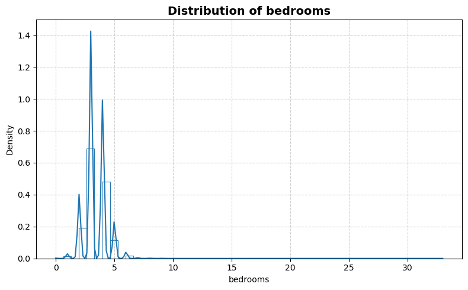
    


    
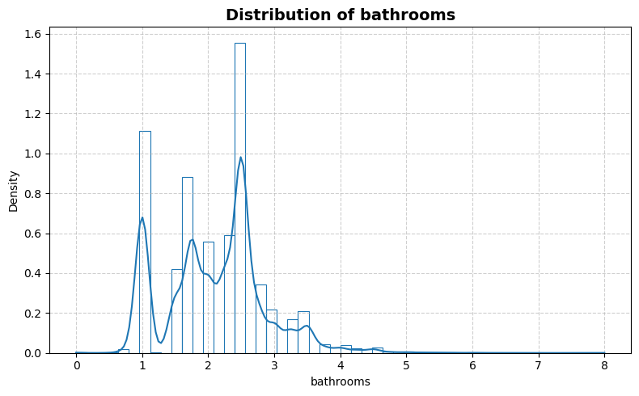
    


    
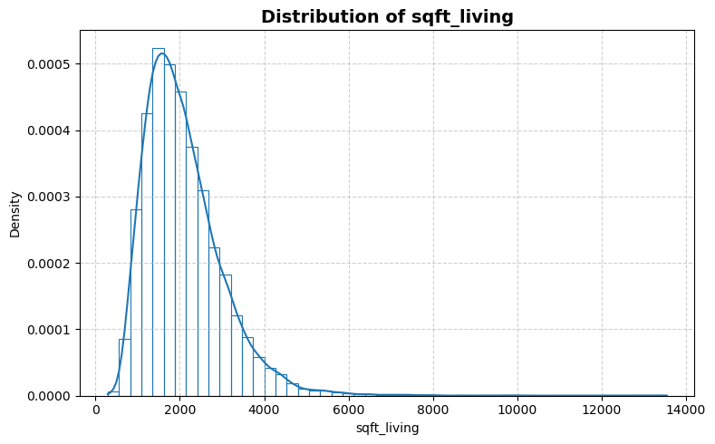
    


    
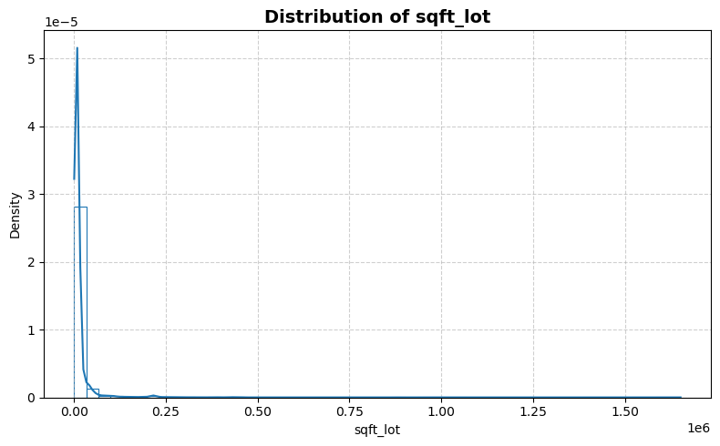
    


    
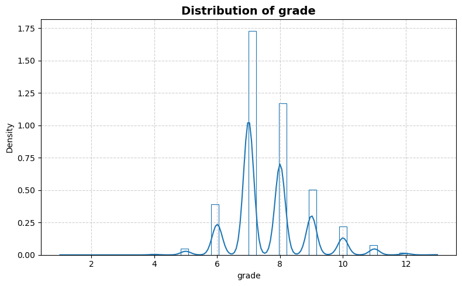
    


    
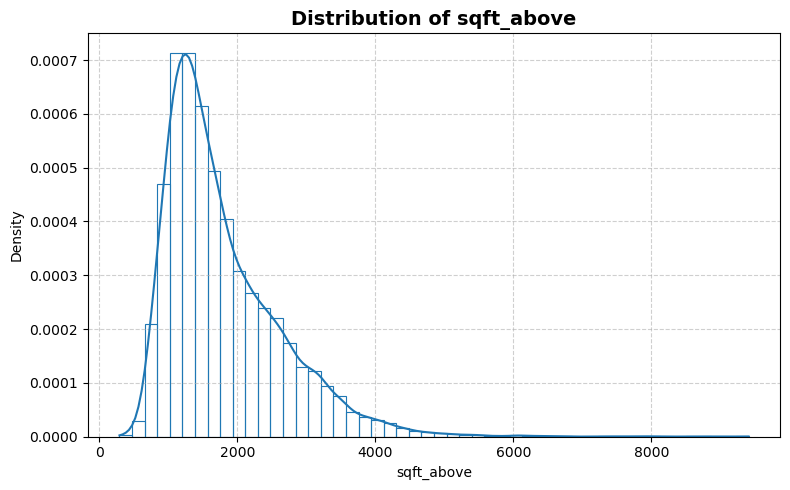
    


    
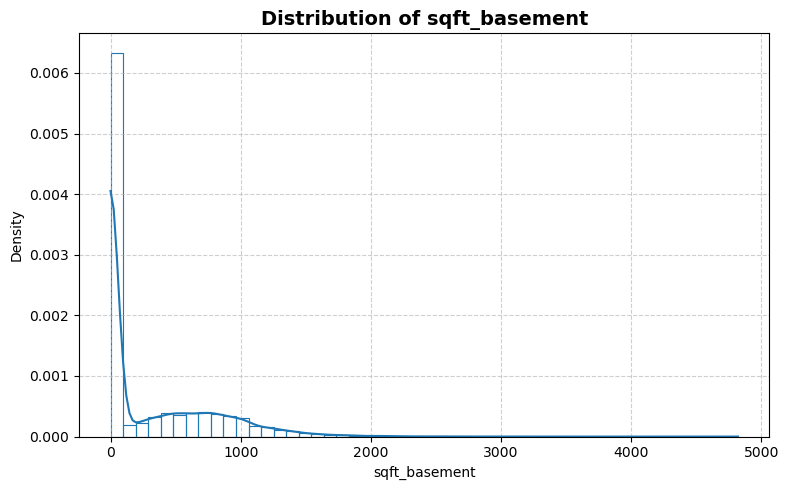
    


    
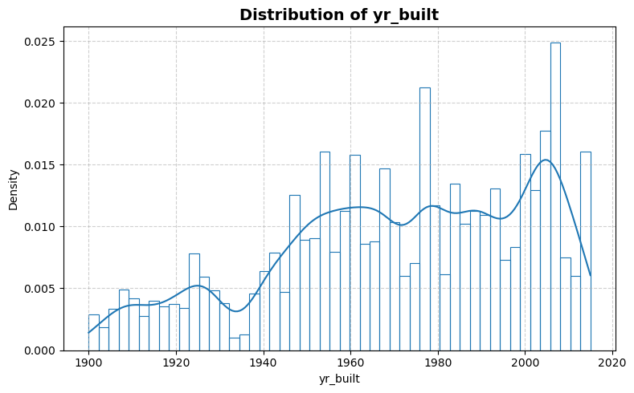
    


    
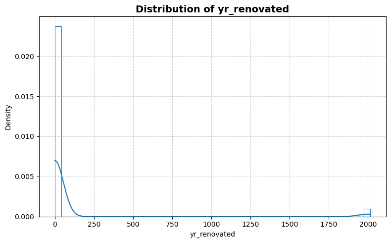
    


    
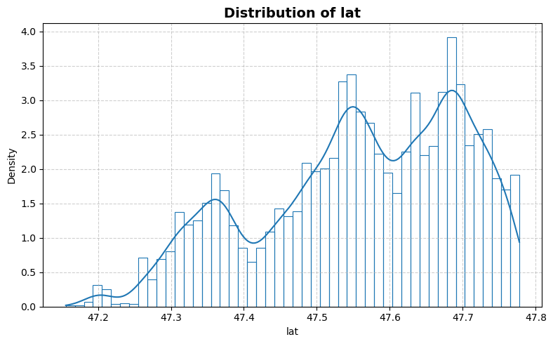
    


    
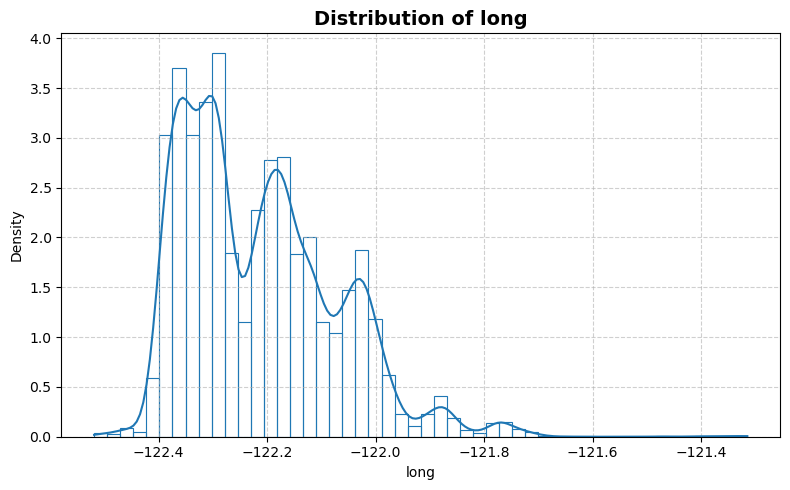
    


    
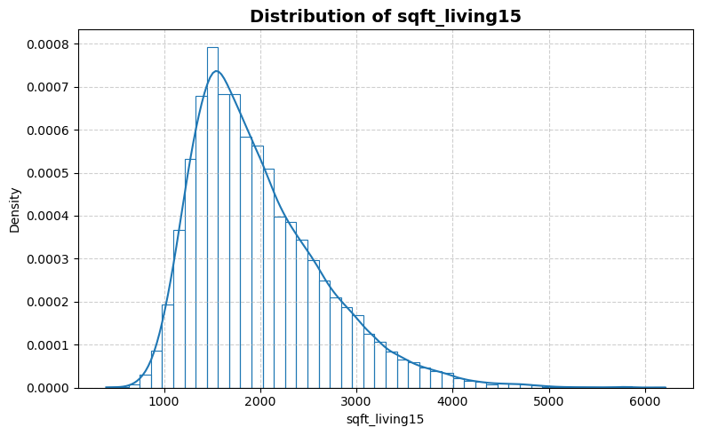
    


    

    


    
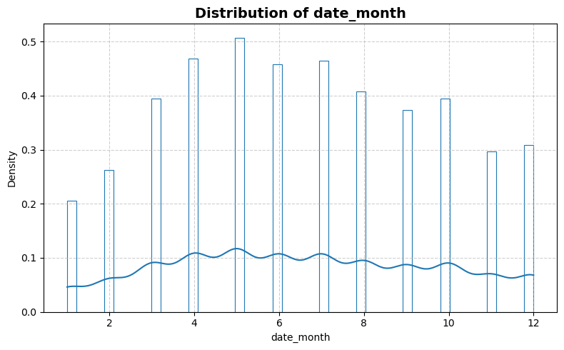
    


    
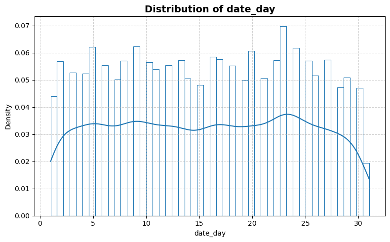
    


    
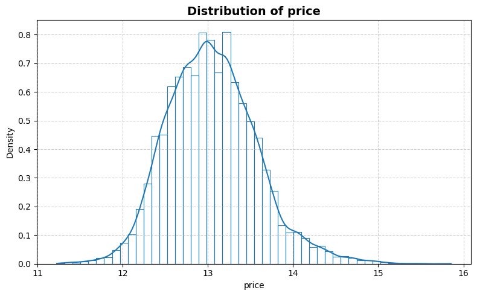
    


```python
statistics_man.plot_box()
```


    
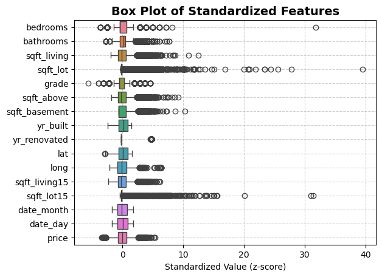
    


```python
statistics_man.print_stat_sum()
```

    Number of samples : 21613
    Number of features: 15
    ==============================


<div>
<table border="1" class="dataframe">
  <thead>
    <tr style="text-align: right;">
      <th></th>
      <th>dtype</th>
      <th>missing</th>
      <th>count</th>
      <th>median</th>
      <th>mean</th>
      <th>std</th>
      <th>min</th>
      <th>25%</th>
      <th>50%</th>
      <th>75%</th>
      <th>max</th>
    </tr>
  </thead>
  <tbody>
    <tr>
      <th>bedrooms</th>
      <td>float64</td>
      <td>0</td>
      <td>21613.0</td>
      <td>3.000000</td>
      <td>3.370842</td>
      <td>0.930062</td>
      <td>0.000000</td>
      <td>3.000000</td>
      <td>3.000000</td>
      <td>4.000000</td>
      <td>3.300000e+01</td>
    </tr>
    <tr>
      <th>bathrooms</th>
      <td>float64</td>
      <td>0</td>
      <td>21613.0</td>
      <td>2.250000</td>
      <td>2.114757</td>
      <td>0.770163</td>
      <td>0.000000</td>
      <td>1.750000</td>
      <td>2.250000</td>
      <td>2.500000</td>
      <td>8.000000e+00</td>
    </tr>
    <tr>
      <th>sqft_living</th>
      <td>float64</td>
      <td>0</td>
      <td>21613.0</td>
      <td>1910.000000</td>
      <td>2079.899736</td>
      <td>918.440897</td>
      <td>290.000000</td>
      <td>1427.000000</td>
      <td>1910.000000</td>
      <td>2550.000000</td>
      <td>1.354000e+04</td>
    </tr>
    <tr>
      <th>sqft_lot</th>
      <td>float64</td>
      <td>0</td>
      <td>21613.0</td>
      <td>7618.000000</td>
      <td>15106.967566</td>
      <td>41420.511515</td>
      <td>520.000000</td>
      <td>5040.000000</td>
      <td>7618.000000</td>
      <td>10688.000000</td>
      <td>1.651359e+06</td>
    </tr>
    <tr>
      <th>grade</th>
      <td>float64</td>
      <td>0</td>
      <td>21613.0</td>
      <td>7.000000</td>
      <td>7.656873</td>
      <td>1.175459</td>
      <td>1.000000</td>
      <td>7.000000</td>
      <td>7.000000</td>
      <td>8.000000</td>
      <td>1.300000e+01</td>
    </tr>
    <tr>
      <th>sqft_above</th>
      <td>float64</td>
      <td>0</td>
      <td>21613.0</td>
      <td>1560.000000</td>
      <td>1788.390691</td>
      <td>828.090978</td>
      <td>290.000000</td>
      <td>1190.000000</td>
      <td>1560.000000</td>
      <td>2210.000000</td>
      <td>9.410000e+03</td>
    </tr>
    <tr>
      <th>sqft_basement</th>
      <td>float64</td>
      <td>0</td>
      <td>21613.0</td>
      <td>0.000000</td>
      <td>291.509045</td>
      <td>442.575043</td>
      <td>0.000000</td>
      <td>0.000000</td>
      <td>0.000000</td>
      <td>560.000000</td>
      <td>4.820000e+03</td>
    </tr>
    <tr>
      <th>yr_built</th>
      <td>float64</td>
      <td>0</td>
      <td>21613.0</td>
      <td>1975.000000</td>
      <td>1971.005136</td>
      <td>29.373411</td>
      <td>1900.000000</td>
      <td>1951.000000</td>
      <td>1975.000000</td>
      <td>1997.000000</td>
      <td>2.015000e+03</td>
    </tr>
    <tr>
      <th>yr_renovated</th>
      <td>float64</td>
      <td>0</td>
      <td>21613.0</td>
      <td>0.000000</td>
      <td>84.402258</td>
      <td>401.679240</td>
      <td>0.000000</td>
      <td>0.000000</td>
      <td>0.000000</td>
      <td>0.000000</td>
      <td>2.015000e+03</td>
    </tr>
    <tr>
      <th>lat</th>
      <td>float64</td>
      <td>0</td>
      <td>21613.0</td>
      <td>47.571800</td>
      <td>47.560053</td>
      <td>0.138564</td>
      <td>47.155900</td>
      <td>47.471000</td>
      <td>47.571800</td>
      <td>47.678000</td>
      <td>4.777760e+01</td>
    </tr>
    <tr>
      <th>long</th>
      <td>float64</td>
      <td>0</td>
      <td>21613.0</td>
      <td>-122.230000</td>
      <td>-122.213896</td>
      <td>0.140828</td>
      <td>-122.519000</td>
      <td>-122.328000</td>
      <td>-122.230000</td>
      <td>-122.125000</td>
      <td>-1.213150e+02</td>
    </tr>
    <tr>
      <th>sqft_living15</th>
      <td>float64</td>
      <td>0</td>
      <td>21613.0</td>
      <td>1840.000000</td>
      <td>1986.552492</td>
      <td>685.391304</td>
      <td>399.000000</td>
      <td>1490.000000</td>
      <td>1840.000000</td>
      <td>2360.000000</td>
      <td>6.210000e+03</td>
    </tr>
    <tr>
      <th>sqft_lot15</th>
      <td>float64</td>
      <td>0</td>
      <td>21613.0</td>
      <td>7620.000000</td>
      <td>12768.455652</td>
      <td>27304.179631</td>
      <td>651.000000</td>
      <td>5100.000000</td>
      <td>7620.000000</td>
      <td>10083.000000</td>
      <td>8.712000e+05</td>
    </tr>
    <tr>
      <th>date_month</th>
      <td>float64</td>
      <td>0</td>
      <td>21613.0</td>
      <td>6.000000</td>
      <td>6.574423</td>
      <td>3.115308</td>
      <td>1.000000</td>
      <td>4.000000</td>
      <td>6.000000</td>
      <td>9.000000</td>
      <td>1.200000e+01</td>
    </tr>
    <tr>
      <th>date_day</th>
      <td>float64</td>
      <td>0</td>
      <td>21613.0</td>
      <td>16.000000</td>
      <td>15.688197</td>
      <td>8.635063</td>
      <td>1.000000</td>
      <td>8.000000</td>
      <td>16.000000</td>
      <td>23.000000</td>
      <td>3.100000e+01</td>
    </tr>
    <tr>
      <th>price</th>
      <td>float64</td>
      <td>0</td>
      <td>21613.0</td>
      <td>13.017005</td>
      <td>13.047819</td>
      <td>0.526683</td>
      <td>11.225257</td>
      <td>12.682155</td>
      <td>13.017005</td>
      <td>13.377007</td>
      <td>1.585673e+01</td>
    </tr>
  </tbody>
</table>
</div>


```python
statistics_man.plot_corr_heatmap()
```


    
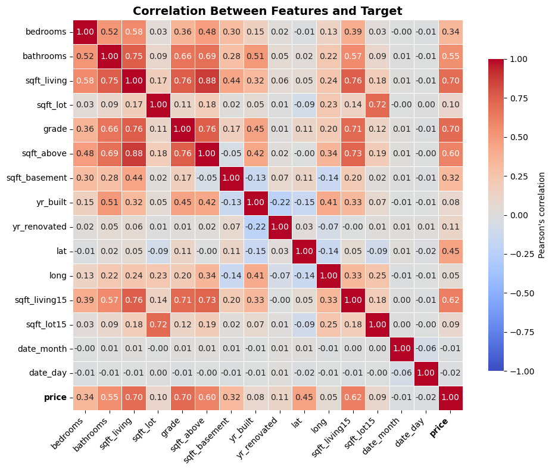
    

