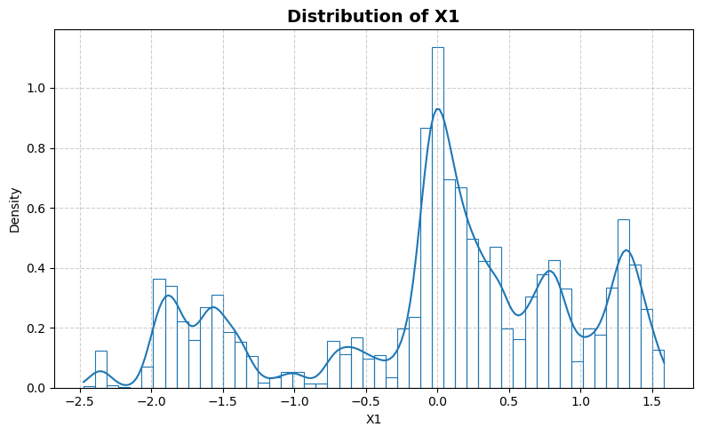
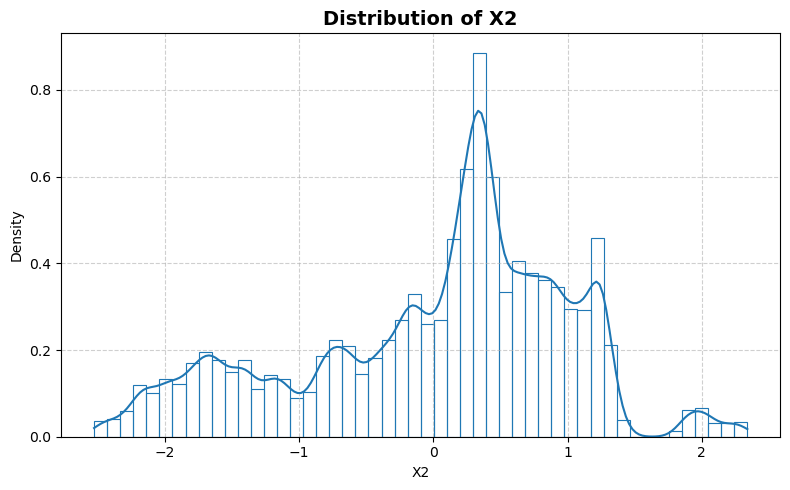
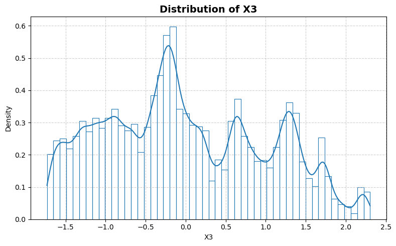
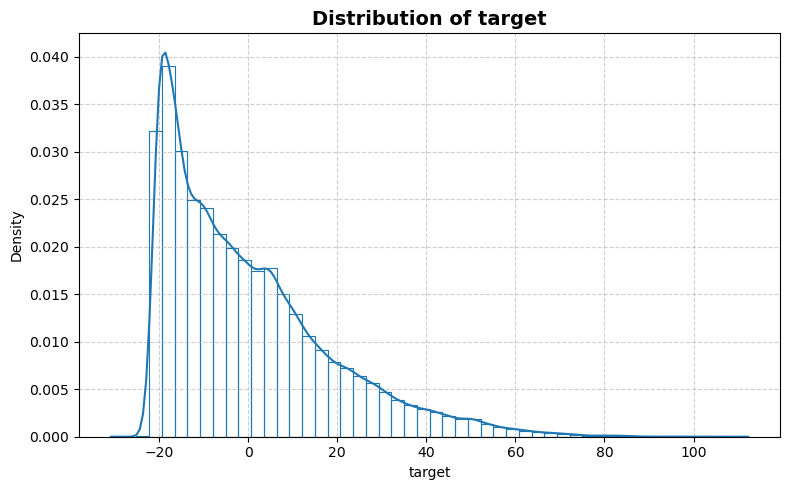
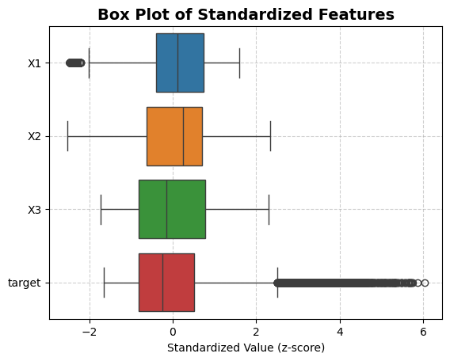

```python
from stat_sum_func import ToParquet, DatasetStatistics
```


```python
file = "houseelectric"
path = f"raw/{file}/{file}.parquet"
statistics_man = DatasetStatistics(path)
statistics_man.df
```


<div>
<table border="1" class="dataframe">
  <thead>
    <tr style="text-align: right;">
      <th></th>
      <th>X1</th>
      <th>X2</th>
      <th>X3</th>
      <th>target</th>
    </tr>
  </thead>
  <tbody>
    <tr>
      <th>0</th>
      <td>1.281000</td>
      <td>0.92971</td>
      <td>0.71251</td>
      <td>2.0305</td>
    </tr>
    <tr>
      <th>1</th>
      <td>1.256600</td>
      <td>0.46466</td>
      <td>0.30651</td>
      <td>-7.4101</td>
    </tr>
    <tr>
      <th>2</th>
      <td>-1.406100</td>
      <td>1.24010</td>
      <td>1.25910</td>
      <td>-6.2772</td>
    </tr>
    <tr>
      <th>3</th>
      <td>1.398600</td>
      <td>0.42940</td>
      <td>-1.51610</td>
      <td>75.3230</td>
    </tr>
    <tr>
      <th>4</th>
      <td>0.795180</td>
      <td>-0.84711</td>
      <td>-0.14732</td>
      <td>-20.0210</td>
    </tr>
    <tr>
      <th>...</th>
      <td>...</td>
      <td>...</td>
      <td>...</td>
      <td>...</td>
    </tr>
    <tr>
      <th>434868</th>
      <td>1.565700</td>
      <td>-2.15610</td>
      <td>-0.58176</td>
      <td>-5.6264</td>
    </tr>
    <tr>
      <th>434869</th>
      <td>0.091598</td>
      <td>1.02420</td>
      <td>1.02790</td>
      <td>45.7430</td>
    </tr>
    <tr>
      <th>434870</th>
      <td>-1.610600</td>
      <td>-0.24423</td>
      <td>0.54517</td>
      <td>-13.4930</td>
    </tr>
    <tr>
      <th>434871</th>
      <td>-0.072314</td>
      <td>0.22385</td>
      <td>-1.07350</td>
      <td>50.6210</td>
    </tr>
    <tr>
      <th>434872</th>
      <td>0.107320</td>
      <td>-0.55841</td>
      <td>-1.43570</td>
      <td>8.0552</td>
    </tr>
  </tbody>
</table>
<p>434873 rows × 4 columns</p>
</div>


```python
for feature in statistics_man.df.columns:
    statistics_man.plot_distribution(feature)
```


    

    


    

    


    

    


    

    


```python
statistics_man.plot_box()
```


    

    


```python
statistics_man.print_stat_sum()
```

    Number of samples : 434873
    Number of features: 3
    ==============================


<div>
<table border="1" class="dataframe">
  <thead>
    <tr style="text-align: right;">
      <th></th>
      <th>dtype</th>
      <th>missing</th>
      <th>count</th>
      <th>median</th>
      <th>mean</th>
      <th>std</th>
      <th>min</th>
      <th>25%</th>
      <th>50%</th>
      <th>75%</th>
      <th>max</th>
    </tr>
  </thead>
  <tbody>
    <tr>
      <th>X1</th>
      <td>float64</td>
      <td>0</td>
      <td>434873.0</td>
      <td>0.10886</td>
      <td>2.276524e-07</td>
      <td>1.000000</td>
      <td>-2.4737</td>
      <td>-0.40239</td>
      <td>0.10886</td>
      <td>0.74392</td>
      <td>1.5859</td>
    </tr>
    <tr>
      <th>X2</th>
      <td>float64</td>
      <td>0</td>
      <td>434873.0</td>
      <td>0.24765</td>
      <td>4.080676e-06</td>
      <td>0.999997</td>
      <td>-2.5276</td>
      <td>-0.62834</td>
      <td>0.24765</td>
      <td>0.70221</td>
      <td>2.3392</td>
    </tr>
    <tr>
      <th>X3</th>
      <td>float64</td>
      <td>0</td>
      <td>434873.0</td>
      <td>-0.14253</td>
      <td>1.639568e-06</td>
      <td>1.000001</td>
      <td>-1.7316</td>
      <td>-0.82116</td>
      <td>-0.14253</td>
      <td>0.77695</td>
      <td>2.3033</td>
    </tr>
    <tr>
      <th>target</th>
      <td>float64</td>
      <td>0</td>
      <td>434873.0</td>
      <td>-4.61070</td>
      <td>3.374143e-05</td>
      <td>18.617997</td>
      <td>-30.7940</td>
      <td>-15.15700</td>
      <td>-4.61070</td>
      <td>9.62490</td>
      <td>112.2600</td>
    </tr>
  </tbody>
</table>
</div>


```python
statistics_man.plot_corr_heatmap()
```


    

    

