```python
from stat_sum_func import ToParquet, DatasetStatistics
```


```python
file = "keggdirected"
path = f"raw/{file}/{file}.parquet"
statistics_man = DatasetStatistics(path)
statistics_man.df
```


<div>
<table border="1" class="dataframe">
  <thead>
    <tr style="text-align: right;">
      <th></th>
      <th>X1</th>
      <th>X2</th>
      <th>X3</th>
      <th>X4</th>
      <th>X5</th>
      <th>X6</th>
      <th>X7</th>
      <th>X8</th>
      <th>X9</th>
      <th>X10</th>
      <th>...</th>
      <th>X12</th>
      <th>X13</th>
      <th>X14</th>
      <th>X15</th>
      <th>X16</th>
      <th>X17</th>
      <th>X18</th>
      <th>X19</th>
      <th>X20</th>
      <th>Target</th>
    </tr>
  </thead>
  <tbody>
    <tr>
      <th>0</th>
      <td>-6.0262</td>
      <td>1.1637</td>
      <td>-0.85098</td>
      <td>-0.00043</td>
      <td>-50.3050</td>
      <td>-0.320010</td>
      <td>-0.942780</td>
      <td>-0.00002</td>
      <td>-0.74901</td>
      <td>-1.43260</td>
      <td>...</td>
      <td>-4.7459</td>
      <td>-0.062806</td>
      <td>-1.007500</td>
      <td>0.000727</td>
      <td>-0.503750</td>
      <td>-0.406060</td>
      <td>-0.003941</td>
      <td>-0.233740</td>
      <td>0.021141</td>
      <td>-0.591450</td>
    </tr>
    <tr>
      <th>1</th>
      <td>-7.0262</td>
      <td>0.1637</td>
      <td>-1.85100</td>
      <td>-0.00043</td>
      <td>-50.3050</td>
      <td>-0.462860</td>
      <td>-0.442780</td>
      <td>-0.00002</td>
      <td>-0.74901</td>
      <td>-0.90280</td>
      <td>...</td>
      <td>-4.8709</td>
      <td>-0.062806</td>
      <td>-0.507500</td>
      <td>-0.020107</td>
      <td>-0.253750</td>
      <td>-0.459640</td>
      <td>0.098738</td>
      <td>-0.203980</td>
      <td>0.065784</td>
      <td>-0.437300</td>
    </tr>
    <tr>
      <th>2</th>
      <td>-5.0262</td>
      <td>-0.8363</td>
      <td>0.14902</td>
      <td>-0.00043</td>
      <td>-39.3050</td>
      <td>0.092691</td>
      <td>0.001662</td>
      <td>-0.00002</td>
      <td>0.25099</td>
      <td>-0.38163</td>
      <td>...</td>
      <td>-3.7598</td>
      <td>0.159420</td>
      <td>0.159160</td>
      <td>-0.000265</td>
      <td>0.079582</td>
      <td>-0.031065</td>
      <td>0.081542</td>
      <td>0.130150</td>
      <td>-0.004322</td>
      <td>0.101690</td>
    </tr>
    <tr>
      <th>3</th>
      <td>4.9738</td>
      <td>0.1637</td>
      <td>0.14902</td>
      <td>-0.00043</td>
      <td>-4.3046</td>
      <td>0.103170</td>
      <td>0.609850</td>
      <td>-0.00002</td>
      <td>0.25099</td>
      <td>0.69206</td>
      <td>...</td>
      <td>-3.2920</td>
      <td>0.042457</td>
      <td>0.650390</td>
      <td>0.011951</td>
      <td>0.325200</td>
      <td>0.284720</td>
      <td>0.100410</td>
      <td>0.257620</td>
      <td>0.129570</td>
      <td>1.018000</td>
    </tr>
    <tr>
      <th>4</th>
      <td>-6.0262</td>
      <td>-0.8363</td>
      <td>-0.85098</td>
      <td>-0.00043</td>
      <td>-42.3050</td>
      <td>-0.262860</td>
      <td>0.557220</td>
      <td>-0.00002</td>
      <td>-0.74901</td>
      <td>1.15910</td>
      <td>...</td>
      <td>-4.2459</td>
      <td>-0.062806</td>
      <td>0.492500</td>
      <td>-0.011178</td>
      <td>0.246250</td>
      <td>-0.406060</td>
      <td>-0.146300</td>
      <td>-0.339690</td>
      <td>0.194060</td>
      <td>0.101690</td>
    </tr>
    <tr>
      <th>...</th>
      <td>...</td>
      <td>...</td>
      <td>...</td>
      <td>...</td>
      <td>...</td>
      <td>...</td>
      <td>...</td>
      <td>...</td>
      <td>...</td>
      <td>...</td>
      <td>...</td>
      <td>...</td>
      <td>...</td>
      <td>...</td>
      <td>...</td>
      <td>...</td>
      <td>...</td>
      <td>...</td>
      <td>...</td>
      <td>...</td>
      <td>...</td>
    </tr>
    <tr>
      <th>48822</th>
      <td>-3.0262</td>
      <td>1.1637</td>
      <td>-0.85098</td>
      <td>-0.00043</td>
      <td>-43.3050</td>
      <td>-0.248580</td>
      <td>-0.442780</td>
      <td>-0.00002</td>
      <td>-0.74901</td>
      <td>-0.61059</td>
      <td>...</td>
      <td>-4.5982</td>
      <td>-0.062806</td>
      <td>-0.507500</td>
      <td>-0.006470</td>
      <td>-0.253750</td>
      <td>-0.212880</td>
      <td>0.004582</td>
      <td>-0.136010</td>
      <td>0.011671</td>
      <td>0.014682</td>
    </tr>
    <tr>
      <th>48823</th>
      <td>2.9738</td>
      <td>0.1637</td>
      <td>1.14900</td>
      <td>-0.00043</td>
      <td>-8.3046</td>
      <td>0.047340</td>
      <td>0.733690</td>
      <td>-0.00002</td>
      <td>3.25100</td>
      <td>0.61149</td>
      <td>...</td>
      <td>-2.9297</td>
      <td>0.407780</td>
      <td>1.139600</td>
      <td>-0.012026</td>
      <td>0.569780</td>
      <td>0.674820</td>
      <td>0.139350</td>
      <td>0.414930</td>
      <td>0.166900</td>
      <td>1.172100</td>
    </tr>
    <tr>
      <th>48824</th>
      <td>-1.0262</td>
      <td>0.1637</td>
      <td>0.14902</td>
      <td>-0.00043</td>
      <td>-30.3050</td>
      <td>0.018617</td>
      <td>0.018756</td>
      <td>-0.00002</td>
      <td>-0.74901</td>
      <td>-0.19474</td>
      <td>...</td>
      <td>-3.8709</td>
      <td>-0.062806</td>
      <td>-0.045965</td>
      <td>0.020644</td>
      <td>-0.022983</td>
      <td>0.045858</td>
      <td>-0.058588</td>
      <td>-0.043719</td>
      <td>-0.027257</td>
      <td>0.389380</td>
    </tr>
    <tr>
      <th>48825</th>
      <td>-4.0262</td>
      <td>1.1637</td>
      <td>-1.85100</td>
      <td>-0.00043</td>
      <td>-50.3050</td>
      <td>-0.462860</td>
      <td>-1.042800</td>
      <td>-0.00002</td>
      <td>-0.74901</td>
      <td>-0.74089</td>
      <td>...</td>
      <td>-4.8709</td>
      <td>-0.062806</td>
      <td>-1.107500</td>
      <td>-0.020107</td>
      <td>-0.553750</td>
      <td>-0.631060</td>
      <td>-0.072691</td>
      <td>-0.375400</td>
      <td>-0.124690</td>
      <td>-0.437300</td>
    </tr>
    <tr>
      <th>48826</th>
      <td>-2.0262</td>
      <td>0.1637</td>
      <td>0.14902</td>
      <td>-0.00043</td>
      <td>-30.3050</td>
      <td>-0.129530</td>
      <td>0.723880</td>
      <td>-0.00002</td>
      <td>0.25099</td>
      <td>0.55494</td>
      <td>...</td>
      <td>-4.1209</td>
      <td>0.103860</td>
      <td>0.825830</td>
      <td>-0.009690</td>
      <td>0.412910</td>
      <td>0.218940</td>
      <td>0.140740</td>
      <td>0.192850</td>
      <td>0.121140</td>
      <td>0.612520</td>
    </tr>
  </tbody>
</table>
<p>48827 rows × 21 columns</p>
</div>


```python
for feature in statistics_man.df.columns:
    statistics_man.plot_distribution(feature)
```


    
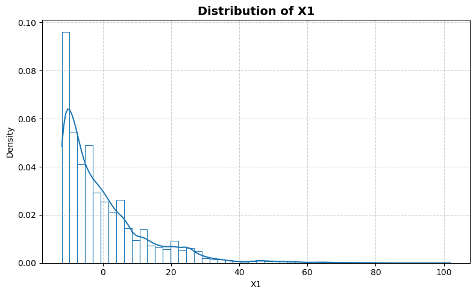
    


    
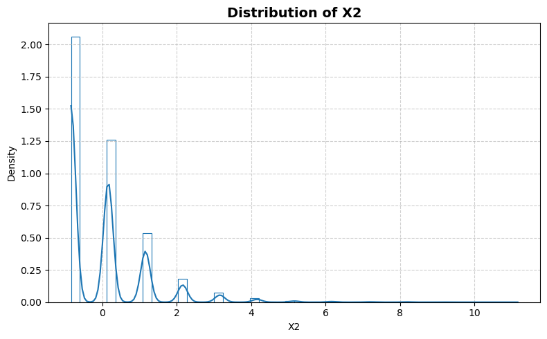
    


    

    


    
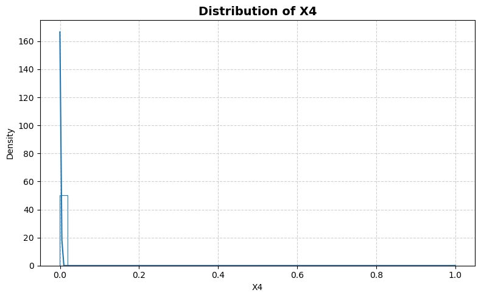
    


    
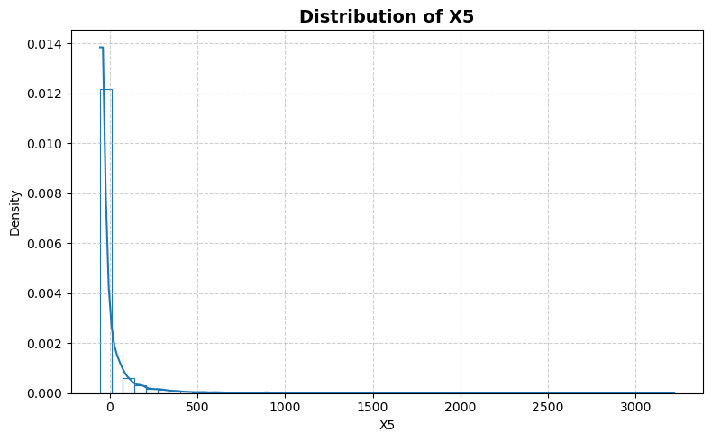
    


    
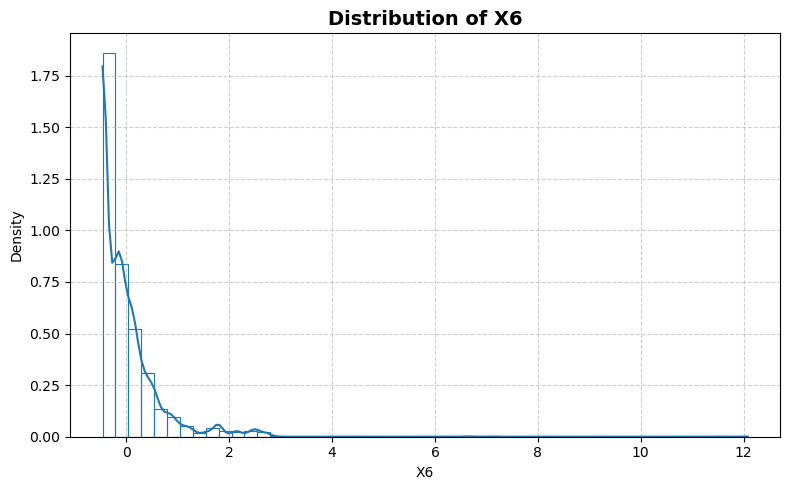
    


    
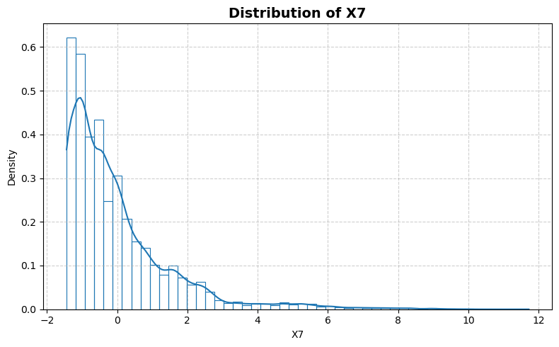
    


    
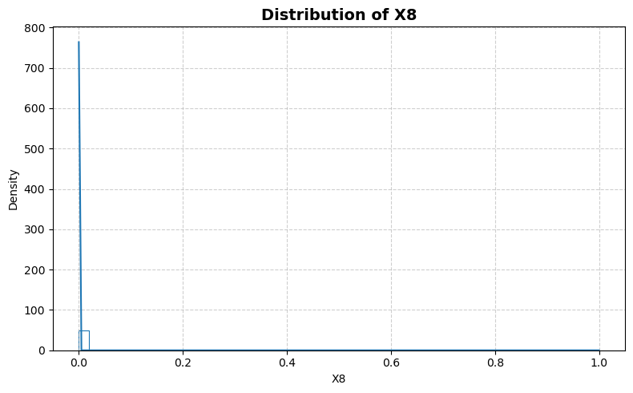
    


    
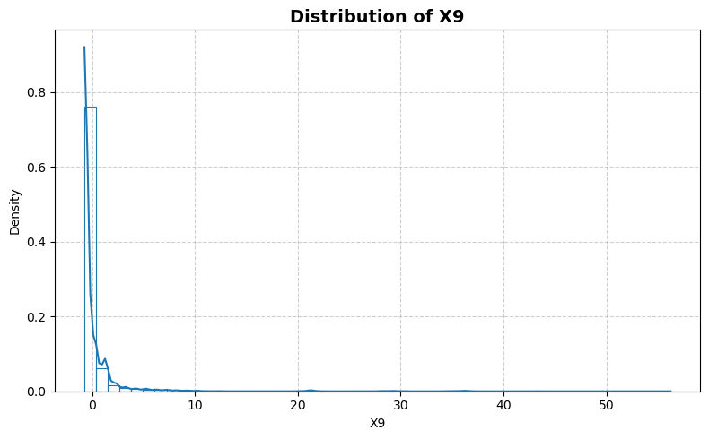
    


    
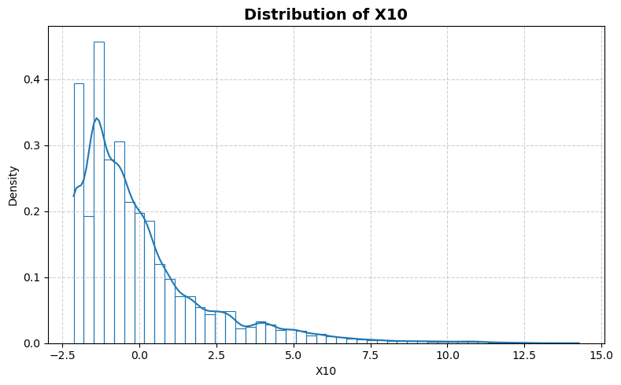
    


    
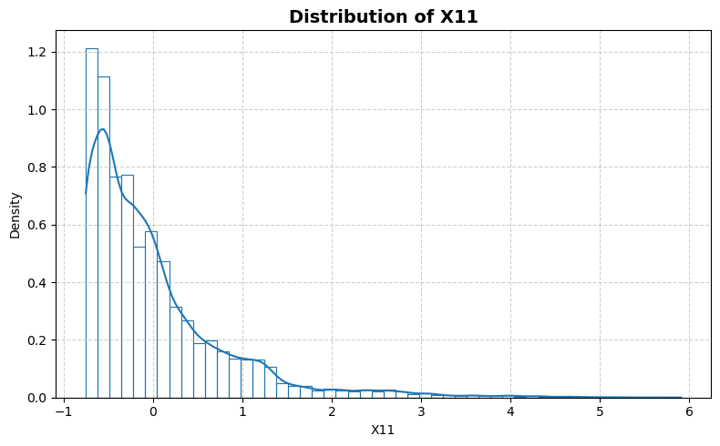
    


    
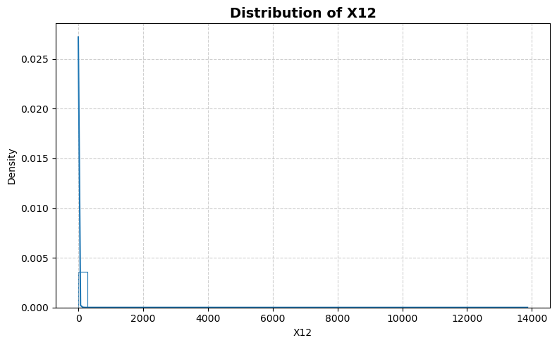
    


    
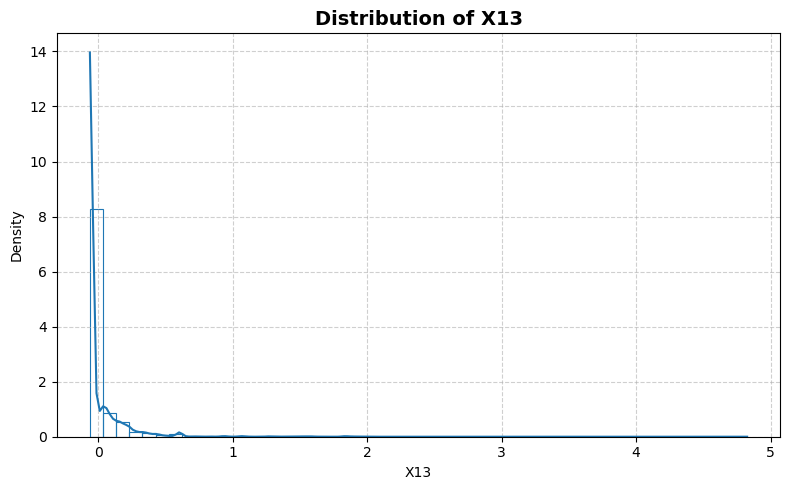
    


    

    


    
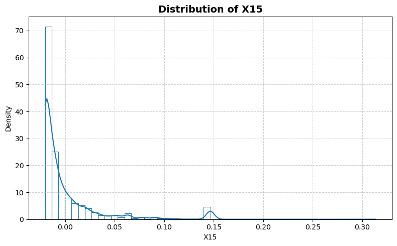
    


    
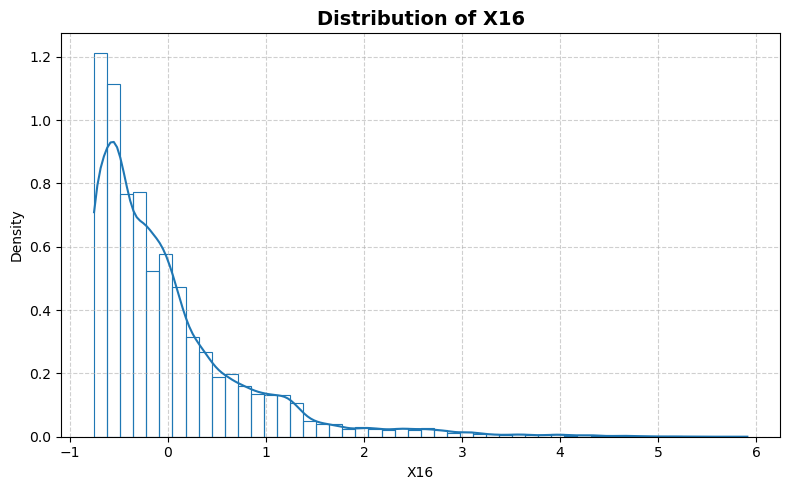
    


    
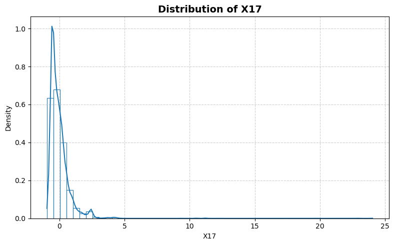
    


    
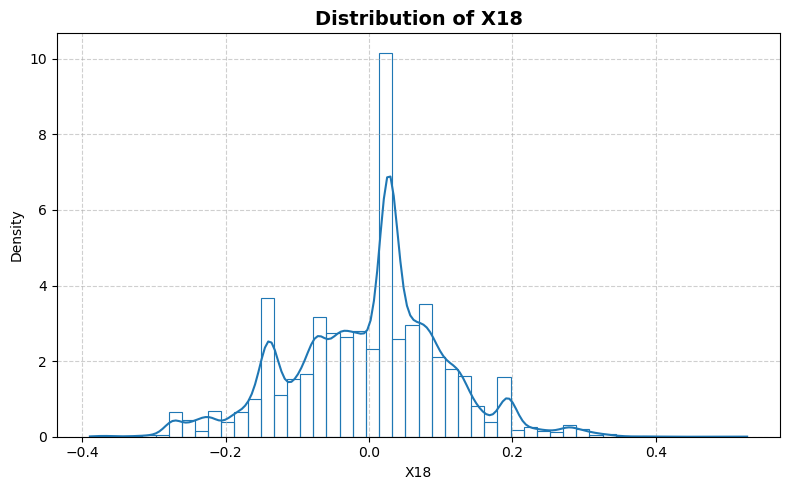
    


    
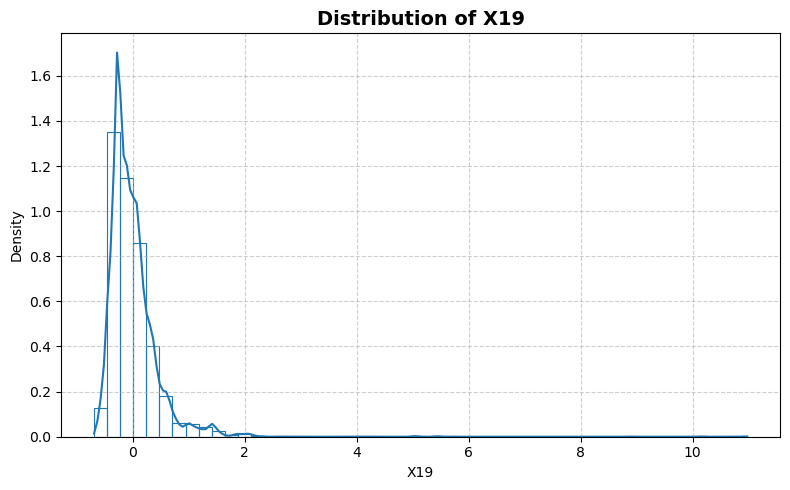
    


    
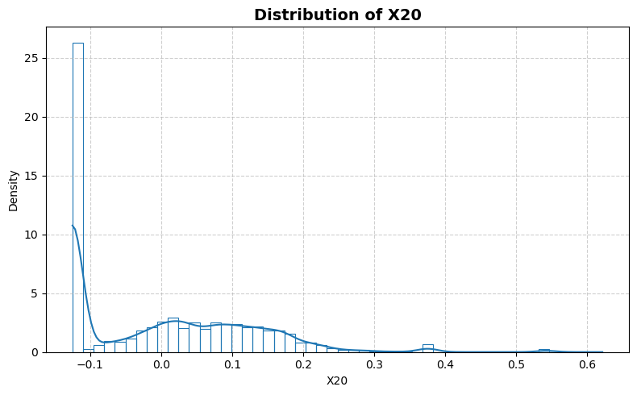
    


    
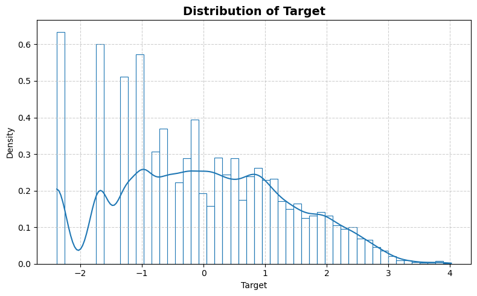
    


```python
statistics_man.plot_box()
```


    
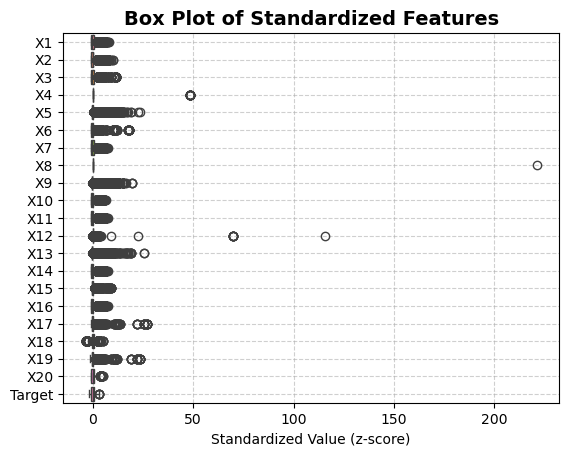
    


```python
statistics_man.print_stat_sum()
```

    Number of samples : 48827
    Number of features: 20
    ==============================


<div>
<table border="1" class="dataframe">
  <thead>
    <tr style="text-align: right;">
      <th></th>
      <th>dtype</th>
      <th>missing</th>
      <th>count</th>
      <th>median</th>
      <th>mean</th>
      <th>std</th>
      <th>min</th>
      <th>25%</th>
      <th>50%</th>
      <th>75%</th>
      <th>max</th>
    </tr>
  </thead>
  <tbody>
    <tr>
      <th>X1</th>
      <td>float64</td>
      <td>0</td>
      <td>48827.0</td>
      <td>-4.026200</td>
      <td>9.054560e-05</td>
      <td>12.699699</td>
      <td>-12.026000</td>
      <td>-9.026200</td>
      <td>-4.026200</td>
      <td>4.973800</td>
      <td>101.97000</td>
    </tr>
    <tr>
      <th>X2</th>
      <td>float64</td>
      <td>0</td>
      <td>48827.0</td>
      <td>0.163700</td>
      <td>-3.870809e-07</td>
      <td>1.123407</td>
      <td>-0.836300</td>
      <td>-0.836300</td>
      <td>0.163700</td>
      <td>0.163700</td>
      <td>11.16400</td>
    </tr>
    <tr>
      <th>X3</th>
      <td>float64</td>
      <td>0</td>
      <td>48827.0</td>
      <td>-0.850980</td>
      <td>-7.544596e-06</td>
      <td>2.306668</td>
      <td>-1.851000</td>
      <td>-1.851000</td>
      <td>-0.850980</td>
      <td>1.149000</td>
      <td>27.14900</td>
    </tr>
    <tr>
      <th>X4</th>
      <td>float64</td>
      <td>0</td>
      <td>48827.0</td>
      <td>-0.000430</td>
      <td>-5.202040e-11</td>
      <td>0.020734</td>
      <td>-0.000430</td>
      <td>-0.000430</td>
      <td>-0.000430</td>
      <td>-0.000430</td>
      <td>0.99957</td>
    </tr>
    <tr>
      <th>X5</th>
      <td>float64</td>
      <td>0</td>
      <td>48827.0</td>
      <td>-43.305000</td>
      <td>6.285375e-05</td>
      <td>136.554285</td>
      <td>-56.305000</td>
      <td>-53.305000</td>
      <td>-43.305000</td>
      <td>-6.304600</td>
      <td>3219.70000</td>
    </tr>
    <tr>
      <th>X6</th>
      <td>float64</td>
      <td>0</td>
      <td>48827.0</td>
      <td>-0.166950</td>
      <td>1.467134e-06</td>
      <td>0.664573</td>
      <td>-0.462860</td>
      <td>-0.462860</td>
      <td>-0.166950</td>
      <td>0.152520</td>
      <td>12.08100</td>
    </tr>
    <tr>
      <th>X7</th>
      <td>float64</td>
      <td>0</td>
      <td>48827.0</td>
      <td>-0.442780</td>
      <td>1.787687e-06</td>
      <td>1.540676</td>
      <td>-1.442800</td>
      <td>-1.109400</td>
      <td>-0.442780</td>
      <td>0.490550</td>
      <td>11.72100</td>
    </tr>
    <tr>
      <th>X8</th>
      <td>float64</td>
      <td>0</td>
      <td>48827.0</td>
      <td>-0.000020</td>
      <td>4.817007e-10</td>
      <td>0.004526</td>
      <td>-0.000020</td>
      <td>-0.000020</td>
      <td>-0.000020</td>
      <td>-0.000020</td>
      <td>0.99998</td>
    </tr>
    <tr>
      <th>X9</th>
      <td>float64</td>
      <td>0</td>
      <td>48827.0</td>
      <td>-0.749010</td>
      <td>3.141704e-06</td>
      <td>2.855609</td>
      <td>-0.749010</td>
      <td>-0.749010</td>
      <td>-0.749010</td>
      <td>-0.749010</td>
      <td>56.25100</td>
    </tr>
    <tr>
      <th>X10</th>
      <td>float64</td>
      <td>0</td>
      <td>48827.0</td>
      <td>-0.625740</td>
      <td>-4.423651e-07</td>
      <td>2.157226</td>
      <td>-2.140900</td>
      <td>-1.474200</td>
      <td>-0.625740</td>
      <td>0.670275</td>
      <td>14.26900</td>
    </tr>
    <tr>
      <th>X11</th>
      <td>float64</td>
      <td>0</td>
      <td>48827.0</td>
      <td>-0.253750</td>
      <td>-6.463719e-07</td>
      <td>0.801097</td>
      <td>-0.753750</td>
      <td>-0.587090</td>
      <td>-0.253750</td>
      <td>0.246250</td>
      <td>5.91020</td>
    </tr>
    <tr>
      <th>X12</th>
      <td>float64</td>
      <td>0</td>
      <td>48827.0</td>
      <td>-4.370900</td>
      <td>1.554027e-05</td>
      <td>119.794431</td>
      <td>-4.870900</td>
      <td>-4.870900</td>
      <td>-4.370900</td>
      <td>-2.912600</td>
      <td>13866.00000</td>
    </tr>
    <tr>
      <th>X13</th>
      <td>float64</td>
      <td>0</td>
      <td>48827.0</td>
      <td>-0.062806</td>
      <td>3.481350e-07</td>
      <td>0.188186</td>
      <td>-0.062806</td>
      <td>-0.062806</td>
      <td>-0.062806</td>
      <td>-0.062806</td>
      <td>4.82610</td>
    </tr>
    <tr>
      <th>X14</th>
      <td>float64</td>
      <td>0</td>
      <td>48827.0</td>
      <td>-0.507500</td>
      <td>-2.757532e-07</td>
      <td>1.602199</td>
      <td>-1.507500</td>
      <td>-1.174200</td>
      <td>-0.507500</td>
      <td>0.492500</td>
      <td>11.82000</td>
    </tr>
    <tr>
      <th>X15</th>
      <td>float64</td>
      <td>0</td>
      <td>48827.0</td>
      <td>-0.012754</td>
      <td>-1.431648e-07</td>
      <td>0.034920</td>
      <td>-0.020107</td>
      <td>-0.020107</td>
      <td>-0.012754</td>
      <td>0.002621</td>
      <td>0.31323</td>
    </tr>
    <tr>
      <th>X16</th>
      <td>float64</td>
      <td>0</td>
      <td>48827.0</td>
      <td>-0.253750</td>
      <td>-6.463719e-07</td>
      <td>0.801097</td>
      <td>-0.753750</td>
      <td>-0.587090</td>
      <td>-0.253750</td>
      <td>0.246250</td>
      <td>5.91020</td>
    </tr>
    <tr>
      <th>X17</th>
      <td>float64</td>
      <td>0</td>
      <td>48827.0</td>
      <td>-0.206060</td>
      <td>1.184793e-06</td>
      <td>0.898134</td>
      <td>-0.947730</td>
      <td>-0.531060</td>
      <td>-0.206060</td>
      <td>0.225715</td>
      <td>24.03900</td>
    </tr>
    <tr>
      <th>X18</th>
      <td>float64</td>
      <td>0</td>
      <td>48827.0</td>
      <td>0.025226</td>
      <td>-3.277188e-08</td>
      <td>0.108240</td>
      <td>-0.389360</td>
      <td>-0.072691</td>
      <td>0.025226</td>
      <td>0.064456</td>
      <td>0.52731</td>
    </tr>
    <tr>
      <th>X19</th>
      <td>float64</td>
      <td>0</td>
      <td>48827.0</td>
      <td>-0.103130</td>
      <td>1.221491e-06</td>
      <td>0.467005</td>
      <td>-0.692070</td>
      <td>-0.275400</td>
      <td>-0.103130</td>
      <td>0.141260</td>
      <td>10.97900</td>
    </tr>
    <tr>
      <th>X20</th>
      <td>float64</td>
      <td>0</td>
      <td>48827.0</td>
      <td>-0.006359</td>
      <td>9.998504e-07</td>
      <td>0.126589</td>
      <td>-0.124690</td>
      <td>-0.124690</td>
      <td>-0.006359</td>
      <td>0.095149</td>
      <td>0.62134</td>
    </tr>
    <tr>
      <th>Target</th>
      <td>float64</td>
      <td>0</td>
      <td>48827.0</td>
      <td>0.014682</td>
      <td>-1.952772e-06</td>
      <td>1.375639</td>
      <td>-2.383200</td>
      <td>-0.996920</td>
      <td>0.014682</td>
      <td>0.984080</td>
      <td>4.02370</td>
    </tr>
  </tbody>
</table>
</div>


```python
statistics_man.plot_corr_heatmap()
```


    
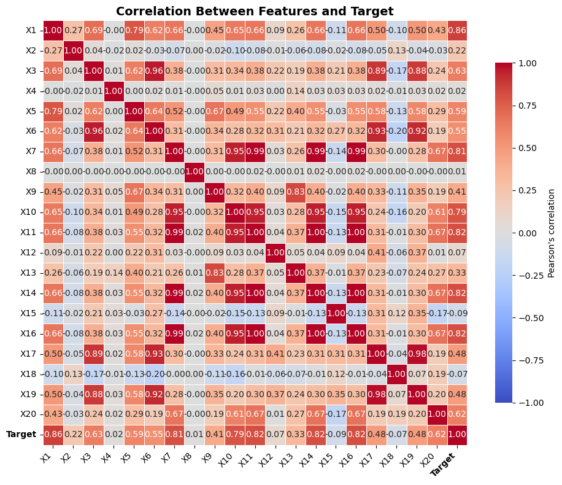
    

