```python
from stat_sum_func import ToParquet, DatasetStatistics
```


```python
file = "kin40k"
path = f"raw/{file}/{file}.parquet"
statistics_man = DatasetStatistics(path)
statistics_man.df
```


<div>
<table border="1" class="dataframe">
  <thead>
    <tr style="text-align: right;">
      <th></th>
      <th>X1</th>
      <th>X2</th>
      <th>X3</th>
      <th>X4</th>
      <th>X5</th>
      <th>X6</th>
      <th>X7</th>
      <th>X8</th>
      <th>Target</th>
    </tr>
  </thead>
  <tbody>
    <tr>
      <th>0</th>
      <td>0.66777</td>
      <td>-0.236390</td>
      <td>-0.152290</td>
      <td>-1.37140</td>
      <td>1.00710</td>
      <td>-0.42573</td>
      <td>-0.912930</td>
      <td>0.832360</td>
      <td>-2.16480</td>
    </tr>
    <tr>
      <th>1</th>
      <td>1.07170</td>
      <td>0.779670</td>
      <td>-1.365700</td>
      <td>-0.95936</td>
      <td>1.58030</td>
      <td>0.53087</td>
      <td>1.196300</td>
      <td>0.607790</td>
      <td>0.25271</td>
    </tr>
    <tr>
      <th>2</th>
      <td>0.95386</td>
      <td>-0.935810</td>
      <td>-0.290640</td>
      <td>-0.49473</td>
      <td>-1.22170</td>
      <td>1.59150</td>
      <td>1.120400</td>
      <td>1.405000</td>
      <td>0.53502</td>
    </tr>
    <tr>
      <th>3</th>
      <td>0.85846</td>
      <td>-1.596900</td>
      <td>-0.432490</td>
      <td>0.48884</td>
      <td>-0.83796</td>
      <td>-1.61330</td>
      <td>1.084600</td>
      <td>0.856000</td>
      <td>1.07290</td>
    </tr>
    <tr>
      <th>4</th>
      <td>-1.33770</td>
      <td>1.284800</td>
      <td>-0.806840</td>
      <td>0.34525</td>
      <td>1.66520</td>
      <td>0.74469</td>
      <td>-0.998410</td>
      <td>0.013187</td>
      <td>1.43290</td>
    </tr>
    <tr>
      <th>...</th>
      <td>...</td>
      <td>...</td>
      <td>...</td>
      <td>...</td>
      <td>...</td>
      <td>...</td>
      <td>...</td>
      <td>...</td>
      <td>...</td>
    </tr>
    <tr>
      <th>39995</th>
      <td>-0.17457</td>
      <td>1.634800</td>
      <td>1.585600</td>
      <td>-1.30180</td>
      <td>0.33781</td>
      <td>0.98134</td>
      <td>1.647900</td>
      <td>-0.478670</td>
      <td>-0.63848</td>
    </tr>
    <tr>
      <th>39996</th>
      <td>-0.81228</td>
      <td>-0.600230</td>
      <td>0.016941</td>
      <td>-1.59990</td>
      <td>-1.14260</td>
      <td>0.62432</td>
      <td>1.322100</td>
      <td>-0.710980</td>
      <td>1.74720</td>
    </tr>
    <tr>
      <th>39997</th>
      <td>0.94034</td>
      <td>-1.077200</td>
      <td>0.891770</td>
      <td>-1.57270</td>
      <td>-1.19280</td>
      <td>0.15781</td>
      <td>1.631400</td>
      <td>0.950360</td>
      <td>0.73449</td>
    </tr>
    <tr>
      <th>39998</th>
      <td>-1.51010</td>
      <td>-0.063367</td>
      <td>0.594400</td>
      <td>-1.65950</td>
      <td>1.46010</td>
      <td>-1.24090</td>
      <td>-0.628240</td>
      <td>-0.024873</td>
      <td>-2.57700</td>
    </tr>
    <tr>
      <th>39999</th>
      <td>-1.63810</td>
      <td>-0.415180</td>
      <td>-0.775310</td>
      <td>-0.47424</td>
      <td>0.69744</td>
      <td>0.23218</td>
      <td>0.030445</td>
      <td>0.681370</td>
      <td>2.00000</td>
    </tr>
  </tbody>
</table>
<p>40000 rows × 9 columns</p>
</div>


```python
for feature in statistics_man.df.columns:
    statistics_man.plot_distribution(feature)
```


    
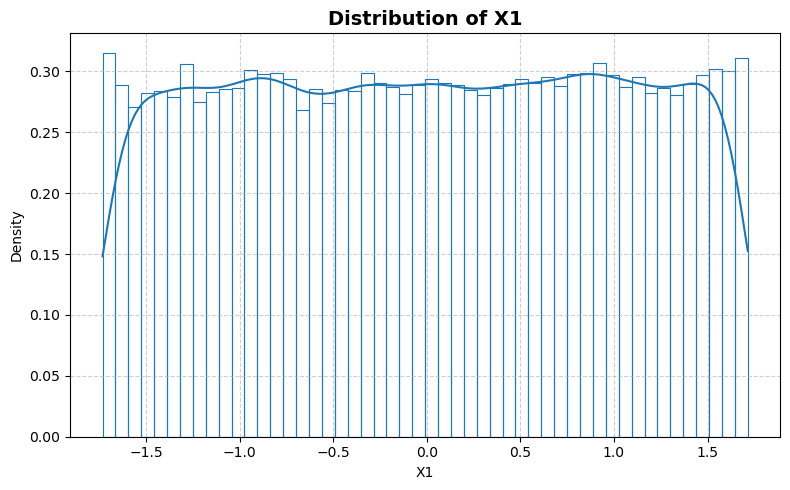
    


    
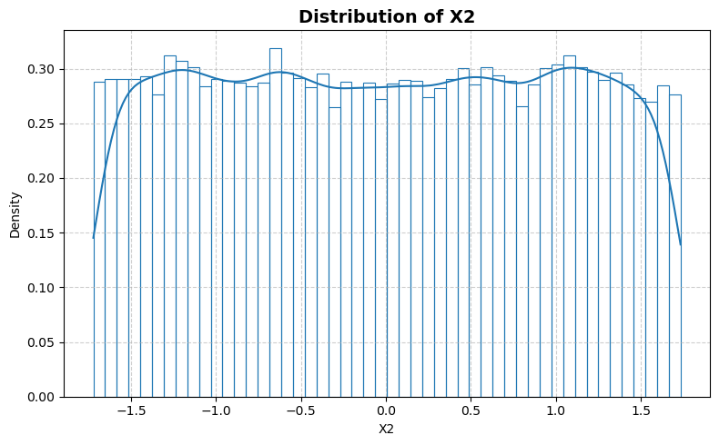
    


    
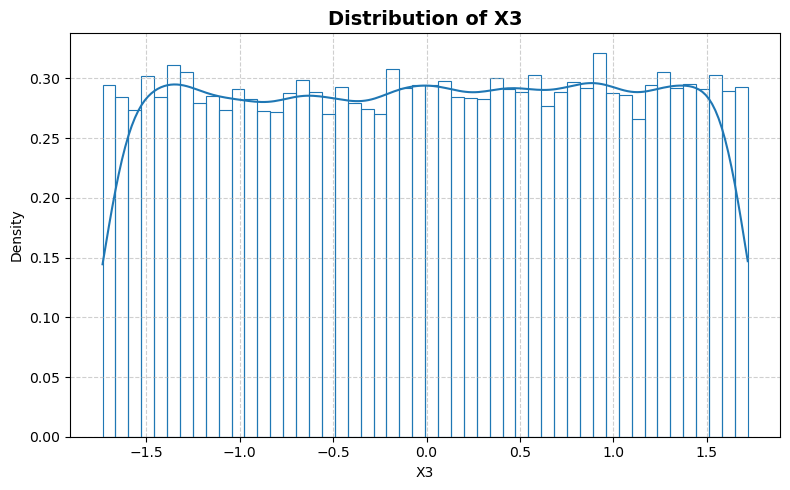
    


    
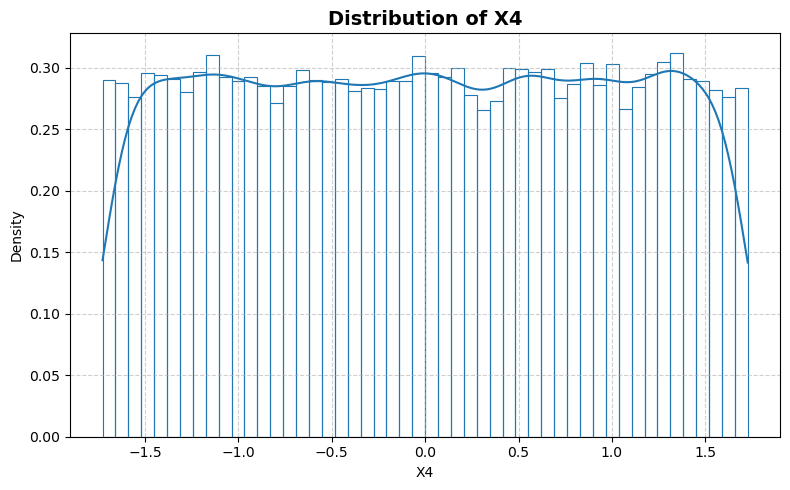
    


    
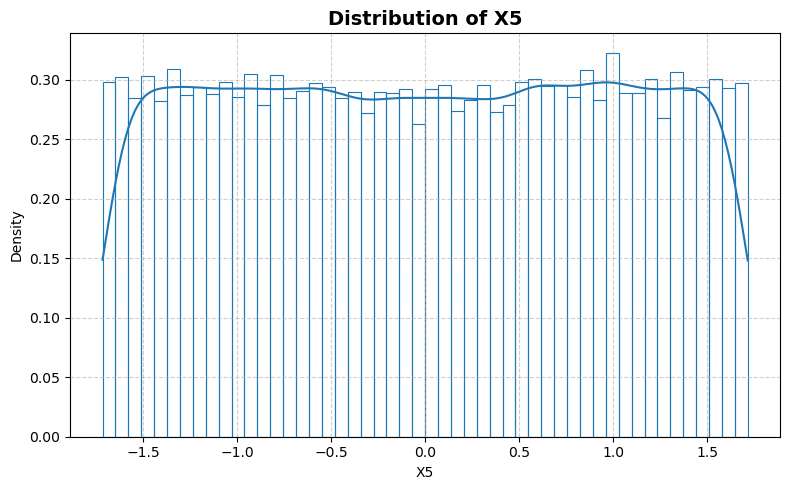
    


    
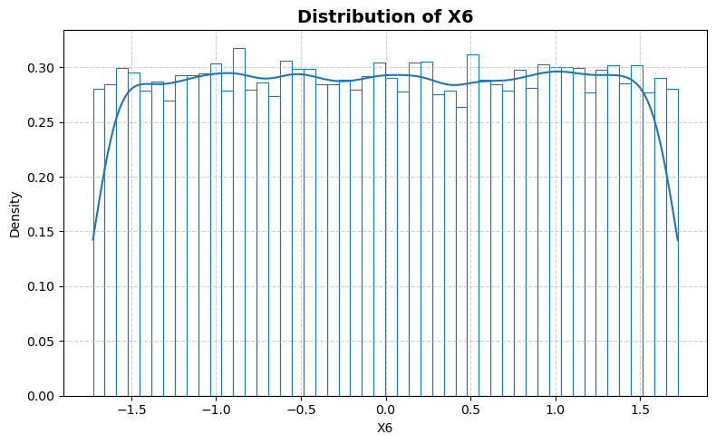
    


    
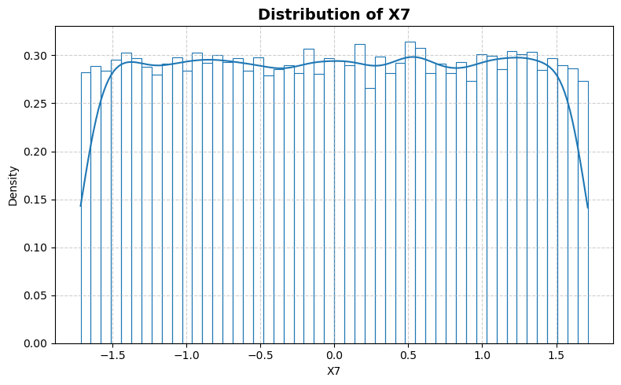
    


    
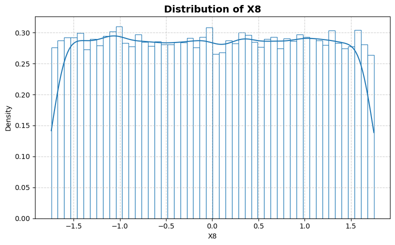
    


    
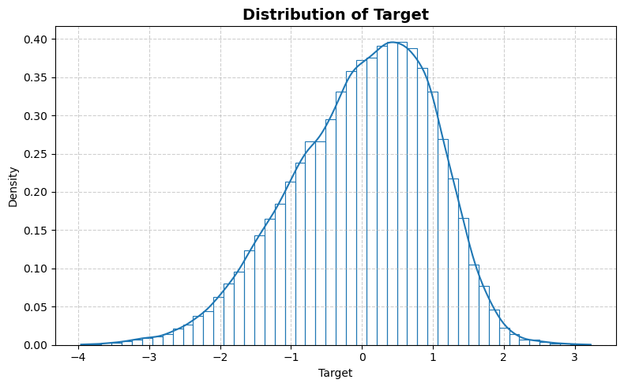
    


```python
statistics_man.plot_box()
```


    
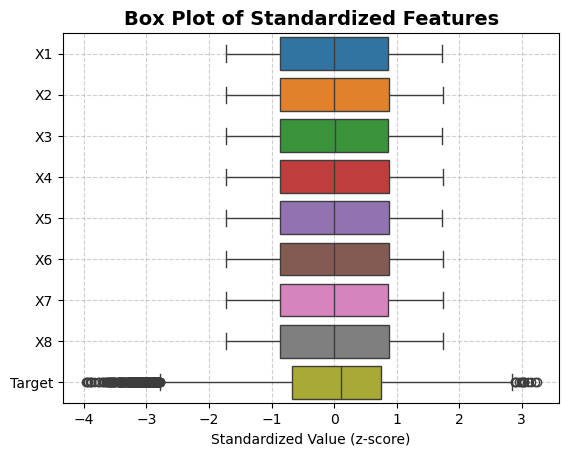
    


```python
statistics_man.print_stat_sum()
```

    Number of samples : 40000
    Number of features: 8
    ==============================


<div>
<table border="1" class="dataframe">
  <thead>
    <tr style="text-align: right;">
      <th></th>
      <th>dtype</th>
      <th>missing</th>
      <th>count</th>
      <th>median</th>
      <th>mean</th>
      <th>std</th>
      <th>min</th>
      <th>25%</th>
      <th>50%</th>
      <th>75%</th>
      <th>max</th>
    </tr>
  </thead>
  <tbody>
    <tr>
      <th>X1</th>
      <td>float64</td>
      <td>0</td>
      <td>40000.0</td>
      <td>0.003687</td>
      <td>-2.814697e-08</td>
      <td>0.998589</td>
      <td>-1.7328</td>
      <td>-0.866830</td>
      <td>0.003687</td>
      <td>0.866965</td>
      <td>1.7150</td>
    </tr>
    <tr>
      <th>X2</th>
      <td>float64</td>
      <td>0</td>
      <td>40000.0</td>
      <td>0.002528</td>
      <td>4.788765e-08</td>
      <td>0.997545</td>
      <td>-1.7218</td>
      <td>-0.868545</td>
      <td>0.002528</td>
      <td>0.871873</td>
      <td>1.7331</td>
    </tr>
    <tr>
      <th>X3</th>
      <td>float64</td>
      <td>0</td>
      <td>40000.0</td>
      <td>0.008090</td>
      <td>1.058767e-07</td>
      <td>0.999635</td>
      <td>-1.7353</td>
      <td>-0.868115</td>
      <td>0.008090</td>
      <td>0.865692</td>
      <td>1.7191</td>
    </tr>
    <tr>
      <th>X4</th>
      <td>float64</td>
      <td>0</td>
      <td>40000.0</td>
      <td>-0.000167</td>
      <td>-1.071675e-10</td>
      <td>0.996861</td>
      <td>-1.7270</td>
      <td>-0.868990</td>
      <td>-0.000167</td>
      <td>0.865835</td>
      <td>1.7267</td>
    </tr>
    <tr>
      <th>X5</th>
      <td>float64</td>
      <td>0</td>
      <td>40000.0</td>
      <td>0.003561</td>
      <td>3.503053e-08</td>
      <td>0.995961</td>
      <td>-1.7173</td>
      <td>-0.867313</td>
      <td>0.003561</td>
      <td>0.867025</td>
      <td>1.7152</td>
    </tr>
    <tr>
      <th>X6</th>
      <td>float64</td>
      <td>0</td>
      <td>40000.0</td>
      <td>-0.002130</td>
      <td>1.737735e-08</td>
      <td>0.994170</td>
      <td>-1.7263</td>
      <td>-0.861887</td>
      <td>-0.002130</td>
      <td>0.867495</td>
      <td>1.7220</td>
    </tr>
    <tr>
      <th>X7</th>
      <td>float64</td>
      <td>0</td>
      <td>40000.0</td>
      <td>0.002602</td>
      <td>-2.676848e-08</td>
      <td>0.988265</td>
      <td>-1.7150</td>
      <td>-0.856070</td>
      <td>0.002602</td>
      <td>0.857447</td>
      <td>1.7136</td>
    </tr>
    <tr>
      <th>X8</th>
      <td>float64</td>
      <td>0</td>
      <td>40000.0</td>
      <td>-0.004480</td>
      <td>-1.230190e-07</td>
      <td>1.006417</td>
      <td>-1.7409</td>
      <td>-0.878117</td>
      <td>-0.004480</td>
      <td>0.874690</td>
      <td>1.7481</td>
    </tr>
    <tr>
      <th>Target</th>
      <td>float64</td>
      <td>0</td>
      <td>40000.0</td>
      <td>0.103995</td>
      <td>8.378772e-08</td>
      <td>0.996977</td>
      <td>-3.9606</td>
      <td>-0.664518</td>
      <td>0.103995</td>
      <td>0.741633</td>
      <td>3.2252</td>
    </tr>
  </tbody>
</table>
</div>


```python
statistics_man.plot_corr_heatmap()
```


    
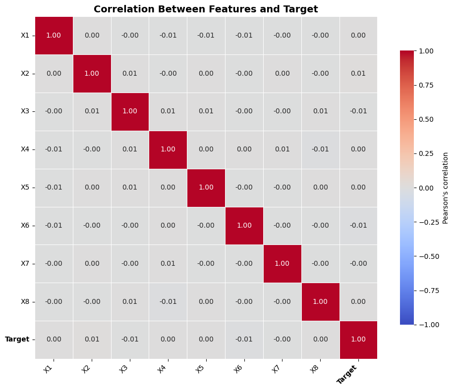
    

