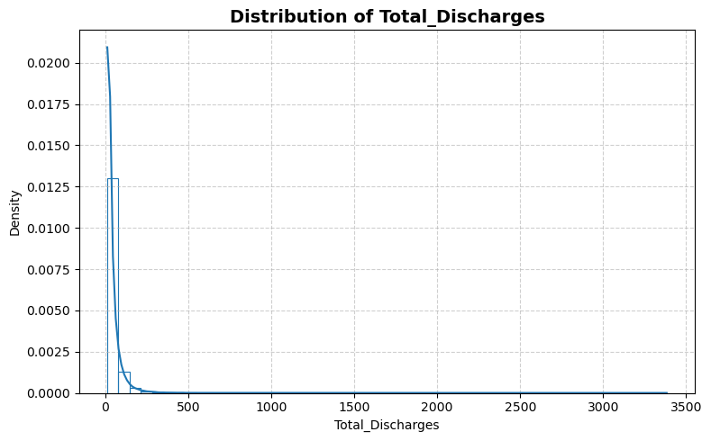
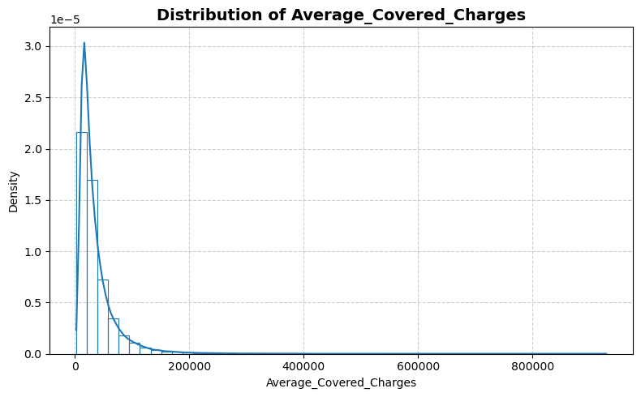
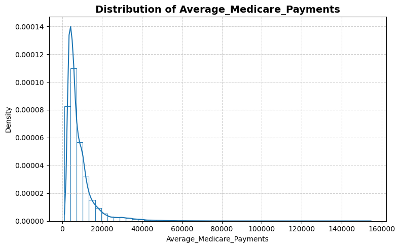
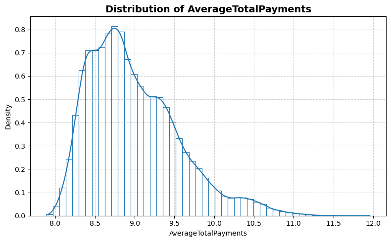
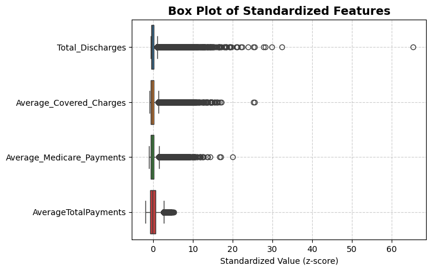
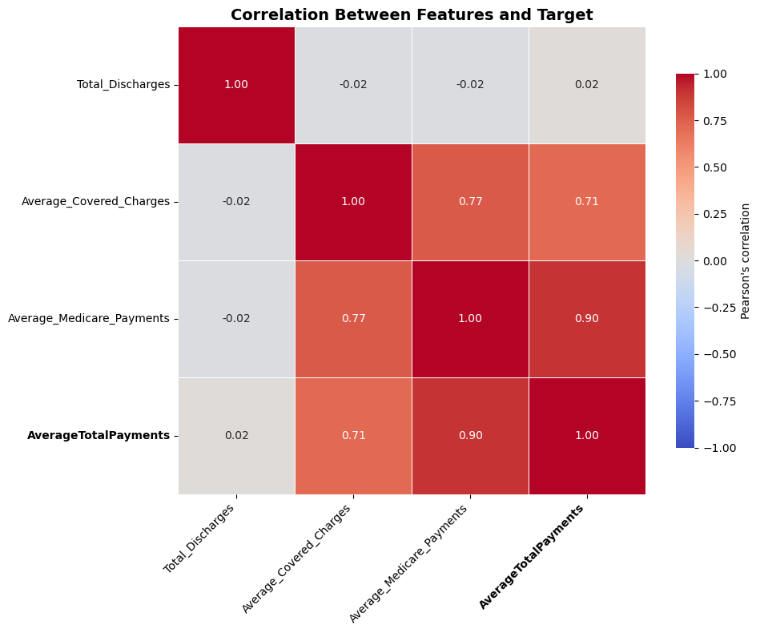

```python
from stat_sum_func import ToParquet, DatasetStatistics
```


```python
file = "medical_charges"
path = f"raw/{file}/{file}.parquet"
statistics_man = DatasetStatistics(path)
statistics_man.df
```


<div>
<table border="1" class="dataframe">
  <thead>
    <tr style="text-align: right;">
      <th></th>
      <th>Total_Discharges</th>
      <th>Average_Covered_Charges</th>
      <th>Average_Medicare_Payments</th>
      <th>AverageTotalPayments</th>
    </tr>
  </thead>
  <tbody>
    <tr>
      <th>0</th>
      <td>91.0</td>
      <td>32963.07692</td>
      <td>4763.736264</td>
      <td>8.661855</td>
    </tr>
    <tr>
      <th>1</th>
      <td>14.0</td>
      <td>15131.85714</td>
      <td>4976.714286</td>
      <td>8.663641</td>
    </tr>
    <tr>
      <th>2</th>
      <td>24.0</td>
      <td>37560.37500</td>
      <td>4453.791667</td>
      <td>8.600791</td>
    </tr>
    <tr>
      <th>3</th>
      <td>25.0</td>
      <td>13998.28000</td>
      <td>4129.160000</td>
      <td>8.597585</td>
    </tr>
    <tr>
      <th>4</th>
      <td>18.0</td>
      <td>31633.27778</td>
      <td>4851.444444</td>
      <td>8.641061</td>
    </tr>
    <tr>
      <th>...</th>
      <td>...</td>
      <td>...</td>
      <td>...</td>
      <td>...</td>
    </tr>
    <tr>
      <th>163060</th>
      <td>23.0</td>
      <td>26314.39130</td>
      <td>3071.391304</td>
      <td>8.244825</td>
    </tr>
    <tr>
      <th>163061</th>
      <td>11.0</td>
      <td>21704.72727</td>
      <td>2649.727273</td>
      <td>8.301116</td>
    </tr>
    <tr>
      <th>163062</th>
      <td>19.0</td>
      <td>39121.73684</td>
      <td>4058.368421</td>
      <td>8.649163</td>
    </tr>
    <tr>
      <th>163063</th>
      <td>11.0</td>
      <td>28873.09091</td>
      <td>6848.545455</td>
      <td>8.944301</td>
    </tr>
    <tr>
      <th>163064</th>
      <td>12.0</td>
      <td>15042.00000</td>
      <td>2887.416667</td>
      <td>8.172094</td>
    </tr>
  </tbody>
</table>
<p>163065 rows × 4 columns</p>
</div>


```python
for feature in statistics_man.df.columns:
    statistics_man.plot_distribution(feature)
```


    

    


    

    


    

    


    

    


```python
statistics_man.plot_box()
```


    

    


```python
statistics_man.print_stat_sum()
```

    Number of samples : 163065
    Number of features: 3
    ==============================


<div>
<table border="1" class="dataframe">
  <thead>
    <tr style="text-align: right;">
      <th></th>
      <th>dtype</th>
      <th>missing</th>
      <th>count</th>
      <th>median</th>
      <th>mean</th>
      <th>std</th>
      <th>min</th>
      <th>25%</th>
      <th>50%</th>
      <th>75%</th>
      <th>max</th>
    </tr>
  </thead>
  <tbody>
    <tr>
      <th>Total_Discharges</th>
      <td>float64</td>
      <td>0</td>
      <td>163065.0</td>
      <td>27.000000</td>
      <td>42.776304</td>
      <td>51.104042</td>
      <td>11.000000</td>
      <td>17.000000</td>
      <td>27.000000</td>
      <td>49.000000</td>
      <td>3383.000000</td>
    </tr>
    <tr>
      <th>Average_Covered_Charges</th>
      <td>float64</td>
      <td>0</td>
      <td>163065.0</td>
      <td>25245.823530</td>
      <td>36133.958434</td>
      <td>35065.365905</td>
      <td>2459.400000</td>
      <td>15947.166670</td>
      <td>25245.823530</td>
      <td>43232.592590</td>
      <td>929118.909100</td>
    </tr>
    <tr>
      <th>Average_Medicare_Payments</th>
      <td>float64</td>
      <td>0</td>
      <td>163065.0</td>
      <td>6158.465116</td>
      <td>8494.495174</td>
      <td>7309.467247</td>
      <td>1148.909091</td>
      <td>4192.354839</td>
      <td>6158.465116</td>
      <td>10056.882350</td>
      <td>154620.818200</td>
    </tr>
    <tr>
      <th>AverageTotalPayments</th>
      <td>float64</td>
      <td>0</td>
      <td>163065.0</td>
      <td>8.883931</td>
      <td>8.991832</td>
      <td>0.566374</td>
      <td>7.891331</td>
      <td>8.563218</td>
      <td>8.883931</td>
      <td>9.331442</td>
      <td>11.958631</td>
    </tr>
  </tbody>
</table>
</div>


```python
statistics_man.plot_corr_heatmap()
```


    

    

