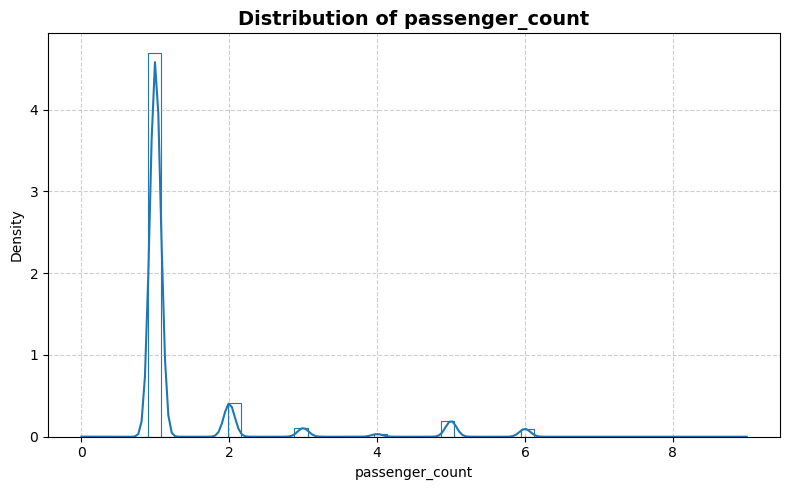
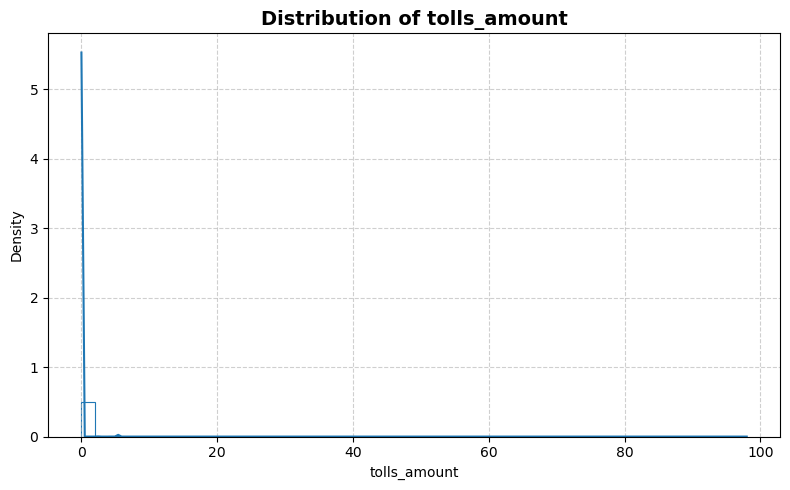
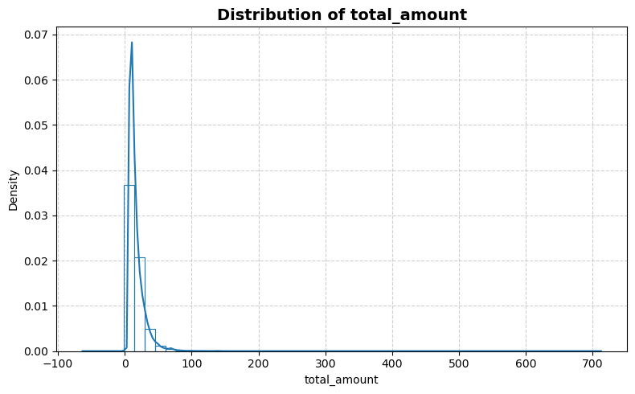
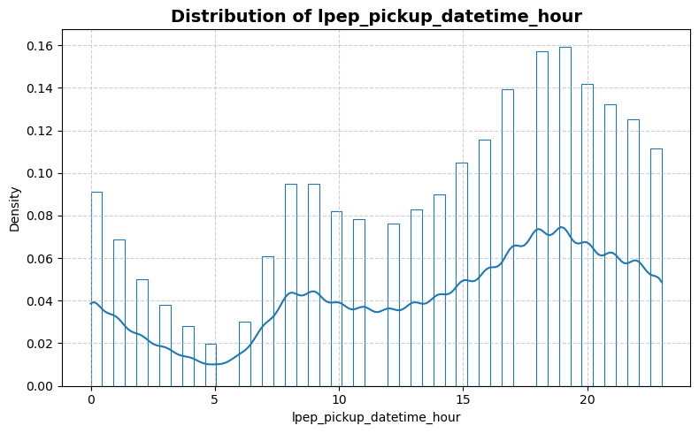
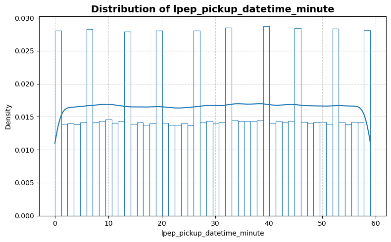
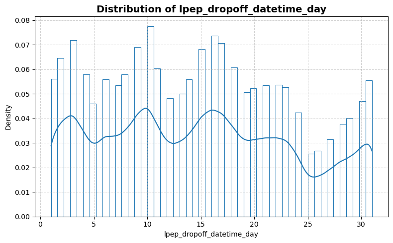
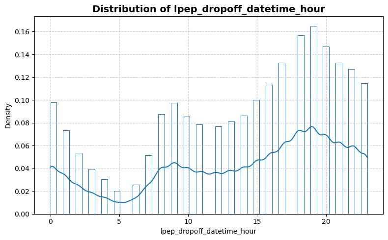
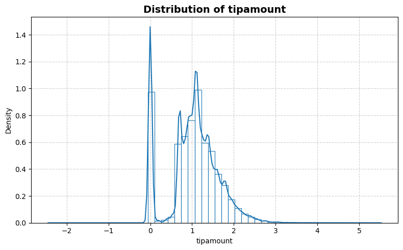
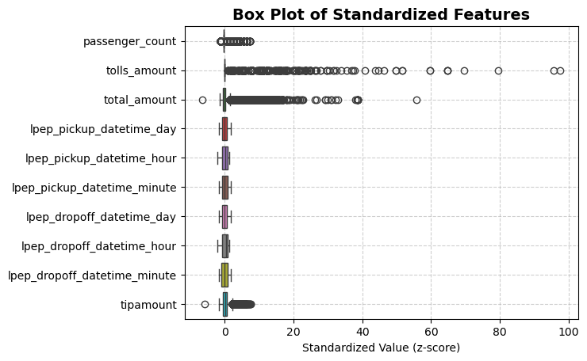
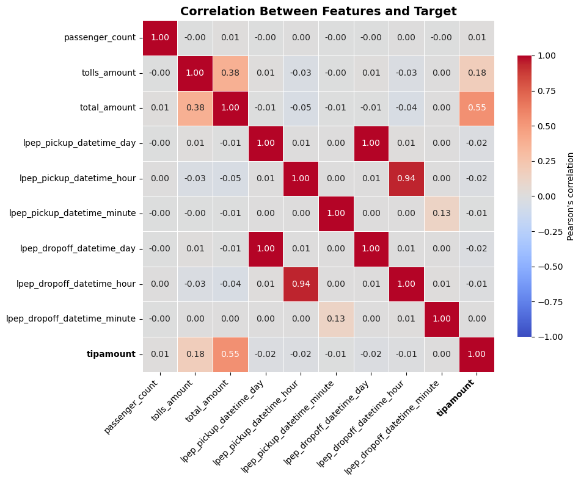

```python
from stat_sum_func import ToParquet, DatasetStatistics
```


```python
file = "nyc_taxi_green_dec_2016"
path = f"raw/{file}/{file}.parquet"
statistics_man = DatasetStatistics(path)
statistics_man.df
```


<div>
<table border="1" class="dataframe">
  <thead>
    <tr style="text-align: right;">
      <th></th>
      <th>passenger_count</th>
      <th>tolls_amount</th>
      <th>total_amount</th>
      <th>lpep_pickup_datetime_day</th>
      <th>lpep_pickup_datetime_hour</th>
      <th>lpep_pickup_datetime_minute</th>
      <th>lpep_dropoff_datetime_day</th>
      <th>lpep_dropoff_datetime_hour</th>
      <th>lpep_dropoff_datetime_minute</th>
      <th>tipamount</th>
    </tr>
  </thead>
  <tbody>
    <tr>
      <th>0</th>
      <td>1.0</td>
      <td>0.0</td>
      <td>6.36</td>
      <td>1.0</td>
      <td>0.0</td>
      <td>52.0</td>
      <td>1.0</td>
      <td>0.0</td>
      <td>54.0</td>
      <td>0.722706</td>
    </tr>
    <tr>
      <th>1</th>
      <td>2.0</td>
      <td>0.0</td>
      <td>8.50</td>
      <td>1.0</td>
      <td>0.0</td>
      <td>10.0</td>
      <td>1.0</td>
      <td>0.0</td>
      <td>14.0</td>
      <td>0.993252</td>
    </tr>
    <tr>
      <th>2</th>
      <td>1.0</td>
      <td>0.0</td>
      <td>7.54</td>
      <td>1.0</td>
      <td>0.0</td>
      <td>12.0</td>
      <td>1.0</td>
      <td>0.0</td>
      <td>15.0</td>
      <td>1.007958</td>
    </tr>
    <tr>
      <th>3</th>
      <td>1.0</td>
      <td>0.0</td>
      <td>12.96</td>
      <td>1.0</td>
      <td>0.0</td>
      <td>29.0</td>
      <td>1.0</td>
      <td>0.0</td>
      <td>39.0</td>
      <td>1.150572</td>
    </tr>
    <tr>
      <th>4</th>
      <td>1.0</td>
      <td>0.0</td>
      <td>12.30</td>
      <td>1.0</td>
      <td>0.0</td>
      <td>42.0</td>
      <td>1.0</td>
      <td>0.0</td>
      <td>52.0</td>
      <td>0.000000</td>
    </tr>
    <tr>
      <th>...</th>
      <td>...</td>
      <td>...</td>
      <td>...</td>
      <td>...</td>
      <td>...</td>
      <td>...</td>
      <td>...</td>
      <td>...</td>
      <td>...</td>
      <td>...</td>
    </tr>
    <tr>
      <th>581830</th>
      <td>2.0</td>
      <td>0.0</td>
      <td>7.55</td>
      <td>31.0</td>
      <td>23.0</td>
      <td>1.0</td>
      <td>31.0</td>
      <td>23.0</td>
      <td>5.0</td>
      <td>0.810930</td>
    </tr>
    <tr>
      <th>581831</th>
      <td>1.0</td>
      <td>0.0</td>
      <td>8.38</td>
      <td>31.0</td>
      <td>23.0</td>
      <td>1.0</td>
      <td>31.0</td>
      <td>23.0</td>
      <td>9.0</td>
      <td>0.076961</td>
    </tr>
    <tr>
      <th>581832</th>
      <td>1.0</td>
      <td>0.0</td>
      <td>7.30</td>
      <td>31.0</td>
      <td>23.0</td>
      <td>0.0</td>
      <td>31.0</td>
      <td>23.0</td>
      <td>4.0</td>
      <td>0.000000</td>
    </tr>
    <tr>
      <th>581833</th>
      <td>1.0</td>
      <td>0.0</td>
      <td>7.55</td>
      <td>31.0</td>
      <td>23.0</td>
      <td>0.0</td>
      <td>31.0</td>
      <td>23.0</td>
      <td>5.0</td>
      <td>0.810930</td>
    </tr>
    <tr>
      <th>581834</th>
      <td>1.0</td>
      <td>0.0</td>
      <td>23.75</td>
      <td>31.0</td>
      <td>23.0</td>
      <td>0.0</td>
      <td>31.0</td>
      <td>23.0</td>
      <td>15.0</td>
      <td>1.599388</td>
    </tr>
  </tbody>
</table>
<p>581835 rows × 10 columns</p>
</div>


```python
for feature in statistics_man.df.columns:
    statistics_man.plot_distribution(feature)
```


    

    


    

    


    

    


    

    


    

    


    

    


    

    


    

    


    

    


    

    


```python
statistics_man.plot_box()
```


    

    


```python
statistics_man.print_stat_sum()
```

    Number of samples : 581835
    Number of features: 9
    ==============================


<div>
<table border="1" class="dataframe">
  <thead>
    <tr style="text-align: right;">
      <th></th>
      <th>dtype</th>
      <th>missing</th>
      <th>count</th>
      <th>median</th>
      <th>mean</th>
      <th>std</th>
      <th>min</th>
      <th>25%</th>
      <th>50%</th>
      <th>75%</th>
      <th>max</th>
    </tr>
  </thead>
  <tbody>
    <tr>
      <th>passenger_count</th>
      <td>float64</td>
      <td>0</td>
      <td>581835.0</td>
      <td>1.000000</td>
      <td>1.363488</td>
      <td>1.045001</td>
      <td>0.000000</td>
      <td>1.00000</td>
      <td>1.000000</td>
      <td>1.000000</td>
      <td>9.000000</td>
    </tr>
    <tr>
      <th>tolls_amount</th>
      <td>float64</td>
      <td>0</td>
      <td>581835.0</td>
      <td>0.000000</td>
      <td>0.136545</td>
      <td>1.003418</td>
      <td>0.000000</td>
      <td>0.00000</td>
      <td>0.000000</td>
      <td>0.000000</td>
      <td>98.000000</td>
    </tr>
    <tr>
      <th>total_amount</th>
      <td>float64</td>
      <td>0</td>
      <td>581835.0</td>
      <td>12.880000</td>
      <td>16.614069</td>
      <td>12.466400</td>
      <td>-63.360000</td>
      <td>9.12000</td>
      <td>12.880000</td>
      <td>19.800000</td>
      <td>712.380000</td>
    </tr>
    <tr>
      <th>lpep_pickup_datetime_day</th>
      <td>float64</td>
      <td>0</td>
      <td>581835.0</td>
      <td>15.000000</td>
      <td>14.797986</td>
      <td>8.638804</td>
      <td>1.000000</td>
      <td>8.00000</td>
      <td>15.000000</td>
      <td>21.000000</td>
      <td>31.000000</td>
    </tr>
    <tr>
      <th>lpep_pickup_datetime_hour</th>
      <td>float64</td>
      <td>0</td>
      <td>581835.0</td>
      <td>15.000000</td>
      <td>13.907697</td>
      <td>6.637991</td>
      <td>0.000000</td>
      <td>9.00000</td>
      <td>15.000000</td>
      <td>19.000000</td>
      <td>23.000000</td>
    </tr>
    <tr>
      <th>lpep_pickup_datetime_minute</th>
      <td>float64</td>
      <td>0</td>
      <td>581835.0</td>
      <td>30.000000</td>
      <td>29.555687</td>
      <td>17.304617</td>
      <td>0.000000</td>
      <td>15.00000</td>
      <td>30.000000</td>
      <td>45.000000</td>
      <td>59.000000</td>
    </tr>
    <tr>
      <th>lpep_dropoff_datetime_day</th>
      <td>float64</td>
      <td>0</td>
      <td>581835.0</td>
      <td>15.000000</td>
      <td>14.800246</td>
      <td>8.636686</td>
      <td>1.000000</td>
      <td>8.00000</td>
      <td>15.000000</td>
      <td>21.000000</td>
      <td>31.000000</td>
    </tr>
    <tr>
      <th>lpep_dropoff_datetime_hour</th>
      <td>float64</td>
      <td>0</td>
      <td>581835.0</td>
      <td>16.000000</td>
      <td>13.893143</td>
      <td>6.730254</td>
      <td>0.000000</td>
      <td>9.00000</td>
      <td>16.000000</td>
      <td>19.000000</td>
      <td>23.000000</td>
    </tr>
    <tr>
      <th>lpep_dropoff_datetime_minute</th>
      <td>float64</td>
      <td>0</td>
      <td>581835.0</td>
      <td>30.000000</td>
      <td>29.534890</td>
      <td>17.449113</td>
      <td>0.000000</td>
      <td>14.00000</td>
      <td>30.000000</td>
      <td>45.000000</td>
      <td>59.000000</td>
    </tr>
    <tr>
      <th>tipamount</th>
      <td>float64</td>
      <td>0</td>
      <td>581835.0</td>
      <td>1.085189</td>
      <td>1.033647</td>
      <td>0.597082</td>
      <td>-2.447551</td>
      <td>0.71784</td>
      <td>1.085189</td>
      <td>1.386294</td>
      <td>5.528238</td>
    </tr>
  </tbody>
</table>
</div>


```python
statistics_man.plot_corr_heatmap()
```


    

    

