```python
from stat_sum_func import ToParquet, DatasetStatistics
```


```python
file = "players_22"
path = f"raw/{file}/{file}.parquet"
statistics_man = DatasetStatistics(path)
statistics_man.df
```


<div>
<table border="1" class="dataframe">
  <thead>
    <tr style="text-align: right;">
      <th></th>
      <th>overall</th>
      <th>potential</th>
      <th>wage_eur</th>
      <th>age</th>
      <th>pace</th>
      <th>shooting</th>
      <th>passing</th>
      <th>dribbling</th>
      <th>defending</th>
      <th>physic</th>
      <th>value_eur</th>
    </tr>
  </thead>
  <tbody>
    <tr>
      <th>0</th>
      <td>93</td>
      <td>93</td>
      <td>320000.0</td>
      <td>34</td>
      <td>85.0</td>
      <td>92.0</td>
      <td>91.0</td>
      <td>95.0</td>
      <td>34.0</td>
      <td>65.0</td>
      <td>78000000.0</td>
    </tr>
    <tr>
      <th>1</th>
      <td>92</td>
      <td>92</td>
      <td>270000.0</td>
      <td>32</td>
      <td>78.0</td>
      <td>92.0</td>
      <td>79.0</td>
      <td>86.0</td>
      <td>44.0</td>
      <td>82.0</td>
      <td>119500000.0</td>
    </tr>
    <tr>
      <th>2</th>
      <td>91</td>
      <td>91</td>
      <td>270000.0</td>
      <td>36</td>
      <td>87.0</td>
      <td>94.0</td>
      <td>80.0</td>
      <td>88.0</td>
      <td>34.0</td>
      <td>75.0</td>
      <td>45000000.0</td>
    </tr>
    <tr>
      <th>3</th>
      <td>91</td>
      <td>91</td>
      <td>270000.0</td>
      <td>29</td>
      <td>91.0</td>
      <td>83.0</td>
      <td>86.0</td>
      <td>94.0</td>
      <td>37.0</td>
      <td>63.0</td>
      <td>129000000.0</td>
    </tr>
    <tr>
      <th>4</th>
      <td>91</td>
      <td>91</td>
      <td>350000.0</td>
      <td>30</td>
      <td>76.0</td>
      <td>86.0</td>
      <td>93.0</td>
      <td>88.0</td>
      <td>64.0</td>
      <td>78.0</td>
      <td>125500000.0</td>
    </tr>
    <tr>
      <th>...</th>
      <td>...</td>
      <td>...</td>
      <td>...</td>
      <td>...</td>
      <td>...</td>
      <td>...</td>
      <td>...</td>
      <td>...</td>
      <td>...</td>
      <td>...</td>
      <td>...</td>
    </tr>
    <tr>
      <th>17036</th>
      <td>47</td>
      <td>52</td>
      <td>1000.0</td>
      <td>22</td>
      <td>58.0</td>
      <td>35.0</td>
      <td>46.0</td>
      <td>48.0</td>
      <td>42.0</td>
      <td>49.0</td>
      <td>70000.0</td>
    </tr>
    <tr>
      <th>17037</th>
      <td>47</td>
      <td>59</td>
      <td>500.0</td>
      <td>19</td>
      <td>59.0</td>
      <td>39.0</td>
      <td>50.0</td>
      <td>46.0</td>
      <td>41.0</td>
      <td>51.0</td>
      <td>110000.0</td>
    </tr>
    <tr>
      <th>17038</th>
      <td>47</td>
      <td>55</td>
      <td>500.0</td>
      <td>21</td>
      <td>60.0</td>
      <td>37.0</td>
      <td>45.0</td>
      <td>49.0</td>
      <td>41.0</td>
      <td>52.0</td>
      <td>100000.0</td>
    </tr>
    <tr>
      <th>17039</th>
      <td>47</td>
      <td>60</td>
      <td>500.0</td>
      <td>19</td>
      <td>68.0</td>
      <td>46.0</td>
      <td>36.0</td>
      <td>48.0</td>
      <td>15.0</td>
      <td>42.0</td>
      <td>110000.0</td>
    </tr>
    <tr>
      <th>17040</th>
      <td>47</td>
      <td>60</td>
      <td>500.0</td>
      <td>19</td>
      <td>68.0</td>
      <td>38.0</td>
      <td>45.0</td>
      <td>48.0</td>
      <td>36.0</td>
      <td>48.0</td>
      <td>110000.0</td>
    </tr>
  </tbody>
</table>
<p>17041 rows × 11 columns</p>
</div>


```python
for feature in statistics_man.df.columns:
    statistics_man.plot_distribution(feature)
```


    
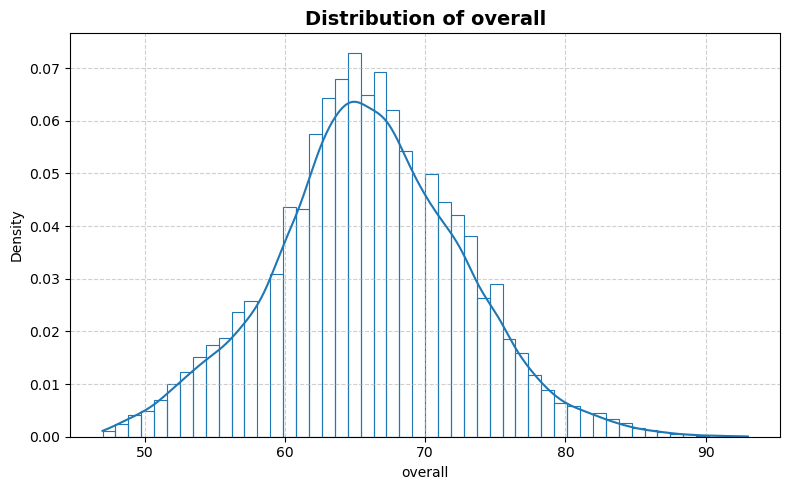
    


    

    


    
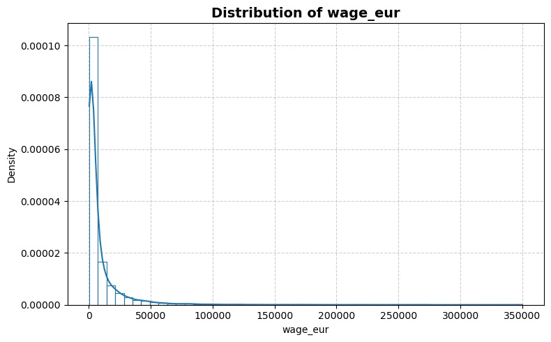
    


    
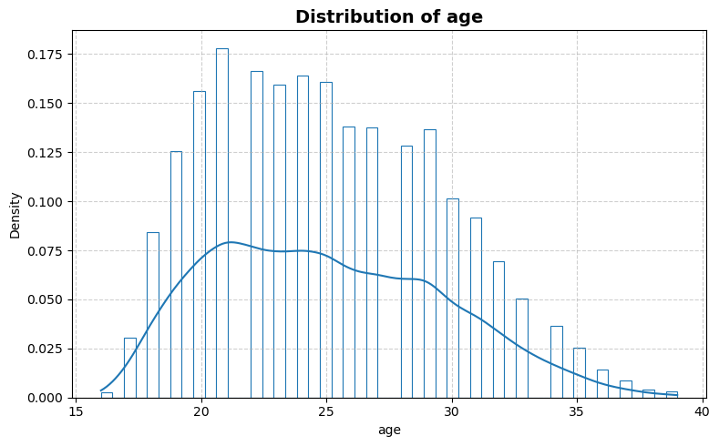
    


    
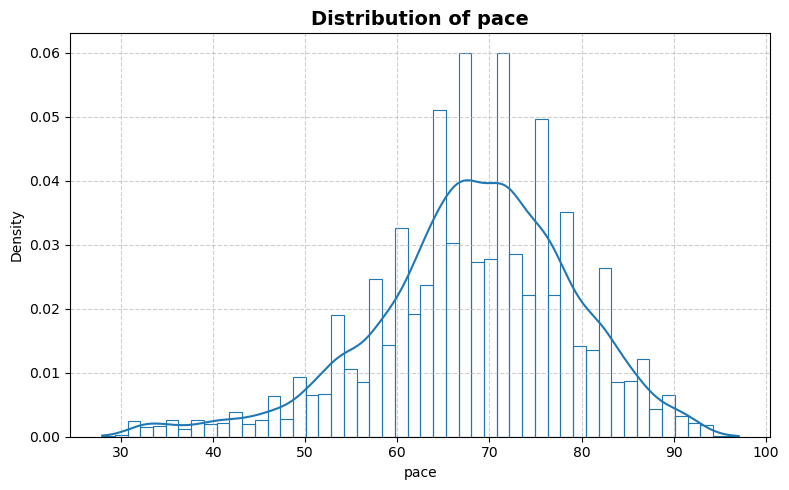
    


    
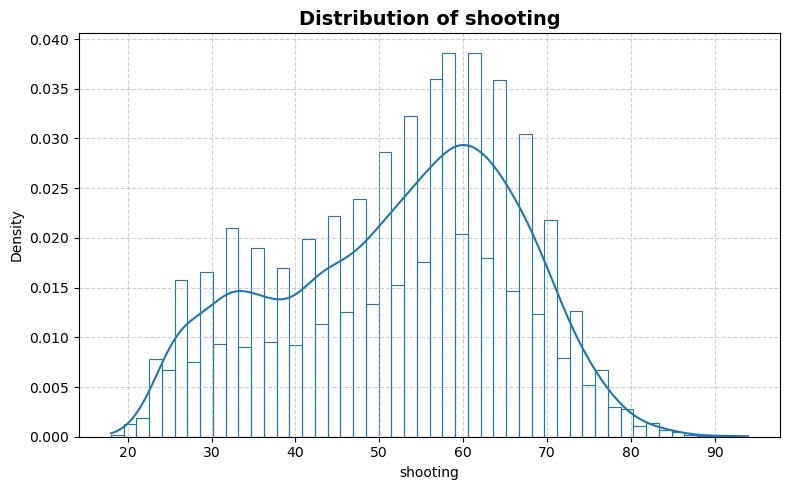
    


    
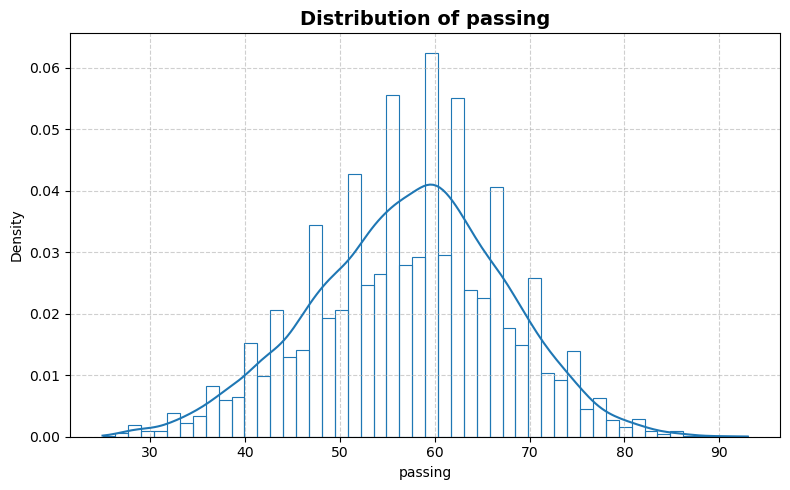
    


    
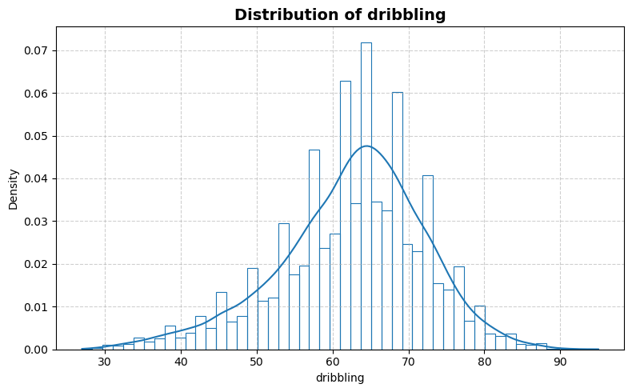
    


    
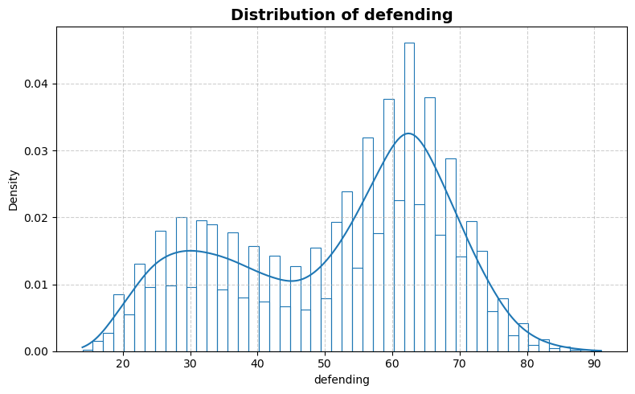
    


    
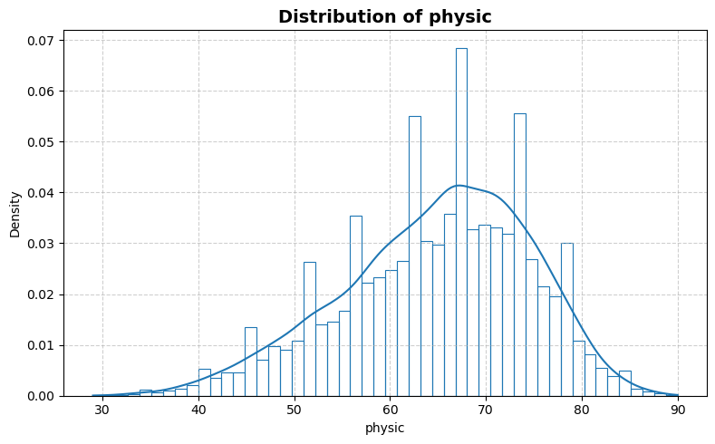
    


    
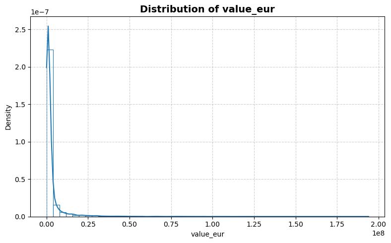
    


```python
statistics_man.plot_box()
```


    
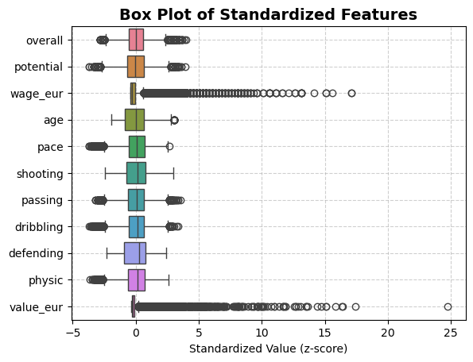
    


```python
statistics_man.print_stat_sum()
```

    Number of samples : 17041
    Number of features: 10
    ==============================


<div>
<table border="1" class="dataframe">
  <thead>
    <tr style="text-align: right;">
      <th></th>
      <th>dtype</th>
      <th>missing</th>
      <th>count</th>
      <th>median</th>
      <th>mean</th>
      <th>std</th>
      <th>min</th>
      <th>25%</th>
      <th>50%</th>
      <th>75%</th>
      <th>max</th>
    </tr>
  </thead>
  <tbody>
    <tr>
      <th>overall</th>
      <td>int64</td>
      <td>0</td>
      <td>17041.0</td>
      <td>66.0</td>
      <td>6.593029e+01</td>
      <td>6.773755e+00</td>
      <td>47.0</td>
      <td>62.0</td>
      <td>66.0</td>
      <td>70.0</td>
      <td>93.0</td>
    </tr>
    <tr>
      <th>potential</th>
      <td>int64</td>
      <td>0</td>
      <td>17041.0</td>
      <td>71.0</td>
      <td>7.124306e+01</td>
      <td>6.048461e+00</td>
      <td>49.0</td>
      <td>67.0</td>
      <td>71.0</td>
      <td>75.0</td>
      <td>95.0</td>
    </tr>
    <tr>
      <th>wage_eur</th>
      <td>float64</td>
      <td>0</td>
      <td>17041.0</td>
      <td>3000.0</td>
      <td>9.354733e+03</td>
      <td>1.988072e+04</td>
      <td>500.0</td>
      <td>1000.0</td>
      <td>3000.0</td>
      <td>9000.0</td>
      <td>350000.0</td>
    </tr>
    <tr>
      <th>age</th>
      <td>int64</td>
      <td>0</td>
      <td>17041.0</td>
      <td>25.0</td>
      <td>2.506596e+01</td>
      <td>4.605071e+00</td>
      <td>16.0</td>
      <td>21.0</td>
      <td>25.0</td>
      <td>28.0</td>
      <td>39.0</td>
    </tr>
    <tr>
      <th>pace</th>
      <td>float64</td>
      <td>0</td>
      <td>17041.0</td>
      <td>69.0</td>
      <td>6.823549e+01</td>
      <td>1.090538e+01</td>
      <td>28.0</td>
      <td>62.0</td>
      <td>69.0</td>
      <td>76.0</td>
      <td>97.0</td>
    </tr>
    <tr>
      <th>shooting</th>
      <td>float64</td>
      <td>0</td>
      <td>17041.0</td>
      <td>54.0</td>
      <td>5.232745e+01</td>
      <td>1.405208e+01</td>
      <td>18.0</td>
      <td>42.0</td>
      <td>54.0</td>
      <td>63.0</td>
      <td>94.0</td>
    </tr>
    <tr>
      <th>passing</th>
      <td>float64</td>
      <td>0</td>
      <td>17041.0</td>
      <td>58.0</td>
      <td>5.729816e+01</td>
      <td>1.006887e+01</td>
      <td>25.0</td>
      <td>51.0</td>
      <td>58.0</td>
      <td>64.0</td>
      <td>93.0</td>
    </tr>
    <tr>
      <th>dribbling</th>
      <td>float64</td>
      <td>0</td>
      <td>17041.0</td>
      <td>64.0</td>
      <td>6.255672e+01</td>
      <td>9.653533e+00</td>
      <td>27.0</td>
      <td>57.0</td>
      <td>64.0</td>
      <td>69.0</td>
      <td>95.0</td>
    </tr>
    <tr>
      <th>defending</th>
      <td>float64</td>
      <td>0</td>
      <td>17041.0</td>
      <td>56.0</td>
      <td>5.169110e+01</td>
      <td>1.618596e+01</td>
      <td>14.0</td>
      <td>37.0</td>
      <td>56.0</td>
      <td>64.0</td>
      <td>91.0</td>
    </tr>
    <tr>
      <th>physic</th>
      <td>float64</td>
      <td>0</td>
      <td>17041.0</td>
      <td>66.0</td>
      <td>6.481263e+01</td>
      <td>9.792269e+00</td>
      <td>29.0</td>
      <td>59.0</td>
      <td>66.0</td>
      <td>72.0</td>
      <td>90.0</td>
    </tr>
    <tr>
      <th>value_eur</th>
      <td>float64</td>
      <td>0</td>
      <td>17041.0</td>
      <td>1000000.0</td>
      <td>2.965082e+06</td>
      <td>7.717024e+06</td>
      <td>15000.0</td>
      <td>525000.0</td>
      <td>1000000.0</td>
      <td>2100000.0</td>
      <td>194000000.0</td>
    </tr>
  </tbody>
</table>
</div>


```python
statistics_man.plot_corr_heatmap()
```


    
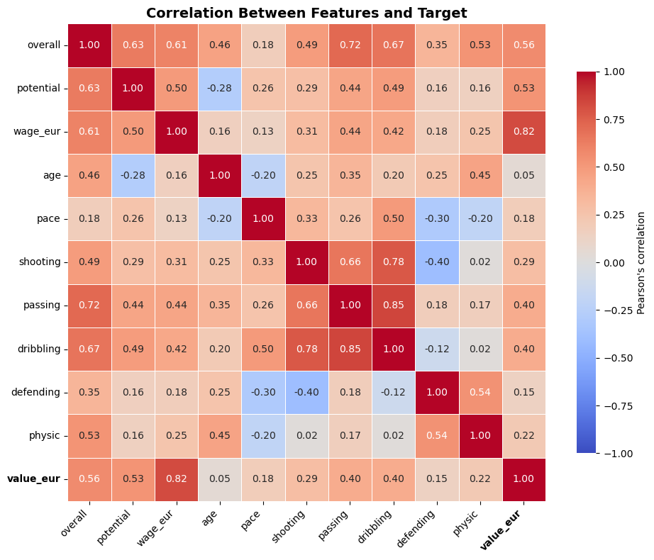
    

