```python
from stat_sum_func import ToParquet, DatasetStatistics
```


```python
file = "power_consumption"
path = f"raw/{file}/{file}.parquet"
statistics_man = DatasetStatistics(path)
statistics_man.df
```


<div>
<table border="1" class="dataframe">
  <thead>
    <tr style="text-align: right;">
      <th></th>
      <th>draft_aft_telegram</th>
      <th>draft_fore_telegram</th>
      <th>stw</th>
      <th>diff_speed_overground</th>
      <th>awind_vcomp_provider</th>
      <th>awind_ucomp_provider</th>
      <th>rcurrent_vcomp</th>
      <th>rcurrent_ucomp</th>
      <th>comb_wind_swell_wave_height</th>
      <th>timeSinceDryDock</th>
      <th>time_id</th>
      <th>power</th>
    </tr>
  </thead>
  <tbody>
    <tr>
      <th>0</th>
      <td>13.85</td>
      <td>13.85</td>
      <td>18.672400</td>
      <td>0.00</td>
      <td>15.165224</td>
      <td>0.410578</td>
      <td>0.082693</td>
      <td>0.346217</td>
      <td>0.113021</td>
      <td>831156.0</td>
      <td>820380</td>
      <td>23058.0</td>
    </tr>
    <tr>
      <th>1</th>
      <td>10.00</td>
      <td>9.87</td>
      <td>19.226700</td>
      <td>0.00</td>
      <td>12.211791</td>
      <td>15.816707</td>
      <td>-0.323882</td>
      <td>-0.113008</td>
      <td>2.037000</td>
      <td>1166391.0</td>
      <td>1155615</td>
      <td>23197.0</td>
    </tr>
    <tr>
      <th>2</th>
      <td>12.00</td>
      <td>11.49</td>
      <td>18.395100</td>
      <td>0.00</td>
      <td>21.005612</td>
      <td>18.225887</td>
      <td>-0.107005</td>
      <td>-0.455295</td>
      <td>1.771780</td>
      <td>1108174.0</td>
      <td>1097398</td>
      <td>23579.0</td>
    </tr>
    <tr>
      <th>3</th>
      <td>11.84</td>
      <td>11.85</td>
      <td>17.891701</td>
      <td>0.00</td>
      <td>27.230972</td>
      <td>13.020768</td>
      <td>0.383015</td>
      <td>0.293125</td>
      <td>2.420000</td>
      <td>1413336.0</td>
      <td>1402560</td>
      <td>22321.0</td>
    </tr>
    <tr>
      <th>4</th>
      <td>14.70</td>
      <td>14.70</td>
      <td>19.870001</td>
      <td>0.00</td>
      <td>21.643135</td>
      <td>0.950529</td>
      <td>-0.066324</td>
      <td>-0.125265</td>
      <td>0.700087</td>
      <td>707870.0</td>
      <td>697094</td>
      <td>32374.0</td>
    </tr>
    <tr>
      <th>...</th>
      <td>...</td>
      <td>...</td>
      <td>...</td>
      <td>...</td>
      <td>...</td>
      <td>...</td>
      <td>...</td>
      <td>...</td>
      <td>...</td>
      <td>...</td>
      <td>...</td>
      <td>...</td>
    </tr>
    <tr>
      <th>567437</th>
      <td>10.20</td>
      <td>10.20</td>
      <td>13.991900</td>
      <td>0.00</td>
      <td>13.282523</td>
      <td>3.337768</td>
      <td>0.346829</td>
      <td>0.040045</td>
      <td>0.117188</td>
      <td>592578.0</td>
      <td>581802</td>
      <td>8778.0</td>
    </tr>
    <tr>
      <th>567438</th>
      <td>13.49</td>
      <td>13.49</td>
      <td>18.603100</td>
      <td>0.00</td>
      <td>24.097143</td>
      <td>3.013288</td>
      <td>-0.407819</td>
      <td>-1.108418</td>
      <td>1.814170</td>
      <td>1496887.0</td>
      <td>1486111</td>
      <td>26307.0</td>
    </tr>
    <tr>
      <th>567439</th>
      <td>12.90</td>
      <td>12.90</td>
      <td>12.417100</td>
      <td>-0.20</td>
      <td>21.074365</td>
      <td>7.399422</td>
      <td>0.508167</td>
      <td>-0.279030</td>
      <td>0.579667</td>
      <td>1601882.0</td>
      <td>1591106</td>
      <td>7594.0</td>
    </tr>
    <tr>
      <th>567440</th>
      <td>13.10</td>
      <td>12.70</td>
      <td>8.161400</td>
      <td>1.70</td>
      <td>9.978826</td>
      <td>2.931367</td>
      <td>0.767617</td>
      <td>0.029912</td>
      <td>0.023438</td>
      <td>34872.0</td>
      <td>24096</td>
      <td>7366.0</td>
    </tr>
    <tr>
      <th>567441</th>
      <td>12.60</td>
      <td>12.50</td>
      <td>8.450300</td>
      <td>1.12</td>
      <td>3.212103</td>
      <td>1.086232</td>
      <td>0.032664</td>
      <td>0.030289</td>
      <td>0.890222</td>
      <td>1325342.0</td>
      <td>1314566</td>
      <td>6703.0</td>
    </tr>
  </tbody>
</table>
<p>567442 rows × 12 columns</p>
</div>


```python
for feature in statistics_man.df.columns:
    statistics_man.plot_distribution(feature)
```


    
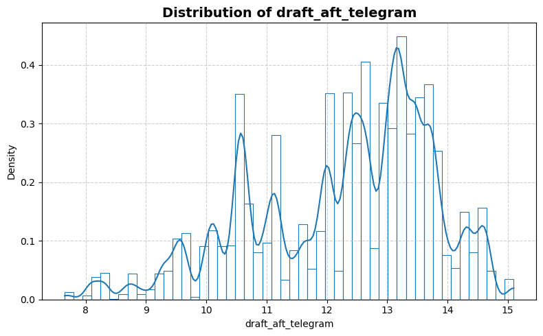
    


    
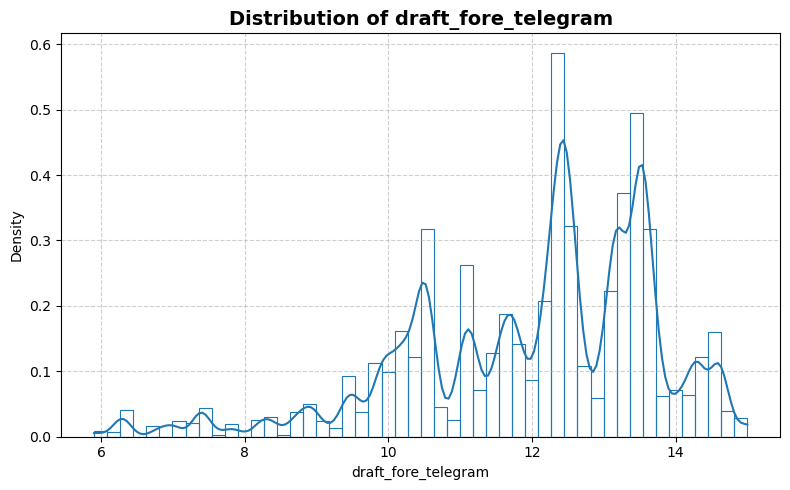
    


    
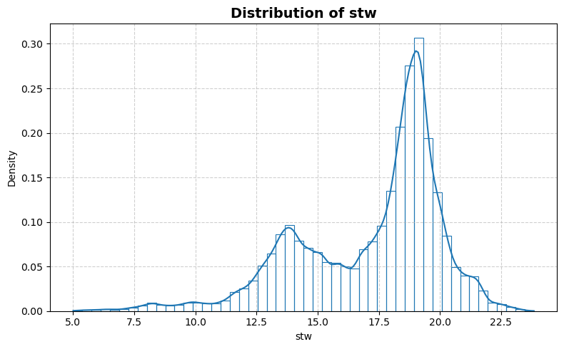
    


    
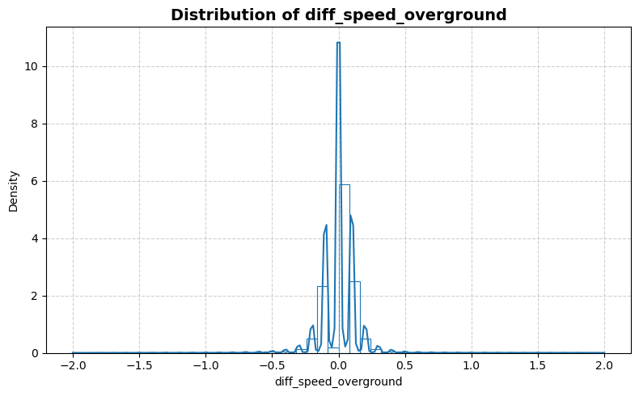
    


    
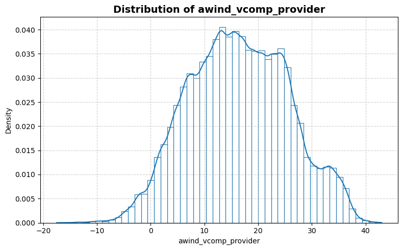
    


    
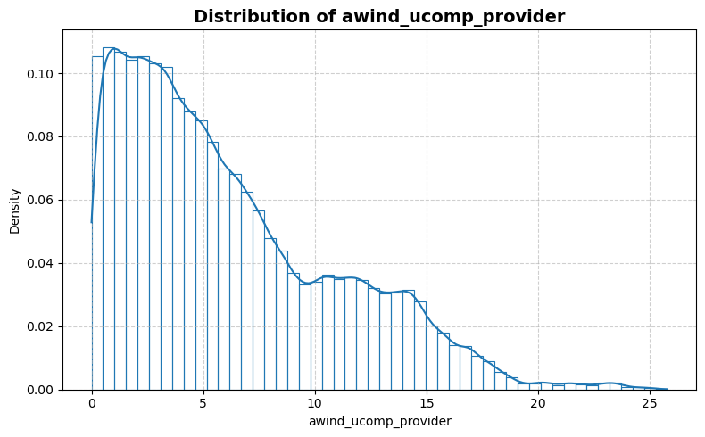
    


    
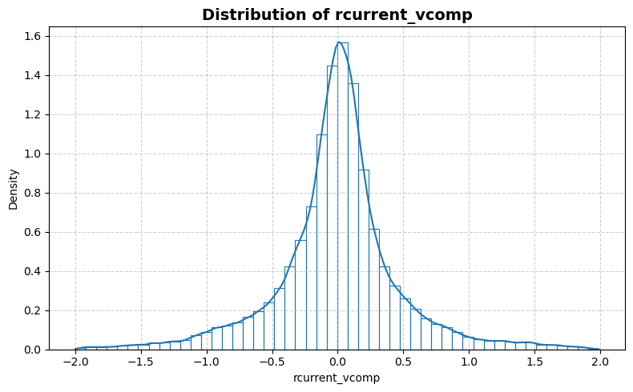
    


    
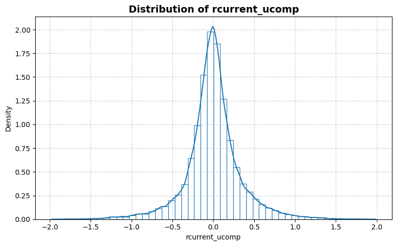
    


    
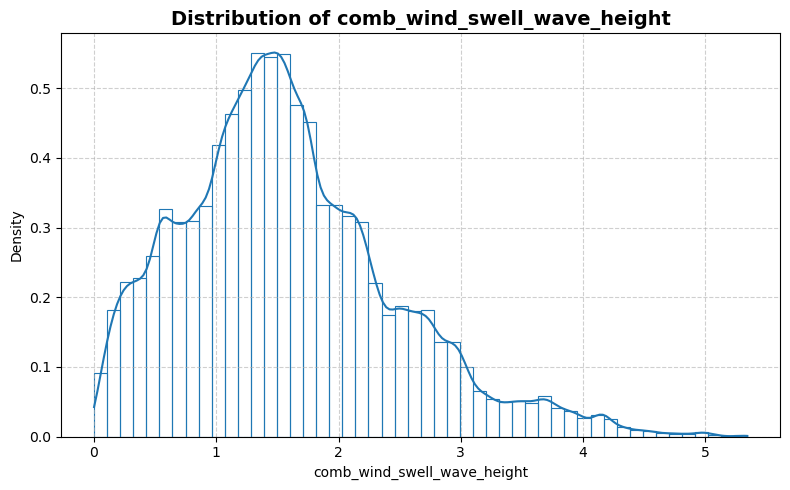
    


    

    


    
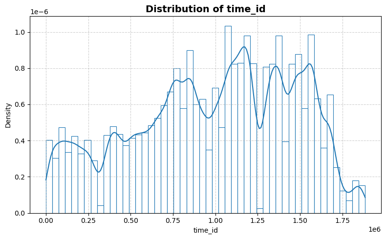
    


    
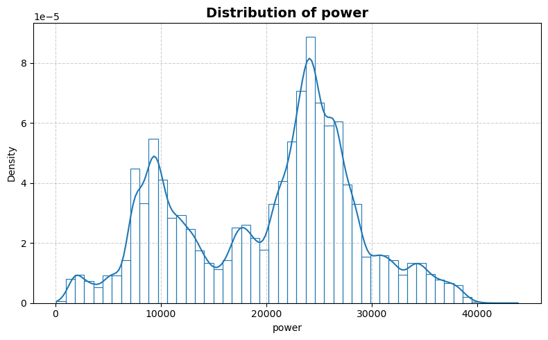
    


```python
statistics_man.plot_box()
```


    
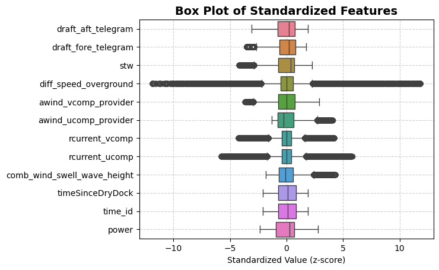
    


```python
statistics_man.print_stat_sum()
```

    Number of samples : 567442
    Number of features: 11
    ==============================


<div>
<table border="1" class="dataframe">
  <thead>
    <tr style="text-align: right;">
      <th></th>
      <th>dtype</th>
      <th>missing</th>
      <th>count</th>
      <th>median</th>
      <th>mean</th>
      <th>std</th>
      <th>min</th>
      <th>25%</th>
      <th>50%</th>
      <th>75%</th>
      <th>max</th>
    </tr>
  </thead>
  <tbody>
    <tr>
      <th>draft_aft_telegram</th>
      <td>float64</td>
      <td>0</td>
      <td>567442.0</td>
      <td>1.259000e+01</td>
      <td>12.269468</td>
      <td>1.502990</td>
      <td>7.650000</td>
      <td>11.100000</td>
      <td>1.259000e+01</td>
      <td>1.340000e+01</td>
      <td>1.510000e+01</td>
    </tr>
    <tr>
      <th>draft_fore_telegram</th>
      <td>float64</td>
      <td>0</td>
      <td>567442.0</td>
      <td>1.240000e+01</td>
      <td>12.008729</td>
      <td>1.729265</td>
      <td>5.900000</td>
      <td>10.900000</td>
      <td>1.240000e+01</td>
      <td>1.335000e+01</td>
      <td>1.500000e+01</td>
    </tr>
    <tr>
      <th>stw</th>
      <td>float64</td>
      <td>0</td>
      <td>567442.0</td>
      <td>1.829370e+01</td>
      <td>17.210161</td>
      <td>2.924155</td>
      <td>5.003200</td>
      <td>15.021300</td>
      <td>1.829370e+01</td>
      <td>1.922160e+01</td>
      <td>2.384030e+01</td>
    </tr>
    <tr>
      <th>diff_speed_overground</th>
      <td>float64</td>
      <td>0</td>
      <td>567442.0</td>
      <td>0.000000e+00</td>
      <td>0.000557</td>
      <td>0.169165</td>
      <td>-2.000000</td>
      <td>-0.090000</td>
      <td>0.000000e+00</td>
      <td>1.000000e-01</td>
      <td>2.000000e+00</td>
    </tr>
    <tr>
      <th>awind_vcomp_provider</th>
      <td>float64</td>
      <td>0</td>
      <td>567442.0</td>
      <td>1.624006e+01</td>
      <td>16.423514</td>
      <td>9.208890</td>
      <td>-17.522674</td>
      <td>9.643000</td>
      <td>1.624006e+01</td>
      <td>2.319712e+01</td>
      <td>4.299657e+01</td>
    </tr>
    <tr>
      <th>awind_ucomp_provider</th>
      <td>float64</td>
      <td>0</td>
      <td>567442.0</td>
      <td>4.969068e+00</td>
      <td>6.193491</td>
      <td>4.807771</td>
      <td>0.000051</td>
      <td>2.351523</td>
      <td>4.969068e+00</td>
      <td>9.131529e+00</td>
      <td>2.578889e+01</td>
    </tr>
    <tr>
      <th>rcurrent_vcomp</th>
      <td>float64</td>
      <td>0</td>
      <td>567442.0</td>
      <td>9.777095e-03</td>
      <td>0.000661</td>
      <td>0.471725</td>
      <td>-1.999337</td>
      <td>-0.192518</td>
      <td>9.777095e-03</td>
      <td>1.957586e-01</td>
      <td>1.990206e+00</td>
    </tr>
    <tr>
      <th>rcurrent_ucomp</th>
      <td>float64</td>
      <td>0</td>
      <td>567442.0</td>
      <td>-5.303160e-03</td>
      <td>0.000422</td>
      <td>0.341720</td>
      <td>-1.977741</td>
      <td>-0.149388</td>
      <td>-5.303160e-03</td>
      <td>1.462249e-01</td>
      <td>1.987223e+00</td>
    </tr>
    <tr>
      <th>comb_wind_swell_wave_height</th>
      <td>float64</td>
      <td>0</td>
      <td>567442.0</td>
      <td>1.486980e+00</td>
      <td>1.587313</td>
      <td>0.875894</td>
      <td>0.000221</td>
      <td>0.987222</td>
      <td>1.486980e+00</td>
      <td>2.079340e+00</td>
      <td>5.344530e+00</td>
    </tr>
    <tr>
      <th>timeSinceDryDock</th>
      <td>float64</td>
      <td>0</td>
      <td>567442.0</td>
      <td>1.054428e+06</td>
      <td>997228.340341</td>
      <td>471080.269890</td>
      <td>10776.000000</td>
      <td>661022.250000</td>
      <td>1.054428e+06</td>
      <td>1.388606e+06</td>
      <td>1.895760e+06</td>
    </tr>
    <tr>
      <th>time_id</th>
      <td>int64</td>
      <td>0</td>
      <td>567442.0</td>
      <td>1.043652e+06</td>
      <td>986452.340341</td>
      <td>471080.269890</td>
      <td>0.000000</td>
      <td>650246.250000</td>
      <td>1.043652e+06</td>
      <td>1.377830e+06</td>
      <td>1.884984e+06</td>
    </tr>
    <tr>
      <th>power</th>
      <td>float64</td>
      <td>0</td>
      <td>567442.0</td>
      <td>2.257000e+04</td>
      <td>20171.242149</td>
      <td>8476.921696</td>
      <td>103.000000</td>
      <td>12058.000000</td>
      <td>2.257000e+04</td>
      <td>2.609700e+04</td>
      <td>4.388300e+04</td>
    </tr>
  </tbody>
</table>
</div>


```python
statistics_man.plot_corr_heatmap()
```


    
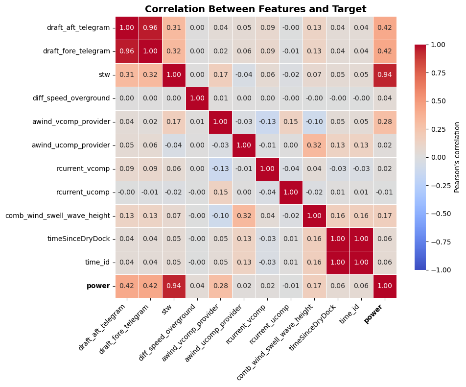
    

