```python
from stat_sum_func import ToParquet, DatasetStatistics
```


```python
file = "protein"
path = f"raw/{file}/{file}.parquet"
statistics_man = DatasetStatistics(path)
statistics_man.df
```


<div>
<table border="1" class="dataframe">
  <thead>
    <tr style="text-align: right;">
      <th></th>
      <th>X1</th>
      <th>X2</th>
      <th>X3</th>
      <th>X4</th>
      <th>X5</th>
      <th>X6</th>
      <th>X7</th>
      <th>X8</th>
      <th>X9</th>
      <th>Target</th>
    </tr>
  </thead>
  <tbody>
    <tr>
      <th>0</th>
      <td>4688.20</td>
      <td>458.880</td>
      <td>-0.063642</td>
      <td>79.81700</td>
      <td>661850.0</td>
      <td>59.0820</td>
      <td>66.854</td>
      <td>77.0250</td>
      <td>-2.50660</td>
      <td>-0.90612</td>
    </tr>
    <tr>
      <th>1</th>
      <td>-784.83</td>
      <td>269.390</td>
      <td>0.059308</td>
      <td>-12.91000</td>
      <td>-163400.0</td>
      <td>1.3009</td>
      <td>47.514</td>
      <td>-43.9750</td>
      <td>-0.51216</td>
      <td>1.01880</td>
    </tr>
    <tr>
      <th>2</th>
      <td>1044.60</td>
      <td>-56.897</td>
      <td>-0.031202</td>
      <td>30.87000</td>
      <td>111670.0</td>
      <td>28.7090</td>
      <td>-9.686</td>
      <td>-5.9751</td>
      <td>-1.40260</td>
      <td>0.15081</td>
    </tr>
    <tr>
      <th>3</th>
      <td>-425.79</td>
      <td>-871.270</td>
      <td>-0.075192</td>
      <td>-4.53580</td>
      <td>-44140.0</td>
      <td>-28.9990</td>
      <td>242.890</td>
      <td>-37.9750</td>
      <td>-0.88686</td>
      <td>-0.81892</td>
    </tr>
    <tr>
      <th>4</th>
      <td>9511.30</td>
      <td>3116.900</td>
      <td>0.014078</td>
      <td>158.97000</td>
      <td>1267600.0</td>
      <td>167.6100</td>
      <td>1749.200</td>
      <td>261.0200</td>
      <td>-14.92100</td>
      <td>-0.52612</td>
    </tr>
    <tr>
      <th>...</th>
      <td>...</td>
      <td>...</td>
      <td>...</td>
      <td>...</td>
      <td>...</td>
      <td>...</td>
      <td>...</td>
      <td>...</td>
      <td>...</td>
      <td>...</td>
    </tr>
    <tr>
      <th>45725</th>
      <td>-1219.70</td>
      <td>875.190</td>
      <td>0.147510</td>
      <td>-15.82800</td>
      <td>-313250.0</td>
      <td>11.6110</td>
      <td>-1615.000</td>
      <td>17.0250</td>
      <td>5.62670</td>
      <td>1.02310</td>
    </tr>
    <tr>
      <th>45726</th>
      <td>-2474.40</td>
      <td>-388.700</td>
      <td>0.052958</td>
      <td>-43.24000</td>
      <td>-330760.0</td>
      <td>-47.9500</td>
      <td>-480.660</td>
      <td>-11.9750</td>
      <td>2.37640</td>
      <td>0.46380</td>
    </tr>
    <tr>
      <th>45727</th>
      <td>549.20</td>
      <td>556.330</td>
      <td>0.040538</td>
      <td>0.51657</td>
      <td>78774.0</td>
      <td>17.3520</td>
      <td>656.580</td>
      <td>-6.9751</td>
      <td>-3.15090</td>
      <td>1.00470</td>
    </tr>
    <tr>
      <th>45728</th>
      <td>-2928.10</td>
      <td>-1754.300</td>
      <td>-0.120490</td>
      <td>-30.14600</td>
      <td>-435900.0</td>
      <td>-47.4460</td>
      <td>-777.080</td>
      <td>-41.9750</td>
      <td>3.74720</td>
      <td>1.09230</td>
    </tr>
    <tr>
      <th>45729</th>
      <td>7197.00</td>
      <td>2300.900</td>
      <td>0.009188</td>
      <td>91.34900</td>
      <td>967260.0</td>
      <td>130.4300</td>
      <td>1308.600</td>
      <td>25.0250</td>
      <td>-8.39440</td>
      <td>0.14365</td>
    </tr>
  </tbody>
</table>
<p>45730 rows × 10 columns</p>
</div>


```python
for feature in statistics_man.df.columns:
    statistics_man.plot_distribution(feature)
```


    
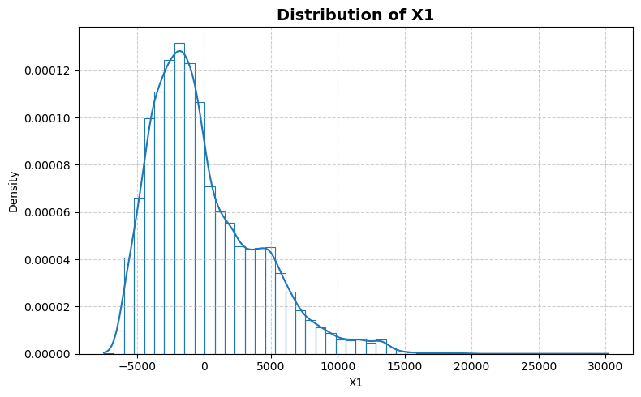
    


    

    


    
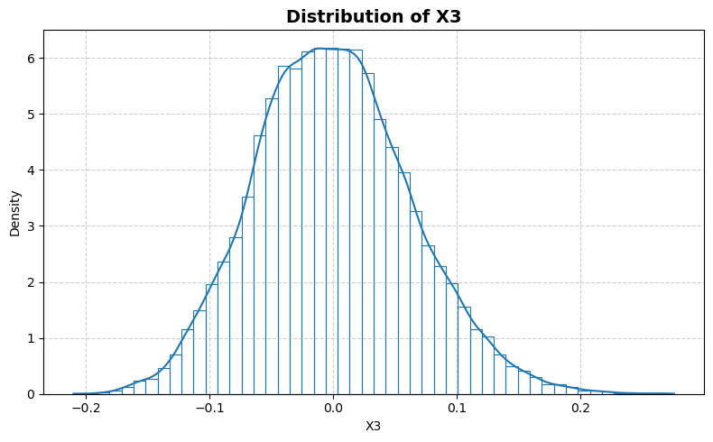
    


    
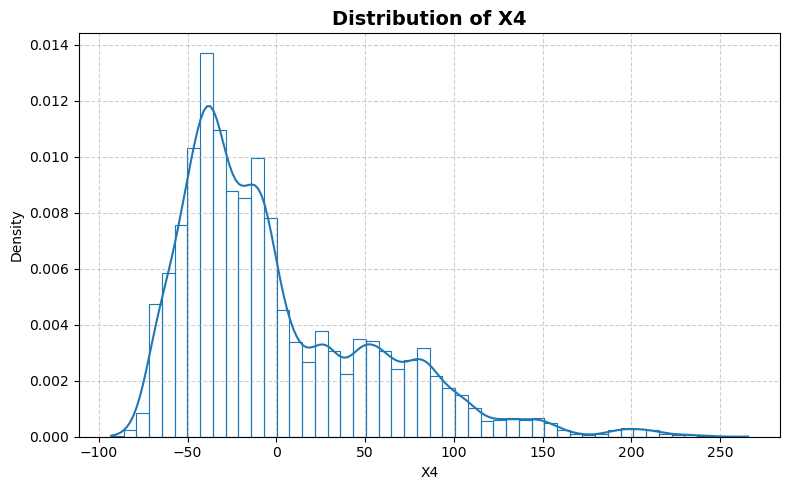
    


    
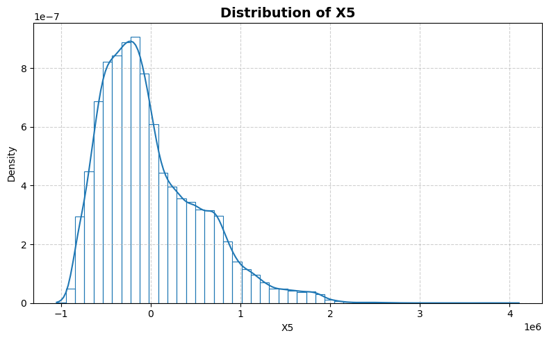
    


    
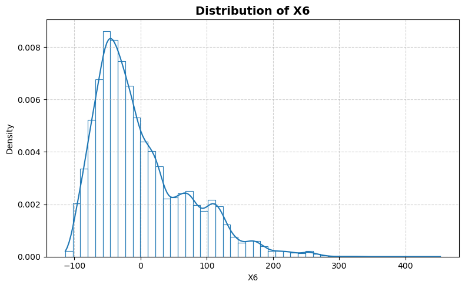
    


    
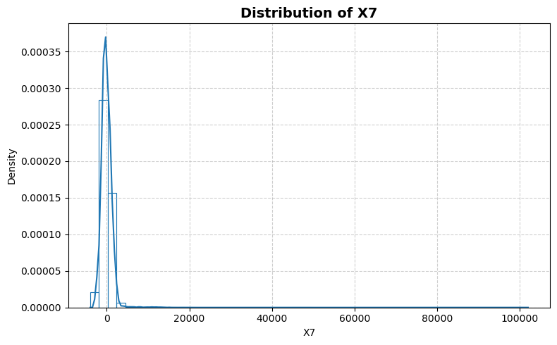
    


    
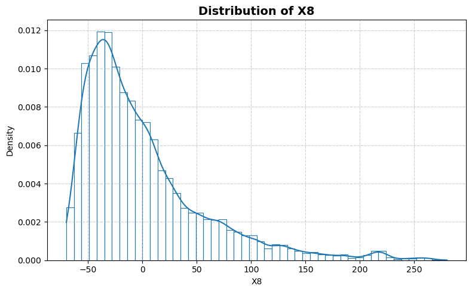
    


    
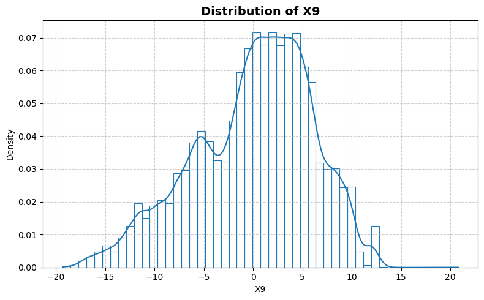
    


    
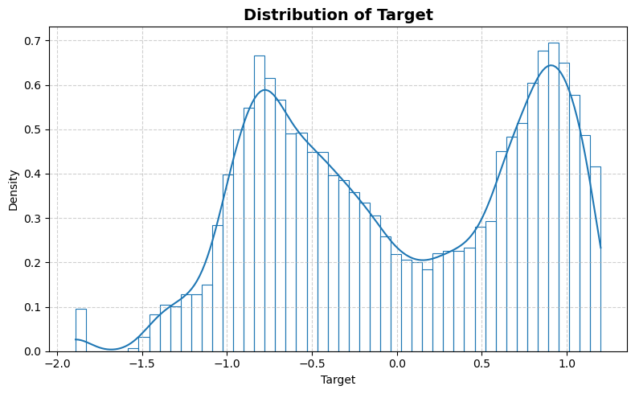
    


```python
statistics_man.plot_box()
```


    
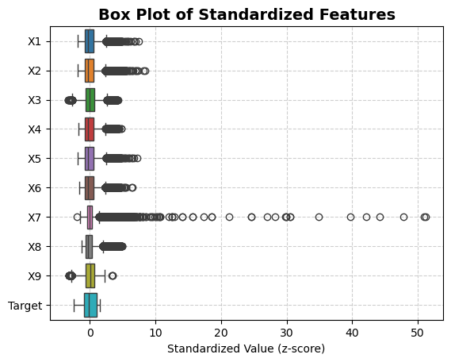
    


```python
statistics_man.print_stat_sum()
```

    Number of samples : 45730
    Number of features: 9
    ==============================


<div>
<table border="1" class="dataframe">
  <thead>
    <tr style="text-align: right;">
      <th></th>
      <th>dtype</th>
      <th>missing</th>
      <th>count</th>
      <th>median</th>
      <th>mean</th>
      <th>std</th>
      <th>min</th>
      <th>25%</th>
      <th>50%</th>
      <th>75%</th>
      <th>max</th>
    </tr>
  </thead>
  <tbody>
    <tr>
      <th>X1</th>
      <td>float64</td>
      <td>0</td>
      <td>45730.0</td>
      <td>-972.795000</td>
      <td>1.014957e-03</td>
      <td>4058.139826</td>
      <td>-7.479500e+03</td>
      <td>-2934.925000</td>
      <td>-972.795000</td>
      <td>2254.550000</td>
      <td>3.016300e+04</td>
    </tr>
    <tr>
      <th>X2</th>
      <td>float64</td>
      <td>0</td>
      <td>45730.0</td>
      <td>-349.215000</td>
      <td>-3.764569e-04</td>
      <td>1464.324771</td>
      <td>-2.613900e+03</td>
      <td>-1038.300000</td>
      <td>-349.215000</td>
      <td>769.040000</td>
      <td>1.229500e+04</td>
    </tr>
    <tr>
      <th>X3</th>
      <td>float64</td>
      <td>0</td>
      <td>45730.0</td>
      <td>-0.002242</td>
      <td>1.190875e-07</td>
      <td>0.062886</td>
      <td>-2.098900e-01</td>
      <td>-0.043652</td>
      <td>-0.002242</td>
      <td>0.040498</td>
      <td>2.753000e-01</td>
    </tr>
    <tr>
      <th>X4</th>
      <td>float64</td>
      <td>0</td>
      <td>45730.0</td>
      <td>-15.751500</td>
      <td>1.038591e-04</td>
      <td>55.425092</td>
      <td>-9.318200e+01</td>
      <td>-39.928500</td>
      <td>-15.751500</td>
      <td>30.154750</td>
      <td>2.658200e+02</td>
    </tr>
    <tr>
      <th>X5</th>
      <td>float64</td>
      <td>0</td>
      <td>45730.0</td>
      <td>-131080.000000</td>
      <td>4.923267e-03</td>
      <td>564036.687794</td>
      <td>-1.048800e+06</td>
      <td>-414707.500000</td>
      <td>-131080.000000</td>
      <td>322620.000000</td>
      <td>4.103700e+06</td>
    </tr>
    <tr>
      <th>X6</th>
      <td>float64</td>
      <td>0</td>
      <td>45730.0</td>
      <td>-19.462000</td>
      <td>-2.325190e-05</td>
      <td>69.999118</td>
      <td>-1.136700e+02</td>
      <td>-50.881000</td>
      <td>-19.462000</td>
      <td>35.830500</td>
      <td>4.527700e+02</td>
    </tr>
    <tr>
      <th>X7</th>
      <td>float64</td>
      <td>0</td>
      <td>45730.0</td>
      <td>-149.590000</td>
      <td>-2.106749e-03</td>
      <td>1993.579517</td>
      <td>-3.989800e+03</td>
      <td>-824.437500</td>
      <td>-149.590000</td>
      <td>654.432500</td>
      <td>1.019600e+05</td>
    </tr>
    <tr>
      <th>X8</th>
      <td>float64</td>
      <td>0</td>
      <td>45730.0</td>
      <td>-15.975000</td>
      <td>-2.738638e-04</td>
      <td>56.492545</td>
      <td>-6.997500e+01</td>
      <td>-38.975000</td>
      <td>-15.975000</td>
      <td>21.025000</td>
      <td>2.800200e+02</td>
    </tr>
    <tr>
      <th>X9</th>
      <td>float64</td>
      <td>0</td>
      <td>45730.0</td>
      <td>0.775640</td>
      <td>-2.367480e-05</td>
      <td>5.979754</td>
      <td>-1.929600e+01</td>
      <td>-4.098975</td>
      <td>0.775640</td>
      <td>4.347100</td>
      <td>2.077700e+01</td>
    </tr>
    <tr>
      <th>Target</th>
      <td>float64</td>
      <td>0</td>
      <td>45730.0</td>
      <td>-0.094444</td>
      <td>-2.836525e-07</td>
      <td>0.773012</td>
      <td>-1.891200e+00</td>
      <td>-0.695750</td>
      <td>-0.094444</td>
      <td>0.774580</td>
      <td>1.199800e+00</td>
    </tr>
  </tbody>
</table>
</div>


```python
statistics_man.plot_corr_heatmap()
```


    
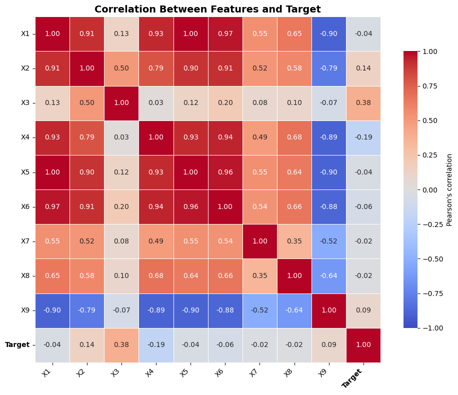
    

