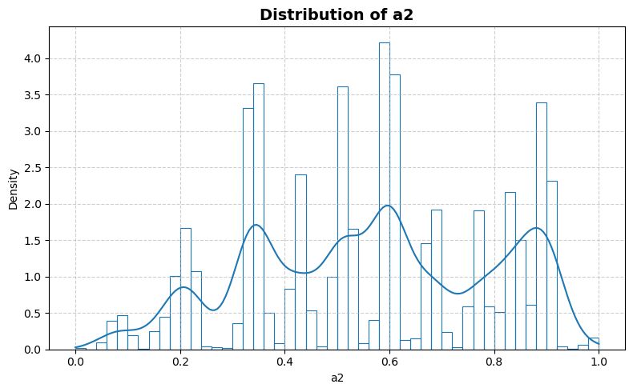
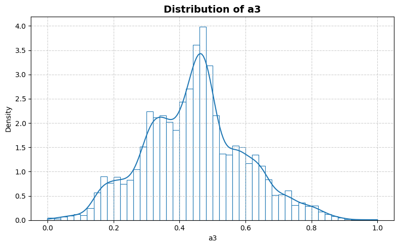
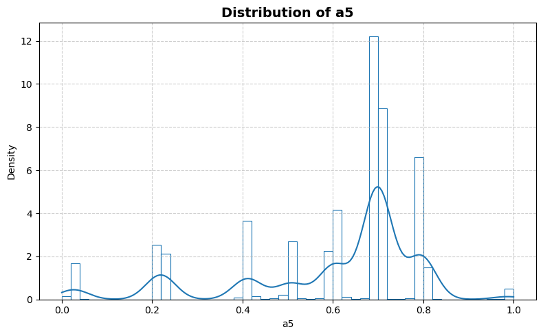
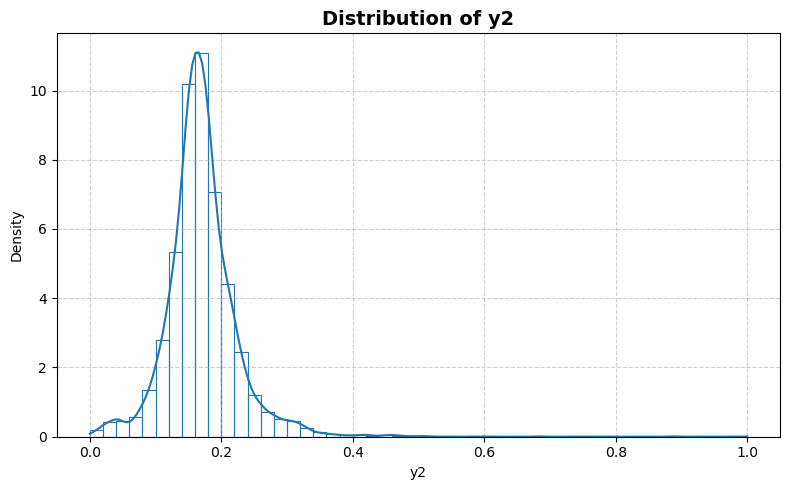
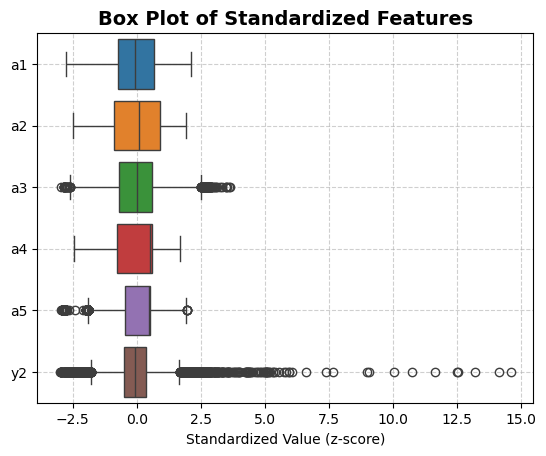
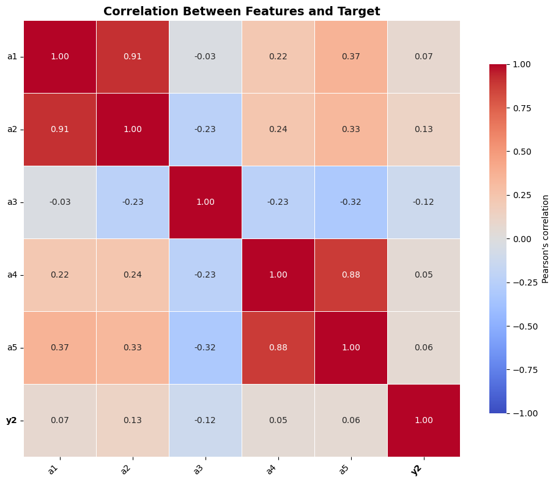

```python
from stat_sum_func import ToParquet, DatasetStatistics
```


```python
file = "sulfur_2"
path = f"raw/{file}/{file}.parquet"
statistics_man = DatasetStatistics(path)
statistics_man.df
```


<div>
<table border="1" class="dataframe">
  <thead>
    <tr style="text-align: right;">
      <th></th>
      <th>a1</th>
      <th>a2</th>
      <th>a3</th>
      <th>a4</th>
      <th>a5</th>
      <th>y2</th>
    </tr>
  </thead>
  <tbody>
    <tr>
      <th>0</th>
      <td>0.663113</td>
      <td>0.774276</td>
      <td>0.470970</td>
      <td>0.096044</td>
      <td>0.019865</td>
      <td>0.191476</td>
    </tr>
    <tr>
      <th>1</th>
      <td>0.659960</td>
      <td>0.766021</td>
      <td>0.473398</td>
      <td>0.111023</td>
      <td>0.027957</td>
      <td>0.174192</td>
    </tr>
    <tr>
      <th>2</th>
      <td>0.654670</td>
      <td>0.767519</td>
      <td>0.474198</td>
      <td>0.105410</td>
      <td>0.028907</td>
      <td>0.165544</td>
    </tr>
    <tr>
      <th>3</th>
      <td>0.653325</td>
      <td>0.769922</td>
      <td>0.475963</td>
      <td>0.066221</td>
      <td>0.029411</td>
      <td>0.168190</td>
    </tr>
    <tr>
      <th>4</th>
      <td>0.654726</td>
      <td>0.760449</td>
      <td>0.478833</td>
      <td>0.033746</td>
      <td>0.031592</td>
      <td>0.170836</td>
    </tr>
    <tr>
      <th>...</th>
      <td>...</td>
      <td>...</td>
      <td>...</td>
      <td>...</td>
      <td>...</td>
      <td>...</td>
    </tr>
    <tr>
      <th>10076</th>
      <td>0.553956</td>
      <td>0.605635</td>
      <td>0.598424</td>
      <td>0.059032</td>
      <td>0.023336</td>
      <td>0.131703</td>
    </tr>
    <tr>
      <th>10077</th>
      <td>0.552458</td>
      <td>0.596963</td>
      <td>0.600553</td>
      <td>0.058193</td>
      <td>0.027241</td>
      <td>0.133950</td>
    </tr>
    <tr>
      <th>10078</th>
      <td>0.553635</td>
      <td>0.606105</td>
      <td>0.599118</td>
      <td>0.075588</td>
      <td>0.024404</td>
      <td>0.136196</td>
    </tr>
    <tr>
      <th>10079</th>
      <td>0.554811</td>
      <td>0.607081</td>
      <td>0.594603</td>
      <td>0.066097</td>
      <td>0.025846</td>
      <td>0.138443</td>
    </tr>
    <tr>
      <th>10080</th>
      <td>0.552536</td>
      <td>0.587002</td>
      <td>0.586568</td>
      <td>0.070876</td>
      <td>0.033292</td>
      <td>0.140690</td>
    </tr>
  </tbody>
</table>
<p>10081 rows × 6 columns</p>
</div>


```python
for feature in statistics_man.df.columns:
    statistics_man.plot_distribution(feature)
```


    

    


    

    


    

    


    

    


    

    


    

    


```python
statistics_man.plot_box()
```


    

    


```python
statistics_man.print_stat_sum()
```

    Number of samples : 10081
    Number of features: 5
    ==============================


<div>
<table border="1" class="dataframe">
  <thead>
    <tr style="text-align: right;">
      <th></th>
      <th>dtype</th>
      <th>missing</th>
      <th>count</th>
      <th>median</th>
      <th>mean</th>
      <th>std</th>
      <th>min</th>
      <th>25%</th>
      <th>50%</th>
      <th>75%</th>
      <th>max</th>
    </tr>
  </thead>
  <tbody>
    <tr>
      <th>a1</th>
      <td>float64</td>
      <td>0</td>
      <td>10081.0</td>
      <td>0.550183</td>
      <td>0.562323</td>
      <td>0.205353</td>
      <td>0.0</td>
      <td>0.413025</td>
      <td>0.550183</td>
      <td>0.697718</td>
      <td>1.0</td>
    </tr>
    <tr>
      <th>a2</th>
      <td>float64</td>
      <td>0</td>
      <td>10081.0</td>
      <td>0.585731</td>
      <td>0.562273</td>
      <td>0.227673</td>
      <td>0.0</td>
      <td>0.356680</td>
      <td>0.585731</td>
      <td>0.767832</td>
      <td>1.0</td>
    </tr>
    <tr>
      <th>a3</th>
      <td>float64</td>
      <td>0</td>
      <td>10081.0</td>
      <td>0.449397</td>
      <td>0.446097</td>
      <td>0.151900</td>
      <td>0.0</td>
      <td>0.341961</td>
      <td>0.449397</td>
      <td>0.536040</td>
      <td>1.0</td>
    </tr>
    <tr>
      <th>a4</th>
      <td>float64</td>
      <td>0</td>
      <td>10081.0</td>
      <td>0.722539</td>
      <td>0.594034</td>
      <td>0.241992</td>
      <td>0.0</td>
      <td>0.410040</td>
      <td>0.722539</td>
      <td>0.739497</td>
      <td>1.0</td>
    </tr>
    <tr>
      <th>a5</th>
      <td>float64</td>
      <td>0</td>
      <td>10081.0</td>
      <td>0.695339</td>
      <td>0.601057</td>
      <td>0.202937</td>
      <td>0.0</td>
      <td>0.509083</td>
      <td>0.695339</td>
      <td>0.703899</td>
      <td>1.0</td>
    </tr>
    <tr>
      <th>y2</th>
      <td>float64</td>
      <td>0</td>
      <td>10081.0</td>
      <td>0.166507</td>
      <td>0.170595</td>
      <td>0.056871</td>
      <td>0.0</td>
      <td>0.143513</td>
      <td>0.166507</td>
      <td>0.192329</td>
      <td>1.0</td>
    </tr>
  </tbody>
</table>
</div>


```python
statistics_man.plot_corr_heatmap()
```


    

    

