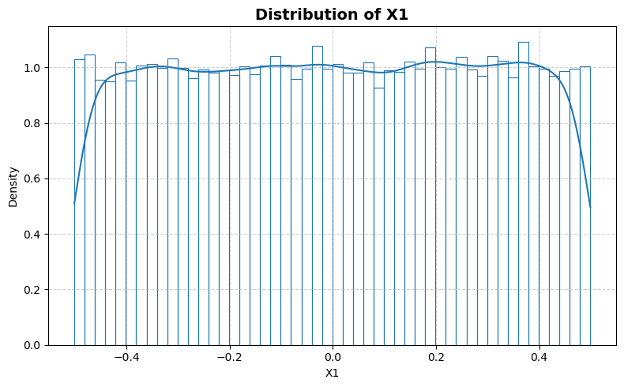
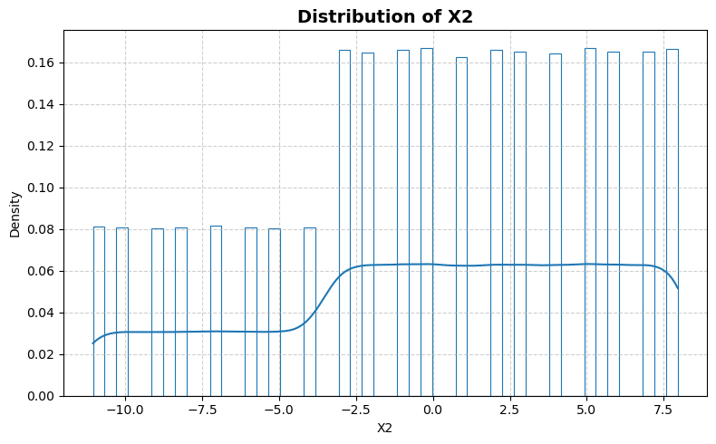
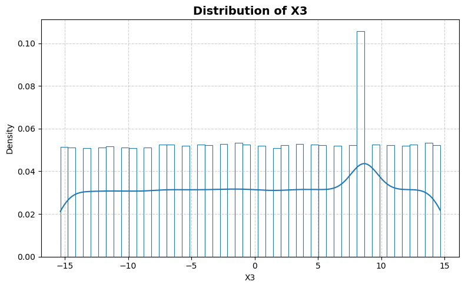
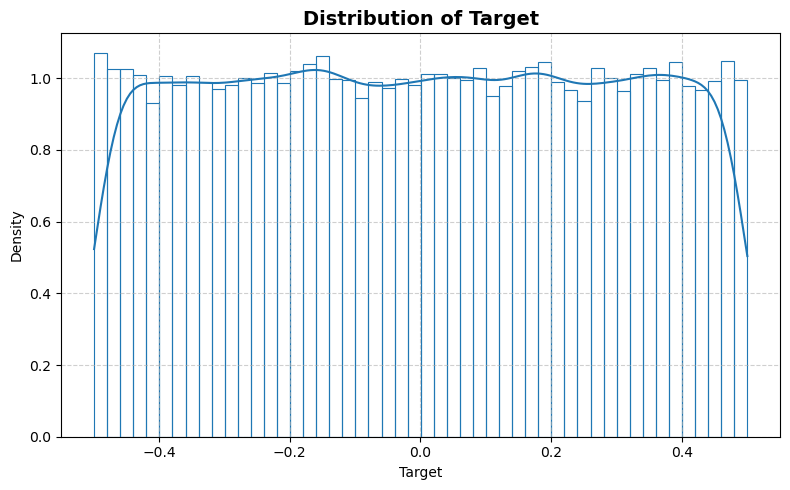
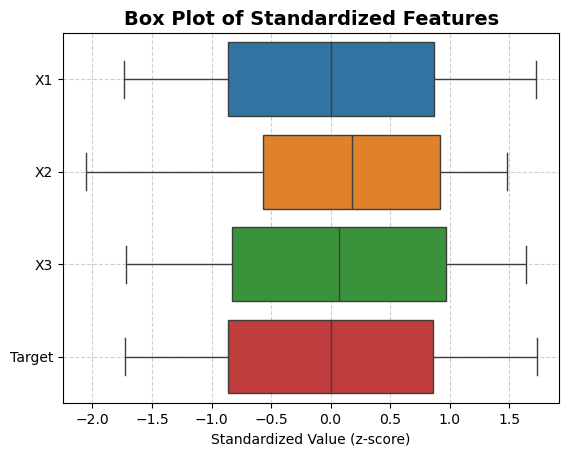
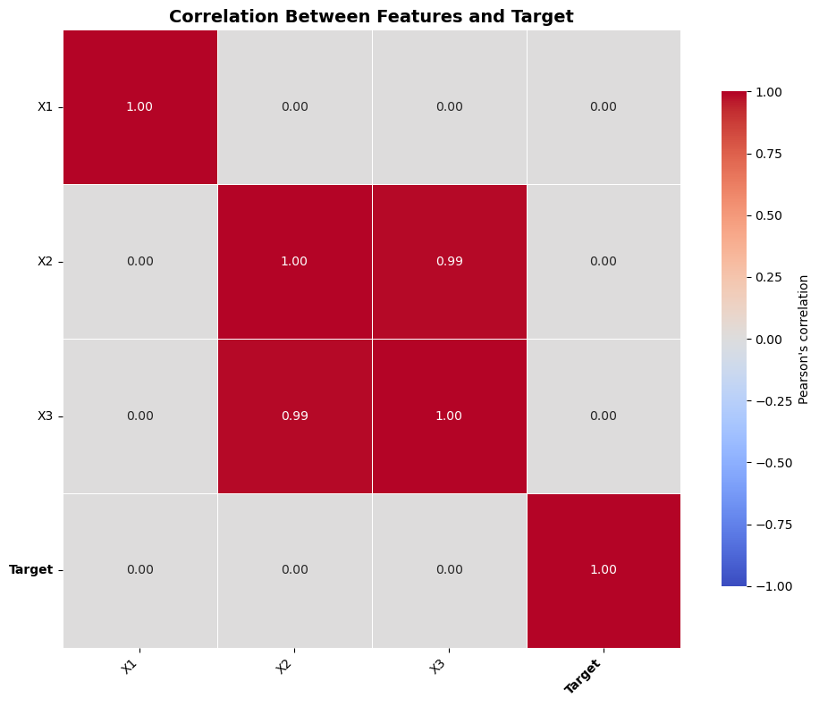

```python
from stat_sum_func import ToParquet, DatasetStatistics
```


```python
file = "tamielectric"
path = f"raw/{file}/{file}.parquet"
statistics_man = DatasetStatistics(path)
statistics_man.df
```


<div>
<table border="1" class="dataframe">
  <thead>
    <tr style="text-align: right;">
      <th></th>
      <th>X1</th>
      <th>X2</th>
      <th>X3</th>
      <th>Target</th>
    </tr>
  </thead>
  <tbody>
    <tr>
      <th>0</th>
      <td>-0.25047</td>
      <td>1.95420</td>
      <td>3.6468</td>
      <td>-0.255300</td>
    </tr>
    <tr>
      <th>1</th>
      <td>0.30217</td>
      <td>-2.04580</td>
      <td>-4.3532</td>
      <td>-0.155600</td>
    </tr>
    <tr>
      <th>2</th>
      <td>-0.19846</td>
      <td>-4.04580</td>
      <td>-8.3532</td>
      <td>-0.348850</td>
    </tr>
    <tr>
      <th>3</th>
      <td>0.36262</td>
      <td>2.95420</td>
      <td>4.6468</td>
      <td>0.086528</td>
    </tr>
    <tr>
      <th>4</th>
      <td>-0.29420</td>
      <td>6.95420</td>
      <td>11.6470</td>
      <td>0.331650</td>
    </tr>
    <tr>
      <th>...</th>
      <td>...</td>
      <td>...</td>
      <td>...</td>
      <td>...</td>
    </tr>
    <tr>
      <th>45776</th>
      <td>0.14291</td>
      <td>6.95420</td>
      <td>12.6470</td>
      <td>-0.419600</td>
    </tr>
    <tr>
      <th>45777</th>
      <td>0.47182</td>
      <td>2.95420</td>
      <td>4.6468</td>
      <td>-0.443690</td>
    </tr>
    <tr>
      <th>45778</th>
      <td>0.49160</td>
      <td>-3.04580</td>
      <td>-6.3532</td>
      <td>0.172290</td>
    </tr>
    <tr>
      <th>45779</th>
      <td>-0.32961</td>
      <td>0.95419</td>
      <td>1.6468</td>
      <td>0.066058</td>
    </tr>
    <tr>
      <th>45780</th>
      <td>0.24889</td>
      <td>4.95420</td>
      <td>8.6468</td>
      <td>0.082533</td>
    </tr>
  </tbody>
</table>
<p>45781 rows × 4 columns</p>
</div>


```python
for feature in statistics_man.df.columns:
    statistics_man.plot_distribution(feature)
```


    

    


    

    


    

    


    

    


```python
statistics_man.plot_box()
```


    

    


```python
statistics_man.print_stat_sum()
```

    Number of samples : 45781
    Number of features: 3
    ==============================


<div>
<table border="1" class="dataframe">
  <thead>
    <tr style="text-align: right;">
      <th></th>
      <th>dtype</th>
      <th>missing</th>
      <th>count</th>
      <th>median</th>
      <th>mean</th>
      <th>std</th>
      <th>min</th>
      <th>25%</th>
      <th>50%</th>
      <th>75%</th>
      <th>max</th>
    </tr>
  </thead>
  <tbody>
    <tr>
      <th>X1</th>
      <td>float64</td>
      <td>0</td>
      <td>45781.0</td>
      <td>-0.000162</td>
      <td>4.179701e-09</td>
      <td>0.288658</td>
      <td>-0.50098</td>
      <td>-0.24959</td>
      <td>-0.000162</td>
      <td>0.24990</td>
      <td>0.49901</td>
    </tr>
    <tr>
      <th>X2</th>
      <td>float64</td>
      <td>0</td>
      <td>45781.0</td>
      <td>0.954190</td>
      <td>-8.196086e-06</td>
      <td>5.369124</td>
      <td>-11.04600</td>
      <td>-3.04580</td>
      <td>0.954190</td>
      <td>4.95420</td>
      <td>7.95420</td>
    </tr>
    <tr>
      <th>X3</th>
      <td>float64</td>
      <td>0</td>
      <td>45781.0</td>
      <td>0.646840</td>
      <td>3.042834e-05</td>
      <td>8.923454</td>
      <td>-15.35300</td>
      <td>-7.35320</td>
      <td>0.646840</td>
      <td>8.64680</td>
      <td>14.64700</td>
    </tr>
    <tr>
      <th>Target</th>
      <td>float64</td>
      <td>0</td>
      <td>45781.0</td>
      <td>0.000717</td>
      <td>-4.794784e-10</td>
      <td>0.289301</td>
      <td>-0.49962</td>
      <td>-0.24958</td>
      <td>0.000717</td>
      <td>0.24992</td>
      <td>0.50033</td>
    </tr>
  </tbody>
</table>
</div>


```python
statistics_man.plot_corr_heatmap()
```


    

    

