```python
from stat_sum_func import ToParquet, DatasetStatistics
```


```python
file = "taxi"
path = f"raw/{file}/{file}.parquet"
statistics_man = DatasetStatistics(path)
statistics_man.df
```


<div>
<table border="1" class="dataframe">
  <thead>
    <tr style="text-align: right;">
      <th></th>
      <th>domain</th>
      <th>minute_oftheday_sin</th>
      <th>minute_oftheday_cos</th>
      <th>hour_sin</th>
      <th>hour_cos</th>
      <th>week_sin</th>
      <th>week_cos</th>
      <th>month_sin</th>
      <th>month_cos</th>
      <th>pickup_longitude</th>
      <th>pickup_latitude</th>
      <th>dropoff_longitude</th>
      <th>dropoff_latitude</th>
      <th>trip_duration</th>
    </tr>
  </thead>
  <tbody>
    <tr>
      <th>0</th>
      <td>0</td>
      <td>-0.156434</td>
      <td>-0.156434</td>
      <td>-2.588190e-01</td>
      <td>-2.588190e-01</td>
      <td>-0.900969</td>
      <td>-0.900969</td>
      <td>6.123234e-17</td>
      <td>6.123234e-17</td>
      <td>-0.411012</td>
      <td>0.452977</td>
      <td>-0.410915</td>
      <td>0.452951</td>
      <td>0.704884</td>
    </tr>
    <tr>
      <th>1</th>
      <td>0</td>
      <td>0.982450</td>
      <td>0.982450</td>
      <td>1.000000e+00</td>
      <td>1.000000e+00</td>
      <td>-0.222521</td>
      <td>-0.222521</td>
      <td>-1.000000e+00</td>
      <td>-1.000000e+00</td>
      <td>-0.411002</td>
      <td>0.452651</td>
      <td>-0.411108</td>
      <td>0.452568</td>
      <td>0.748243</td>
    </tr>
    <tr>
      <th>2</th>
      <td>0</td>
      <td>-0.994056</td>
      <td>-0.994056</td>
      <td>-9.659258e-01</td>
      <td>-9.659258e-01</td>
      <td>-0.900969</td>
      <td>-0.900969</td>
      <td>8.660254e-01</td>
      <td>8.660254e-01</td>
      <td>-0.410995</td>
      <td>0.452933</td>
      <td>-0.411141</td>
      <td>0.452334</td>
      <td>0.882335</td>
    </tr>
    <tr>
      <th>3</th>
      <td>0</td>
      <td>0.390731</td>
      <td>0.390731</td>
      <td>2.588190e-01</td>
      <td>2.588190e-01</td>
      <td>1.000000</td>
      <td>1.000000</td>
      <td>-5.000000e-01</td>
      <td>-5.000000e-01</td>
      <td>-0.411167</td>
      <td>0.452444</td>
      <td>-0.411179</td>
      <td>0.452297</td>
      <td>0.698107</td>
    </tr>
    <tr>
      <th>4</th>
      <td>0</td>
      <td>-0.923880</td>
      <td>-0.923880</td>
      <td>-9.659258e-01</td>
      <td>-9.659258e-01</td>
      <td>-0.222521</td>
      <td>-0.222521</td>
      <td>6.123234e-17</td>
      <td>6.123234e-17</td>
      <td>-0.410961</td>
      <td>0.453258</td>
      <td>-0.410961</td>
      <td>0.453139</td>
      <td>0.699706</td>
    </tr>
    <tr>
      <th>...</th>
      <td>...</td>
      <td>...</td>
      <td>...</td>
      <td>...</td>
      <td>...</td>
      <td>...</td>
      <td>...</td>
      <td>...</td>
      <td>...</td>
      <td>...</td>
      <td>...</td>
      <td>...</td>
      <td>...</td>
      <td>...</td>
    </tr>
    <tr>
      <th>1498808</th>
      <td>3</td>
      <td>-0.548293</td>
      <td>-0.548293</td>
      <td>-5.000000e-01</td>
      <td>-5.000000e-01</td>
      <td>0.623490</td>
      <td>0.623490</td>
      <td>5.000000e-01</td>
      <td>5.000000e-01</td>
      <td>-0.436441</td>
      <td>-0.003111</td>
      <td>-0.436412</td>
      <td>-0.003499</td>
      <td>0.773141</td>
    </tr>
    <tr>
      <th>1498809</th>
      <td>3</td>
      <td>-0.434445</td>
      <td>-0.434445</td>
      <td>-2.588190e-01</td>
      <td>-2.588190e-01</td>
      <td>0.623490</td>
      <td>0.623490</td>
      <td>5.000000e-01</td>
      <td>5.000000e-01</td>
      <td>-0.436119</td>
      <td>-0.002278</td>
      <td>-0.435722</td>
      <td>-0.003657</td>
      <td>0.959005</td>
    </tr>
    <tr>
      <th>1498810</th>
      <td>3</td>
      <td>-0.629320</td>
      <td>-0.629320</td>
      <td>-5.000000e-01</td>
      <td>-5.000000e-01</td>
      <td>0.623490</td>
      <td>0.623490</td>
      <td>5.000000e-01</td>
      <td>5.000000e-01</td>
      <td>-0.436030</td>
      <td>-0.001942</td>
      <td>-0.436040</td>
      <td>-0.001951</td>
      <td>0.906989</td>
    </tr>
    <tr>
      <th>1498811</th>
      <td>3</td>
      <td>0.267238</td>
      <td>0.267238</td>
      <td>5.000000e-01</td>
      <td>5.000000e-01</td>
      <td>0.623490</td>
      <td>0.623490</td>
      <td>5.000000e-01</td>
      <td>5.000000e-01</td>
      <td>-0.436390</td>
      <td>-0.002853</td>
      <td>-0.436391</td>
      <td>-0.002853</td>
      <td>0.519522</td>
    </tr>
    <tr>
      <th>1498812</th>
      <td>3</td>
      <td>-0.203642</td>
      <td>-0.203642</td>
      <td>6.123234e-17</td>
      <td>6.123234e-17</td>
      <td>0.623490</td>
      <td>0.623490</td>
      <td>5.000000e-01</td>
      <td>5.000000e-01</td>
      <td>-0.435733</td>
      <td>-0.003795</td>
      <td>-0.435813</td>
      <td>-0.003638</td>
      <td>0.742910</td>
    </tr>
  </tbody>
</table>
<p>1498813 rows × 14 columns</p>
</div>


```python
for feature in statistics_man.df.columns:
    statistics_man.plot_distribution(feature)
```


    
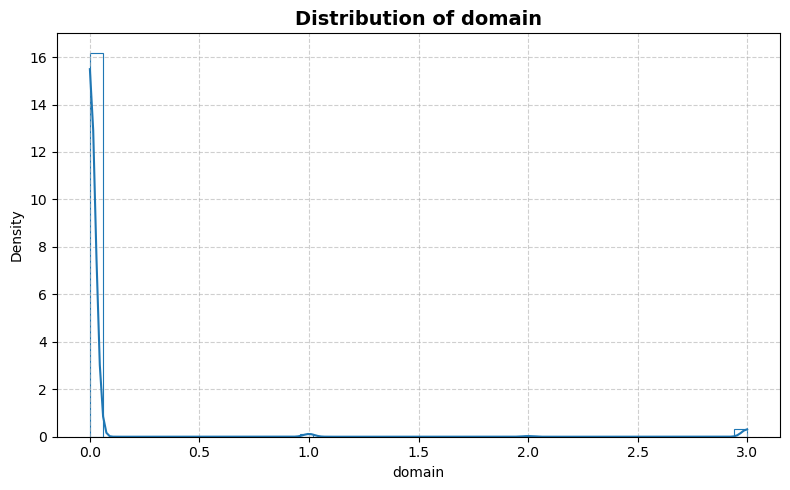
    


    
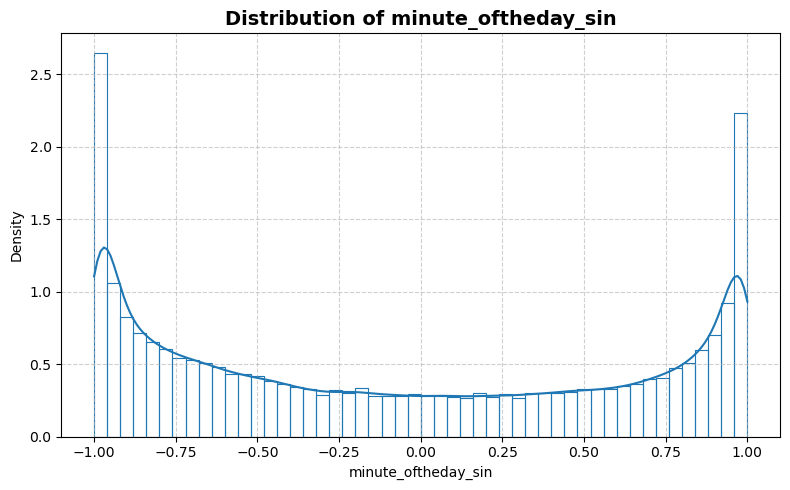
    


    

    


    

    


    
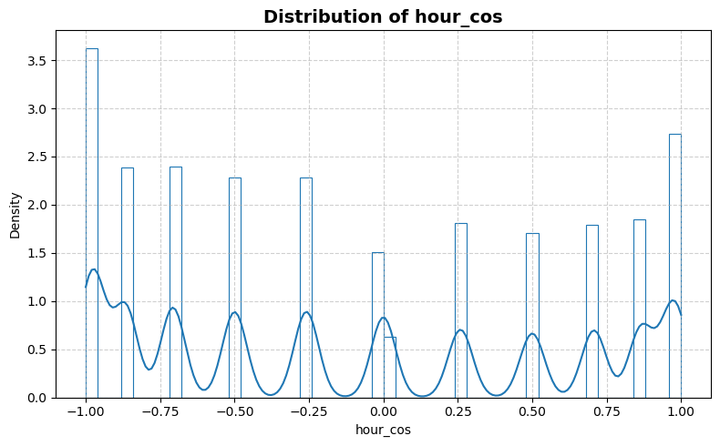
    


    
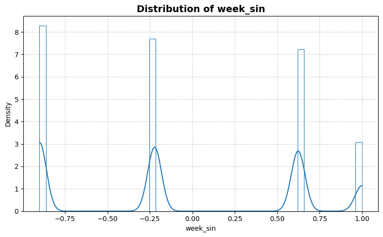
    


    
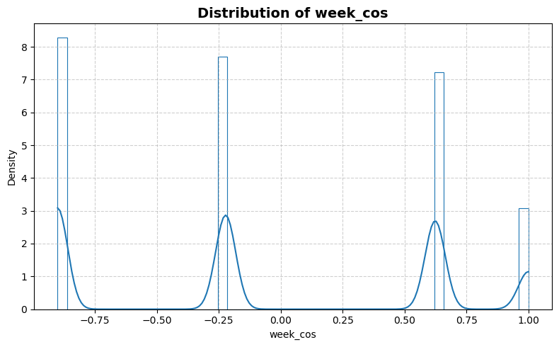
    


    
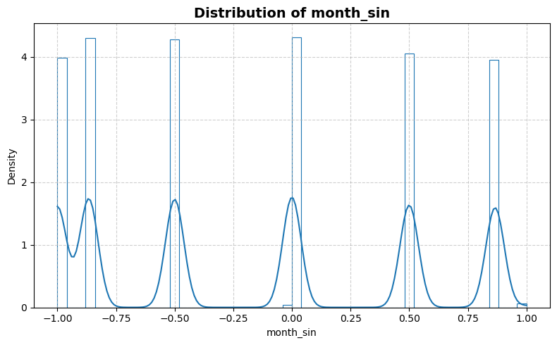
    


    
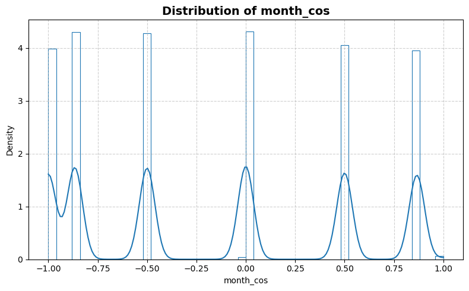
    


    

    


    
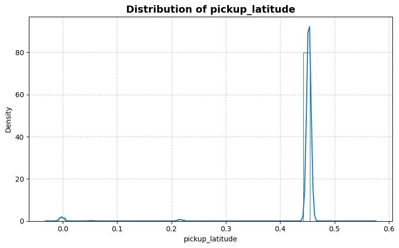
    


    
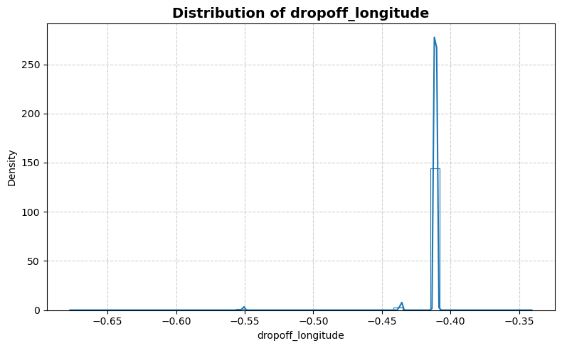
    


    
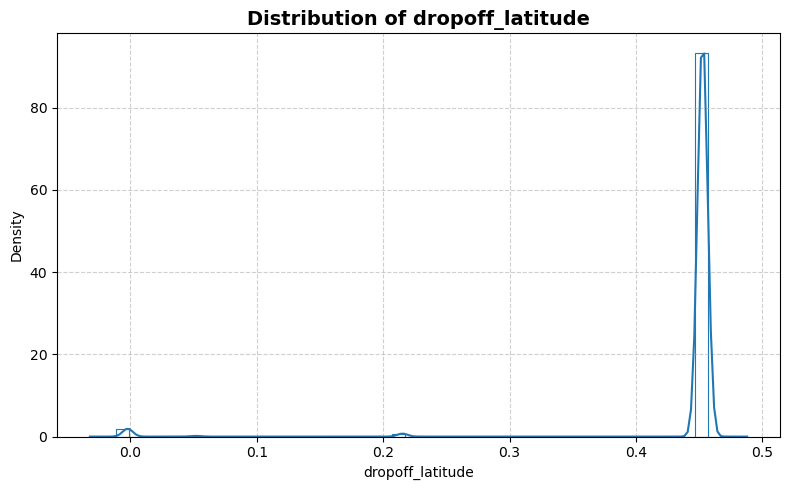
    


    
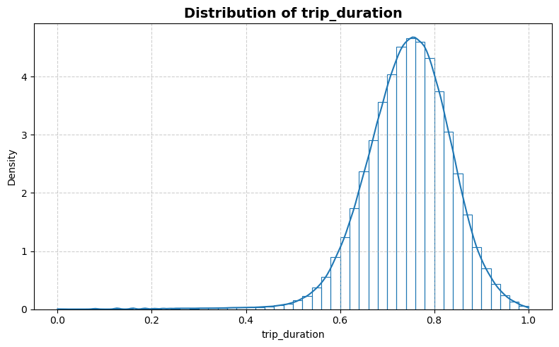
    


```python
statistics_man.plot_box()
```


    
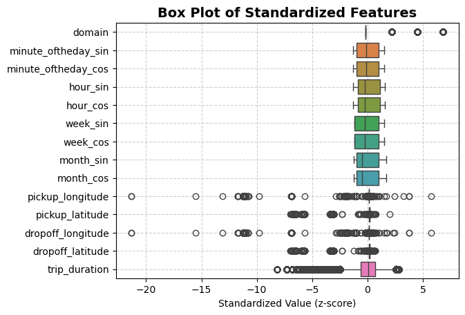
    


```python
statistics_man.print_stat_sum()
```

    Number of samples : 1498813
    Number of features: 13
    ==============================


<div>
<table border="1" class="dataframe">
  <thead>
    <tr style="text-align: right;">
      <th></th>
      <th>dtype</th>
      <th>missing</th>
      <th>count</th>
      <th>median</th>
      <th>mean</th>
      <th>std</th>
      <th>min</th>
      <th>25%</th>
      <th>50%</th>
      <th>75%</th>
      <th>max</th>
    </tr>
  </thead>
  <tbody>
    <tr>
      <th>domain</th>
      <td>int64</td>
      <td>0</td>
      <td>1498813.0</td>
      <td>0.000000</td>
      <td>0.069245</td>
      <td>0.429941</td>
      <td>0.000000</td>
      <td>0.000000</td>
      <td>0.000000</td>
      <td>0.000000</td>
      <td>3.000000</td>
    </tr>
    <tr>
      <th>minute_oftheday_sin</th>
      <td>float64</td>
      <td>0</td>
      <td>1498813.0</td>
      <td>-0.156434</td>
      <td>-0.064543</td>
      <td>0.720119</td>
      <td>-1.000000</td>
      <td>-0.777146</td>
      <td>-0.156434</td>
      <td>0.678801</td>
      <td>1.000000</td>
    </tr>
    <tr>
      <th>minute_oftheday_cos</th>
      <td>float64</td>
      <td>0</td>
      <td>1498813.0</td>
      <td>-0.156434</td>
      <td>-0.064543</td>
      <td>0.720119</td>
      <td>-1.000000</td>
      <td>-0.777146</td>
      <td>-0.156434</td>
      <td>0.678801</td>
      <td>1.000000</td>
    </tr>
    <tr>
      <th>hour_sin</th>
      <td>float64</td>
      <td>0</td>
      <td>1498813.0</td>
      <td>-0.258819</td>
      <td>-0.087534</td>
      <td>0.705042</td>
      <td>-1.000000</td>
      <td>-0.707107</td>
      <td>-0.258819</td>
      <td>0.707107</td>
      <td>1.000000</td>
    </tr>
    <tr>
      <th>hour_cos</th>
      <td>float64</td>
      <td>0</td>
      <td>1498813.0</td>
      <td>-0.258819</td>
      <td>-0.087534</td>
      <td>0.705042</td>
      <td>-1.000000</td>
      <td>-0.707107</td>
      <td>-0.258819</td>
      <td>0.707107</td>
      <td>1.000000</td>
    </tr>
    <tr>
      <th>week_sin</th>
      <td>float64</td>
      <td>0</td>
      <td>1498813.0</td>
      <td>-0.222521</td>
      <td>-0.060814</td>
      <td>0.700371</td>
      <td>-0.900969</td>
      <td>-0.900969</td>
      <td>-0.222521</td>
      <td>0.623490</td>
      <td>1.000000</td>
    </tr>
    <tr>
      <th>week_cos</th>
      <td>float64</td>
      <td>0</td>
      <td>1498813.0</td>
      <td>-0.222521</td>
      <td>-0.060814</td>
      <td>0.700371</td>
      <td>-0.900969</td>
      <td>-0.900969</td>
      <td>-0.222521</td>
      <td>0.623490</td>
      <td>1.000000</td>
    </tr>
    <tr>
      <th>month_sin</th>
      <td>float64</td>
      <td>0</td>
      <td>1498813.0</td>
      <td>-0.500000</td>
      <td>-0.173497</td>
      <td>0.680349</td>
      <td>-1.000000</td>
      <td>-0.866025</td>
      <td>-0.500000</td>
      <td>0.500000</td>
      <td>1.000000</td>
    </tr>
    <tr>
      <th>month_cos</th>
      <td>float64</td>
      <td>0</td>
      <td>1498813.0</td>
      <td>-0.500000</td>
      <td>-0.173497</td>
      <td>0.680349</td>
      <td>-1.000000</td>
      <td>-0.866025</td>
      <td>-0.500000</td>
      <td>0.500000</td>
      <td>1.000000</td>
    </tr>
    <tr>
      <th>pickup_longitude</th>
      <td>float64</td>
      <td>0</td>
      <td>1498813.0</td>
      <td>-0.411012</td>
      <td>-0.412486</td>
      <td>0.012420</td>
      <td>-0.677407</td>
      <td>-0.411072</td>
      <td>-0.411012</td>
      <td>-0.410933</td>
      <td>-0.340753</td>
    </tr>
    <tr>
      <th>pickup_latitude</th>
      <td>float64</td>
      <td>0</td>
      <td>1498813.0</td>
      <td>0.452810</td>
      <td>0.441493</td>
      <td>0.067777</td>
      <td>-0.031953</td>
      <td>0.452610</td>
      <td>0.452810</td>
      <td>0.452976</td>
      <td>0.576456</td>
    </tr>
    <tr>
      <th>dropoff_longitude</th>
      <td>float64</td>
      <td>0</td>
      <td>1498813.0</td>
      <td>-0.411003</td>
      <td>-0.412485</td>
      <td>0.012419</td>
      <td>-0.677407</td>
      <td>-0.411068</td>
      <td>-0.411003</td>
      <td>-0.410910</td>
      <td>-0.340753</td>
    </tr>
    <tr>
      <th>dropoff_latitude</th>
      <td>float64</td>
      <td>0</td>
      <td>1498813.0</td>
      <td>0.452815</td>
      <td>0.441502</td>
      <td>0.067780</td>
      <td>-0.032034</td>
      <td>0.452593</td>
      <td>0.452815</td>
      <td>0.452991</td>
      <td>0.488011</td>
    </tr>
    <tr>
      <th>trip_duration</th>
      <td>float64</td>
      <td>0</td>
      <td>1498813.0</td>
      <td>0.748590</td>
      <td>0.744064</td>
      <td>0.090856</td>
      <td>0.000000</td>
      <td>0.689468</td>
      <td>0.748590</td>
      <td>0.804546</td>
      <td>0.999980</td>
    </tr>
  </tbody>
</table>
</div>


```python
statistics_man.plot_corr_heatmap()
```


    
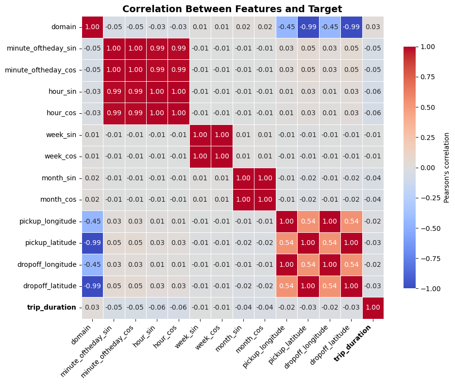
    

