# Import libraries


```python
from stat_sum_func import SplittedDatasetStatistics
```

# Splitted Data statistics summary


```python
file = "3droad"
```

## Random_Split


```python
train_path = f"splitted/{file}/Random_Split/train_0.parquet"
test_path = f"splitted/{file}/Random_Split/test_0.parquet"

statistics_man = SplittedDatasetStatistics(train_path, test_path)

print("==" * 20 + "Train data Samples" + "==" * 20)
display(statistics_man.train.df)

print("==" * 20 + "Test data Samples" + "==" * 20)

display(statistics_man.test.df)
```

    ========================================Train data Samples========================================


<div>


<table border="1" class="dataframe">
  <thead>
    <tr style="text-align: right;">
      <th></th>
      <th>X1</th>
      <th>X2</th>
      <th>X3</th>
      <th>target</th>
    </tr>
  </thead>
  <tbody>
    <tr>
      <th>0</th>
      <td>-1.522200</td>
      <td>1.248700</td>
      <td>0.93864</td>
      <td>-15.8090</td>
    </tr>
    <tr>
      <th>1</th>
      <td>-0.062097</td>
      <td>0.388870</td>
      <td>1.72680</td>
      <td>-10.2980</td>
    </tr>
    <tr>
      <th>2</th>
      <td>0.059452</td>
      <td>0.925230</td>
      <td>0.40868</td>
      <td>35.8420</td>
    </tr>
    <tr>
      <th>3</th>
      <td>0.844510</td>
      <td>-0.621170</td>
      <td>0.18112</td>
      <td>6.5483</td>
    </tr>
    <tr>
      <th>4</th>
      <td>0.741760</td>
      <td>0.360240</td>
      <td>-1.12490</td>
      <td>-1.4642</td>
    </tr>
    <tr>
      <th>...</th>
      <td>...</td>
      <td>...</td>
      <td>...</td>
      <td>...</td>
    </tr>
    <tr>
      <th>304406</th>
      <td>1.349700</td>
      <td>0.028330</td>
      <td>0.73913</td>
      <td>-12.7560</td>
    </tr>
    <tr>
      <th>304407</th>
      <td>-0.021434</td>
      <td>0.907190</td>
      <td>0.38837</td>
      <td>70.1560</td>
    </tr>
    <tr>
      <th>304408</th>
      <td>0.798240</td>
      <td>-0.061993</td>
      <td>-0.60086</td>
      <td>37.7790</td>
    </tr>
    <tr>
      <th>304409</th>
      <td>-1.425100</td>
      <td>0.418090</td>
      <td>-0.21082</td>
      <td>-11.3810</td>
    </tr>
    <tr>
      <th>304410</th>
      <td>-1.864700</td>
      <td>0.414520</td>
      <td>-0.36037</td>
      <td>28.2500</td>
    </tr>
  </tbody>
</table>
<p>304411 rows × 4 columns</p>
</div>


    ========================================Test data Samples========================================


<div>
<table border="1" class="dataframe">
  <thead>
    <tr style="text-align: right;">
      <th></th>
      <th>X1</th>
      <th>X2</th>
      <th>X3</th>
      <th>target</th>
    </tr>
  </thead>
  <tbody>
    <tr>
      <th>0</th>
      <td>-0.026622</td>
      <td>-1.38020</td>
      <td>-0.988030</td>
      <td>-18.8280</td>
    </tr>
    <tr>
      <th>1</th>
      <td>0.978830</td>
      <td>-2.51630</td>
      <td>-1.632400</td>
      <td>-20.8350</td>
    </tr>
    <tr>
      <th>2</th>
      <td>-1.918000</td>
      <td>0.41818</td>
      <td>-0.283440</td>
      <td>-15.1660</td>
    </tr>
    <tr>
      <th>3</th>
      <td>0.077155</td>
      <td>-0.64808</td>
      <td>-0.092912</td>
      <td>6.0770</td>
    </tr>
    <tr>
      <th>4</th>
      <td>-1.699700</td>
      <td>0.23335</td>
      <td>-0.945800</td>
      <td>39.6220</td>
    </tr>
    <tr>
      <th>...</th>
      <td>...</td>
      <td>...</td>
      <td>...</td>
      <td>...</td>
    </tr>
    <tr>
      <th>130458</th>
      <td>0.266820</td>
      <td>0.10769</td>
      <td>0.234710</td>
      <td>-13.4980</td>
    </tr>
    <tr>
      <th>130459</th>
      <td>1.183200</td>
      <td>0.48634</td>
      <td>1.009700</td>
      <td>3.3794</td>
    </tr>
    <tr>
      <th>130460</th>
      <td>0.068009</td>
      <td>0.56842</td>
      <td>-0.782690</td>
      <td>30.8440</td>
    </tr>
    <tr>
      <th>130461</th>
      <td>0.274630</td>
      <td>1.02690</td>
      <td>0.246100</td>
      <td>-11.1530</td>
    </tr>
    <tr>
      <th>130462</th>
      <td>1.163100</td>
      <td>-1.72740</td>
      <td>-0.249860</td>
      <td>16.9220</td>
    </tr>
  </tbody>
</table>
<p>130463 rows × 4 columns</p>
</div>


```python
statistics_man.print_stat_sum()
```

    ========================================Train data Statistics Summary========================================
    Number of samples : 304411
    Number of features: 3
    ==============================


<div>
<table border="1" class="dataframe">
  <thead>
    <tr style="text-align: right;">
      <th></th>
      <th>dtype</th>
      <th>missing</th>
      <th>count</th>
      <th>median</th>
      <th>mean</th>
      <th>std</th>
      <th>min</th>
      <th>25%</th>
      <th>50%</th>
      <th>75%</th>
      <th>max</th>
    </tr>
  </thead>
  <tbody>
    <tr>
      <th>X1</th>
      <td>float64</td>
      <td>0</td>
      <td>304411.0</td>
      <td>0.10886</td>
      <td>-0.000589</td>
      <td>0.999486</td>
      <td>-2.4737</td>
      <td>-0.402390</td>
      <td>0.10886</td>
      <td>0.74379</td>
      <td>1.5859</td>
    </tr>
    <tr>
      <th>X2</th>
      <td>float64</td>
      <td>0</td>
      <td>304411.0</td>
      <td>0.24640</td>
      <td>-0.001214</td>
      <td>1.000344</td>
      <td>-2.5276</td>
      <td>-0.629335</td>
      <td>0.24640</td>
      <td>0.70147</td>
      <td>2.3392</td>
    </tr>
    <tr>
      <th>X3</th>
      <td>float64</td>
      <td>0</td>
      <td>304411.0</td>
      <td>-0.14302</td>
      <td>-0.000458</td>
      <td>0.999950</td>
      <td>-1.7316</td>
      <td>-0.821905</td>
      <td>-0.14302</td>
      <td>0.77599</td>
      <td>2.3033</td>
    </tr>
    <tr>
      <th>target</th>
      <td>float64</td>
      <td>0</td>
      <td>304411.0</td>
      <td>-4.56320</td>
      <td>0.015332</td>
      <td>18.611448</td>
      <td>-26.6830</td>
      <td>-15.153000</td>
      <td>-4.56320</td>
      <td>9.66225</td>
      <td>107.1000</td>
    </tr>
  </tbody>
</table>
</div>


    ========================================Test data Statistics Summary========================================
    Number of samples : 130463
    Number of features: 3
    ==============================


<div>
<table border="1" class="dataframe">
  <thead>
    <tr style="text-align: right;">
      <th></th>
      <th>dtype</th>
      <th>missing</th>
      <th>count</th>
      <th>median</th>
      <th>mean</th>
      <th>std</th>
      <th>min</th>
      <th>25%</th>
      <th>50%</th>
      <th>75%</th>
      <th>max</th>
    </tr>
  </thead>
  <tbody>
    <tr>
      <th>X1</th>
      <td>float64</td>
      <td>0</td>
      <td>130463.0</td>
      <td>0.10886</td>
      <td>0.001375</td>
      <td>1.001197</td>
      <td>-2.4737</td>
      <td>-0.401630</td>
      <td>0.10886</td>
      <td>0.745285</td>
      <td>1.5859</td>
    </tr>
    <tr>
      <th>X2</th>
      <td>float64</td>
      <td>0</td>
      <td>130463.0</td>
      <td>0.25000</td>
      <td>0.002832</td>
      <td>0.999196</td>
      <td>-2.5268</td>
      <td>-0.625675</td>
      <td>0.25000</td>
      <td>0.703995</td>
      <td>2.3391</td>
    </tr>
    <tr>
      <th>X3</th>
      <td>float64</td>
      <td>0</td>
      <td>130463.0</td>
      <td>-0.14140</td>
      <td>0.001068</td>
      <td>1.000120</td>
      <td>-1.7293</td>
      <td>-0.818790</td>
      <td>-0.14140</td>
      <td>0.778675</td>
      <td>2.3029</td>
    </tr>
    <tr>
      <th>target</th>
      <td>float64</td>
      <td>0</td>
      <td>130463.0</td>
      <td>-4.73550</td>
      <td>-0.035772</td>
      <td>18.633261</td>
      <td>-30.7940</td>
      <td>-15.169000</td>
      <td>-4.73550</td>
      <td>9.538100</td>
      <td>112.2600</td>
    </tr>
  </tbody>
</table>
</div>


```python
statistics_man.plot_pairplot()
```


    
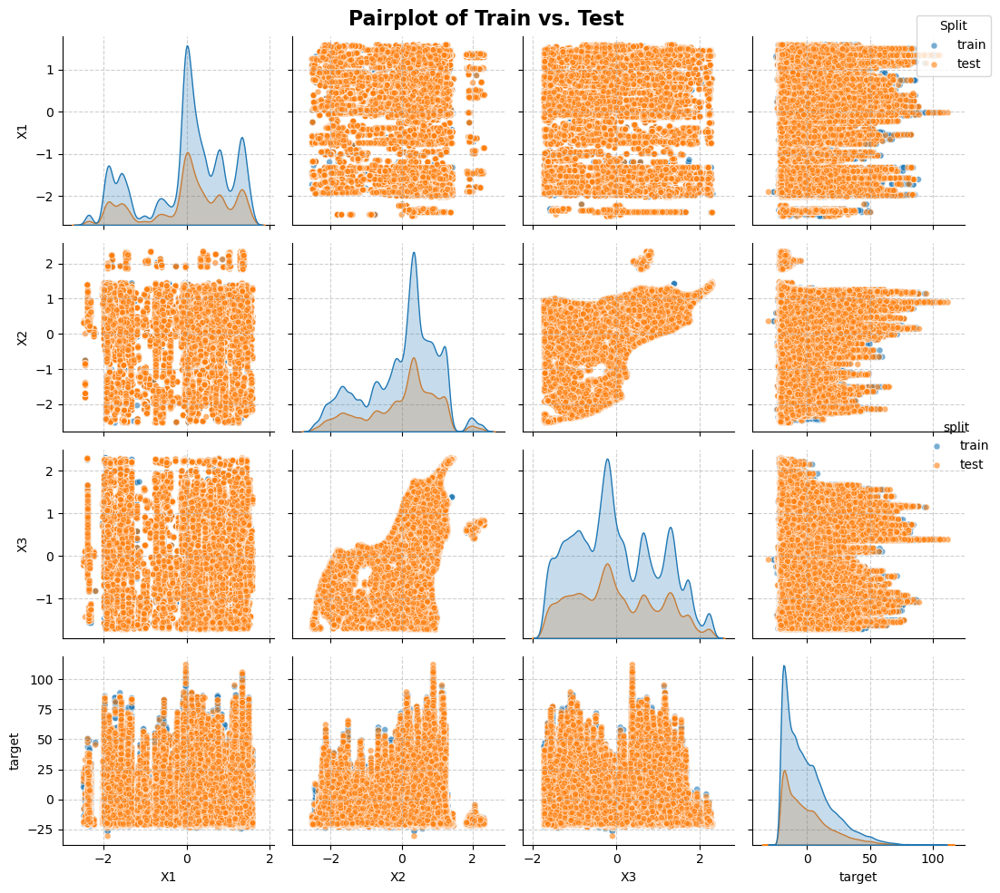
    


```python
for feature in statistics_man.df_all.columns[:-1]:
    statistics_man.plot_distribution(feature)
```


    

    


    
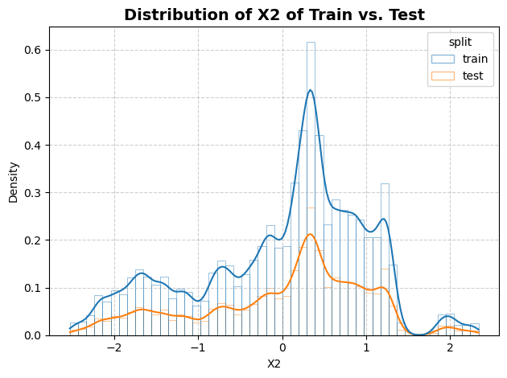
    


    
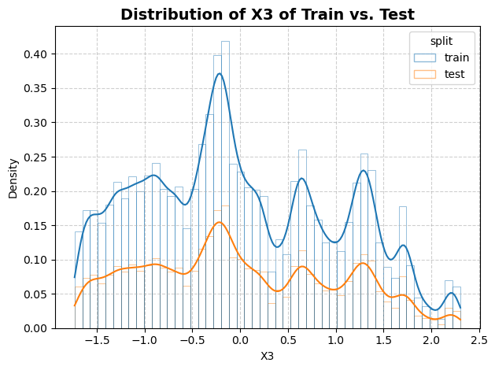
    


    

    


```python
statistics_man.plot_corr_heatmap()
```

    ========================================Train data Correlation Heatmap========================================


    

    


    ========================================Test data Correlation Heatmap========================================


    

    


## Covariate_Shift


```python
train_path = f"splitted/{file}/Covariate_Shift/train_0.parquet"
test_path = f"splitted/{file}/Covariate_Shift/test_0.parquet"

statistics_man = SplittedDatasetStatistics(train_path, test_path)

print("==" * 20 + "Train data Samples" + "==" * 20)
display(statistics_man.train.df)

print("==" * 20 + "Test data Samples" + "==" * 20)

display(statistics_man.test.df)
```

    ========================================Train data Samples========================================


<div>
<table border="1" class="dataframe">
  <thead>
    <tr style="text-align: right;">
      <th></th>
      <th>X1</th>
      <th>X2</th>
      <th>X3</th>
      <th>target</th>
    </tr>
  </thead>
  <tbody>
    <tr>
      <th>0</th>
      <td>-0.042664</td>
      <td>-1.507500</td>
      <td>-1.063100</td>
      <td>0.79023</td>
    </tr>
    <tr>
      <th>1</th>
      <td>0.304510</td>
      <td>-0.655420</td>
      <td>-0.308150</td>
      <td>-19.35600</td>
    </tr>
    <tr>
      <th>2</th>
      <td>0.134450</td>
      <td>-2.019900</td>
      <td>-1.061400</td>
      <td>-4.83680</td>
    </tr>
    <tr>
      <th>3</th>
      <td>0.211660</td>
      <td>-0.348770</td>
      <td>0.078819</td>
      <td>0.35136</td>
    </tr>
    <tr>
      <th>4</th>
      <td>0.026631</td>
      <td>-1.781700</td>
      <td>-0.375450</td>
      <td>16.67800</td>
    </tr>
    <tr>
      <th>...</th>
      <td>...</td>
      <td>...</td>
      <td>...</td>
      <td>...</td>
    </tr>
    <tr>
      <th>131121</th>
      <td>0.022998</td>
      <td>-1.661200</td>
      <td>-0.413820</td>
      <td>-12.33000</td>
    </tr>
    <tr>
      <th>131122</th>
      <td>-0.031647</td>
      <td>1.384500</td>
      <td>2.222600</td>
      <td>-20.39100</td>
    </tr>
    <tr>
      <th>131123</th>
      <td>-0.000830</td>
      <td>-0.983190</td>
      <td>-1.288300</td>
      <td>12.26800</td>
    </tr>
    <tr>
      <th>131124</th>
      <td>-0.019241</td>
      <td>-0.000993</td>
      <td>0.267010</td>
      <td>-17.97000</td>
    </tr>
    <tr>
      <th>131125</th>
      <td>0.012714</td>
      <td>0.565490</td>
      <td>-0.250180</td>
      <td>-16.67600</td>
    </tr>
  </tbody>
</table>
<p>131126 rows × 4 columns</p>
</div>


    ========================================Test data Samples========================================


<div>
<table border="1" class="dataframe">
  <thead>
    <tr style="text-align: right;">
      <th></th>
      <th>X1</th>
      <th>X2</th>
      <th>X3</th>
      <th>target</th>
    </tr>
  </thead>
  <tbody>
    <tr>
      <th>0</th>
      <td>-1.47430</td>
      <td>-0.23894</td>
      <td>-1.46360</td>
      <td>14.6410</td>
    </tr>
    <tr>
      <th>1</th>
      <td>1.26070</td>
      <td>-0.23565</td>
      <td>-0.85814</td>
      <td>12.6640</td>
    </tr>
    <tr>
      <th>2</th>
      <td>1.28120</td>
      <td>0.88266</td>
      <td>0.98573</td>
      <td>29.7380</td>
    </tr>
    <tr>
      <th>3</th>
      <td>-0.47672</td>
      <td>1.31230</td>
      <td>2.14940</td>
      <td>-17.7600</td>
    </tr>
    <tr>
      <th>4</th>
      <td>-1.98270</td>
      <td>0.86728</td>
      <td>0.25854</td>
      <td>-3.1239</td>
    </tr>
    <tr>
      <th>...</th>
      <td>...</td>
      <td>...</td>
      <td>...</td>
      <td>...</td>
    </tr>
    <tr>
      <th>303743</th>
      <td>-1.11720</td>
      <td>0.94382</td>
      <td>1.38140</td>
      <td>23.0340</td>
    </tr>
    <tr>
      <th>303744</th>
      <td>-1.55330</td>
      <td>0.47387</td>
      <td>1.71350</td>
      <td>-3.7200</td>
    </tr>
    <tr>
      <th>303745</th>
      <td>-1.79360</td>
      <td>0.83102</td>
      <td>-1.67220</td>
      <td>-17.9240</td>
    </tr>
    <tr>
      <th>303746</th>
      <td>-1.54620</td>
      <td>-0.12833</td>
      <td>0.76656</td>
      <td>7.4463</td>
    </tr>
    <tr>
      <th>303747</th>
      <td>0.43139</td>
      <td>-1.42070</td>
      <td>-1.06790</td>
      <td>-5.0441</td>
    </tr>
  </tbody>
</table>
<p>303748 rows × 4 columns</p>
</div>


```python
statistics_man.print_stat_sum()
```

    ========================================Train data Statistics Summary========================================
    Number of samples : 131126
    Number of features: 3
    ==============================


<div>

<table border="1" class="dataframe">
  <thead>
    <tr style="text-align: right;">
      <th></th>
      <th>dtype</th>
      <th>missing</th>
      <th>count</th>
      <th>median</th>
      <th>mean</th>
      <th>std</th>
      <th>min</th>
      <th>25%</th>
      <th>50%</th>
      <th>75%</th>
      <th>max</th>
    </tr>
  </thead>
  <tbody>
    <tr>
      <th>X1</th>
      <td>float64</td>
      <td>0</td>
      <td>131126.0</td>
      <td>0.108860</td>
      <td>0.125415</td>
      <td>0.124444</td>
      <td>-0.050163</td>
      <td>0.020130</td>
      <td>0.108860</td>
      <td>0.228860</td>
      <td>0.39543</td>
    </tr>
    <tr>
      <th>X2</th>
      <td>float64</td>
      <td>0</td>
      <td>131126.0</td>
      <td>-0.119695</td>
      <td>-0.254733</td>
      <td>0.991130</td>
      <td>-2.509600</td>
      <td>-0.973938</td>
      <td>-0.119695</td>
      <td>0.519645</td>
      <td>2.24260</td>
    </tr>
    <tr>
      <th>X3</th>
      <td>float64</td>
      <td>0</td>
      <td>131126.0</td>
      <td>-0.354300</td>
      <td>-0.212078</td>
      <td>0.959606</td>
      <td>-1.731600</td>
      <td>-0.979110</td>
      <td>-0.354300</td>
      <td>0.304485</td>
      <td>2.28480</td>
    </tr>
    <tr>
      <th>target</th>
      <td>float64</td>
      <td>0</td>
      <td>131126.0</td>
      <td>-6.199050</td>
      <td>-2.338466</td>
      <td>16.863319</td>
      <td>-24.085000</td>
      <td>-15.942750</td>
      <td>-6.199050</td>
      <td>6.160100</td>
      <td>112.26000</td>
    </tr>
  </tbody>
</table>
</div>


    ========================================Test data Statistics Summary========================================
    Number of samples : 303748
    Number of features: 3
    ==============================


<div>

<table border="1" class="dataframe">
  <thead>
    <tr style="text-align: right;">
      <th></th>
      <th>dtype</th>
      <th>missing</th>
      <th>count</th>
      <th>median</th>
      <th>mean</th>
      <th>std</th>
      <th>min</th>
      <th>25%</th>
      <th>50%</th>
      <th>75%</th>
      <th>max</th>
    </tr>
  </thead>
  <tbody>
    <tr>
      <th>X1</th>
      <td>float64</td>
      <td>0</td>
      <td>303748.0</td>
      <td>0.397300</td>
      <td>-0.054140</td>
      <td>1.189658</td>
      <td>-2.4737</td>
      <td>-1.399000</td>
      <td>0.397300</td>
      <td>0.943370</td>
      <td>1.5859</td>
    </tr>
    <tr>
      <th>X2</th>
      <td>float64</td>
      <td>0</td>
      <td>303748.0</td>
      <td>0.325570</td>
      <td>0.109967</td>
      <td>0.983627</td>
      <td>-2.5276</td>
      <td>-0.317173</td>
      <td>0.325570</td>
      <td>0.758373</td>
      <td>2.3392</td>
    </tr>
    <tr>
      <th>X3</th>
      <td>float64</td>
      <td>0</td>
      <td>303748.0</td>
      <td>-0.048988</td>
      <td>0.091553</td>
      <td>1.003183</td>
      <td>-1.7304</td>
      <td>-0.702983</td>
      <td>-0.048988</td>
      <td>0.895647</td>
      <td>2.3033</td>
    </tr>
    <tr>
      <th>target</th>
      <td>float64</td>
      <td>0</td>
      <td>303748.0</td>
      <td>-3.849700</td>
      <td>1.009501</td>
      <td>19.238687</td>
      <td>-30.7940</td>
      <td>-14.722000</td>
      <td>-3.849700</td>
      <td>11.274250</td>
      <td>105.9700</td>
    </tr>
  </tbody>
</table>
</div>


```python
for feature in statistics_man.df_all.columns[:-1]:
    statistics_man.plot_distribution(feature)
```


    
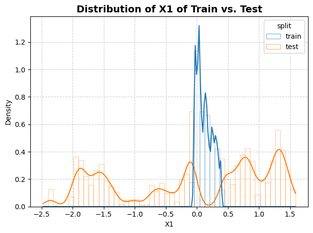
    


    
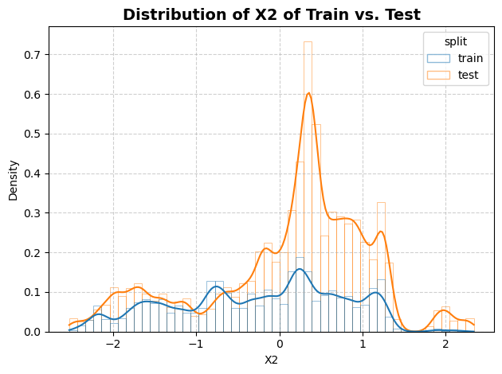
    


    
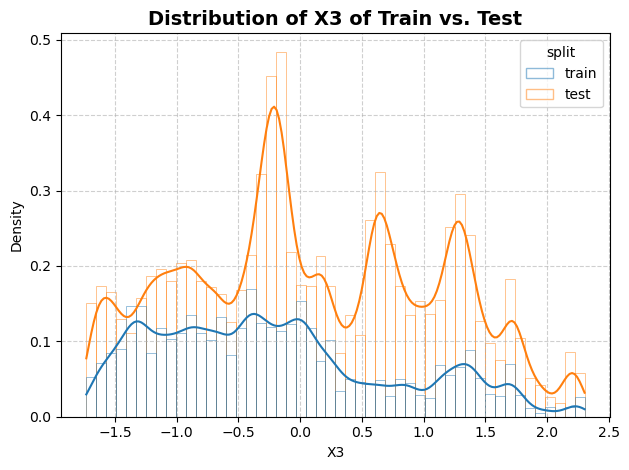
    


    
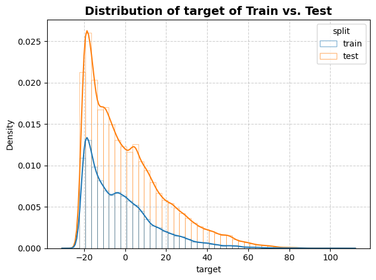
    


```python
statistics_man.plot_pairplot()
```


    
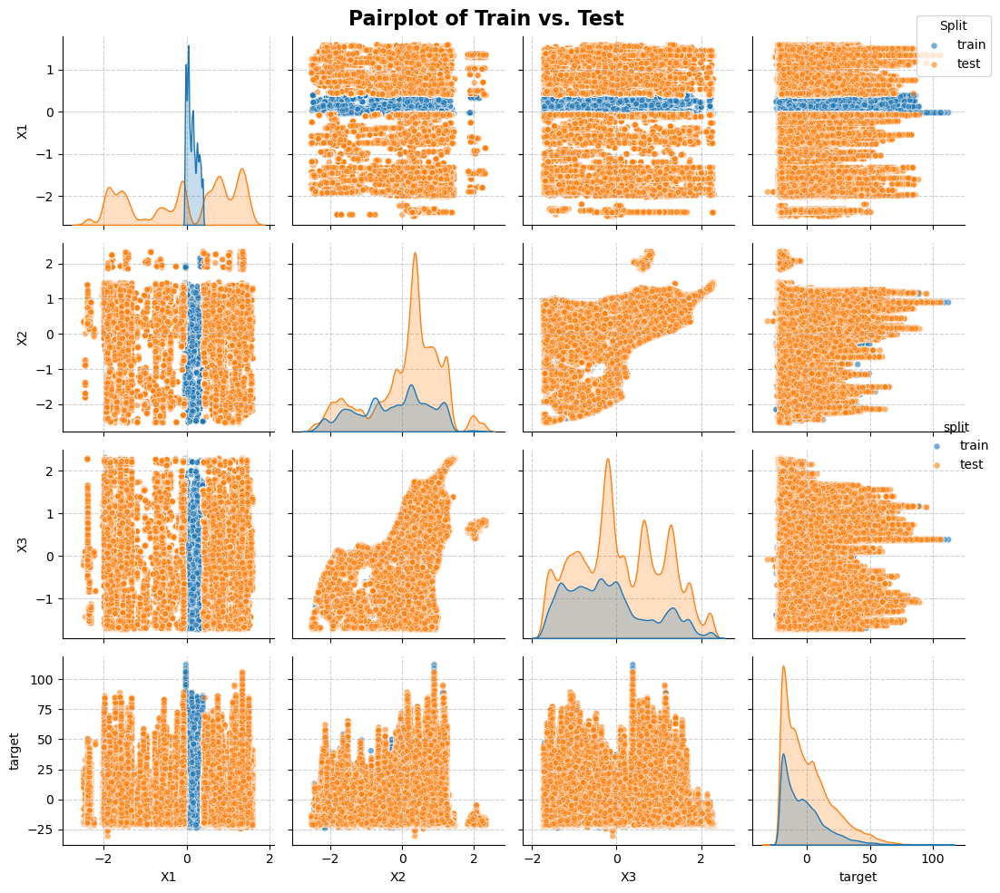
    


```python

```


```python
statistics_man.plot_corr_heatmap()
```

    ========================================Train data Correlation Heatmap========================================


    
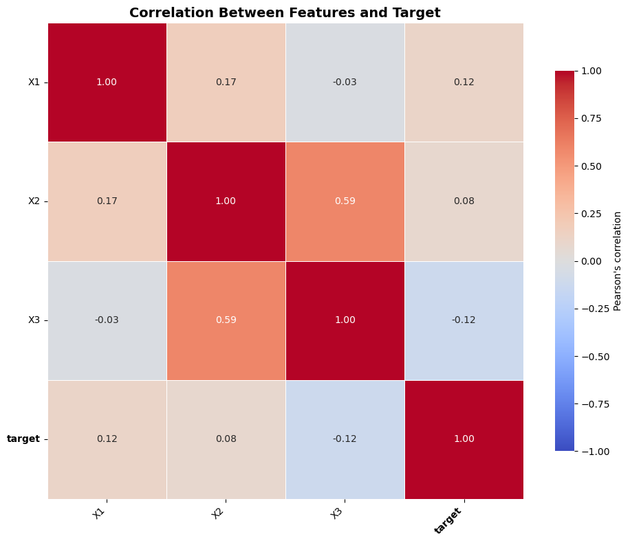
    


    ========================================Test data Correlation Heatmap========================================


    
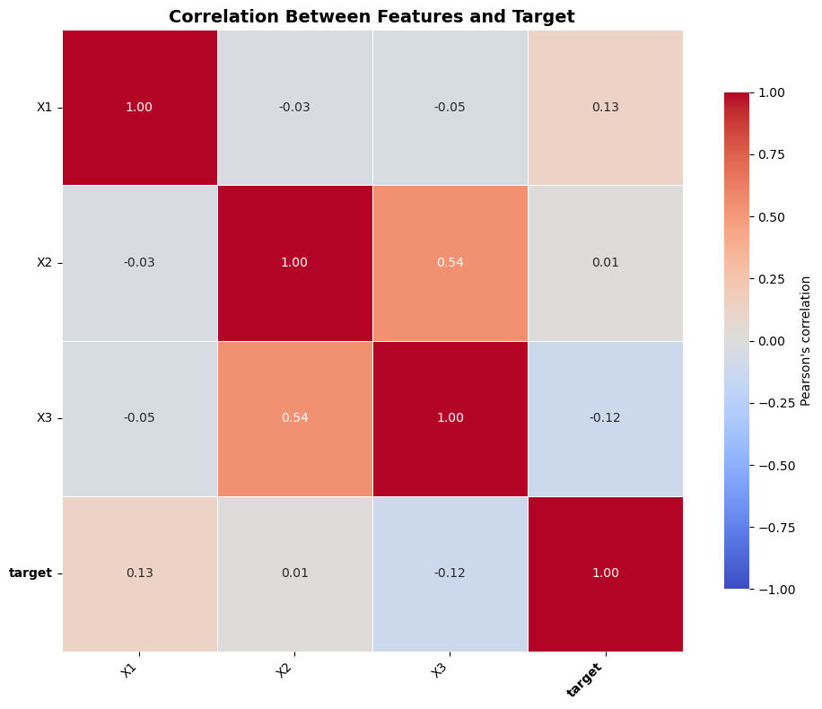
    


## Mfs_based_Split


```python
train_path = f"splitted/{file}/Mfs_based_Split/train_1.parquet"
test_path = f"splitted/{file}/Mfs_based_Split/test_1.parquet"

statistics_man = SplittedDatasetStatistics(train_path, test_path)

print("==" * 20 + "Train data Samples" + "==" * 20)
display(statistics_man.train.df)

print("==" * 20 + "Test data Samples" + "==" * 20)

display(statistics_man.test.df)
```

    ========================================Train data Samples========================================


<div>


<table border="1" class="dataframe">
  <thead>
    <tr style="text-align: right;">
      <th></th>
      <th>X1</th>
      <th>X2</th>
      <th>X3</th>
      <th>target</th>
    </tr>
  </thead>
  <tbody>
    <tr>
      <th>0</th>
      <td>-1.474303</td>
      <td>-0.238940</td>
      <td>-1.463602</td>
      <td>0.786391</td>
    </tr>
    <tr>
      <th>1</th>
      <td>1.260702</td>
      <td>-0.235650</td>
      <td>-0.858141</td>
      <td>0.680203</td>
    </tr>
    <tr>
      <th>2</th>
      <td>-0.042664</td>
      <td>-1.507502</td>
      <td>-1.063101</td>
      <td>0.042444</td>
    </tr>
    <tr>
      <th>3</th>
      <td>1.284502</td>
      <td>-2.233403</td>
      <td>-0.879251</td>
      <td>-0.890538</td>
    </tr>
    <tr>
      <th>4</th>
      <td>0.801611</td>
      <td>0.418131</td>
      <td>0.225140</td>
      <td>-0.165077</td>
    </tr>
    <tr>
      <th>...</th>
      <td>...</td>
      <td>...</td>
      <td>...</td>
      <td>...</td>
    </tr>
    <tr>
      <th>304407</th>
      <td>-1.553303</td>
      <td>0.473871</td>
      <td>1.713502</td>
      <td>-0.199807</td>
    </tr>
    <tr>
      <th>304408</th>
      <td>-0.019241</td>
      <td>-0.000993</td>
      <td>0.267010</td>
      <td>-0.965197</td>
    </tr>
    <tr>
      <th>304409</th>
      <td>0.012714</td>
      <td>0.565491</td>
      <td>-0.250180</td>
      <td>-0.895694</td>
    </tr>
    <tr>
      <th>304410</th>
      <td>-1.546203</td>
      <td>-0.128330</td>
      <td>0.766561</td>
      <td>0.399952</td>
    </tr>
    <tr>
      <th>304411</th>
      <td>0.431391</td>
      <td>-1.420702</td>
      <td>-1.067901</td>
      <td>-0.270926</td>
    </tr>
  </tbody>
</table>
<p>304412 rows × 4 columns</p>
</div>


    ========================================Test data Samples========================================


<div>

<table border="1" class="dataframe">
  <thead>
    <tr style="text-align: right;">
      <th></th>
      <th>X1</th>
      <th>X2</th>
      <th>X3</th>
      <th>target</th>
    </tr>
  </thead>
  <tbody>
    <tr>
      <th>0</th>
      <td>-0.658522</td>
      <td>0.572191</td>
      <td>-0.626131</td>
      <td>-0.641638</td>
    </tr>
    <tr>
      <th>1</th>
      <td>-1.565603</td>
      <td>0.572191</td>
      <td>-0.272230</td>
      <td>-0.773446</td>
    </tr>
    <tr>
      <th>2</th>
      <td>0.068009</td>
      <td>0.572211</td>
      <td>-0.781881</td>
      <td>1.779303</td>
    </tr>
    <tr>
      <th>3</th>
      <td>-0.563781</td>
      <td>0.572211</td>
      <td>-1.250301</td>
      <td>1.475027</td>
    </tr>
    <tr>
      <th>4</th>
      <td>-0.023044</td>
      <td>0.572211</td>
      <td>0.710411</td>
      <td>1.097327</td>
    </tr>
    <tr>
      <th>...</th>
      <td>...</td>
      <td>...</td>
      <td>...</td>
      <td>...</td>
    </tr>
    <tr>
      <th>130457</th>
      <td>1.345802</td>
      <td>2.339003</td>
      <td>0.818231</td>
      <td>-1.004782</td>
    </tr>
    <tr>
      <th>130458</th>
      <td>1.345802</td>
      <td>2.339003</td>
      <td>0.815971</td>
      <td>-0.906705</td>
    </tr>
    <tr>
      <th>130459</th>
      <td>1.345802</td>
      <td>2.339103</td>
      <td>0.817111</td>
      <td>-1.014397</td>
    </tr>
    <tr>
      <th>130460</th>
      <td>1.345802</td>
      <td>2.339203</td>
      <td>0.816661</td>
      <td>-0.993503</td>
    </tr>
    <tr>
      <th>130461</th>
      <td>1.345802</td>
      <td>2.339203</td>
      <td>0.816311</td>
      <td>-0.965465</td>
    </tr>
  </tbody>
</table>
<p>130462 rows × 4 columns</p>
</div>


```python
statistics_man.print_stat_sum()
```

    ========================================Train data Statistics Summary========================================
    Number of samples : 304412
    Number of features: 3
    ==============================


<div>

<table border="1" class="dataframe">
  <thead>
    <tr style="text-align: right;">
      <th></th>
      <th>dtype</th>
      <th>missing</th>
      <th>count</th>
      <th>median</th>
      <th>mean</th>
      <th>std</th>
      <th>min</th>
      <th>25%</th>
      <th>50%</th>
      <th>75%</th>
      <th>max</th>
    </tr>
  </thead>
  <tbody>
    <tr>
      <th>X1</th>
      <td>float64</td>
      <td>0</td>
      <td>304412.0</td>
      <td>0.069432</td>
      <td>-0.033316</td>
      <td>0.965004</td>
      <td>-2.473705</td>
      <td>-0.295821</td>
      <td>0.069432</td>
      <td>0.692521</td>
      <td>1.585103</td>
    </tr>
    <tr>
      <th>X2</th>
      <td>float64</td>
      <td>0</td>
      <td>304412.0</td>
      <td>-0.163610</td>
      <td>-0.444256</td>
      <td>0.843866</td>
      <td>-2.527603</td>
      <td>-1.125701</td>
      <td>-0.163610</td>
      <td>0.289870</td>
      <td>1.239102</td>
    </tr>
    <tr>
      <th>X3</th>
      <td>float64</td>
      <td>0</td>
      <td>304412.0</td>
      <td>-0.336090</td>
      <td>-0.318296</td>
      <td>0.845558</td>
      <td>-1.724902</td>
      <td>-0.970064</td>
      <td>-0.336090</td>
      <td>0.119178</td>
      <td>1.770802</td>
    </tr>
    <tr>
      <th>target</th>
      <td>float64</td>
      <td>0</td>
      <td>304412.0</td>
      <td>-0.156959</td>
      <td>0.011867</td>
      <td>0.907099</td>
      <td>-1.653994</td>
      <td>-0.725804</td>
      <td>-0.156959</td>
      <td>0.509626</td>
      <td>4.801169</td>
    </tr>
  </tbody>
</table>
</div>


    ========================================Test data Statistics Summary========================================
    Number of samples : 130462
    Number of features: 3
    ==============================


<div>

<table border="1" class="dataframe">
  <thead>
    <tr style="text-align: right;">
      <th></th>
      <th>dtype</th>
      <th>missing</th>
      <th>count</th>
      <th>median</th>
      <th>mean</th>
      <th>std</th>
      <th>min</th>
      <th>25%</th>
      <th>50%</th>
      <th>75%</th>
      <th>max</th>
    </tr>
  </thead>
  <tbody>
    <tr>
      <th>X1</th>
      <td>float64</td>
      <td>0</td>
      <td>130462.0</td>
      <td>0.254930</td>
      <td>0.077738</td>
      <td>1.073239</td>
      <td>-2.385905</td>
      <td>-0.503191</td>
      <td>0.254930</td>
      <td>0.903841</td>
      <td>1.585903</td>
    </tr>
    <tr>
      <th>X2</th>
      <td>float64</td>
      <td>0</td>
      <td>130462.0</td>
      <td>0.974876</td>
      <td>1.036599</td>
      <td>0.369728</td>
      <td>-0.097403</td>
      <td>0.763981</td>
      <td>0.974876</td>
      <td>1.220602</td>
      <td>2.339203</td>
    </tr>
    <tr>
      <th>X3</th>
      <td>float64</td>
      <td>0</td>
      <td>130462.0</td>
      <td>0.888806</td>
      <td>0.742693</td>
      <td>0.936535</td>
      <td>-1.731602</td>
      <td>0.306288</td>
      <td>0.888806</td>
      <td>1.354402</td>
      <td>2.303303</td>
    </tr>
    <tr>
      <th>target</th>
      <td>float64</td>
      <td>0</td>
      <td>130462.0</td>
      <td>-0.491721</td>
      <td>-0.027689</td>
      <td>1.188413</td>
      <td>-1.324634</td>
      <td>-0.943121</td>
      <td>-0.491721</td>
      <td>0.548717</td>
      <td>6.029659</td>
    </tr>
  </tbody>
</table>
</div>


```python
statistics_man.plot_pairplot()
```


    
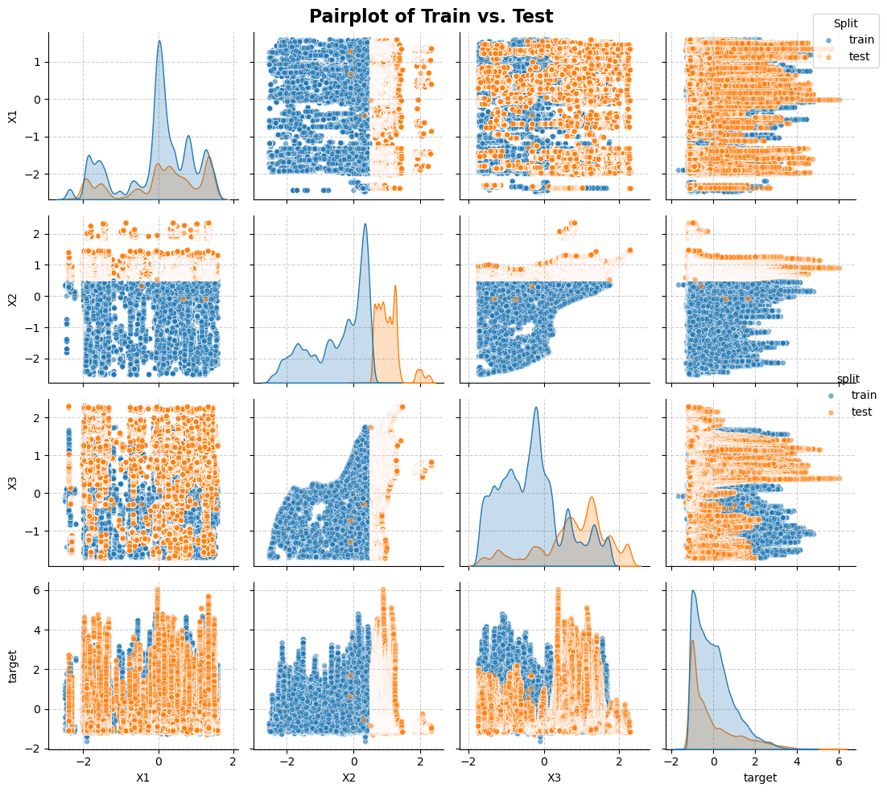
    


```python
for feature in statistics_man.df_all.columns[:-1]:
    statistics_man.plot_distribution(feature)
```


    
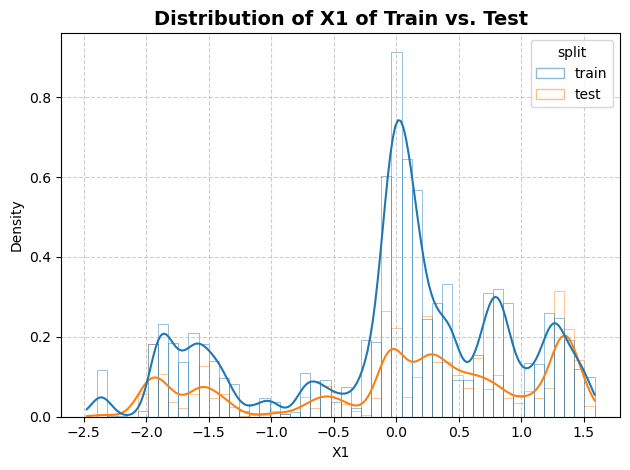
    


    
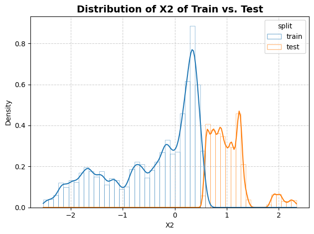
    


    
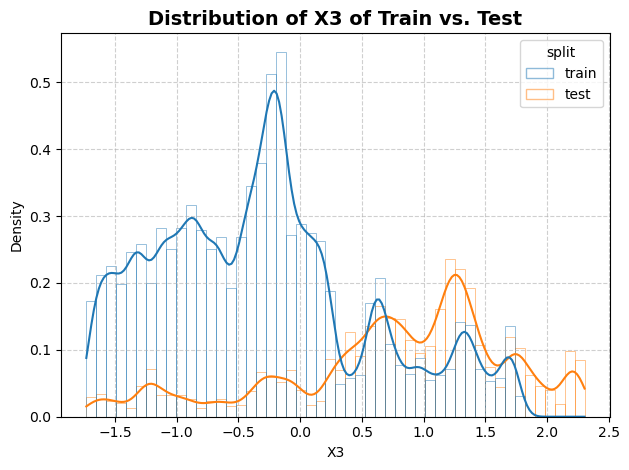
    


    
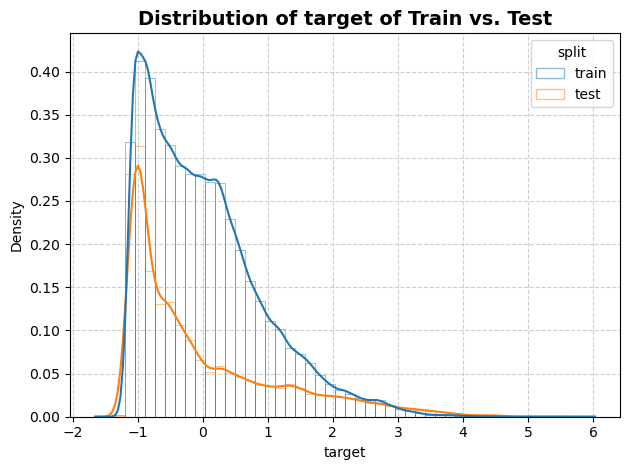
    


```python
statistics_man.plot_corr_heatmap()
```

    ========================================Train data Correlation Heatmap========================================


    
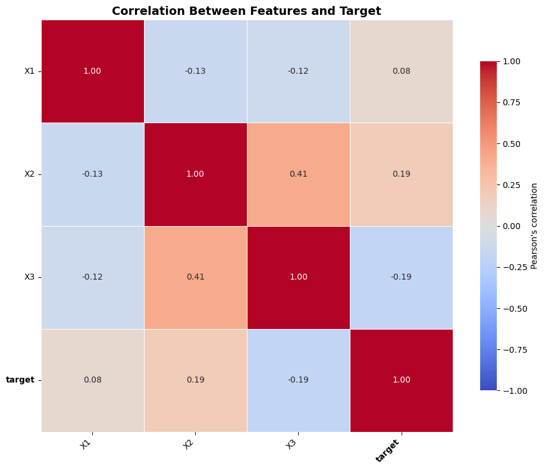
    


    ========================================Test data Correlation Heatmap========================================


    
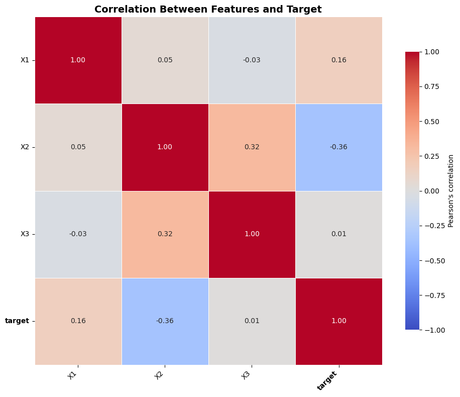
    


## Single_Hyperball


```python
train_path = f"splitted/{file}/Random_Split/train_0.parquet"
test_path = f"splitted/{file}/Random_Split/test_0.parquet"

statistics_man = SplittedDatasetStatistics(train_path, test_path)

print("==" * 20 + "Train data Samples" + "==" * 20)
display(statistics_man.train.df)

print("==" * 20 + "Test data Samples" + "==" * 20)

display(statistics_man.test.df)
```

    ========================================Train data Samples========================================


<div>

<table border="1" class="dataframe">
  <thead>
    <tr style="text-align: right;">
      <th></th>
      <th>X1</th>
      <th>X2</th>
      <th>X3</th>
      <th>target</th>
    </tr>
  </thead>
  <tbody>
    <tr>
      <th>0</th>
      <td>-1.522200</td>
      <td>1.248700</td>
      <td>0.93864</td>
      <td>-15.8090</td>
    </tr>
    <tr>
      <th>1</th>
      <td>-0.062097</td>
      <td>0.388870</td>
      <td>1.72680</td>
      <td>-10.2980</td>
    </tr>
    <tr>
      <th>2</th>
      <td>0.059452</td>
      <td>0.925230</td>
      <td>0.40868</td>
      <td>35.8420</td>
    </tr>
    <tr>
      <th>3</th>
      <td>0.844510</td>
      <td>-0.621170</td>
      <td>0.18112</td>
      <td>6.5483</td>
    </tr>
    <tr>
      <th>4</th>
      <td>0.741760</td>
      <td>0.360240</td>
      <td>-1.12490</td>
      <td>-1.4642</td>
    </tr>
    <tr>
      <th>...</th>
      <td>...</td>
      <td>...</td>
      <td>...</td>
      <td>...</td>
    </tr>
    <tr>
      <th>304406</th>
      <td>1.349700</td>
      <td>0.028330</td>
      <td>0.73913</td>
      <td>-12.7560</td>
    </tr>
    <tr>
      <th>304407</th>
      <td>-0.021434</td>
      <td>0.907190</td>
      <td>0.38837</td>
      <td>70.1560</td>
    </tr>
    <tr>
      <th>304408</th>
      <td>0.798240</td>
      <td>-0.061993</td>
      <td>-0.60086</td>
      <td>37.7790</td>
    </tr>
    <tr>
      <th>304409</th>
      <td>-1.425100</td>
      <td>0.418090</td>
      <td>-0.21082</td>
      <td>-11.3810</td>
    </tr>
    <tr>
      <th>304410</th>
      <td>-1.864700</td>
      <td>0.414520</td>
      <td>-0.36037</td>
      <td>28.2500</td>
    </tr>
  </tbody>
</table>
<p>304411 rows × 4 columns</p>
</div>


    ========================================Test data Samples========================================


<div>

<table border="1" class="dataframe">
  <thead>
    <tr style="text-align: right;">
      <th></th>
      <th>X1</th>
      <th>X2</th>
      <th>X3</th>
      <th>target</th>
    </tr>
  </thead>
  <tbody>
    <tr>
      <th>0</th>
      <td>-0.026622</td>
      <td>-1.38020</td>
      <td>-0.988030</td>
      <td>-18.8280</td>
    </tr>
    <tr>
      <th>1</th>
      <td>0.978830</td>
      <td>-2.51630</td>
      <td>-1.632400</td>
      <td>-20.8350</td>
    </tr>
    <tr>
      <th>2</th>
      <td>-1.918000</td>
      <td>0.41818</td>
      <td>-0.283440</td>
      <td>-15.1660</td>
    </tr>
    <tr>
      <th>3</th>
      <td>0.077155</td>
      <td>-0.64808</td>
      <td>-0.092912</td>
      <td>6.0770</td>
    </tr>
    <tr>
      <th>4</th>
      <td>-1.699700</td>
      <td>0.23335</td>
      <td>-0.945800</td>
      <td>39.6220</td>
    </tr>
    <tr>
      <th>...</th>
      <td>...</td>
      <td>...</td>
      <td>...</td>
      <td>...</td>
    </tr>
    <tr>
      <th>130458</th>
      <td>0.266820</td>
      <td>0.10769</td>
      <td>0.234710</td>
      <td>-13.4980</td>
    </tr>
    <tr>
      <th>130459</th>
      <td>1.183200</td>
      <td>0.48634</td>
      <td>1.009700</td>
      <td>3.3794</td>
    </tr>
    <tr>
      <th>130460</th>
      <td>0.068009</td>
      <td>0.56842</td>
      <td>-0.782690</td>
      <td>30.8440</td>
    </tr>
    <tr>
      <th>130461</th>
      <td>0.274630</td>
      <td>1.02690</td>
      <td>0.246100</td>
      <td>-11.1530</td>
    </tr>
    <tr>
      <th>130462</th>
      <td>1.163100</td>
      <td>-1.72740</td>
      <td>-0.249860</td>
      <td>16.9220</td>
    </tr>
  </tbody>
</table>
<p>130463 rows × 4 columns</p>
</div>


```python
statistics_man.print_stat_sum()
```

    ========================================Train data Statistics Summary========================================
    Number of samples : 304411
    Number of features: 3
    ==============================


<div>

<table border="1" class="dataframe">
  <thead>
    <tr style="text-align: right;">
      <th></th>
      <th>dtype</th>
      <th>missing</th>
      <th>count</th>
      <th>median</th>
      <th>mean</th>
      <th>std</th>
      <th>min</th>
      <th>25%</th>
      <th>50%</th>
      <th>75%</th>
      <th>max</th>
    </tr>
  </thead>
  <tbody>
    <tr>
      <th>X1</th>
      <td>float64</td>
      <td>0</td>
      <td>304411.0</td>
      <td>0.10886</td>
      <td>-0.000589</td>
      <td>0.999486</td>
      <td>-2.4737</td>
      <td>-0.402390</td>
      <td>0.10886</td>
      <td>0.74379</td>
      <td>1.5859</td>
    </tr>
    <tr>
      <th>X2</th>
      <td>float64</td>
      <td>0</td>
      <td>304411.0</td>
      <td>0.24640</td>
      <td>-0.001214</td>
      <td>1.000344</td>
      <td>-2.5276</td>
      <td>-0.629335</td>
      <td>0.24640</td>
      <td>0.70147</td>
      <td>2.3392</td>
    </tr>
    <tr>
      <th>X3</th>
      <td>float64</td>
      <td>0</td>
      <td>304411.0</td>
      <td>-0.14302</td>
      <td>-0.000458</td>
      <td>0.999950</td>
      <td>-1.7316</td>
      <td>-0.821905</td>
      <td>-0.14302</td>
      <td>0.77599</td>
      <td>2.3033</td>
    </tr>
    <tr>
      <th>target</th>
      <td>float64</td>
      <td>0</td>
      <td>304411.0</td>
      <td>-4.56320</td>
      <td>0.015332</td>
      <td>18.611448</td>
      <td>-26.6830</td>
      <td>-15.153000</td>
      <td>-4.56320</td>
      <td>9.66225</td>
      <td>107.1000</td>
    </tr>
  </tbody>
</table>
</div>


    ========================================Test data Statistics Summary========================================
    Number of samples : 130463
    Number of features: 3
    ==============================


<div>

<table border="1" class="dataframe">
  <thead>
    <tr style="text-align: right;">
      <th></th>
      <th>dtype</th>
      <th>missing</th>
      <th>count</th>
      <th>median</th>
      <th>mean</th>
      <th>std</th>
      <th>min</th>
      <th>25%</th>
      <th>50%</th>
      <th>75%</th>
      <th>max</th>
    </tr>
  </thead>
  <tbody>
    <tr>
      <th>X1</th>
      <td>float64</td>
      <td>0</td>
      <td>130463.0</td>
      <td>0.10886</td>
      <td>0.001375</td>
      <td>1.001197</td>
      <td>-2.4737</td>
      <td>-0.401630</td>
      <td>0.10886</td>
      <td>0.745285</td>
      <td>1.5859</td>
    </tr>
    <tr>
      <th>X2</th>
      <td>float64</td>
      <td>0</td>
      <td>130463.0</td>
      <td>0.25000</td>
      <td>0.002832</td>
      <td>0.999196</td>
      <td>-2.5268</td>
      <td>-0.625675</td>
      <td>0.25000</td>
      <td>0.703995</td>
      <td>2.3391</td>
    </tr>
    <tr>
      <th>X3</th>
      <td>float64</td>
      <td>0</td>
      <td>130463.0</td>
      <td>-0.14140</td>
      <td>0.001068</td>
      <td>1.000120</td>
      <td>-1.7293</td>
      <td>-0.818790</td>
      <td>-0.14140</td>
      <td>0.778675</td>
      <td>2.3029</td>
    </tr>
    <tr>
      <th>target</th>
      <td>float64</td>
      <td>0</td>
      <td>130463.0</td>
      <td>-4.73550</td>
      <td>-0.035772</td>
      <td>18.633261</td>
      <td>-30.7940</td>
      <td>-15.169000</td>
      <td>-4.73550</td>
      <td>9.538100</td>
      <td>112.2600</td>
    </tr>
  </tbody>
</table>
</div>


```python
statistics_man.plot_pairplot()
```


    

    


```python
for feature in statistics_man.df_all.columns[:-1]:
    statistics_man.plot_distribution(feature)
```


    
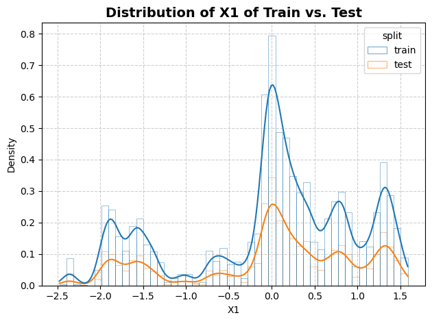
    


    

    


    

    


    
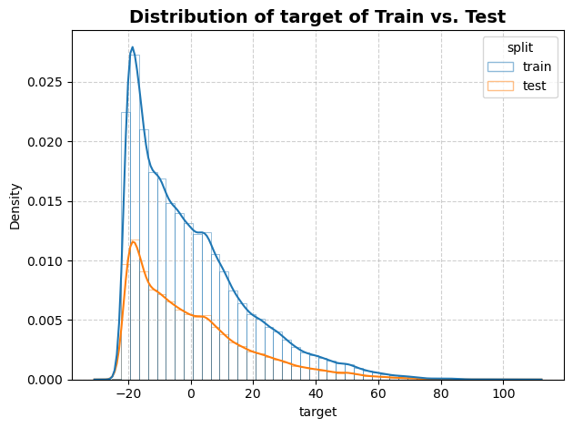
    


```python
statistics_man.plot_corr_heatmap()
```

    ========================================Train data Correlation Heatmap========================================


    
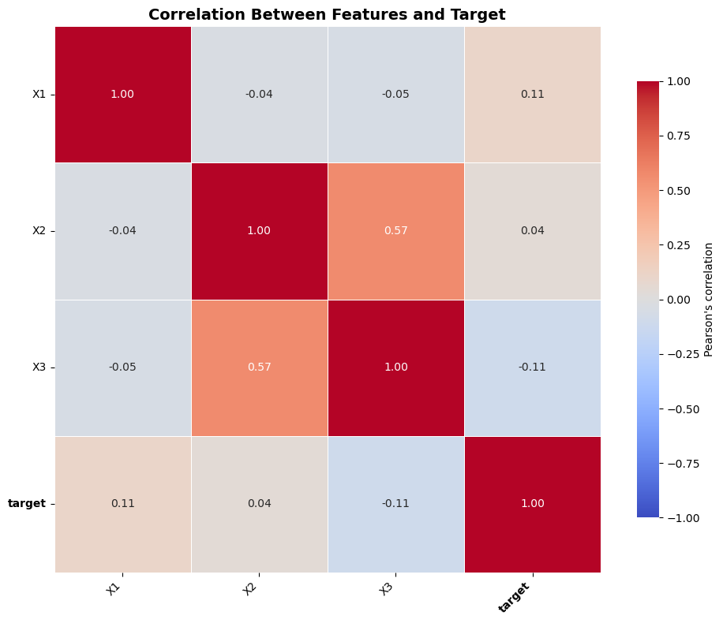
    


    ========================================Test data Correlation Heatmap========================================


    

    


## Multiple_Hyperballs


```python
train_path = f"splitted/{file}/Multiple_Hyperballs/train_0.parquet"
test_path = f"splitted/{file}/Multiple_Hyperballs/test_0.parquet"

statistics_man = SplittedDatasetStatistics(train_path, test_path)

print("==" * 20 + "Train data Samples" + "==" * 20)
display(statistics_man.train.df)

print("==" * 20 + "Test data Samples" + "==" * 20)

display(statistics_man.test.df)
```

    ========================================Train data Samples========================================


<div>
<style scoped>
    .dataframe tbody tr th:only-of-type {
        vertical-align: middle;
    }

    .dataframe tbody tr th {
        vertical-align: top;
    }

    .dataframe thead th {
        text-align: right;
    }
</style>
<table border="1" class="dataframe">
  <thead>
    <tr style="text-align: right;">
      <th></th>
      <th>X1</th>
      <th>X2</th>
      <th>X3</th>
      <th>target</th>
    </tr>
  </thead>
  <tbody>
    <tr>
      <th>0</th>
      <td>-1.474300</td>
      <td>-0.238940</td>
      <td>-1.46360</td>
      <td>14.6410</td>
    </tr>
    <tr>
      <th>1</th>
      <td>1.260700</td>
      <td>-0.235650</td>
      <td>-0.85814</td>
      <td>12.6640</td>
    </tr>
    <tr>
      <th>2</th>
      <td>1.281200</td>
      <td>0.882660</td>
      <td>0.98573</td>
      <td>29.7380</td>
    </tr>
    <tr>
      <th>3</th>
      <td>-1.982700</td>
      <td>0.867280</td>
      <td>0.25854</td>
      <td>-3.1239</td>
    </tr>
    <tr>
      <th>4</th>
      <td>1.284500</td>
      <td>-2.233400</td>
      <td>-0.87925</td>
      <td>-16.5800</td>
    </tr>
    <tr>
      <th>...</th>
      <td>...</td>
      <td>...</td>
      <td>...</td>
      <td>...</td>
    </tr>
    <tr>
      <th>305270</th>
      <td>-1.864700</td>
      <td>0.496740</td>
      <td>0.22618</td>
      <td>-1.2136</td>
    </tr>
    <tr>
      <th>305271</th>
      <td>0.771820</td>
      <td>0.189240</td>
      <td>-1.08020</td>
      <td>60.1830</td>
    </tr>
    <tr>
      <th>305272</th>
      <td>-0.019241</td>
      <td>-0.000993</td>
      <td>0.26701</td>
      <td>-17.9700</td>
    </tr>
    <tr>
      <th>305273</th>
      <td>0.012714</td>
      <td>0.565490</td>
      <td>-0.25018</td>
      <td>-16.6760</td>
    </tr>
    <tr>
      <th>305274</th>
      <td>-1.546200</td>
      <td>-0.128330</td>
      <td>0.76656</td>
      <td>7.4463</td>
    </tr>
  </tbody>
</table>
<p>305275 rows × 4 columns</p>
</div>


    ========================================Test data Samples========================================


<div>
<style scoped>
    .dataframe tbody tr th:only-of-type {
        vertical-align: middle;
    }

    .dataframe tbody tr th {
        vertical-align: top;
    }

    .dataframe thead th {
        text-align: right;
    }
</style>
<table border="1" class="dataframe">
  <thead>
    <tr style="text-align: right;">
      <th></th>
      <th>X1</th>
      <th>X2</th>
      <th>X3</th>
      <th>target</th>
    </tr>
  </thead>
  <tbody>
    <tr>
      <th>0</th>
      <td>-0.476720</td>
      <td>1.312300</td>
      <td>2.14940</td>
      <td>-17.76000</td>
    </tr>
    <tr>
      <th>1</th>
      <td>-0.042664</td>
      <td>-1.507500</td>
      <td>-1.06310</td>
      <td>0.79023</td>
    </tr>
    <tr>
      <th>2</th>
      <td>-1.407900</td>
      <td>1.201800</td>
      <td>1.05750</td>
      <td>70.83400</td>
    </tr>
    <tr>
      <th>3</th>
      <td>0.304510</td>
      <td>-0.655420</td>
      <td>-0.30815</td>
      <td>-19.35600</td>
    </tr>
    <tr>
      <th>4</th>
      <td>0.439420</td>
      <td>-0.815980</td>
      <td>-0.80934</td>
      <td>-13.54400</td>
    </tr>
    <tr>
      <th>...</th>
      <td>...</td>
      <td>...</td>
      <td>...</td>
      <td>...</td>
    </tr>
    <tr>
      <th>129594</th>
      <td>-0.710850</td>
      <td>-0.018852</td>
      <td>0.96833</td>
      <td>-16.38900</td>
    </tr>
    <tr>
      <th>129595</th>
      <td>0.883850</td>
      <td>-1.469800</td>
      <td>-0.94309</td>
      <td>-13.51600</td>
    </tr>
    <tr>
      <th>129596</th>
      <td>-1.912700</td>
      <td>0.463360</td>
      <td>1.72650</td>
      <td>-9.20280</td>
    </tr>
    <tr>
      <th>129597</th>
      <td>0.146430</td>
      <td>-0.883750</td>
      <td>-0.62592</td>
      <td>-1.11950</td>
    </tr>
    <tr>
      <th>129598</th>
      <td>-1.918000</td>
      <td>0.417100</td>
      <td>-0.28964</td>
      <td>-14.42900</td>
    </tr>
  </tbody>
</table>
<p>129599 rows × 4 columns</p>
</div>


```python
statistics_man.print_stat_sum()
```

    ========================================Train data Statistics Summary========================================
    Number of samples : 305275
    Number of features: 3
    ==============================


<div>
<style scoped>
    .dataframe tbody tr th:only-of-type {
        vertical-align: middle;
    }

    .dataframe tbody tr th {
        vertical-align: top;
    }

    .dataframe thead th {
        text-align: right;
    }
</style>
<table border="1" class="dataframe">
  <thead>
    <tr style="text-align: right;">
      <th></th>
      <th>dtype</th>
      <th>missing</th>
      <th>count</th>
      <th>median</th>
      <th>mean</th>
      <th>std</th>
      <th>min</th>
      <th>25%</th>
      <th>50%</th>
      <th>75%</th>
      <th>max</th>
    </tr>
  </thead>
  <tbody>
    <tr>
      <th>X1</th>
      <td>float64</td>
      <td>0</td>
      <td>305275.0</td>
      <td>0.29040</td>
      <td>0.237799</td>
      <td>0.924769</td>
      <td>-2.4719</td>
      <td>-0.075140</td>
      <td>0.29040</td>
      <td>0.93622</td>
      <td>1.5859</td>
    </tr>
    <tr>
      <th>X2</th>
      <td>float64</td>
      <td>0</td>
      <td>305275.0</td>
      <td>0.31229</td>
      <td>0.169516</td>
      <td>0.895319</td>
      <td>-2.5276</td>
      <td>-0.188860</td>
      <td>0.31229</td>
      <td>0.72898</td>
      <td>2.3392</td>
    </tr>
    <tr>
      <th>X3</th>
      <td>float64</td>
      <td>0</td>
      <td>305275.0</td>
      <td>-0.03134</td>
      <td>0.049923</td>
      <td>0.952197</td>
      <td>-1.7316</td>
      <td>-0.651225</td>
      <td>-0.03134</td>
      <td>0.74379</td>
      <td>2.3029</td>
    </tr>
    <tr>
      <th>target</th>
      <td>float64</td>
      <td>0</td>
      <td>305275.0</td>
      <td>-3.74790</td>
      <td>1.255903</td>
      <td>19.809273</td>
      <td>-30.7940</td>
      <td>-15.336000</td>
      <td>-3.74790</td>
      <td>12.32000</td>
      <td>112.2600</td>
    </tr>
  </tbody>
</table>
</div>


    ========================================Test data Statistics Summary========================================
    Number of samples : 129599
    Number of features: 3
    ==============================


<div>
<style scoped>
    .dataframe tbody tr th:only-of-type {
        vertical-align: middle;
    }

    .dataframe tbody tr th {
        vertical-align: top;
    }

    .dataframe thead th {
        text-align: right;
    }
</style>
<table border="1" class="dataframe">
  <thead>
    <tr style="text-align: right;">
      <th></th>
      <th>dtype</th>
      <th>missing</th>
      <th>count</th>
      <th>median</th>
      <th>mean</th>
      <th>std</th>
      <th>min</th>
      <th>25%</th>
      <th>50%</th>
      <th>75%</th>
      <th>max</th>
    </tr>
  </thead>
  <tbody>
    <tr>
      <th>X1</th>
      <td>float64</td>
      <td>0</td>
      <td>129599.0</td>
      <td>-0.049967</td>
      <td>-0.560144</td>
      <td>0.945582</td>
      <td>-2.4737</td>
      <td>-1.57250</td>
      <td>-0.049967</td>
      <td>0.13008</td>
      <td>0.95025</td>
    </tr>
    <tr>
      <th>X2</th>
      <td>float64</td>
      <td>0</td>
      <td>129599.0</td>
      <td>-0.583360</td>
      <td>-0.399302</td>
      <td>1.113655</td>
      <td>-2.4417</td>
      <td>-1.41380</td>
      <td>-0.583360</td>
      <td>0.49163</td>
      <td>2.25110</td>
    </tr>
    <tr>
      <th>X3</th>
      <td>float64</td>
      <td>0</td>
      <td>129599.0</td>
      <td>-0.442790</td>
      <td>-0.117595</td>
      <td>1.095505</td>
      <td>-1.7304</td>
      <td>-1.00275</td>
      <td>-0.442790</td>
      <td>0.95094</td>
      <td>2.30330</td>
    </tr>
    <tr>
      <th>target</th>
      <td>float64</td>
      <td>0</td>
      <td>129599.0</td>
      <td>-5.965000</td>
      <td>-2.958322</td>
      <td>15.044376</td>
      <td>-24.0850</td>
      <td>-14.67600</td>
      <td>-5.965000</td>
      <td>4.88080</td>
      <td>88.72200</td>
    </tr>
  </tbody>
</table>
</div>


```python
statistics_man.plot_pairplot()
```


    
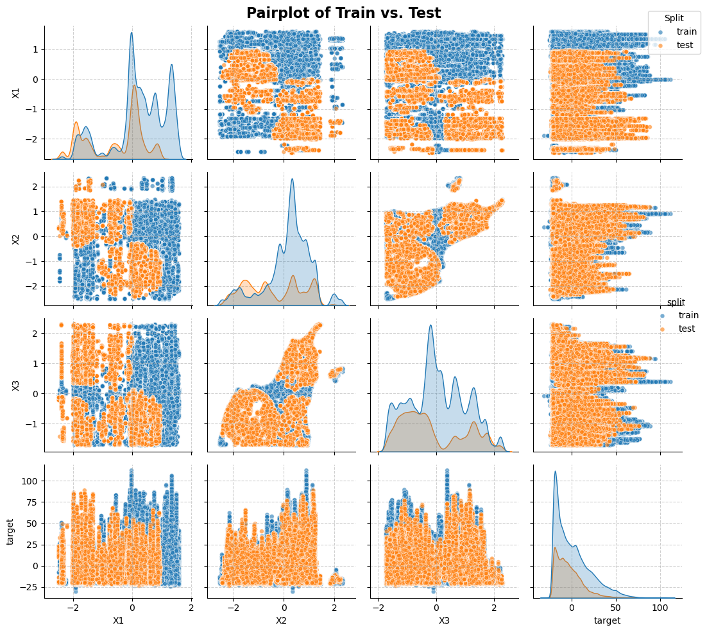
    


```python
for feature in statistics_man.df_all.columns[:-1]:
    statistics_man.plot_distribution(feature)
```


    
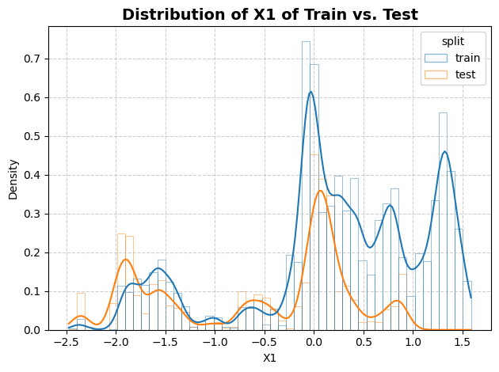
    


    
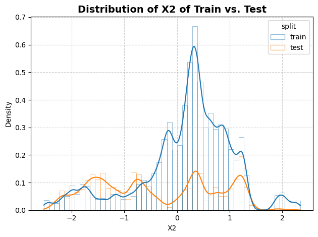
    


    
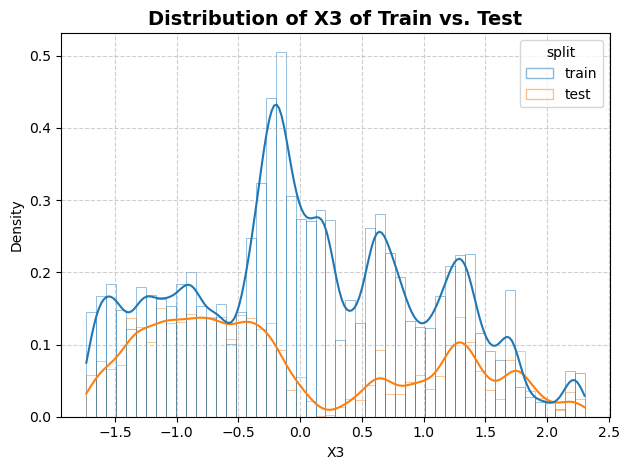
    


    
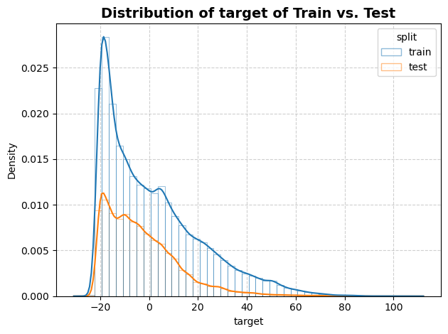
    


```python
statistics_man.plot_corr_heatmap()
```

    ========================================Train data Correlation Heatmap========================================


    
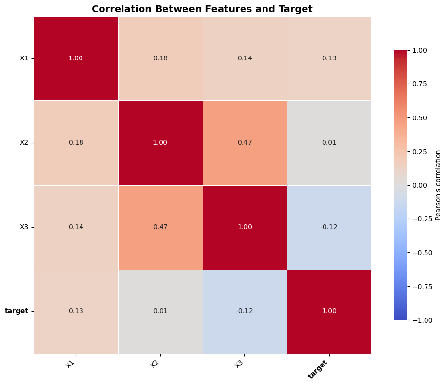
    


    ========================================Test data Correlation Heatmap========================================


    
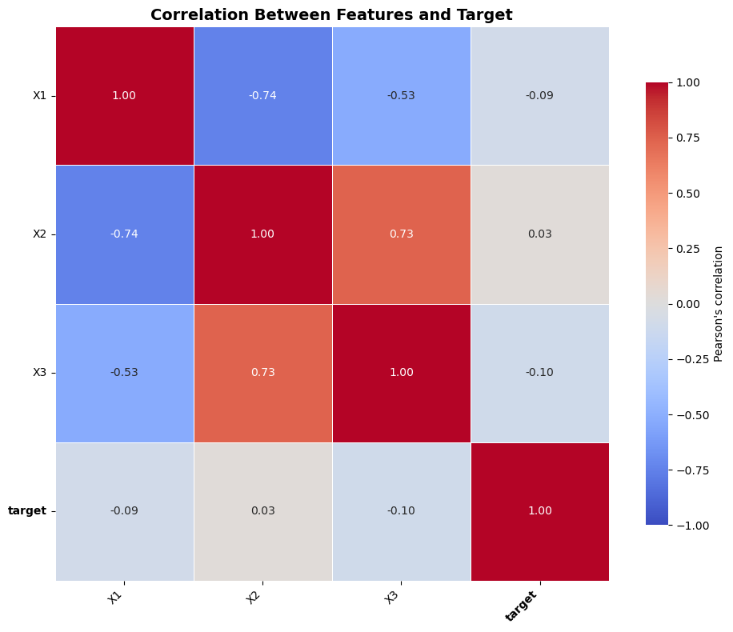
    


## KMeans_Hyperballs


```python
train_path = f"splitted/{file}/KMeans_Hyperballs/train_0.parquet"
test_path = f"splitted/{file}/KMeans_Hyperballs/test_0.parquet"

statistics_man = SplittedDatasetStatistics(train_path, test_path)

print("==" * 20 + "Train data Samples" + "==" * 20)
display(statistics_man.train.df)

print("==" * 20 + "Test data Samples" + "==" * 20)

display(statistics_man.test.df)
```

    ========================================Train data Samples========================================


<div>
<style scoped>
    .dataframe tbody tr th:only-of-type {
        vertical-align: middle;
    }

    .dataframe tbody tr th {
        vertical-align: top;
    }

    .dataframe thead th {
        text-align: right;
    }
</style>
<table border="1" class="dataframe">
  <thead>
    <tr style="text-align: right;">
      <th></th>
      <th>X1</th>
      <th>X2</th>
      <th>X3</th>
      <th>target</th>
    </tr>
  </thead>
  <tbody>
    <tr>
      <th>0</th>
      <td>-1.474300</td>
      <td>-0.238940</td>
      <td>-1.46360</td>
      <td>14.64100</td>
    </tr>
    <tr>
      <th>1</th>
      <td>1.281200</td>
      <td>0.882660</td>
      <td>0.98573</td>
      <td>29.73800</td>
    </tr>
    <tr>
      <th>2</th>
      <td>-0.042664</td>
      <td>-1.507500</td>
      <td>-1.06310</td>
      <td>0.79023</td>
    </tr>
    <tr>
      <th>3</th>
      <td>1.284500</td>
      <td>-2.233400</td>
      <td>-0.87925</td>
      <td>-16.58000</td>
    </tr>
    <tr>
      <th>4</th>
      <td>0.801610</td>
      <td>0.418130</td>
      <td>0.22514</td>
      <td>-3.07340</td>
    </tr>
    <tr>
      <th>...</th>
      <td>...</td>
      <td>...</td>
      <td>...</td>
      <td>...</td>
    </tr>
    <tr>
      <th>304407</th>
      <td>-0.000830</td>
      <td>-0.983190</td>
      <td>-1.28830</td>
      <td>12.26800</td>
    </tr>
    <tr>
      <th>304408</th>
      <td>-1.793600</td>
      <td>0.831020</td>
      <td>-1.67220</td>
      <td>-17.92400</td>
    </tr>
    <tr>
      <th>304409</th>
      <td>-0.019241</td>
      <td>-0.000993</td>
      <td>0.26701</td>
      <td>-17.97000</td>
    </tr>
    <tr>
      <th>304410</th>
      <td>0.012714</td>
      <td>0.565490</td>
      <td>-0.25018</td>
      <td>-16.67600</td>
    </tr>
    <tr>
      <th>304411</th>
      <td>0.431390</td>
      <td>-1.420700</td>
      <td>-1.06790</td>
      <td>-5.04410</td>
    </tr>
  </tbody>
</table>
<p>304412 rows × 4 columns</p>
</div>


    ========================================Test data Samples========================================


<div>
<style scoped>
    .dataframe tbody tr th:only-of-type {
        vertical-align: middle;
    }

    .dataframe tbody tr th {
        vertical-align: top;
    }

    .dataframe thead th {
        text-align: right;
    }
</style>
<table border="1" class="dataframe">
  <thead>
    <tr style="text-align: right;">
      <th></th>
      <th>X1</th>
      <th>X2</th>
      <th>X3</th>
      <th>target</th>
    </tr>
  </thead>
  <tbody>
    <tr>
      <th>0</th>
      <td>0.48302</td>
      <td>-0.489030</td>
      <td>-1.459300</td>
      <td>14.2780</td>
    </tr>
    <tr>
      <th>1</th>
      <td>1.26070</td>
      <td>-0.235650</td>
      <td>-0.858140</td>
      <td>12.6640</td>
    </tr>
    <tr>
      <th>2</th>
      <td>0.24414</td>
      <td>0.599440</td>
      <td>-0.009732</td>
      <td>-11.9810</td>
    </tr>
    <tr>
      <th>3</th>
      <td>0.75701</td>
      <td>0.224630</td>
      <td>-1.238900</td>
      <td>40.3310</td>
    </tr>
    <tr>
      <th>4</th>
      <td>-0.23780</td>
      <td>0.364850</td>
      <td>-0.178710</td>
      <td>9.8680</td>
    </tr>
    <tr>
      <th>...</th>
      <td>...</td>
      <td>...</td>
      <td>...</td>
      <td>...</td>
    </tr>
    <tr>
      <th>130457</th>
      <td>0.14781</td>
      <td>0.373830</td>
      <td>-0.186430</td>
      <td>19.4000</td>
    </tr>
    <tr>
      <th>130458</th>
      <td>1.29200</td>
      <td>0.533640</td>
      <td>-1.153300</td>
      <td>2.1164</td>
    </tr>
    <tr>
      <th>130459</th>
      <td>-0.71085</td>
      <td>-0.018852</td>
      <td>0.968330</td>
      <td>-16.3890</td>
    </tr>
    <tr>
      <th>130460</th>
      <td>-1.91270</td>
      <td>0.463360</td>
      <td>1.726500</td>
      <td>-9.2028</td>
    </tr>
    <tr>
      <th>130461</th>
      <td>-0.54058</td>
      <td>-0.081321</td>
      <td>-1.302500</td>
      <td>32.2030</td>
    </tr>
  </tbody>
</table>
<p>130462 rows × 4 columns</p>
</div>


```python
statistics_man.print_stat_sum()
```

    ========================================Train data Statistics Summary========================================
    Number of samples : 304412
    Number of features: 3
    ==============================


<div>
<style scoped>
    .dataframe tbody tr th:only-of-type {
        vertical-align: middle;
    }

    .dataframe tbody tr th {
        vertical-align: top;
    }

    .dataframe thead th {
        text-align: right;
    }
</style>
<table border="1" class="dataframe">
  <thead>
    <tr style="text-align: right;">
      <th></th>
      <th>dtype</th>
      <th>missing</th>
      <th>count</th>
      <th>median</th>
      <th>mean</th>
      <th>std</th>
      <th>min</th>
      <th>25%</th>
      <th>50%</th>
      <th>75%</th>
      <th>max</th>
    </tr>
  </thead>
  <tbody>
    <tr>
      <th>X1</th>
      <td>float64</td>
      <td>0</td>
      <td>304412.0</td>
      <td>0.13759</td>
      <td>0.078607</td>
      <td>0.982669</td>
      <td>-2.4737</td>
      <td>-0.11298</td>
      <td>0.13759</td>
      <td>0.796780</td>
      <td>1.5859</td>
    </tr>
    <tr>
      <th>X2</th>
      <td>float64</td>
      <td>0</td>
      <td>304412.0</td>
      <td>0.16864</td>
      <td>-0.154596</td>
      <td>1.105332</td>
      <td>-2.5276</td>
      <td>-1.12570</td>
      <td>0.16864</td>
      <td>0.692380</td>
      <td>2.3392</td>
    </tr>
    <tr>
      <th>X3</th>
      <td>float64</td>
      <td>0</td>
      <td>304412.0</td>
      <td>-0.11435</td>
      <td>0.017555</td>
      <td>0.989369</td>
      <td>-1.7304</td>
      <td>-0.78248</td>
      <td>-0.11435</td>
      <td>0.779700</td>
      <td>2.3029</td>
    </tr>
    <tr>
      <th>target</th>
      <td>float64</td>
      <td>0</td>
      <td>304412.0</td>
      <td>-4.93440</td>
      <td>-0.644752</td>
      <td>18.098356</td>
      <td>-30.7940</td>
      <td>-15.20700</td>
      <td>-4.93440</td>
      <td>8.298325</td>
      <td>112.2600</td>
    </tr>
  </tbody>
</table>
</div>


    ========================================Test data Statistics Summary========================================
    Number of samples : 130462
    Number of features: 3
    ==============================


<div>
<style scoped>
    .dataframe tbody tr th:only-of-type {
        vertical-align: middle;
    }

    .dataframe tbody tr th {
        vertical-align: top;
    }

    .dataframe thead th {
        text-align: right;
    }
</style>
<table border="1" class="dataframe">
  <thead>
    <tr style="text-align: right;">
      <th></th>
      <th>dtype</th>
      <th>missing</th>
      <th>count</th>
      <th>median</th>
      <th>mean</th>
      <th>std</th>
      <th>min</th>
      <th>25%</th>
      <th>50%</th>
      <th>75%</th>
      <th>max</th>
    </tr>
  </thead>
  <tbody>
    <tr>
      <th>X1</th>
      <td>float64</td>
      <td>0</td>
      <td>130462.0</td>
      <td>0.019404</td>
      <td>-0.183415</td>
      <td>1.015933</td>
      <td>-2.38590</td>
      <td>-0.766770</td>
      <td>0.019404</td>
      <td>0.531970</td>
      <td>1.5851</td>
    </tr>
    <tr>
      <th>X2</th>
      <td>float64</td>
      <td>0</td>
      <td>130462.0</td>
      <td>0.330310</td>
      <td>0.360726</td>
      <td>0.544679</td>
      <td>-0.73348</td>
      <td>-0.002624</td>
      <td>0.330310</td>
      <td>0.717400</td>
      <td>2.3377</td>
    </tr>
    <tr>
      <th>X3</th>
      <td>float64</td>
      <td>0</td>
      <td>130462.0</td>
      <td>-0.184655</td>
      <td>-0.040962</td>
      <td>1.023211</td>
      <td>-1.73160</td>
      <td>-0.886267</td>
      <td>-0.184655</td>
      <td>0.770595</td>
      <td>2.3033</td>
    </tr>
    <tr>
      <th>target</th>
      <td>float64</td>
      <td>0</td>
      <td>130462.0</td>
      <td>-3.651200</td>
      <td>1.504426</td>
      <td>19.695603</td>
      <td>-24.59000</td>
      <td>-15.021750</td>
      <td>-3.651200</td>
      <td>12.983750</td>
      <td>89.3880</td>
    </tr>
  </tbody>
</table>
</div>


```python
statistics_man.plot_pairplot()
```


    
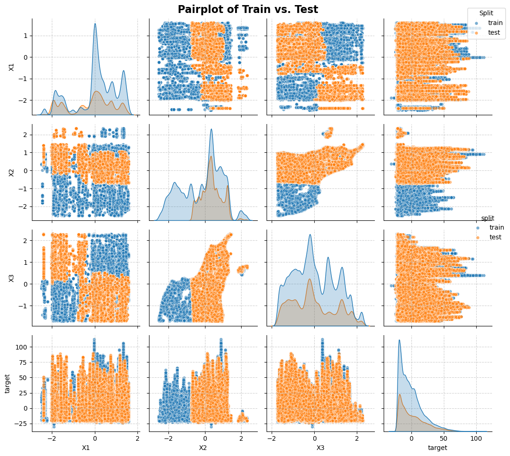
    


```python
for feature in statistics_man.df_all.columns[:-1]:
    statistics_man.plot_distribution(feature)
```


    
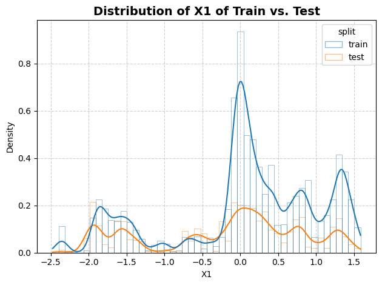
    


    
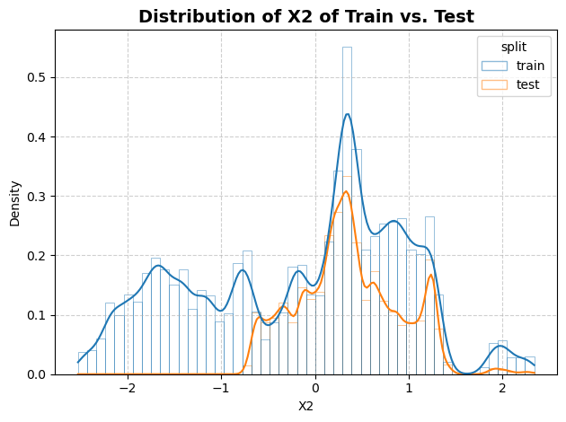
    


    
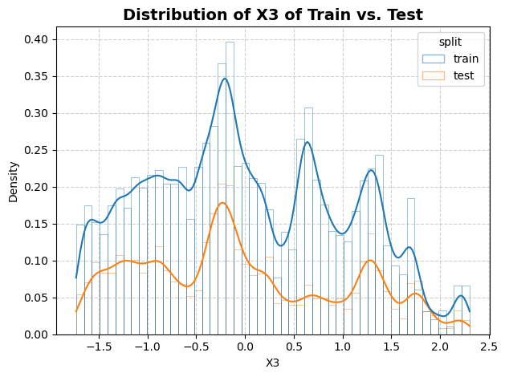
    


    

    


```python
statistics_man.plot_corr_heatmap()
```

    ========================================Train data Correlation Heatmap========================================


    
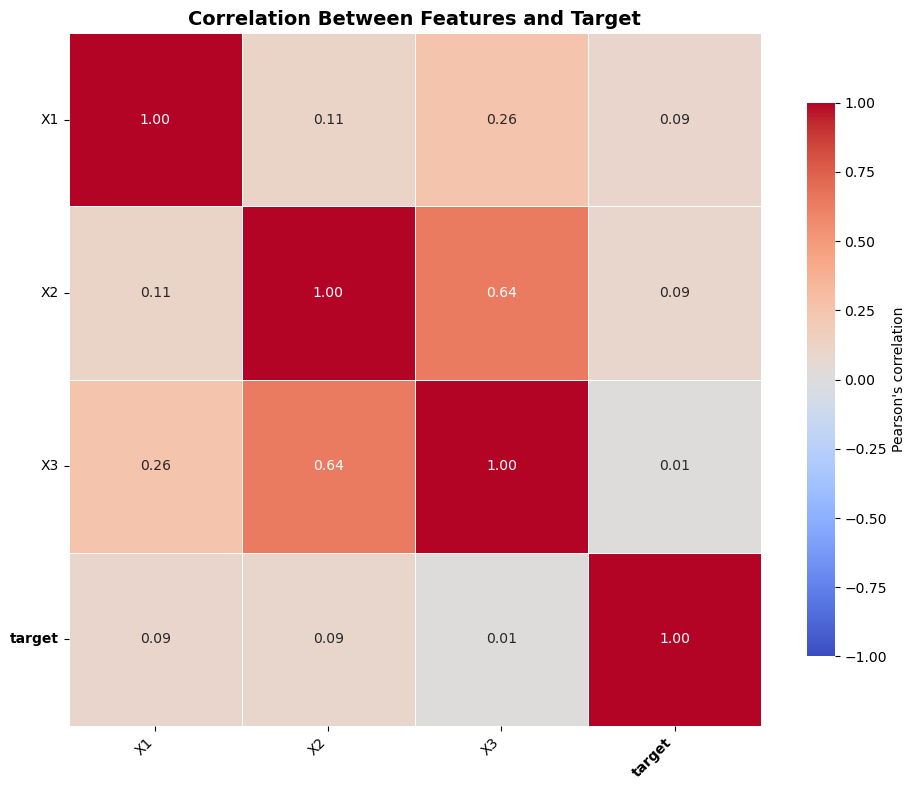
    


    ========================================Test data Correlation Heatmap========================================


    
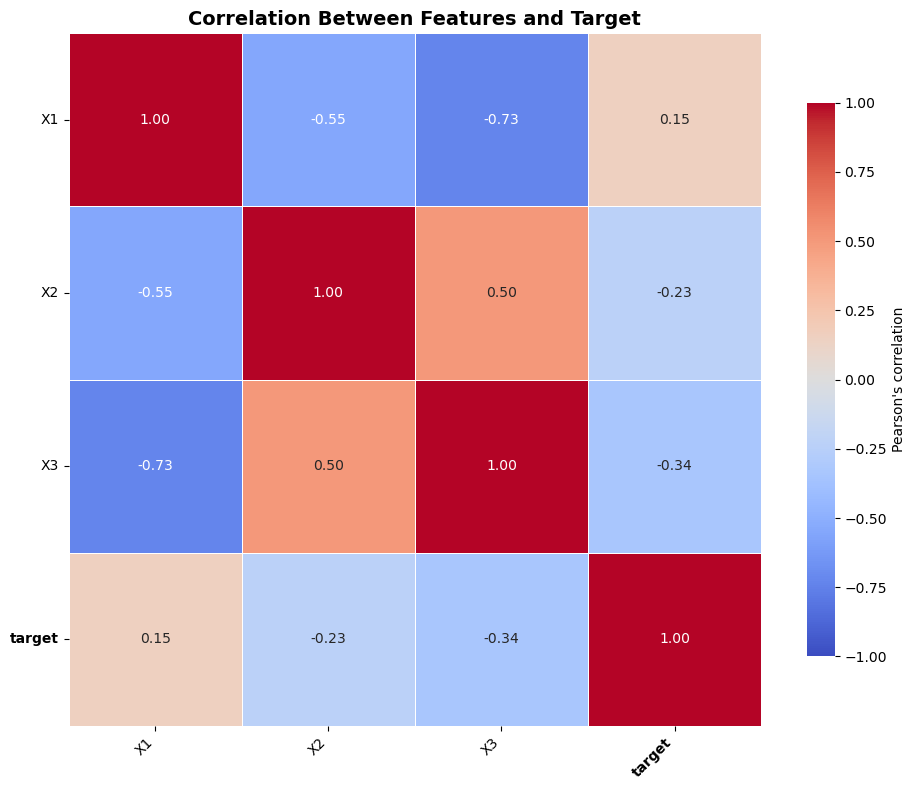
    


## Single_Slab


```python
train_path = f"splitted/{file}/Single_Slab/train_0.parquet"
test_path = f"splitted/{file}/Single_Slab/test_0.parquet"

statistics_man = SplittedDatasetStatistics(train_path, test_path)

print("==" * 20 + "Train data Samples" + "==" * 20)
display(statistics_man.train.df)

print("==" * 20 + "Test data Samples" + "==" * 20)

display(statistics_man.test.df)
```

    ========================================Train data Samples========================================


<div>
<style scoped>
    .dataframe tbody tr th:only-of-type {
        vertical-align: middle;
    }

    .dataframe tbody tr th {
        vertical-align: top;
    }

    .dataframe thead th {
        text-align: right;
    }
</style>
<table border="1" class="dataframe">
  <thead>
    <tr style="text-align: right;">
      <th></th>
      <th>X1</th>
      <th>X2</th>
      <th>X3</th>
      <th>target</th>
    </tr>
  </thead>
  <tbody>
    <tr>
      <th>0</th>
      <td>-1.474300</td>
      <td>-0.238940</td>
      <td>-1.46360</td>
      <td>14.64100</td>
    </tr>
    <tr>
      <th>1</th>
      <td>1.281200</td>
      <td>0.882660</td>
      <td>0.98573</td>
      <td>29.73800</td>
    </tr>
    <tr>
      <th>2</th>
      <td>-0.042664</td>
      <td>-1.507500</td>
      <td>-1.06310</td>
      <td>0.79023</td>
    </tr>
    <tr>
      <th>3</th>
      <td>-1.982700</td>
      <td>0.867280</td>
      <td>0.25854</td>
      <td>-3.12390</td>
    </tr>
    <tr>
      <th>4</th>
      <td>1.284500</td>
      <td>-2.233400</td>
      <td>-0.87925</td>
      <td>-16.58000</td>
    </tr>
    <tr>
      <th>...</th>
      <td>...</td>
      <td>...</td>
      <td>...</td>
      <td>...</td>
    </tr>
    <tr>
      <th>306055</th>
      <td>-1.864700</td>
      <td>0.496740</td>
      <td>0.22618</td>
      <td>-1.21360</td>
    </tr>
    <tr>
      <th>306056</th>
      <td>-0.000830</td>
      <td>-0.983190</td>
      <td>-1.28830</td>
      <td>12.26800</td>
    </tr>
    <tr>
      <th>306057</th>
      <td>-0.019241</td>
      <td>-0.000993</td>
      <td>0.26701</td>
      <td>-17.97000</td>
    </tr>
    <tr>
      <th>306058</th>
      <td>0.012714</td>
      <td>0.565490</td>
      <td>-0.25018</td>
      <td>-16.67600</td>
    </tr>
    <tr>
      <th>306059</th>
      <td>0.431390</td>
      <td>-1.420700</td>
      <td>-1.06790</td>
      <td>-5.04410</td>
    </tr>
  </tbody>
</table>
<p>306060 rows × 4 columns</p>
</div>


    ========================================Test data Samples========================================


<div>
<style scoped>
    .dataframe tbody tr th:only-of-type {
        vertical-align: middle;
    }

    .dataframe tbody tr th {
        vertical-align: top;
    }

    .dataframe thead th {
        text-align: right;
    }
</style>
<table border="1" class="dataframe">
  <thead>
    <tr style="text-align: right;">
      <th></th>
      <th>X1</th>
      <th>X2</th>
      <th>X3</th>
      <th>target</th>
    </tr>
  </thead>
  <tbody>
    <tr>
      <th>0</th>
      <td>1.26070</td>
      <td>-0.235650</td>
      <td>-0.85814</td>
      <td>12.6640</td>
    </tr>
    <tr>
      <th>1</th>
      <td>-0.47672</td>
      <td>1.312300</td>
      <td>2.14940</td>
      <td>-17.7600</td>
    </tr>
    <tr>
      <th>2</th>
      <td>-1.52220</td>
      <td>-0.035011</td>
      <td>0.99883</td>
      <td>-9.8360</td>
    </tr>
    <tr>
      <th>3</th>
      <td>1.30100</td>
      <td>-0.138330</td>
      <td>-1.05980</td>
      <td>22.3520</td>
    </tr>
    <tr>
      <th>4</th>
      <td>1.21550</td>
      <td>0.127730</td>
      <td>-1.58650</td>
      <td>23.5390</td>
    </tr>
    <tr>
      <th>...</th>
      <td>...</td>
      <td>...</td>
      <td>...</td>
      <td>...</td>
    </tr>
    <tr>
      <th>128809</th>
      <td>0.77182</td>
      <td>0.189240</td>
      <td>-1.08020</td>
      <td>60.1830</td>
    </tr>
    <tr>
      <th>128810</th>
      <td>-1.11720</td>
      <td>0.943820</td>
      <td>1.38140</td>
      <td>23.0340</td>
    </tr>
    <tr>
      <th>128811</th>
      <td>-1.55330</td>
      <td>0.473870</td>
      <td>1.71350</td>
      <td>-3.7200</td>
    </tr>
    <tr>
      <th>128812</th>
      <td>-1.79360</td>
      <td>0.831020</td>
      <td>-1.67220</td>
      <td>-17.9240</td>
    </tr>
    <tr>
      <th>128813</th>
      <td>-1.54620</td>
      <td>-0.128330</td>
      <td>0.76656</td>
      <td>7.4463</td>
    </tr>
  </tbody>
</table>
<p>128814 rows × 4 columns</p>
</div>


```python
statistics_man.print_stat_sum()
```

    ========================================Train data Statistics Summary========================================
    Number of samples : 306060
    Number of features: 3
    ==============================


<div>
<style scoped>
    .dataframe tbody tr th:only-of-type {
        vertical-align: middle;
    }

    .dataframe tbody tr th {
        vertical-align: top;
    }

    .dataframe thead th {
        text-align: right;
    }
</style>
<table border="1" class="dataframe">
  <thead>
    <tr style="text-align: right;">
      <th></th>
      <th>dtype</th>
      <th>missing</th>
      <th>count</th>
      <th>median</th>
      <th>mean</th>
      <th>std</th>
      <th>min</th>
      <th>25%</th>
      <th>50%</th>
      <th>75%</th>
      <th>max</th>
    </tr>
  </thead>
  <tbody>
    <tr>
      <th>X1</th>
      <td>float64</td>
      <td>0</td>
      <td>306060.0</td>
      <td>0.147840</td>
      <td>0.068119</td>
      <td>0.960509</td>
      <td>-2.4737</td>
      <td>-0.122220</td>
      <td>0.147840</td>
      <td>0.763960</td>
      <td>1.5859</td>
    </tr>
    <tr>
      <th>X2</th>
      <td>float64</td>
      <td>0</td>
      <td>306060.0</td>
      <td>0.193915</td>
      <td>-0.120543</td>
      <td>1.009463</td>
      <td>-2.5276</td>
      <td>-0.834573</td>
      <td>0.193915</td>
      <td>0.644860</td>
      <td>2.3377</td>
    </tr>
    <tr>
      <th>X3</th>
      <td>float64</td>
      <td>0</td>
      <td>306060.0</td>
      <td>-0.145295</td>
      <td>-0.029377</td>
      <td>0.837829</td>
      <td>-1.7196</td>
      <td>-0.639787</td>
      <td>-0.145295</td>
      <td>0.613343</td>
      <td>2.3029</td>
    </tr>
    <tr>
      <th>target</th>
      <td>float64</td>
      <td>0</td>
      <td>306060.0</td>
      <td>-5.320250</td>
      <td>-0.570751</td>
      <td>18.405547</td>
      <td>-30.7940</td>
      <td>-15.219000</td>
      <td>-5.320250</td>
      <td>8.656550</td>
      <td>112.2600</td>
    </tr>
  </tbody>
</table>
</div>


    ========================================Test data Statistics Summary========================================
    Number of samples : 128814
    Number of features: 3
    ==============================


<div>
<style scoped>
    .dataframe tbody tr th:only-of-type {
        vertical-align: middle;
    }

    .dataframe tbody tr th {
        vertical-align: top;
    }

    .dataframe thead th {
        text-align: right;
    }
</style>
<table border="1" class="dataframe">
  <thead>
    <tr style="text-align: right;">
      <th></th>
      <th>dtype</th>
      <th>missing</th>
      <th>count</th>
      <th>median</th>
      <th>mean</th>
      <th>std</th>
      <th>min</th>
      <th>25%</th>
      <th>50%</th>
      <th>75%</th>
      <th>max</th>
    </tr>
  </thead>
  <tbody>
    <tr>
      <th>X1</th>
      <td>float64</td>
      <td>0</td>
      <td>128814.0</td>
      <td>-0.017208</td>
      <td>-0.161848</td>
      <td>1.070859</td>
      <td>-2.4375</td>
      <td>-1.320700</td>
      <td>-0.017208</td>
      <td>0.721520</td>
      <td>1.5851</td>
    </tr>
    <tr>
      <th>X2</th>
      <td>float64</td>
      <td>0</td>
      <td>128814.0</td>
      <td>0.371290</td>
      <td>0.286407</td>
      <td>0.915573</td>
      <td>-2.3411</td>
      <td>-0.105838</td>
      <td>0.371290</td>
      <td>0.826958</td>
      <td>2.3392</td>
    </tr>
    <tr>
      <th>X3</th>
      <td>float64</td>
      <td>0</td>
      <td>128814.0</td>
      <td>-0.070015</td>
      <td>0.069798</td>
      <td>1.304314</td>
      <td>-1.7316</td>
      <td>-1.211700</td>
      <td>-0.070015</td>
      <td>1.340000</td>
      <td>2.3033</td>
    </tr>
    <tr>
      <th>target</th>
      <td>float64</td>
      <td>0</td>
      <td>128814.0</td>
      <td>-2.497050</td>
      <td>1.356096</td>
      <td>19.044872</td>
      <td>-24.6620</td>
      <td>-14.966000</td>
      <td>-2.497050</td>
      <td>11.693750</td>
      <td>89.3880</td>
    </tr>
  </tbody>
</table>
</div>


```python
statistics_man.plot_pairplot()
```


    
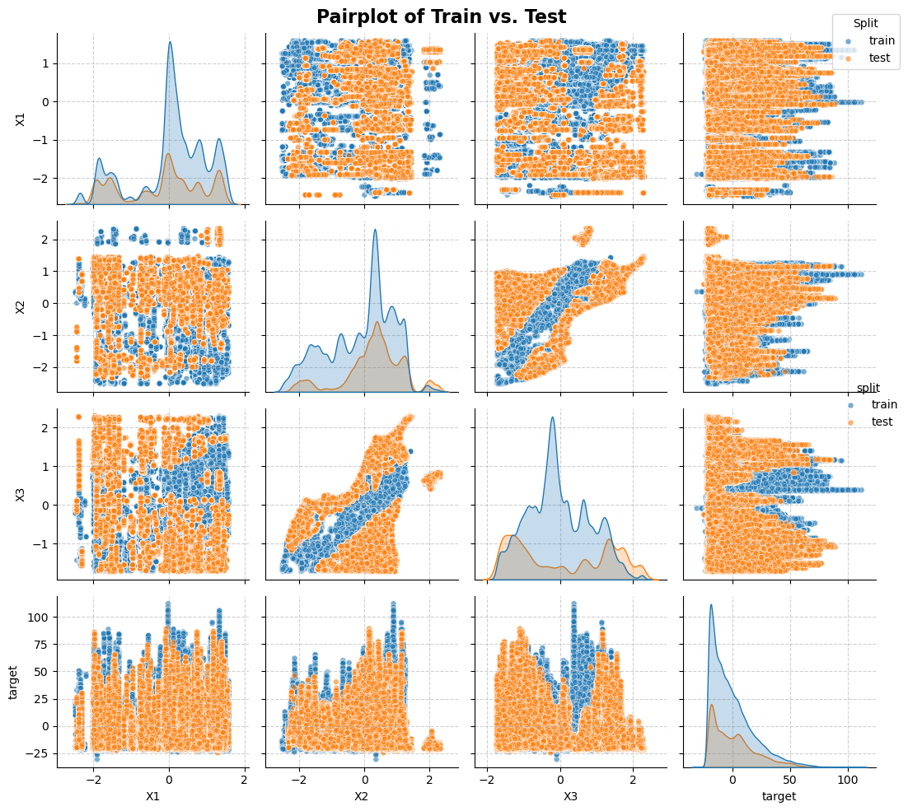
    


```python
for feature in statistics_man.df_all.columns[:-1]:
    statistics_man.plot_distribution(feature)
```


    
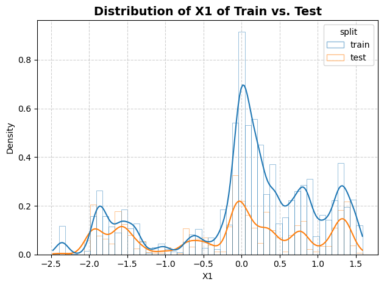
    


    
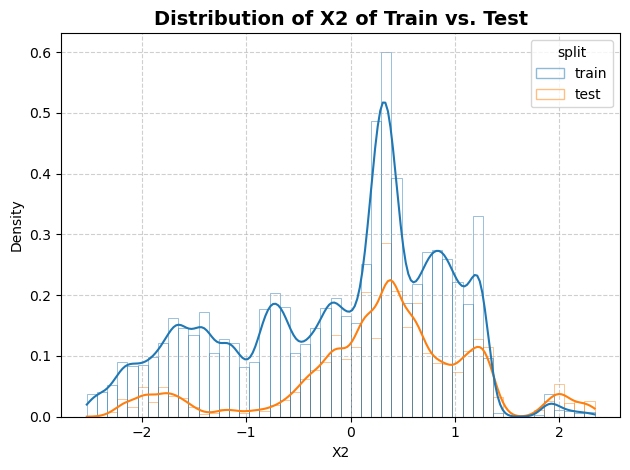
    


    
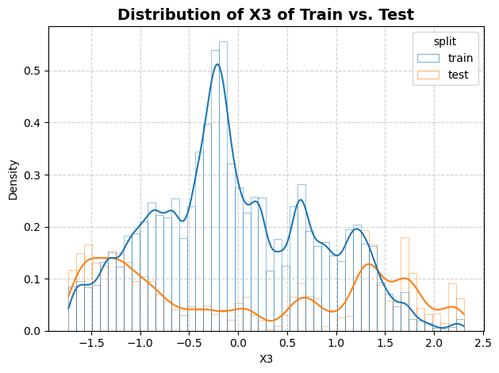
    


    
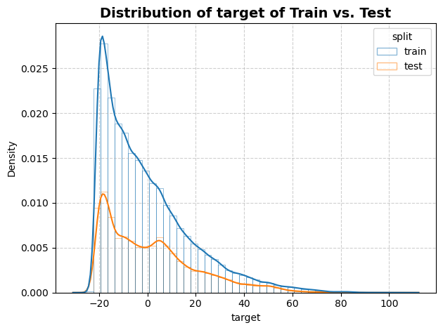
    


```python
statistics_man.plot_corr_heatmap()
```

    ========================================Train data Correlation Heatmap========================================


    
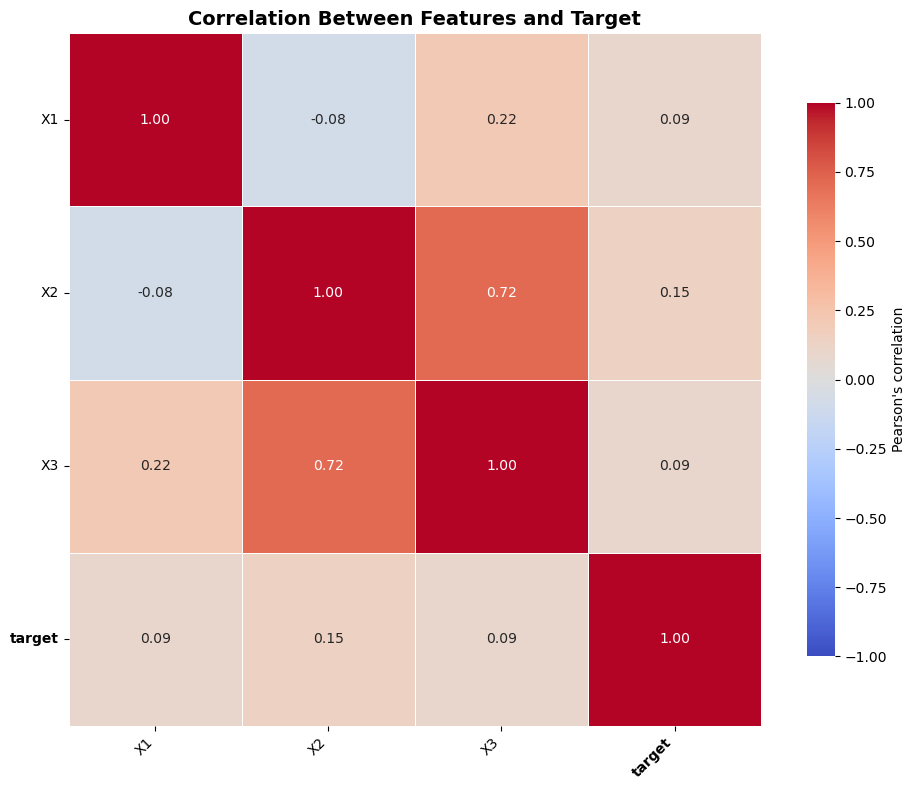
    


    ========================================Test data Correlation Heatmap========================================


    
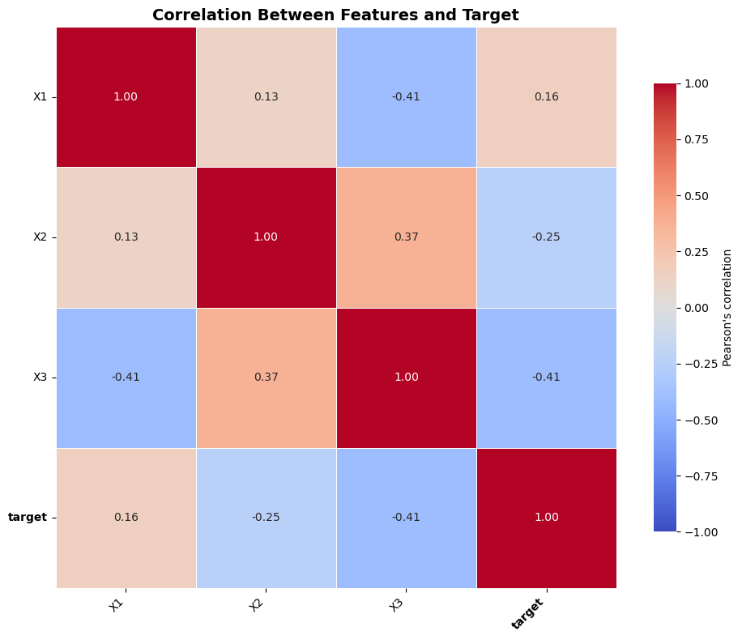
    


## Semi_Infinite_Slab


```python
train_path = f"splitted/{file}/Semi_Infinite_Slab/train_0.parquet"
test_path = f"splitted/{file}/Semi_Infinite_Slab/test_0.parquet"

statistics_man = SplittedDatasetStatistics(train_path, test_path)

print("==" * 20 + "Train data Samples" + "==" * 20)
display(statistics_man.train.df)

print("==" * 20 + "Test data Samples" + "==" * 20)

display(statistics_man.test.df)
```

    ========================================Train data Samples========================================


<div>
<style scoped>
    .dataframe tbody tr th:only-of-type {
        vertical-align: middle;
    }

    .dataframe tbody tr th {
        vertical-align: top;
    }

    .dataframe thead th {
        text-align: right;
    }
</style>
<table border="1" class="dataframe">
  <thead>
    <tr style="text-align: right;">
      <th></th>
      <th>X1</th>
      <th>X2</th>
      <th>X3</th>
      <th>target</th>
    </tr>
  </thead>
  <tbody>
    <tr>
      <th>0</th>
      <td>-1.474300</td>
      <td>-0.238940</td>
      <td>-1.46360</td>
      <td>14.64100</td>
    </tr>
    <tr>
      <th>1</th>
      <td>1.260700</td>
      <td>-0.235650</td>
      <td>-0.85814</td>
      <td>12.66400</td>
    </tr>
    <tr>
      <th>2</th>
      <td>1.281200</td>
      <td>0.882660</td>
      <td>0.98573</td>
      <td>29.73800</td>
    </tr>
    <tr>
      <th>3</th>
      <td>-0.042664</td>
      <td>-1.507500</td>
      <td>-1.06310</td>
      <td>0.79023</td>
    </tr>
    <tr>
      <th>4</th>
      <td>-1.982700</td>
      <td>0.867280</td>
      <td>0.25854</td>
      <td>-3.12390</td>
    </tr>
    <tr>
      <th>...</th>
      <td>...</td>
      <td>...</td>
      <td>...</td>
      <td>...</td>
    </tr>
    <tr>
      <th>300216</th>
      <td>-0.000830</td>
      <td>-0.983190</td>
      <td>-1.28830</td>
      <td>12.26800</td>
    </tr>
    <tr>
      <th>300217</th>
      <td>-1.793600</td>
      <td>0.831020</td>
      <td>-1.67220</td>
      <td>-17.92400</td>
    </tr>
    <tr>
      <th>300218</th>
      <td>-0.019241</td>
      <td>-0.000993</td>
      <td>0.26701</td>
      <td>-17.97000</td>
    </tr>
    <tr>
      <th>300219</th>
      <td>0.012714</td>
      <td>0.565490</td>
      <td>-0.25018</td>
      <td>-16.67600</td>
    </tr>
    <tr>
      <th>300220</th>
      <td>0.431390</td>
      <td>-1.420700</td>
      <td>-1.06790</td>
      <td>-5.04410</td>
    </tr>
  </tbody>
</table>
<p>300221 rows × 4 columns</p>
</div>


    ========================================Test data Samples========================================


<div>
<style scoped>
    .dataframe tbody tr th:only-of-type {
        vertical-align: middle;
    }

    .dataframe tbody tr th {
        vertical-align: top;
    }

    .dataframe thead th {
        text-align: right;
    }
</style>
<table border="1" class="dataframe">
  <thead>
    <tr style="text-align: right;">
      <th></th>
      <th>X1</th>
      <th>X2</th>
      <th>X3</th>
      <th>target</th>
    </tr>
  </thead>
  <tbody>
    <tr>
      <th>0</th>
      <td>-0.476720</td>
      <td>1.312300</td>
      <td>2.14940</td>
      <td>-17.7600</td>
    </tr>
    <tr>
      <th>1</th>
      <td>-1.522200</td>
      <td>-0.035011</td>
      <td>0.99883</td>
      <td>-9.8360</td>
    </tr>
    <tr>
      <th>2</th>
      <td>0.026631</td>
      <td>-1.781700</td>
      <td>-0.37545</td>
      <td>16.6780</td>
    </tr>
    <tr>
      <th>3</th>
      <td>0.794930</td>
      <td>1.189800</td>
      <td>2.13570</td>
      <td>-14.1180</td>
    </tr>
    <tr>
      <th>4</th>
      <td>0.020487</td>
      <td>1.086200</td>
      <td>1.76440</td>
      <td>-18.6570</td>
    </tr>
    <tr>
      <th>...</th>
      <td>...</td>
      <td>...</td>
      <td>...</td>
      <td>...</td>
    </tr>
    <tr>
      <th>134648</th>
      <td>0.022998</td>
      <td>-1.661200</td>
      <td>-0.41382</td>
      <td>-12.3300</td>
    </tr>
    <tr>
      <th>134649</th>
      <td>-0.031647</td>
      <td>1.384500</td>
      <td>2.22260</td>
      <td>-20.3910</td>
    </tr>
    <tr>
      <th>134650</th>
      <td>-1.117200</td>
      <td>0.943820</td>
      <td>1.38140</td>
      <td>23.0340</td>
    </tr>
    <tr>
      <th>134651</th>
      <td>-1.553300</td>
      <td>0.473870</td>
      <td>1.71350</td>
      <td>-3.7200</td>
    </tr>
    <tr>
      <th>134652</th>
      <td>-1.546200</td>
      <td>-0.128330</td>
      <td>0.76656</td>
      <td>7.4463</td>
    </tr>
  </tbody>
</table>
<p>134653 rows × 4 columns</p>
</div>


```python
statistics_man.print_stat_sum()
```

    ========================================Train data Statistics Summary========================================
    Number of samples : 300221
    Number of features: 3
    ==============================


<div>
<style scoped>
    .dataframe tbody tr th:only-of-type {
        vertical-align: middle;
    }

    .dataframe tbody tr th {
        vertical-align: top;
    }

    .dataframe thead th {
        text-align: right;
    }
</style>
<table border="1" class="dataframe">
  <thead>
    <tr style="text-align: right;">
      <th></th>
      <th>dtype</th>
      <th>missing</th>
      <th>count</th>
      <th>median</th>
      <th>mean</th>
      <th>std</th>
      <th>min</th>
      <th>25%</th>
      <th>50%</th>
      <th>75%</th>
      <th>max</th>
    </tr>
  </thead>
  <tbody>
    <tr>
      <th>X1</th>
      <td>float64</td>
      <td>0</td>
      <td>300221.0</td>
      <td>0.23858</td>
      <td>0.184829</td>
      <td>0.945644</td>
      <td>-2.4737</td>
      <td>-0.072049</td>
      <td>0.23858</td>
      <td>0.84767</td>
      <td>1.5859</td>
    </tr>
    <tr>
      <th>X2</th>
      <td>float64</td>
      <td>0</td>
      <td>300221.0</td>
      <td>0.24178</td>
      <td>0.026036</td>
      <td>0.947529</td>
      <td>-2.5276</td>
      <td>-0.588150</td>
      <td>0.24178</td>
      <td>0.64046</td>
      <td>2.3392</td>
    </tr>
    <tr>
      <th>X3</th>
      <td>float64</td>
      <td>0</td>
      <td>300221.0</td>
      <td>-0.36066</td>
      <td>-0.378121</td>
      <td>0.806717</td>
      <td>-1.7316</td>
      <td>-1.054000</td>
      <td>-0.36066</td>
      <td>0.17033</td>
      <td>1.6972</td>
    </tr>
    <tr>
      <th>target</th>
      <td>float64</td>
      <td>0</td>
      <td>300221.0</td>
      <td>-3.03790</td>
      <td>1.669656</td>
      <td>19.957133</td>
      <td>-30.7940</td>
      <td>-15.202000</td>
      <td>-3.03790</td>
      <td>13.29700</td>
      <td>112.2600</td>
    </tr>
  </tbody>
</table>
</div>


    ========================================Test data Statistics Summary========================================
    Number of samples : 134653
    Number of features: 3
    ==============================


<div>
<style scoped>
    .dataframe tbody tr th:only-of-type {
        vertical-align: middle;
    }

    .dataframe tbody tr th {
        vertical-align: top;
    }

    .dataframe thead th {
        text-align: right;
    }
</style>
<table border="1" class="dataframe">
  <thead>
    <tr style="text-align: right;">
      <th></th>
      <th>dtype</th>
      <th>missing</th>
      <th>count</th>
      <th>median</th>
      <th>mean</th>
      <th>std</th>
      <th>min</th>
      <th>25%</th>
      <th>50%</th>
      <th>75%</th>
      <th>max</th>
    </tr>
  </thead>
  <tbody>
    <tr>
      <th>X1</th>
      <td>float64</td>
      <td>0</td>
      <td>134653.0</td>
      <td>-0.068439</td>
      <td>-0.412091</td>
      <td>0.994894</td>
      <td>-2.4375</td>
      <td>-1.49540</td>
      <td>-0.068439</td>
      <td>0.19062</td>
      <td>1.5693</td>
    </tr>
    <tr>
      <th>X2</th>
      <td>float64</td>
      <td>0</td>
      <td>134653.0</td>
      <td>0.290610</td>
      <td>-0.058049</td>
      <td>1.105877</td>
      <td>-2.5269</td>
      <td>-0.95314</td>
      <td>0.290610</td>
      <td>0.84783</td>
      <td>1.4726</td>
    </tr>
    <tr>
      <th>X3</th>
      <td>float64</td>
      <td>0</td>
      <td>134653.0</td>
      <td>1.093200</td>
      <td>0.843054</td>
      <td>0.865492</td>
      <td>-1.7164</td>
      <td>0.10835</td>
      <td>1.093200</td>
      <td>1.49030</td>
      <td>2.3033</td>
    </tr>
    <tr>
      <th>target</th>
      <td>float64</td>
      <td>0</td>
      <td>134653.0</td>
      <td>-6.843900</td>
      <td>-3.722648</td>
      <td>14.538993</td>
      <td>-22.6300</td>
      <td>-15.07500</td>
      <td>-6.843900</td>
      <td>4.00640</td>
      <td>88.7220</td>
    </tr>
  </tbody>
</table>
</div>


```python
statistics_man.plot_pairplot()
```


    
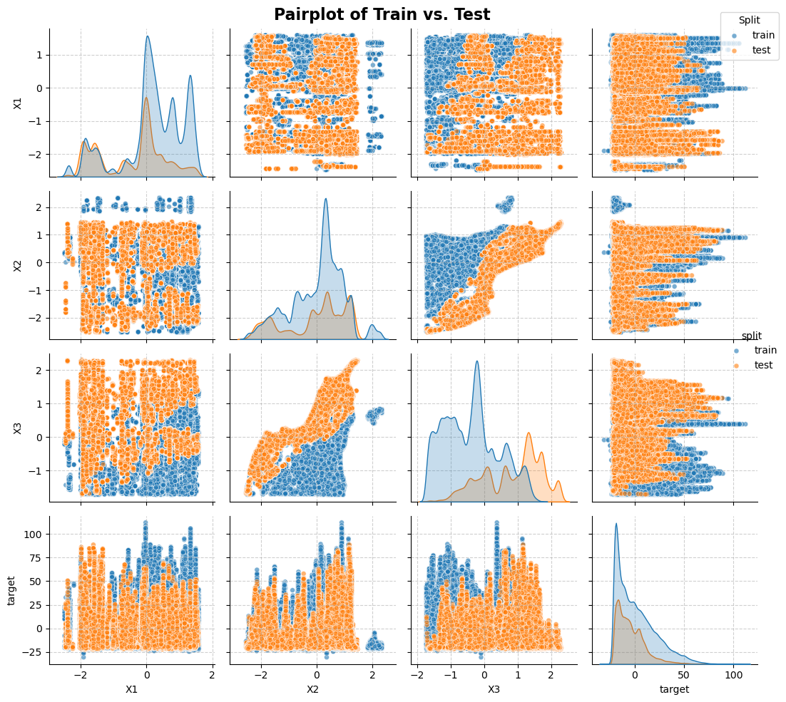
    


```python
for feature in statistics_man.df_all.columns[:-1]:
    statistics_man.plot_distribution(feature)
```


    
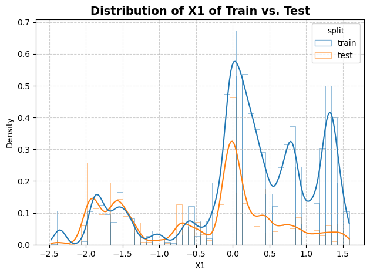
    


    
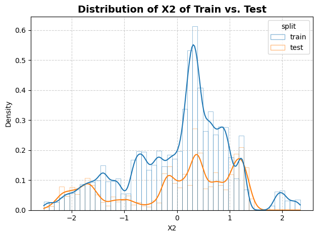
    


    
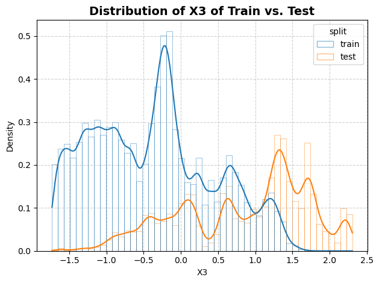
    


    
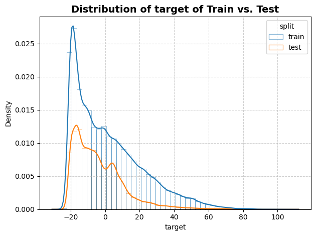
    


```python
statistics_man.plot_corr_heatmap()
```

    ========================================Train data Correlation Heatmap========================================


    
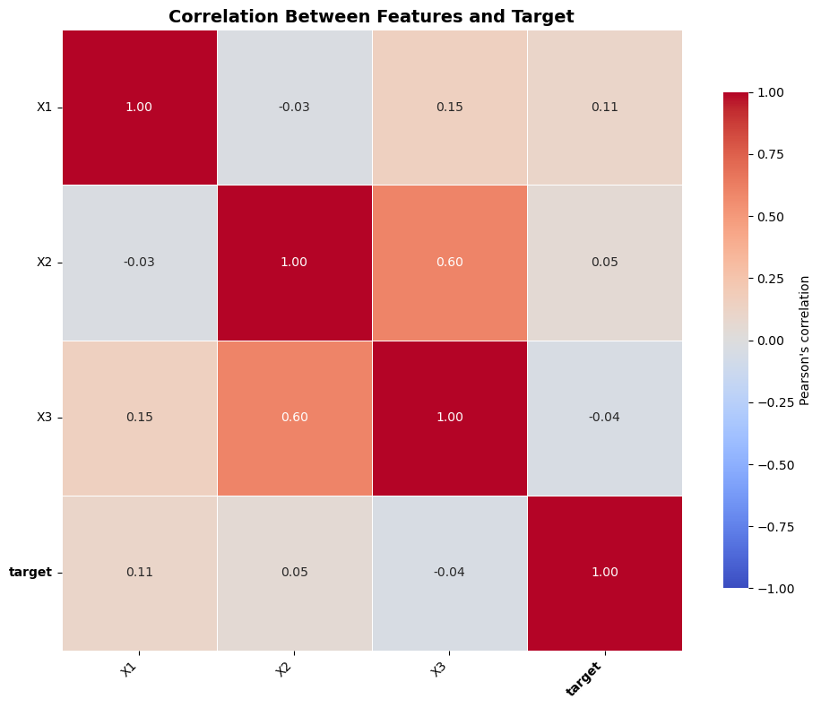
    


    ========================================Test data Correlation Heatmap========================================


    
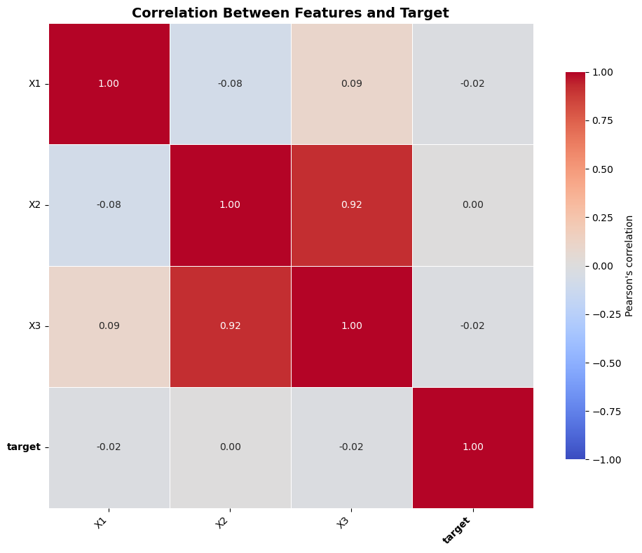
    

